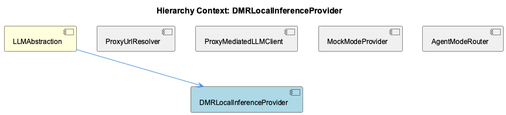
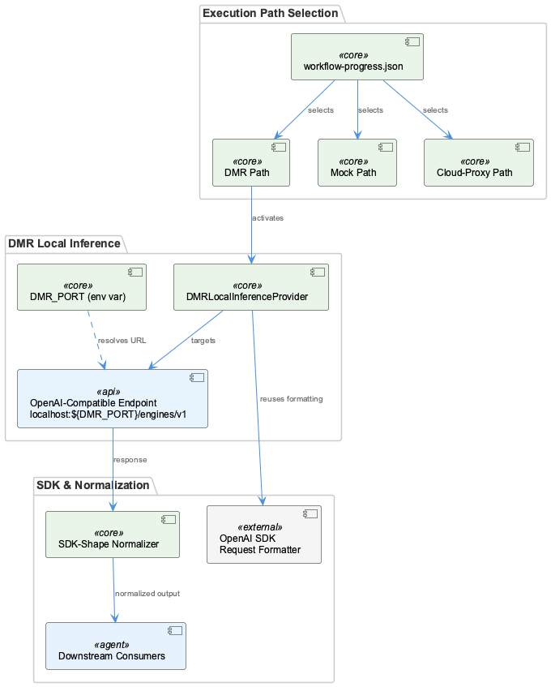

# DMRLocalInferenceProvider

**Type:** SubComponent

DMR mode enables fully air-gapped or offline inference, making it suitable for environments where cloud provider API keys (OPENAI_API_KEY, ANTHROPIC_API_KEY) are unavailable

# DMRLocalInferenceProvider — Technical Reference

## What It Is

DMRLocalInferenceProvider is a SubComponent of LLMAbstraction that routes LLM inference requests to a locally running Docker Model Runner (DMR) instance rather than a cloud API or mock stub. It represents one of three named execution paths within LLMAbstraction — alongside MockModeProvider and the proxy-mediated cloud path — and is activated either globally or per-agent via mode flags stored in `.data/workflow-progress.json`.

The provider targets an OpenAI-compatible API at `localhost:${DMR_PORT}/engines/v1`, where `DMR_PORT` is resolved from the environment at runtime. This makes it suitable for fully air-gapped or offline environments where neither `OPENAI_API_KEY` nor `ANTHROPIC_API_KEY` is available.

## Architecture and Design

The central design decision in DMRLocalInferenceProvider is the choice of an **OpenAI-compatible endpoint**. By targeting `/engines/v1` with standard OpenAI SDK request formatting, the provider avoids any bespoke serialization logic. Requests are structured identically to cloud-bound calls, and responses return in the same SDK shape, meaning downstream consumers within LLMAbstraction require no conditional handling based on which provider path was taken. This is the same normalization contract honored by the cloud proxy path — SDK-shape normalization is a system-wide invariant, not a per-provider concern.

The environment-variable-driven URL resolution (`DMR_PORT`) follows the same pattern used by ProxyUrlResolver, which checks `RAPID_LLM_PROXY_URL`, `LLM_CLI_PROXY_URL`, and `LLM_PROXY_URL` in priority order before falling back to a default. DMRLocalInferenceProvider applies the same philosophy — the endpoint is never hardcoded, allowing the provider to work across host and containerized environments without code changes.

The three-path architecture (mock / DMR / cloud-proxy) is a deliberate **substitutability design**: each path must satisfy the same interface contract so that AgentModeRouter can switch between them transparently. The priority chain — per-agent override → global mode → legacy flags — means DMR mode can be enabled globally while individual agents selectively override to mock or cloud without system-wide side effects.

## Implementation Details

The provider constructs its base URL as `localhost:${DMR_PORT}/engines/v1`, consuming `DMR_PORT` from the process environment. This mirrors how ProxyUrlResolver consumes its own env-var hierarchy. Because the endpoint is OpenAI-compatible, the existing OpenAI SDK client can be instantiated pointing at the DMR base URL with no modifications to request construction or response parsing.

Response normalization follows the same path as cloud provider responses. Since DMR returns OpenAI-shaped responses, the same SDK-shape normalization layer that handles cloud responses applies here, keeping the contract with downstream consumers uniform. This is architecturally significant: it means the DMR path does not introduce a separate normalization branch.

No singleton client instance details or health-check caching behavior are explicitly documented for DMRLocalInferenceProvider in the available observations — the parent LLMAbstraction notes these patterns exist in the system, but their application to DMR specifically should be verified against the implementation files.

## Integration Points

Within LLMAbstraction, DMRLocalInferenceProvider is selected by AgentModeRouter when the resolved mode (after evaluating the per-agent → global → legacy priority chain) indicates DMR. It is one peer among three: MockModeProvider handles test/stub scenarios, DMRLocalInferenceProvider handles local offline inference, and ProxyMediatedLLMClient handles cloud-bound requests via the rapid-llm-proxy daemon.

The provider does **not** route through the rapid-llm-proxy. This is a meaningful architectural distinction: cloud calls pass through the proxy at port 12435 to gain centralized token tracking, tier-based routing, and telemetry attribution (the gap that `ProxyMediatedLLMClient` / `llm-with-process.ts` was built to close). DMR calls bypass this entirely, which means DMR-sourced inference will not appear in proxy-level token-usage telemetry. Developers working in DMR mode should be aware that token tracking observable through the proxy is absent.

The environment dependency on `DMR_PORT` is the only external coupling beyond the LLMAbstraction interface contract. No API keys are required, which is the primary enabling condition for air-gapped deployments.

## Usage Guidelines

**When to use DMR mode:** Enable DMRLocalInferenceProvider when operating in environments without cloud API key access, in air-gapped networks, or during development on machines running Docker Model Runner locally. It is not a substitute for mock mode in automated testing — MockModeProvider is the appropriate path for deterministic, dependency-free test execution.

**Environment setup:** `DMR_PORT` must be set in the environment before the provider is invoked. Without it, URL construction will produce a malformed endpoint. Verify that the Docker Model Runner process is healthy and listening on the configured port before activating DMR mode globally.

**Mode activation:** DMR mode is set via the `mode` flag in `.data/workflow-progress.json`, either at the global level or scoped to a specific agent entry. Because AgentModeRouter evaluates per-agent overrides first, a global DMR setting can coexist with agents individually pinned to mock or cloud — enabling mixed-mode workflows during incremental migration or partial offline operation.

**Telemetry gap awareness:** Since DMR bypasses ProxyMediatedLLMClient and the rapid-llm-proxy, token usage from DMR inference is not captured in proxy-level telemetry. If usage attribution matters for a workflow, either route through cloud-proxy mode or implement supplementary logging at the DMRLocalInferenceProvider level directly.

**Response contract:** Because the DMR endpoint is OpenAI-compatible and response normalization is handled uniformly, no consumer-side changes are needed when toggling to or from DMR mode. This substitutability is the primary maintainability guarantee of the three-path design — preserve it by ensuring any future DMR-specific response handling remains within the provider boundary and does not leak SDK-shape differences to callers.

## Hierarchy Context

### Parent
- [LLMAbstraction](./LLMAbstraction.md) -- LLMAbstraction is a multi-layered abstraction over LLM providers that enables provider-agnostic model calls through three distinct execution paths: mock mode (for testing), local inference via Docker Model Runner (DMR), and public cloud providers (Anthropic, OpenAI, Groq) routed through a rapid-llm-proxy. The system supports per-agent and global mode switching stored in `.data/workflow-progress.json`, allowing runtime toggling between modes without code changes. Provider selection follows a priority chain from per-agent overrides to global mode to legacy flags.

The architecture centers on a proxy-mediated request pattern where most LLM calls route through a local rapid-llm-proxy daemon (default port 12435) via `/api/complete`, enabling centralized token tracking, tier-based routing, and telemetry attribution. The `llm-with-process.ts` module exists specifically to inject a `process` tag into proxy requests — a gap in the SDK's `LLMService.complete()` that caused all wave-analysis calls to appear as `process='unknown'` in token-usage telemetry. DMR provider uses an OpenAI-compatible API at `localhost:${DMR_PORT}/engines/v1` for fully local inference.

Key patterns include: environment-variable-driven URL resolution with multiple fallback levels, singleton client instances with health-check caching, YAML-based provider configuration with env-var expansion, and SDK-shape response normalization ensuring downstream consumers work unchanged regardless of which provider path was taken.

### Siblings
- [ProxyUrlResolver](./ProxyUrlResolver.md) -- Resolves proxy endpoint by checking environment variables RAPID_LLM_PROXY_URL, LLM_CLI_PROXY_URL, and LLM_PROXY_URL in priority order, falling back to localhost:12435 as the default, ensuring compatibility across Docker and host environments
- [ProxyMediatedLLMClient](./ProxyMediatedLLMClient.md) -- The llm-with-process.ts module exists specifically to inject a process tag into proxy requests, filling a gap in LLMService.complete() that caused wave-analysis calls to appear as process='unknown' in token-usage telemetry
- [MockModeProvider](./MockModeProvider.md) -- Mock mode is one of three named execution paths in LLMAbstraction, activated via per-agent or global mode flags stored in .data/workflow-progress.json
- [AgentModeRouter](./AgentModeRouter.md) -- Priority chain resolves in order: per-agent override → global mode → legacy flags, meaning a per-agent mock setting overrides a global DMR mode without affecting other agents

---

*Generated from 5 observations*
