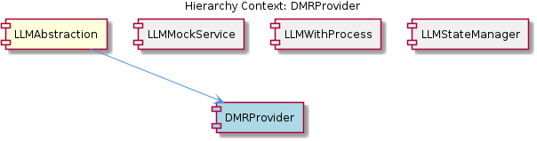

# DMRProvider

**Type:** SubComponent

The DMRProvider class provides a specific implementation of the LLM provider interface, allowing the LLMService to interact with the DMR LLM service.

## What It Is  

The **DMRProvider** is a concrete implementation of the LLM‑provider interface that lives in the file **`lib/llm/providers/dmr-provider.ts`**.  It is one of several provider classes (e.g., **AnthropicProvider** in `lib/llm/providers/anthropic-provider.ts`) that the **LLMService** instantiates and manages.  The provider encapsulates all knowledge required to talk to the DMR large‑language‑model service – such as API keys, endpoint URLs, request shaping, and response parsing – while exposing a uniform contract that the higher‑level **LLMAbstraction** component can rely on.  In the overall hierarchy, **DMRProvider** sits under the parent **LLMAbstraction**, alongside its sibling providers, and is consumed exclusively through the façade offered by **LLMService** (`lib/llm/llm-service.ts`).

## Architecture and Design  

The codebase follows a **modular provider architecture**.  The parent component **LLMAbstraction** defines a stable abstraction (an interface or abstract class) for LLM providers.  Each concrete provider – **DMRProvider**, **AnthropicProvider**, etc. – lives in its own file under `lib/llm/providers/` and implements that abstraction.  This design enables **plug‑and‑play** of new LLM back‑ends without touching the core service logic.

At the centre of the system is **LLMService**, which acts as a **facade** and **orchestrator**.  LLMService is the single public entry point for all LLM‑related operations.  It is responsible for:

* Instantiating each provider class (including **DMRProvider**) and holding their configuration.
* Routing calls to the appropriate provider based on runtime mode or configuration.
* Applying cross‑cutting concerns such as caching, circuit‑breaking, budget / sensitivity checks, and provider fallback.

Because the providers are instantiated by LLMService rather than being directly referenced throughout the codebase, the architecture achieves **separation of concerns**: provider‑specific details stay inside `dmr-provider.ts`, while policy‑level logic stays inside `llm-service.ts`.  The observation that “the LLMService class acts as the single public entry point… handling mode routing, caching, circuit breaking, budget/sensitivity checks, and provider fallback” confirms this orchestration pattern.

## Implementation Details  

While the source file does not expose individual symbols, the observations let us infer the essential mechanics of **DMRProvider**:

1. **Configuration Management** – The provider likely reads its own configuration (API key, endpoint URL, optional timeout settings) from a configuration object supplied by **LLMService**.  This keeps secrets and service‑specific URLs out of the provider’s hard‑coded logic.

2. **Provider Interface Implementation** – By conforming to the LLM provider interface defined in **LLMAbstraction**, **DMRProvider** implements methods such as `generate`, `chat`, or `embed` (names are not listed but are typical).  The interface guarantees that LLMService can invoke the same method signatures regardless of which concrete provider is active.

3. **Request/Response Handling** – Inside `dmr-provider.ts`, the class will construct HTTP requests to the DMR endpoint, attach authentication headers, and serialize the payload according to DMR’s API contract.  Responses are parsed and transformed into the canonical response shape expected by the abstraction layer, allowing downstream code to remain provider‑agnostic.

4. **Error Normalization** – Errors from the DMR service are likely caught and re‑thrown as a standardized error type so that LLMService’s circuit‑breaker and fallback logic can operate uniformly across providers.

Because **LLMService** is the orchestrator, **DMRProvider** does not need to implement caching or budgeting; those concerns are handled higher up.  This keeps the provider class focused on “talking to DMR” and makes it easier to test in isolation.

## Integration Points  

The primary integration surface for **DMRProvider** is the **LLMService** class (`lib/llm/llm-service.ts`).  LLMService creates an instance of **DMRProvider**, injects the configuration (e.g., from environment variables or a central config file), and registers it under a provider key (e.g., `"dmr"`).  When a consumer of the LLM abstraction requests an operation, LLMService selects the appropriate provider based on the current mode or explicit request parameters.

Other integration points include:

* **Configuration Layer** – The API key and endpoint URL for DMR must be supplied, likely via a shared configuration object that LLMService reads at startup.
* **Fallback Mechanism** – If DMR encounters a failure, LLMService may fall back to another provider such as **AnthropicProvider**.  This requires **DMRProvider** to surface failures in a predictable way.
* **Cross‑Cutting Concerns** – Caching, circuit breaking, and budget checks are applied by LLMService *after* the provider returns a result, meaning that **DMRProvider** does not need to be aware of those mechanisms.

No child entities are defined under **DMRProvider**; it is a leaf node in the provider hierarchy.

## Usage Guidelines  

1. **Instantiate via LLMService** – Developers should never `new DMRProvider()` directly.  Instead, they obtain an LLM client through **LLMService**, which guarantees that the provider is correctly configured and that all orchestration policies are in place.

2. **Provide Correct Configuration** – Ensure that the DMR API key and endpoint URL are present in the configuration object passed to LLMService.  Missing or malformed credentials will cause provider initialization failures that propagate as service‑level errors.

3. **Respect Provider Limits** – Since budget and sensitivity checks are enforced by LLMService, callers should be aware of any quotas or cost implications of using the DMR backend.  The service will reject or throttle requests that exceed configured limits.

4. **Handle Provider Errors Gracefully** – Although LLMService abstracts most error handling, callers should still be prepared for the possibility of a fallback to another provider.  Responses may come from a different backend, so any provider‑specific metadata should be treated as optional.

5. **Testing** – When writing unit tests for components that depend on LLM functionality, mock **LLMService** rather than the concrete **DMRProvider**.  This preserves the contract defined by **LLMAbstraction** and keeps tests independent of the underlying LLM implementation.

---

### Architectural Patterns Identified
* **Modular Provider Architecture** – Separate files for each LLM provider implementing a common interface.
* **Facade / Orchestrator (LLMService)** – Single entry point that hides provider complexity.
* **Dependency Injection (implicit)** – LLMService injects configuration into providers.
* **Circuit Breaker & Fallback** – Applied at the service layer across providers.

### Design Decisions and Trade‑offs
* **Separation of Concerns** – Providers focus solely on API communication; LLMService handles policy.  Trade‑off: additional indirection may add latency but improves clarity.
* **Uniform Provider Interface** – Enables easy addition of new providers (e.g., future `OpenAIProvider`).  Trade‑off: all providers must conform to the lowest common denominator of functionality.
* **Centralized Configuration** – Simplifies secret management but creates a single point of failure if configuration loading is buggy.

### System Structure Insights
* **LLMAbstraction** is the parent abstraction layer defining contracts.
* **DMRProvider** and **AnthropicProvider** are sibling concrete implementations under `lib/llm/providers/`.
* **LLMService** is the orchestrator that instantiates providers, applies cross‑cutting concerns, and exposes the façade to the rest of the system.

### Scalability Considerations
* Adding new providers scales linearly; each new provider only requires a new class under `providers/` and registration in LLMService.
* The façade can route traffic to multiple providers in parallel or based on load, supporting horizontal scaling of LLM calls.
* Caching and circuit‑breaking at the service layer help protect downstream LLM services from overload.

### Maintainability Assessment
* **High Maintainability** – Clear separation between provider logic and orchestration logic reduces coupling.
* **Ease of Extension** – New providers can be added without modifying existing provider code, only updating the service’s registration map.
* **Potential Risks** – The central LLMService becomes a critical component; bugs there can affect all providers.  Proper unit testing and modularization of its concerns (caching, fallback, budgeting) are essential.

## Diagrams

### Relationship

## Architecture Diagrams

## Hierarchy Context

### Parent
- [LLMAbstraction](./LLMAbstraction.md) -- [LLM] The LLMAbstraction component employs a modular architecture, with separate modules for different LLM providers, as seen in the DMRProvider class (lib/llm/providers/dmr-provider.ts) and the AnthropicProvider class (lib/llm/providers/anthropic-provider.ts). This design decision allows for easy integration of multiple LLM providers and provides a high-level facade for all LLM operations, handled by the LLMService class (lib/llm/llm-service.ts). The LLMService class acts as the single public entry point for all LLM operations, handling mode routing, caching, circuit breaking, budget/sensitivity checks, and provider fallback. This is evident in the code, where the LLMService class is responsible for instantiating and managing the various provider classes, such as DMRProvider and AnthropicProvider.

### Siblings
- [LLMService](./LLMService.md) -- The LLMService class is responsible for instantiating and managing various provider classes, such as DMRProvider and AnthropicProvider.
- [AnthropicProvider](./AnthropicProvider.md) -- The AnthropicProvider class is located in lib/llm/providers/anthropic-provider.ts and is an example of a provider class managed by the LLMService.

---

*Generated from 3 observations*
