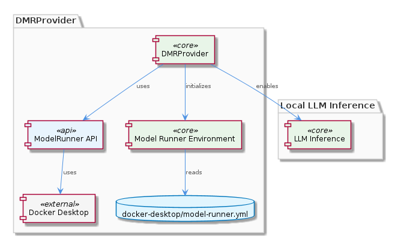
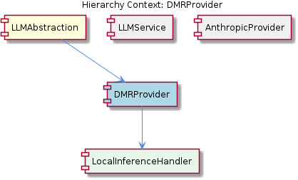

# DMRProvider

**Type:** SubComponent

The `DMRProvider.initialize` method in dmr-provider.py imports the required Docker modules and sets up the Model Runner environment, as specified in the docker-desktop/model-runner.yml configuration file.

## What It Is  

The **DMRProvider** is the concrete implementation that enables **local LLM inference** within the LLMAbstraction component. Its primary source files are:

* **TypeScript implementation** – `lib/llm/providers/dmr-provider.ts`  
* **Python counterpart** – `llm-abstraction/dmr-provider.py`  

Both versions orchestrate the Docker Desktop **Model Runner** API to launch a language‑model container locally and stream inference results back to the application. The provider’s `initialize` routine pulls in the Docker‑related modules and reads the configuration defined in `docker-desktop/model-runner.yml`, ensuring the runtime environment is correctly prepared before any model execution occurs.

The DMRProvider lives under the **LLMAbstraction** parent component, sits alongside sibling providers such as **AnthropicProvider**, and owns a child component called **LocalInferenceHandler**, which encapsulates the low‑level request/response handling for the locally‑run model.

---

## Architecture and Design  

The architecture follows a **provider‑agnostic façade** pattern. The top‑level **LLMService** class (`lib/llm/llm-service.ts`) acts as a single entry point for all language‑model operations, delegating calls to whichever provider implements the requested capability. DMRProvider fulfills the “local inference” slot of this façade, while AnthropicProvider fulfills the “remote Anthropic API” slot. This design isolates provider‑specific concerns (Docker interaction, SDK usage, authentication) from the rest of the system, allowing new providers to be added without altering the service contract.

Within DMRProvider, the **Model Runner API** from Docker Desktop is the core integration point. The provider’s `run_model` function (exposed in `llm-abstraction/dmr-provider.py`) invokes the Docker‑based runner, passing the model image, resource limits, and the prompt payload. The `initialize` method pre‑loads the Docker client libraries and parses `docker-desktop/model-runner.yml`, which contains the model image reference, volume mounts, and any environment variables required for the container. This configuration‑driven approach decouples the code from hard‑coded container details, supporting easy swapping of model versions.

The child component **LocalInferenceHandler** likely abstracts the streaming of token‑by‑token responses and error handling, providing a uniform interface to the higher‑level DMRProvider class. By nesting this handler, the provider keeps its public surface small while delegating the intricacies of Docker I/O to a dedicated module.

---

## Implementation Details  

1. **Entry Point – `DMRProvider.initialize`**  
   * Located in `llm-abstraction/dmr-provider.py`.  
   * Imports Docker SDK modules (`docker`, `docker.errors`, etc.).  
   * Reads `docker-desktop/model-runner.yml` to extract the model image name, resource constraints, and any volume bindings.  
   * Instantiates a Docker client (`docker.from_env()`) and validates that the Model Runner service is reachable. Any failure here aborts provider initialization, preventing later runtime errors.

2. **Model Execution – `run_model`**  
   * Also in `llm-abstraction/dmr-provider.py`.  
   * Constructs a Docker container run request using the Model Runner API. The request includes:  
     * **Image** – the LLM container defined in the YAML file.  
     * **Command** – the entry‑point that accepts a JSON payload containing the prompt and generation parameters.  
     * **Resource Limits** – CPU/memory caps derived from the configuration.  
   * Streams the container’s stdout back to the caller, converting Docker log lines into the token stream expected by the LLM abstraction layer.

3. **TypeScript Wrapper – `lib/llm/providers/dmr-provider.ts`**  
   * Provides a JavaScript/TypeScript façade that conforms to the `LLMProvider` interface used by `LLMService`.  
   * Internally forwards calls to the Python implementation via an inter‑process bridge (e.g., a spawned child process or a gRPC stub). This keeps the TypeScript side lightweight while leveraging the mature Docker SDK in Python.

4. **Configuration – `docker-desktop/model-runner.yml`**  
   * Stores all mutable aspects of the local inference environment: model image tag, environment variables, volume mounts for model weights, and optional GPU flags.  
   * Because the file lives outside the source tree, operators can update the model version without changing application code, supporting a clean separation between code and deployment artifacts.

5. **LocalInferenceHandler** (inferred)  
   * Likely implements methods such as `handleResponse(stream)` and `translateDockerErrors(error)`, converting raw Docker output into the standard LLM response object consumed by `LLMService`.

---

## Integration Points  

* **LLMService (parent)** – Calls `DMRProvider.generate` (or similar) through the common provider interface. Because `LLMService` performs caching, circuit‑breaking, and mode routing, DMRProvider must honor the same contract (e.g., return a promise/async iterator of tokens).  

* **Docker Desktop Model Runner (external service)** – The only external runtime dependency. The provider’s `initialize` method ensures the Docker daemon is running and that the Model Runner extension is installed.  

* **Configuration File (`docker-desktop/model-runner.yml`)** – Acts as the contract between DevOps and the code. Any change to the model image or resource allocation is reflected here, not in source.  

* **LocalInferenceHandler (child)** – Consumes the raw Docker stream and emits a normalized response. This handler is the bridge between low‑level Docker events and the higher‑level LLM abstraction.  

* **Sibling Providers** – Because all providers share the same `LLMProvider` interface, DMRProvider can be swapped out at runtime (e.g., for testing) without touching `LLMService` or other consumers.

---

## Usage Guidelines  

1. **Initialize Early** – Invoke `DMRProvider.initialize()` during application startup, before any LLM calls are made. This guarantees the Docker client is ready and the Model Runner configuration is validated.  

2. **Configuration Management** – Keep `docker-desktop/model-runner.yml` under version control for reproducibility, but allow environment‑specific overrides (e.g., via CI variables) to point at different model images or GPU settings.  

3. **Resource Awareness** – Respect the CPU/memory limits defined in the YAML file. Over‑committing resources can cause the Docker daemon to kill the container, resulting in cryptic errors that `LocalInferenceHandler` will surface as provider failures.  

4. **Error Handling** – Propagate Docker‑specific exceptions (e.g., `docker.errors.NotFound`, `docker.errors.APIError`) through the provider interface so that `LLMService` can apply its circuit‑breaker logic.  

5. **Testing** – For unit tests, mock the Docker client and the `run_model` function rather than launching a real container. The provider’s separation of concerns (initialization vs. execution) makes this straightforward.  

6. **Version Compatibility** – Ensure the Docker Desktop version includes the Model Runner extension; older Docker releases will lack the required API and cause initialization to fail.

---

### Architectural Patterns Identified  
* **Facade / Provider‑agnostic façade** – `LLMService` abstracts multiple providers behind a uniform interface.  
* **Strategy** – Each provider (DMRProvider, AnthropicProvider) implements a concrete strategy for model execution.  
* **Configuration‑driven runtime** – `docker-desktop/model-runner.yml` externalizes deployment details.  

### Design Decisions and Trade‑offs  
* **Local inference via Docker** provides isolation and reproducibility but adds a dependency on Docker Desktop, limiting deployment to environments where Docker is available.  
* Maintaining both a Python implementation (for Docker SDK richness) and a TypeScript wrapper introduces a small inter‑process overhead but preserves language‑level ergonomics for the rest of the codebase.  
* Using a YAML config decouples code from model versions, improving flexibility at the cost of an additional file that must be kept in sync with CI/CD pipelines.  

### System Structure Insights  
* The **LLMAbstraction** component is a thin orchestration layer; most heavy lifting resides in provider‑specific modules.  
* **DMRProvider** sits at the intersection of the internal service façade and an external container runtime, acting as the bridge that translates high‑level LLM calls into Docker‑based model execution.  

### Scalability Considerations  
* Scaling horizontally requires each node to have Docker Desktop with the Model Runner installed and sufficient hardware (CPU/GPU) to host the model container.  
* Because each inference request spawns a container (or reuses a long‑running container), concurrency is bounded by the host’s resource limits defined in the YAML file. Adjusting those limits or using a pooled container approach could improve throughput.  

### Maintainability Assessment  
* **High maintainability** for the provider logic itself: the core code is small, well‑encapsulated, and driven by external configuration.  
* **Medium maintainability** for the Docker integration layer: changes in Docker’s API or Model Runner version may require updates to the initialization and run logic.  
* The clear separation between `DMRProvider`, `LocalInferenceHandler`, and the configuration file makes the component easy to reason about, test, and replace if a different local inference mechanism is adopted in the future.

## Hierarchy Context

### Parent
- [LLMAbstraction](./LLMAbstraction.md) -- [LLM] The LLMAbstraction component implements a high-level facade, the LLMService class (lib/llm/llm-service.ts), which handles mode routing, caching, and circuit breaking for all LLM operations. This design decision enables provider-agnostic model calls and allows for the integration of multiple LLM providers, such as Anthropic and OpenAI, without affecting the overall architecture of the component. For instance, the DMRProvider class (lib/llm/providers/dmr-provider.ts) supports local LLM inference via Docker Desktop's Model Runner, while the AnthropicProvider class (lib/llm/providers/anthropic-provider.ts) uses the Anthropic SDK for LLM operations. The LLMService class acts as a single entry point for all LLM operations, providing a unified interface for the component's clients.

### Children
- [LocalInferenceHandler](./LocalInferenceHandler.md) -- The DMRProvider class is designed to implement local LLM inference, as suggested by the parent analysis, but without source code, we can only infer its presence based on the parent context.

### Siblings
- [LLMService](./LLMService.md) -- LLMService class (lib/llm/llm-service.ts) acts as a single entry point for all LLM operations
- [AnthropicProvider](./AnthropicProvider.md) -- AnthropicProvider class (lib/llm/providers/anthropic-provider.ts) implements LLM operations using the Anthropic SDK

---

*Generated from 3 observations*
