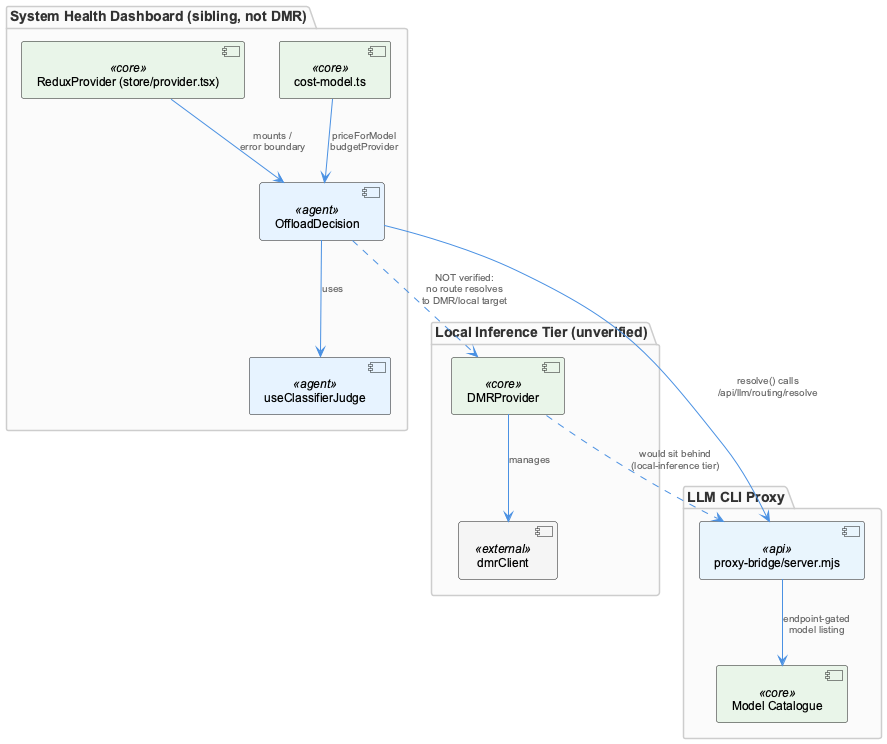
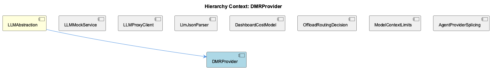

# DMRProvider

**Type:** SubComponent

DMRProvider (dmr-provider.ts) implements an OpenAI-compatible client interface so it can be substituted for remote providers without changing call sites

# DMRProvider — Technical Insight Document

## What It Is

DMRProvider is implemented in `dmr-provider.ts` as a local inference backend that adheres to an OpenAI-compatible client interface. This interface conformance is the defining architectural characteristic of the component: by matching the shape of remote LLM providers, DMRProvider can be substituted at call sites without requiring changes to consuming code. It exists within the broader LLMAbstraction component, sitting alongside sibling implementations like ProxyCompletionClient as one of several interchangeable completion-serving mechanisms.

Its principal distinguishing trait—stated explicitly in the observations—is that it does not require network egress. This single property is what makes DMRProvider relevant to multiple other subsystems: the offload gating logic, the LLM mode-resolution logic, and cost/telemetry systems that need to distinguish local from remote execution paths.

## Architecture and Design

The core design pattern here is the **interface substitution / adapter pattern**: DMRProvider wraps a local model runtime behind an OpenAI-compatible surface so that any code written against the standard completion API can transparently target either a remote provider or this local one. This is a deliberate trade-off — sacrificing some flexibility in how local inference is exposed in exchange for uniformity across the LLMAbstraction call sites.

DMRProvider is also woven into the **offload decision system**. It is positioned as a "local target" option evaluated by OffloadDecisionEngine's `evaluateOffload()` function in `offload-gates.ts`. This function reproduces a specific short-circuit gate order (considered→route-allows→band→target→target-band→scope→transport→offloaded) that determines the reason string attributed to any offload decision. DMRProvider's role in this chain is as the "no network required" branch: because it doesn't require egress, it interacts directly with the `requireNetwork` gate, effectively acting as a fallback/local path that can satisfy routing without triggering network-dependent gates like `band` or `transport`. Architecturally, this means DMRProvider is not just a completion backend but a first-class value in the OffloadTarget.provider enumeration that the gating logic branches on.

## Implementation Details

While no code symbols were enumerated for this component, the observations establish its functional contract precisely: it must expose an OpenAI-compatible client interface (mirroring method signatures/response shapes expected by consumers), and it must be referenceable as a `provider` value within `OffloadTarget.provider` entries in `offload-gates.ts`. This implies DMRProvider likely exports a class or factory function conforming to a shared completion-client interface type, consistent with how ProxyCompletionClient (a sibling) tags requests with process identifiers for `llm-with-process.ts`.

DMRProvider's selection as the active backend is driven externally by mode-resolution logic in the parent LLMAbstraction component — specifically `getLLMMode()` and `isMockLLMEnabled()` in `llm-mock-service.ts`. When these functions resolve to a non-mock, local mode, DMRProvider is the backend most likely selected to serve inference. This establishes an important implementation dependency: DMRProvider itself does not decide when it's used; it is a passive target selected by upstream mode-resolution and offload-decision logic.

## Integration Points

DMRProvider integrates with the system along three primary axes:

1. **LLMAbstraction (parent)** — DMRProvider is one of the concrete backends contained within LLMAbstraction, alongside siblings ProxyCompletionClient, CostModelEngine, ModelNormalization, and OffloadDecisionEngine. Its activation is gated by the four-tier mode-resolution precedence chain (per-agent override → global mode → legacy `mockLLM` flag → 'public' fallback) defined in the parent's `getLLMMode()`.

2. **OffloadDecisionEngine (sibling)** — DMRProvider is a referenced value within `OffloadTarget.provider` entries and is evaluated by `evaluateOffload()` in `offload-gates.ts`. Its no-egress property makes it specifically relevant to the `requireNetwork` gate, differentiating it from network-aware remote targets.

3. **Interface conformance with remote providers** — Because DMRProvider matches the OpenAI-compatible interface, it can theoretically interoperate with downstream consumers (such as cost tracking via CostModelEngine or process tagging via ProxyCompletionClient) without those systems needing DMRProvider-specific logic, provided model identifiers are normalized consistently (per ModelNormalization).

## Usage Guidelines

Developers should treat DMRProvider as a drop-in local substitute for remote completion clients — call sites should not special-case it beyond what the OpenAI-compatible interface already supports, preserving the abstraction's value. When debugging why a request went to DMRProvider instead of a remote provider, check the mode-resolution chain in `llm-mock-service.ts` first (per-agent overrides in `workflow-progress.json` can silently override global settings), and then check `evaluateOffload()`'s gate order in `offload-gates.ts` to see whether `requireNetwork` or another gate routed the call locally.

Because gate order in `evaluateOffload()` determines the reported reason string, any change to DMRProvider's registration as an `OffloadTarget.provider` should be validated against the existing gate sequence to avoid misattributing offload reasons. Finally, since DMRProvider has no enumerated code symbols in this analysis, any deeper implementation changes should begin by locating and documenting its actual class/function structure in `dmr-provider.ts` to keep this reference accurate going forward.

## Hierarchy Context

### Parent
- [LLMAbstraction](./LLMAbstraction.md) -- [LLM] The mode-resolution logic in getLLMMode() (llm-mock-service.ts) establishes a clear precedence chain that new developers must understand before debugging unexpected LLM behavior: per-agent overrides in workflow-progress.json take precedence over a global mode setting, which in turn overrides a legacy mockLLM boolean flag, with 'public' as the ultimate fallback. This four-tier resolution means that a developer trying to force mock mode for testing might set the global mode but be silently overridden by a stale per-agent override left in workflow-progress.json from a previous run. The dual-checking of both llmState (new) and mockLLM (legacy) shapes in isMockLLMEnabled() and getLLMState() is a deliberate backward-compatibility shim, indicating the config schema evolved over time but old state files or tooling that only write the legacy flag must continue to work without breaking the mock system.

### Siblings
- [ProxyCompletionClient](./ProxyCompletionClient.md) -- llm-with-process.ts tags each completion request with a process identifier, which downstream shows up as CostRow.process in cost-model.ts
- [CostModelEngine](./CostModelEngine.md) -- priceForModel() implements a three-tier resolution: exact model key match, family-representative fallback via FAMILY_REPRESENTATIVE, then generic family match, defaulting to a zero-priced 'none' source
- [ModelNormalization](./ModelNormalization.md) -- Model identifiers normalized here feed directly into CostConfig.modelPrices keys consumed by priceForModel() in cost-model.ts
- [OffloadDecisionEngine](./OffloadDecisionEngine.md) -- evaluateOffload() in offload-gates.ts reproduces the proxy's short-circuit gate order exactly (considered→route-allows→band→target→target-band→scope→transport→offloaded), because gate order determines which reason string is attributed to a call

---

*Generated from 5 observations*
