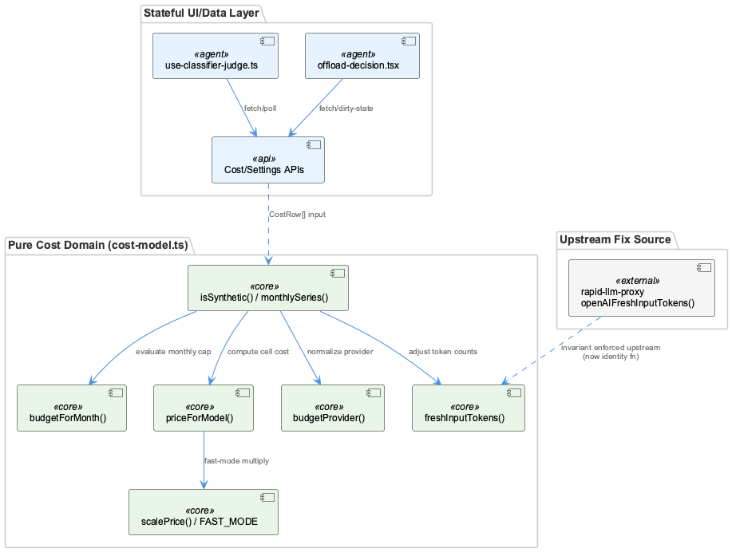
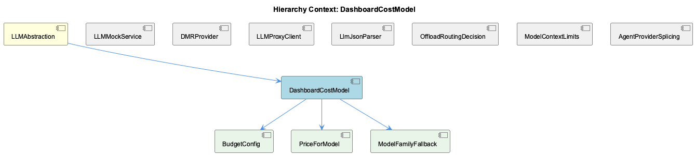

# DashboardCostModel

**Type:** SubComponent

# DashboardCostModel — Technical Insight Document

## What It Is

DashboardCostModel is implemented entirely in `integrations/system-health-dashboard/src/components/cost/cost-model.ts`, and its defining characteristic — stated explicitly in the source's own framing — is that it is "pure cost/budget logic... No React here." Every exported function (`budgetForMonth`, `priceForModel`, `cellCostUsd`, `monthlySeries`) is a pure function over `CostRow[]`/`CostConfig` inputs: no hooks, no fetch calls, no component state. As a child of LLMAbstraction, it sits alongside siblings like LLMMockService, OffloadRoutingDecision, and LlmJsonParser, but unlike those siblings — several of which (`offload-decision.tsx`, `use-classifier-judge.ts`) interleave data-fetching, polling, and dirty-state tracking directly into hooks and components — DashboardCostModel draws a sharp architectural line: pricing math lives here, I/O lives everywhere else.

Its three named children, BudgetConfig, PriceForModel, and ModelFamilyFallback, are not separate modules but the conceptual decomposition of this single file's responsibilities: time-scoped budget policy, model price resolution, and the fallback cascade that resolves unrecognized model names to a representative family price.

## Architecture and Design

The dominant pattern is a **pure functional core / imperative shell**: cost-model.ts holds zero I/O or React state, isolating pricing math from the fetch/hook layer that callers (the live dashboard tab, and presumably offline reporting scripts) must provide. This buys testability — pure functions can be unit-tested without a DOM or mocked fetch — and reuse across multiple consumers, at the cost of pushing all I/O (`GET /api/token-usage/cost`, `GET /api/llm/settings`) out of this file entirely.

A second pattern, embodied by BudgetConfig, is **policy-as-data with time-scoped overrides**: `BudgetConfig.monthlyEurByMonth` models a mutable budget cap as a map keyed by month rather than a scalar, because a cap is not constant over time and retroactively evaluating July's spend against August's raised cap would misreport history.

A third pattern, embodied by PriceForModel and ModelFamilyFallback, is **precedence-chain resolution**: `priceForModel()` tries exact match → fast-mode-suffix strip-and-recurse → family representative → any-family-match, always terminating in an explicit `priced: false` sentinel rather than throwing. The ordering here is load-bearing, not incidental — the fast-mode check runs after exact-match (so a hand-written `<model>-fast` row can override the multiplicative rule) but before family fallback (so suffix-stripping can recurse into either an exact or family match for the base model).

A fourth pattern is the **provider/account normalization funnel**: `budgetProvider()`/`BUDGET_PROVIDER_LABEL` collapse an open-ended set of raw provider strings into exactly two fixed budget buckets.

## Implementation Details

`budgetForMonth()` resolves BudgetConfig's monthly overrides using `Object.prototype.hasOwnProperty.call()` rather than a `??` chain, deliberately preserving three-state logic: an explicit `null` override ("no cap this month") must remain distinguishable from an absent key ("no override, use standing cap"). Any refactor that collapses this to a simple nullable check will silently reinstate the standing cap on months that were intentionally uncapped.

`priceForModel()` implements the precedence cascade described above. Fast-mode pricing (`FAST_MODE_SUFFIX`, `FAST_MODE_MULTIPLIER`, `scalePrice()`) is deliberately a multiplicative *rule* applied inside `priceForModel()` rather than literal duplicate rows in `modelPrices` — the source comment reasons that hand-maintained `<model>-fast` twins for every fast-capable model would fail silently via family-fallback, pricing an unrecognized fast variant at standard rates with no warning. Notably, the 2x multiplier used for `claude-opus-4.8` is flagged in-source as *assumed*, not verified against real billing — a known soft spot.

`freshInputTokens()` is now effectively an identity function; it previously subtracted `cache_read_tokens` for OpenAI-wire providers (copilot/opencode) because `prompt_tokens` on that wire included cached tokens. Once the upstream proxy's `openAIFreshInputTokens()` (in rapid-llm-proxy) began subtracting at the parse boundary and a backfill script corrected historical rows, the local subtraction became a double-compensation zeroing out legitimate input on corrected rows (concrete example in-source: input=135, cache_read=23264 → old code wrongly returned 0). `isOpenAIWireProvider()` remains only as documentation of a now-irrelevant distinction.

`budgetProvider()` collapses raw provider/subscription strings (anthropic, claude-code, max-oauth-passthrough, copilot, github) via `p.includes('copilot') || p === 'github'`, defaulting everything else to `'claude-max'`.

`isSynthetic()`/`SYNTHETIC_MODELS`/`SYNTHETIC_PROVIDERS` use exact-set membership plus prefix matching (`m.startsWith('fake')`, `'demo'`) to exclude test/probe rows; `monthlySeries()` invokes it as a hard `continue` before aggregation.

## Integration Points

As a child of LLMAbstraction, DashboardCostModel is one of several distinct concerns bundled under that parent alongside LLMMockService's mode-precedence system, DMRProvider's OpenAI-shape protocol reuse, LLMProxyClient's transport layer, and LlmJsonParser's two-stage repair pipeline. DashboardCostModel's freshInputTokens() has an explicit cross-service dependency: its correctness now depends on invariants enforced *outside* this file, in rapid-llm-proxy's `openAIFreshInputTokens()` and an associated backfill script — a case where a fix at the source required removing, not adding, compensating code downstream. The module has no direct coupling to OffloadRoutingDecision or the classifier-judge hook's control-plane/data-plane split, but shares the project's general convention (also seen in LLMMockService's `getLLMMode()`) of explicit multi-tier precedence over collapsed boolean/nullable logic.

## Usage Guidelines

Any modification to `budgetForMonth()` must preserve the `hasOwnProperty` check; collapsing it to `??` will silently misclassify "no cap" as "no override." Changes to `priceForModel()`'s fallback ordering must preserve exact → fast-strip → family-representative → any-family-match sequencing, since the ordering is what prevents silent mispricing. The `claude-opus-4.8` 2x fast multiplier should be verified against real billing before being trusted as ground truth. Do not reintroduce cache_read_token subtraction in `freshInputTokens()` without confirming the upstream proxy/backfill invariants have changed. When adding a new provider/subscription string upstream, be aware `budgetProvider()`'s default-to-`claude-max` fallback will silently fold it into that bucket rather than surfacing it as unrecognized — this should be revisited if a third budget bucket is ever introduced. Finally, `isSynthetic()`'s filtering only protects `monthlySeries()`/`cellCostUsd()`; any new consumer of `CostRow[]` that aggregates independently must apply its own synthetic-row exclusion or risk double-counting test/probe spend. The module performs no caching or memoization internally, so callers control call frequency (e.g., via React memoization upstream).

## Hierarchy Context

### Parent
- [LLMAbstraction](./LLMAbstraction.md) -- [LLM] The mock/local/public mode toggle system in llm-mock-service.ts is designed around a persisted state file (.data/workflow-progress.json) rather than environment variables, which allows runtime mode switching without process restarts. The LLMState structure with globalMode and perAgentOverrides fields enables fine-grained control where a specific agent can be forced into mock mode for testing while the rest of the system runs against real providers. This is critical for integration testing scenarios where a developer wants to validate one agent's prompt-handling logic without incurring API costs or non-determinism from the LLM calls of other agents in a multi-agent pipeline. The getLLMMode() read path checks perAgentOverrides first, then falls back to globalMode, and finally to the legacy progress.mockLLM boolean, establishing a three-tier precedence resolution that any new developer must understand before assuming a single toggle controls behavior.

### Children
- [BudgetConfig](./BudgetConfig.md) -- [CGR] BudgetConfig (class) in cost-model.ts
- [PriceForModel](./PriceForModel.md) -- [CGR] priceForModel (function) in cost-model.ts
- [ModelFamilyFallback](./ModelFamilyFallback.md) -- [LLM] priceForModel() in cost-model.ts implements a three-tier resolution cascade — exact match, fast-mode suffix stripping (recursive call), then family fallback via FAMILY_REPRESENTATIVE — and the ordering is load-bearing, not incidental. The fast-mode check runs AFTER the exact-match check specifically so a hand-written `<model>-fast` row can override the multiplicative rule, but BEFORE the family fallback so that stripping the `-fast` suffix and recursing into priceForModel(base, prices) can itself hit either an exact match or a family fallback for the base model. This means a model like `claude-opus-4.8-fast` with no exact row resolves through two fallback layers in sequence: suffix-strip → family-fallback-for-opus → 2x multiplier — and a bug in either layer silently degrades pricing accuracy rather than erroring, which is the exact failure mode the source comment for FAST_MODE_MULTIPLIER warns about (mispricing at the standard rate, `priced: true`, no warning).

### Siblings
- [LLMMockService](./LLMMockService.md) -- [LLM] The `use-classifier-judge.ts` hook (integrations/system-health-dashboard/src/components/llm-routing/use-classifier-judge.ts) implements the same config-vs-runtime split described for LLMMockService's `getLLMMode()` precedence chain, but for the offload judge rather than the mock toggle: `JudgeBackend.enabled` is what the YAML file says, while `JudgeBackend.reachable` is whether it actually answered on the last poll. The header comment documents a real incident (2026-09-02) where `enabled: true` masked a dead backend for about a day because nothing distinguished 'switched off' from 'not answering' — the exact class of ambiguity that `getLLMMode()`'s three-tier precedence (perAgentOverrides → globalMode → legacy progress.mockLLM) is designed to avoid by making precedence explicit rather than collapsing multiple signals into one boolean.
- [DMRProvider](./DMRProvider.md) -- [LLM] The DMR provider in dmr-provider.ts is deliberately built as a thin OpenAI-shape adapter rather than a bespoke client — it targets `http://${DMR_HOST}:${DMR_PORT}/engines/v1` but reuses the same request/response contract as the OpenAI SDK integration. This is a 'protocol reuse' strategy: instead of writing DMR-specific request builders, response parsers, and error mappers, the team accepts that Docker Model Runner exposes an OpenAI-compatible surface and piggybacks on existing code paths. The trade-off is that any DMR-specific quirks (different error codes, different streaming semantics, different rate-limit headers) would have to be shimmed into the OpenAI shape rather than handled natively, which could become a leaky abstraction if DMR's compatibility layer ever diverges meaningfully from the OpenAI spec it's mimicking.
- [LLMProxyClient](./LLMProxyClient.md) -- [LLM] The parent context establishes that llm-with-process.ts is a deliberate fetch-based bypass around the SDK's LLMService.complete(), built specifically to inject the 'process' telemetry tag the rapid-llm-proxy's /api/complete endpoint requires, with resolveProxyCompleteUrl() implementing a layered precedence (RAPID_LLM_PROXY_URL → LLM_CLI_PROXY_URL → LLM_PROXY_URL → localhost default). This is the LLMProxyClient's actual transport layer, and the dashboard code surveyed here (offload-decision.tsx, use-classifier-judge.ts) is the operator-facing control plane that sits ABOVE that transport: neither file makes an LLM completion call itself, they instead call GET/PATCH against the proxy's HTTP surface (/api/llm/routing/resolve, /api/llm/classifier) to inspect and edit the routing policy that governs how llm-with-process.ts's requests get dispatched. This is a clean separation between the data-plane client (proxy-bridge, llm-with-process.ts) and the control-plane client (this dashboard code), but it also means the two must agree on wire semantics independently — evidenced by the extensive commentary in offload-decision.tsx about the proxy's resolved answers being compared against the dashboard's own ladder logic rather than trusted.
- [LlmJsonParser](./LlmJsonParser.md) -- [LLM] parse-llm-json.ts's core value proposition is that it treats malformed JSON-mode output as a two-orthogonal-failure-mode problem rather than one generic 'try/catch and give up' problem. escapeControlCharsInStrings() targets corruption caused by raw control characters (e.g. literal newlines or tabs) embedded inside string literals — a byte-level defect that a naive JSON.parse() cannot tolerate — while truncateToLastCompleteElement() targets a structural defect: the provider hit its output-token ceiling mid-object/mid-array. Because these are independent failure modes with independent signatures, running them as a fixed two-stage pipeline rather than a single heuristic means each stage can be reasoned about, tested, and evolved in isolation, and a malformed-but-complete response only pays the cost of the first stage.
- [OffloadRoutingDecision](./OffloadRoutingDecision.md) -- [LLM] OffloadDecision (offload-decision.tsx) is architected around a dual-mode toggle — 'config' (routes, answering 'what will happen') versus 'recorded' (calls, answering 'what did happen') — that deliberately share the same GATES/rung geometry so an operator can flip between intent and behaviour without re-reading a layout. This is a single-component design choice explicitly justified in the header comment rather than splitting into two cards, trading some internal branching complexity (mode-dependent counts, detail strings) for a consistent mental model at the UI layer.
- [ModelContextLimits](./ModelContextLimits.md) -- [LLM] The module in lib/statusline/model-limits.cjs implements a two-tier caching strategy specifically because it runs in a fresh process every 5 seconds per status-line pane (documented in the file's header comment). The in-process memo (`_memo`, `_userMemo`) only helps within a single tick's multiple calls to catalogueContextWindow(); the real cross-tick optimization is the on-disk derived cache at catalogueCachePath() (.logs/model-context-limits.json), which avoids re-parsing opencode's 4.5MB/213-provider models.json (a documented 33ms cost) on every single tick across every open pane. This is a deliberate departure from typical in-memory caching because the process boundary itself defeats memoization.
- [AgentProviderSplicing](./AgentProviderSplicing.md) -- [LLM] The cost-model.ts module in the dashboard's cost tab implements a layered price-resolution strategy in priceForModel(): exact model key match, then fast-mode suffix stripping with a 2x multiplier via scalePrice(), then family-based fallback through FAMILY_REPRESENTATIVE. This mirrors the same 'tiered precedence resolution' philosophy seen elsewhere in the LLM subsystem (e.g. getLLMMode()'s three-tier fallback), suggesting a project-wide convention of building explicit precedence chains rather than single flat lookups whenever provider/model identity is ambiguous or evolving.

---

*Generated from 9 observations*
