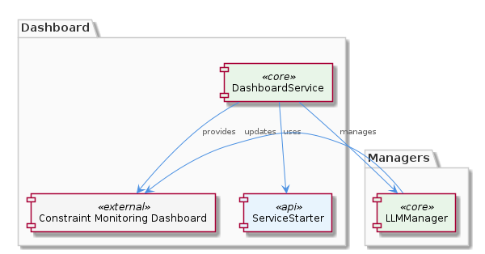
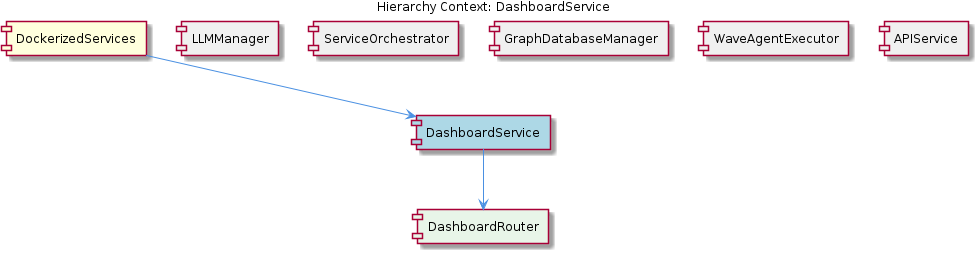

# DashboardService

**Type:** SubComponent

The DashboardService might be designed to work with other sub-components, such as the LLMManager, to manage complex workflows.

## What It Is  

**DashboardService** is the sub‑component that orchestrates the lifecycle of the constraint‑monitoring dashboard.  It lives inside the **DockerizedServices** container (the parent component that wires everything together via dependency injection) and is the immediate owner of **DashboardRouter**, the routing layer described in `integrations/mcp-constraint-monitor/dashboard/README.md`.  Although the source tree does not expose a concrete file path for the service itself, the surrounding documentation makes it clear that the service sits alongside sibling sub‑components such as **LLMManager**, **ServiceOrchestrator**, **GraphDatabaseManager**, **WaveAgentExecutor**, and **APIService**.  Its primary responsibilities are to start the dashboard process, keep it running, shut it down cleanly, and surface any startup or runtime errors to the broader system.

The service is expected to interact with the **constraint monitoring dashboard** UI, providing a “plug‑and‑play” experience for developers who need to spin up the dashboard quickly during development or testing.  It also collaborates with higher‑level orchestrators (e.g., **LLMManager**) to embed the dashboard into more complex workflows, ensuring that the user experience remains responsive even when other heavy‑weight components are active.

---

## Architecture and Design  

The design of **DashboardService** follows a **service‑starter pattern** that is explicitly referenced in the observations: the service leverages the `ServiceStarter` class located in `lib/service-starter.js`.  `ServiceStarter` supplies retry logic, timeout handling, and graceful degradation, which the dashboard inherits to become resilient to transient failures (e.g., container start‑up race conditions or network hiccups).  This pattern is also used by the sibling **ServiceOrchestrator**, indicating a shared architectural convention across the DockerizedServices ecosystem.

A second, complementary pattern is the **router façade** embodied by **DashboardRouter**.  The router isolates HTTP‑level concerns (path matching, request validation, and response formatting) from the core lifecycle logic of the service.  By delegating routing to a dedicated child component, the service adheres to the **Separation of Concerns** principle, making the dashboard’s API surface easier to evolve without touching the startup/shutdown code.

The parent component, **DockerizedServices**, employs **dependency injection** (as described in the parent’s documentation) to inject the `ServiceStarter` instance and any configuration objects into **DashboardService**.  This decouples the service from concrete implementations of retry or timeout strategies, allowing the system to swap out or mock those dependencies during testing.

---

## Implementation Details  

1. **Service Startup via `ServiceStarter`**  
   - The service creates an instance of `ServiceStarter` (imported from `lib/service-starter.js`).  
   - `ServiceStarter.start()` is called with a callback that launches the dashboard process (likely a Node.js or static‑file server).  
   - The starter’s built‑in retry loop attempts to bring the dashboard up a configurable number of times, applying exponential back‑off and respecting a global timeout.  If all attempts fail, `ServiceStarter` emits an error event that **DashboardService** catches and logs.

2. **Error Handling & Graceful Shutdown**  
   - During the startup phase, any exception thrown by the dashboard process is wrapped by `ServiceStarter` and re‑thrown as a standardized `ServiceError`.  
   - **DashboardService** registers a shutdown hook (e.g., listening for `SIGTERM` or Docker container stop events).  The hook invokes `ServiceStarter.stop()`, which sends a termination signal to the dashboard process and waits for a clean exit, falling back to a forced kill after a grace period.

3. **Routing via `DashboardRouter`**  
   - `DashboardRouter` is instantiated inside **DashboardService** and attached to the service’s HTTP server (or Express app) after the dashboard has successfully started.  
   - The router defines endpoints such as `/status`, `/metrics`, and UI‑specific routes (`/dashboard/*`).  It also forwards any health‑check requests to the underlying dashboard process, translating raw responses into the format expected by other sub‑components (e.g., **APIService**).

4. **Collaboration with Siblings**  
   - When the **LLMManager** initiates a complex workflow that requires visual feedback, it calls a method on **DashboardService** (e.g., `showWorkflowStep(stepId)`).  The service forwards this request through **DashboardRouter** to the UI, ensuring a tight but loosely coupled integration.  
   - The same pattern is mirrored in **APIService**, which may expose an external API that proxies calls to the dashboard’s internal routes.

5. **Configuration & Environment**  
   - All configuration values (port numbers, retry limits, timeout durations) are supplied via the DockerizedServices DI container, typically read from environment variables or a central `config/*.json` file.  This centralization ensures consistent behavior across all services that rely on `ServiceStarter`.

---

## Integration Points  

- **Parent (DockerizedServices)** – Provides the DI container that injects `ServiceStarter`, configuration objects, and any logger instances.  The parent also orchestrates the order of service startup, guaranteeing that **DashboardService** starts after any required data stores (e.g., **GraphDatabaseManager**) are ready.

- **Sibling: ServiceOrchestrator** – Shares the same `ServiceStarter` implementation, meaning that any updates to retry logic automatically benefit the dashboard.  Both services may emit lifecycle events (`serviceStarted`, `serviceFailed`) that the orchestrator aggregates for overall system health monitoring.

- **Sibling: LLMManager** – Calls into **DashboardService** to display workflow progress or to surface LLM‑generated insights on the dashboard UI.  The interaction is mediated through a well‑defined interface (e.g., `DashboardService.updatePanel(panelId, payload)`), keeping the LLM logic independent of UI concerns.

- **Child: DashboardRouter** – Exposes the HTTP API that other components (including **APIService**) consume.  The router also serves static assets for the dashboard UI, acting as the bridge between the backend service lifecycle and the front‑end experience.

- **External: Constraint Monitoring Dashboard** – The actual UI runs as a separate process (or static site) launched by **DashboardService**.  Errors from the UI are bubbled up through the router and `ServiceStarter`, allowing the system to react (e.g., restart the UI container).

---

## Usage Guidelines  

1. **Never invoke the dashboard process directly** – Always start the service through its public `start()` method, which internally uses `ServiceStarter`.  This guarantees that retry and timeout policies are applied uniformly.

2. **Handle lifecycle events** – Subscribe to `serviceStarted`, `serviceFailed`, and `serviceStopped` events emitted by **DashboardService**.  These events are the canonical way for other sub‑components (e.g., **LLMManager**) to know when the UI is ready for interaction.

3. **Configure via DI** – All tunable parameters (retry count, back‑off factor, port) must be supplied through the DockerizedServices DI container.  Hard‑coding values inside the service will bypass the centralized configuration and lead to inconsistencies across environments.

4. **Use the router for UI interactions** – When an external component needs to push data to the dashboard (e.g., a new LLM inference result), it should call the appropriate route exposed by **DashboardRouter** rather than reaching into the dashboard process directly.  This preserves the abstraction barrier and simplifies future UI replacements.

5. **Graceful shutdown is mandatory** – In container orchestration environments (Docker, Kubernetes), ensure that the container’s stop signal propagates to **DashboardService** so that `ServiceStarter.stop()` can cleanly terminate the dashboard process.  Skipping this step can leave orphaned processes and port conflicts.

---

### Architectural Patterns Identified  

- **Service‑Starter / Robust Startup Pattern** – Centralized retry, timeout, and graceful degradation via `lib/service-starter.js`.  
- **Router / Facade Pattern** – `DashboardRouter` isolates HTTP routing from core service logic.  
- **Dependency Injection** – Parent `DockerizedServices` injects configuration and helper classes, promoting loose coupling.  

### Design Decisions & Trade‑offs  

- **Choosing a shared ServiceStarter** reduces duplication and guarantees consistent resilience, but it couples all services to a single startup implementation, making divergent startup requirements harder to express.  
- **Separating routing into a child component** improves maintainability and testability, yet adds an extra indirection layer that developers must understand when debugging request flows.  
- **Embedding the dashboard UI as a child process** offers fast iteration and isolation but incurs additional container resources and inter‑process communication overhead.  

### System Structure Insights  

The system is organized as a hierarchy: **DockerizedServices** (DI container) → **DashboardService** (lifecycle manager) → **DashboardRouter** (API surface).  Sibling services share common infrastructure (ServiceStarter, logging, configuration), fostering a uniform operational model across the platform.

### Scalability Considerations  

Because the dashboard runs as a separate process, it can be horizontally scaled by replicating the container and load‑balancing at the router level (if the router is made stateless).  The robust startup logic ensures that a surge in container restarts does not cascade into system‑wide failures.  However, the current design assumes a single dashboard instance; scaling beyond one instance would require coordination of shared state (e.g., session storage) which is not addressed in the observations.

### Maintainability Assessment  

The clear separation between startup logic, routing, and UI execution makes the codebase approachable for new developers.  Dependency injection centralizes configuration, simplifying environment changes.  The reliance on a single `ServiceStarter` class means that bug fixes or enhancements to retry behavior propagate automatically, reducing maintenance overhead.  The main risk to maintainability is the implicit coupling to the UI process; any major change to the dashboard’s runtime (e.g., moving from a Node server to a static site served by Nginx) would require updates in both the startup script and the router’s health‑check logic.

## Hierarchy Context

### Parent
- [DockerizedServices](./DockerizedServices.md) -- [LLM] The DockerizedServices component utilizes dependency injection to manage complex workflows and handle multiple requests efficiently. This is evident in the lib/llm/llm-service.ts file, where the LLMService class is used for high-level LLM operations, including mode routing, caching, and provider fallback. The use of dependency injection allows for loose coupling between components, making it easier to test and maintain the codebase. Furthermore, the ServiceStarter class in lib/service-starter.js provides robust service startup with retry, timeout, and graceful degradation, ensuring that the component can recover from failures and provide a responsive user experience.

### Children
- [DashboardRouter](./DashboardRouter.md) -- The integrations/mcp-constraint-monitor/dashboard/README.md file suggests the presence of a dashboard routing mechanism.

### Siblings
- [LLMManager](./LLMManager.md) -- LLMManager utilizes the LLMService class in lib/llm/llm-service.ts for high-level LLM operations.
- [ServiceOrchestrator](./ServiceOrchestrator.md) -- ServiceOrchestrator uses the ServiceStarter class in lib/service-starter.js to provide robust service startup with retry, timeout, and graceful degradation.
- [GraphDatabaseManager](./GraphDatabaseManager.md) -- GraphDatabaseManager likely uses Graphology and LevelDB to provide persistence and data storage capabilities.
- [WaveAgentExecutor](./WaveAgentExecutor.md) -- WaveAgentExecutor likely uses a specific constructor and execution pattern to execute wave-based agents.
- [APIService](./APIService.md) -- APIService likely interacts with the constraint monitoring API server to provide easy startup and management.

---

*Generated from 7 observations*
