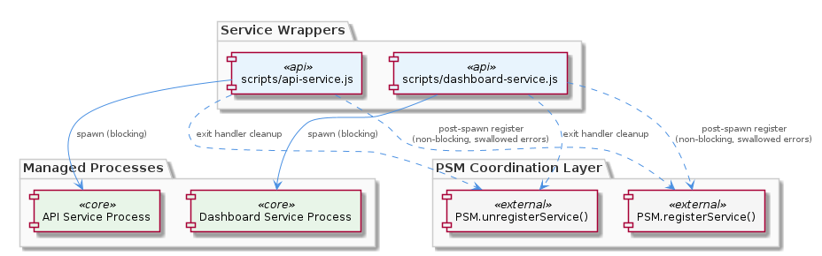
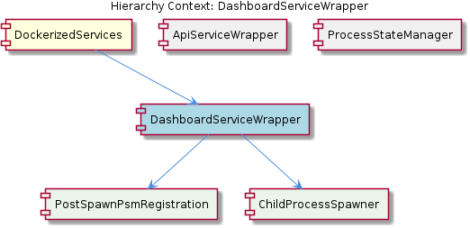

# DashboardServiceWrapper

**Type:** SubComponent

The symmetry between scripts/api-service.js and scripts/dashboard-service.js indicates both services share an implicit wrapper contract: spawn first, coordinate second

# DashboardServiceWrapper — Technical Insight Document

## What It Is

`DashboardServiceWrapper` is implemented in `scripts/dashboard-service.js` and serves as the lifecycle wrapper script for the dashboard service within the `DockerizedServices` component group. It is responsible for spawning the dashboard child process and coordinating its identity with the central `ProcessStateManager` (PSM) registry. The wrapper does not embed the dashboard application logic itself; rather, it acts as a thin orchestration layer that brings the service up, registers it for coordination, and ensures it is unregistered on shutdown.

Structurally, the wrapper decomposes into two child responsibilities: `ChildProcessSpawner`, which forks the dashboard process, and `PostSpawnPsmRegistration`, which handles the after-the-fact handshake with `ProcessStateManager`. This decomposition mirrors the structure of its sibling, `ApiServiceWrapper` (implemented in `scripts/api-service.js`), and both share an implicit wrapper contract enforced by convention rather than by a shared base class: **spawn first, coordinate second**.

## Architecture and Design

The architectural stance taken by `DashboardServiceWrapper` is one of **decoupled coordination**. The wrapper treats PSM as a non-blocking coordination sink — a place to deposit service identity information for the benefit of orchestration tooling, but never as a gating dependency that could prevent the dashboard from running. This is evident in the sequence: the child process is spawned first via `ChildProcessSpawner`, and only then does `PostSpawnPsmRegistration` invoke `ProcessStateManager.registerService()`. The dashboard is considered live and authoritative the moment the fork completes; PSM acknowledgment is never awaited as a readiness signal.

A defining design choice is the explicit swallowing of PSM registration failures. If `ProcessStateManager.registerService()` throws — for instance, because PSM's backing store or IPC channel is unavailable — the wrapper continues execution silently. This deliberately decouples dashboard availability from PSM health, ensuring that orchestration-layer faults cannot cascade into service-layer outages. The same philosophy applies on shutdown: an exit handler invokes `PSM.unregisterService()` to clean up the dashboard's PID/port record, but this too is best-effort. In crash scenarios where the exit handler does not fire, PSM's view of the dashboard will become stale, representing last-known state rather than guaranteed live state.

This pattern is not unique to the dashboard. The symmetry between `scripts/dashboard-service.js` and `scripts/api-service.js` indicates a shared architectural convention across `DockerizedServices`: both wrappers implement the same spawn-then-register-best-effort flow, and both register an exit hook for `PSM.unregisterService()`. The convention is reinforced by the fact that the only entry into the registry from either wrapper is `ProcessStateManager.registerService()`, the sibling component that serves as the registration target for both.

## Implementation Details

The execution flow inside `scripts/dashboard-service.js` proceeds in three logical phases. First, the `ChildProcessSpawner` responsibility creates the dashboard child process. The fork is treated as the point of liveness — there is no separate health probe, no waiting on stdout for a "ready" signal, and no synchronous handshake before proceeding. Second, the `PostSpawnPsmRegistration` responsibility calls `ProcessStateManager.registerService()` with the spawned process's identity (PID, port, and any associated metadata captured by the registry). This call is wrapped in error handling that catches and discards any thrown exception — registration failure does not propagate.

Third, the wrapper installs an exit handler that calls `PSM.unregisterService()` upon normal process termination. This handler mirrors the cleanup contract established in `ApiServiceWrapper` and is the only mechanism by which the dashboard's entry is removed from PSM under normal conditions. Like the registration call, the unregistration is best-effort: any error during cleanup is tolerated, since by the time it runs the dashboard is already exiting and there is no actionable recovery path.

Notably, the code structure analysis reports zero code symbols in this entity, which is consistent with the wrapper being a small, script-style file composed of top-level imperative statements rather than exported classes or functions. The logic lives in the sequence of calls itself, not in reusable abstractions.

## Integration Points

The primary integration point is with `ProcessStateManager`, a sibling component within `DockerizedServices`. `DashboardServiceWrapper` depends on PSM's public surface — specifically `ProcessStateManager.registerService()` and `PSM.unregisterService()` — but only in a unidirectional, fire-and-forget manner. PSM is not consulted for any decision made by the wrapper; it is purely a sink for identity information. This makes the dependency a soft one: the dashboard service would continue to function correctly even if PSM were completely removed, with the only loss being the registry record.

The wrapper also has a strong structural relationship with its sibling, `ApiServiceWrapper`. While there is no shared module between them, they implement the same wrapper contract, and changes to one are likely to require mirroring in the other to preserve the convention. The shared convention is documented at the parent level (`DockerizedServices`) and is realized concretely through the two child responsibilities `PostSpawnPsmRegistration` and `ChildProcessSpawner`, both of which are explicitly named to reflect their role in the spawn-then-coordinate sequence.

Within the dashboard process tree, `ChildProcessSpawner` is the integration point with the actual dashboard runtime. The wrapper does not impose any specific contract on the dashboard binary beyond standard Node.js child process semantics — it forks, observes the lifetime, and unregisters on exit.

## Usage Guidelines

Developers extending or modifying `DashboardServiceWrapper` should preserve the spawn-first, register-second ordering. Reversing this order — for example, attempting to register with PSM before forking — would couple dashboard availability to PSM health, violating the explicit design intent and the convention shared with `ApiServiceWrapper`. Similarly, the error-swallowing behavior around `ProcessStateManager.registerService()` should not be tightened into a hard failure; doing so would defeat the decoupling that makes PSM safe to take offline independently.

When inspecting PSM to diagnose dashboard state, developers should remember that the registry reflects **last-known state, not guaranteed live state**. A dashboard entry may persist in PSM after a crash because the exit handler did not run, and conversely a running dashboard may be absent from PSM if the initial registration call silently failed. Cross-referencing PSM entries with actual process state (e.g., via `ps` or port checks) is advisable when correctness matters.

When adding a new service wrapper to `DockerizedServices` alongside `DashboardServiceWrapper` and `ApiServiceWrapper`, follow the same pattern: spawn the child via a `ChildProcessSpawner`-equivalent step, call `ProcessStateManager.registerService()` post-spawn with errors swallowed, and install an exit handler invoking `PSM.unregisterService()`. This preserves the implicit wrapper contract and ensures consistent behavior across the component group.

---

## Summary Findings

**1. Architectural patterns identified:** Thin wrapper script pattern; decoupled best-effort coordination with a central registry; convention-based contract sharing between sibling wrappers (rather than inheritance or a shared base module); fire-and-forget integration with `ProcessStateManager`.

**2. Design decisions and trade-offs:** Service availability is prioritized over registry correctness — PSM failures cannot block dashboard startup, and registry state may become stale on crashes. The trade-off favors local development ergonomics (no startup deadlocks) at the cost of orchestration accuracy (potential zombie entries in PSM).

**3. System structure insights:** `DashboardServiceWrapper` decomposes into `ChildProcessSpawner` and `PostSpawnPsmRegistration`, structurally identical to `ApiServiceWrapper`. Both sit under `DockerizedServices` and both write into the sibling `ProcessStateManager`. The wrapper carries no exported symbols; its logic is script-level imperative code.

**4. Scalability considerations:** The pattern scales linearly with the number of wrapped services — each new service adds another best-effort writer to PSM. Because registration is non-blocking and failures are tolerated, PSM contention or unavailability does not create a scaling bottleneck for service startup. The model is explicitly tuned for a local development container, not high-availability orchestration.

**5. Maintainability assessment:** Maintainability is high for the wrapper itself due to its small surface area, but the convention-based contract with `ApiServiceWrapper` is fragile — there is no compile-time or test-time enforcement that the two wrappers stay in sync. Future maintainers must manually mirror changes across both files. Extracting the shared spawn-then-register-best-effort logic into a common module would harden the contract but is not currently done.

## Hierarchy Context

### Parent
- [DockerizedServices](./DockerizedServices.md) -- [LLM] **Process State Manager (PSM) as a Non-Critical Registration Sink**

The service wrapper scripts (`scripts/api-service.js` and `scripts/dashboard-service.js`) treat registration with the `ProcessStateManager` singleton as a best-effort, non-critical side effect rather than a prerequisite for service startup. Concretely, `ProcessStateManager.registerService()` is called after the child process is spawned, but any error thrown during registration is explicitly swallowed — the wrapper continues regardless. This design decision reflects a deliberate architectural stance: PSM is a coordination facility for coordinated startup/shutdown introspection, not a gating mechanism. If PSM fails (e.g., because its backing store or IPC channel is unavailable), the individual service still runs. Conversely, on process exit, the wrapper calls `PSM.unregisterService()` to clean up the PID/port records, again in a best-effort fashion. This means PSM's state can become stale in crash scenarios — a developer inspecting PSM for health should be aware that the registry reflects last-known state, not guaranteed live state. The tradeoff favors availability of individual services over centralized orchestration correctness, which is appropriate for a local development container where zombie processes are more easily tolerated than startup deadlocks.

### Children
- [PostSpawnPsmRegistration](./PostSpawnPsmRegistration.md) -- scripts/dashboard-service.js explicitly follows the same post-spawn PSM registration pattern as scripts/api-service.js, confirming this is a shared architectural convention across the DockerizedServices component, not an incidental implementation choice.
- [ChildProcessSpawner](./ChildProcessSpawner.md) -- scripts/dashboard-service.js treats the child process as live and authoritative the moment it is forked — PSM acknowledgment is never awaited as a readiness signal, consistent with the non-blocking coordination model described in the parent component.

### Siblings
- [ApiServiceWrapper](./ApiServiceWrapper.md) -- scripts/api-service.js calls ProcessStateManager.registerService() after the child process is spawned, meaning the service is live before PSM acknowledgment occurs
- [ProcessStateManager](./ProcessStateManager.md) -- ProcessStateManager.registerService() is the entry point called by both scripts/api-service.js and scripts/dashboard-service.js after child process spawn, recording service identity in the registry

---

*Generated from 4 observations*
