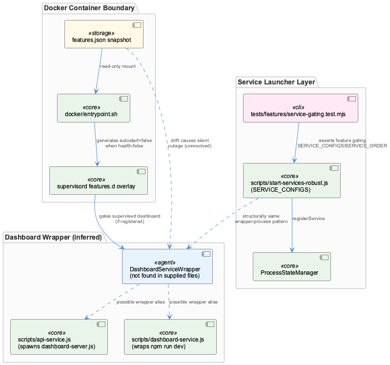
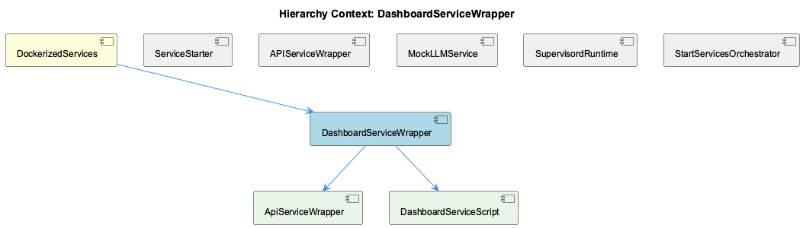

# DashboardServiceWrapper

**Type:** SubComponent

# DashboardServiceWrapper — Technical Insight Document

## What It Is

DashboardServiceWrapper is the orchestration layer implemented primarily across `scripts/start-services-robust.js`, `docker/entrypoint.sh`, `start-services.sh`, and `tests/features/service-gating.test.mjs`, that governs how heterogeneous services (Express APIs, Next.js dev servers, Python subprocesses) are started, gated by feature flags, and verified as healthy — both on the host and inside a Docker container. As a child of DockerizedServices, it embodies the same dual-mode execution reality: services either run as supervisord-managed processes inside a single container, or as host-native Node subprocesses tracked through ProcessStateManager. DashboardServiceWrapper is the concrete machinery that makes that duality operable, containing four sub-components — ServiceRequiredFlagAsymmetry, SERVICE_ORDER_Contract, FeatureGatedStartOneService, and DockerEntrypointFeatureSnapshot — each addressing a distinct facet of the same underlying problem: keeping configuration, ordering, and feature-gating consistent across two independently editable execution paths.

## Architecture and Design

The core architectural pattern is a wrapper/adapter normalizing disparate service types behind one PSM lifecycle contract, layered with declarative feature-gating checked against a shared catalogue (`FEATURE_IDS` from `lib/features/catalogue.cjs`). Crucially, this catalogue is enforced at two physically separate boundaries — the host (`SERVICE_CONFIGS[...].feature` in `start-services-robust.js`) and the container (`PROGRAM_FEATURES` in `docker/entrypoint.sh`) — with no shared runtime code crossing that boundary. Instead, consistency between the two is enforced entirely by tests: `tests/features/service-gating.test.mjs` on the host side, and `tests/features/container-gating.test.mjs` on the container side, mirroring each other's role as drift detectors.

A second defining pattern is the snapshot-file bridge: `docker/entrypoint.sh` reads a host-written, read-only snapshot at `/coding/.coding/runtime/features.json` rather than attempting to run the host's feature resolver inside the container. This is architecturally identical to the `CODING_ROOT` override bridge noted in the parent DockerizedServices observations and in `llm-mock-service.ts` — both cross the host/container boundary via a mounted file instead of environment variables passed at container-create time.

The most consequential design decision is the deliberate asymmetry in failure posture. FeatureGatedStartOneService (host side) fails **closed**: an unknown feature name throws rather than silently skipping. DockerEntrypointFeatureSnapshot (container side) fails **open**: an unknown feature key, or an entirely missing snapshot, defaults to "enabled," per the explicit rationale in the entrypoint script that a container silently running nothing is harder to diagnose than one running too much. This is not an oversight but a considered per-blast-radius choice, tested explicitly by both service-gating and container-gating suites.

## Implementation Details

At the host level, `scripts/start-services-robust.js` defines `SERVICE_CONFIGS` and `SERVICE_ORDER` as plain data structures — there's no schema or type system enforcing shape. ServiceRequiredFlagAsymmetry lives here: `transcriptMonitor` and `liveLoggingCoordinator` are marked `required: true, maxRetries: 3`, forming the base that "later services register against" (per the test's own comment), while services like dashboard/graphify are optional, consistent with the module's stated goal of "retry-with-timeout and graceful degradation for all services." Nothing in the language prevents someone from flipping `required: true` to `false` — the only guard is `SERVICE_ORDER_Contract`'s assertion in `tests/features/service-gating.test.mjs` that `SERVICE_ORDER.slice(0, 2)` equals `['transcriptMonitor', 'liveLoggingCoordinator']`.

The wrapper also implements dual "is this running" verification: PSM-based checks (`psm.isServiceRunning(...)`) plus `isProcessRunningByScript()`, a `pgrep`-based scan for orphaned processes. When an orphan is found, it is explicitly re-registered with PSM — a self-healing reconciliation-on-read, not a passive check. This same "guard against drift between source of truth and observed reality" concern reappears architecturally in DockerEntrypointFeatureSnapshot's handling of `PROGRAM_FEATURES` versus `supervisord.conf`.

Port lifecycle management is similarly two-phased: `killProcessOnPortAndWait()` (SIGTERM→poll→SIGKILL escalation) followed by `waitForPortBindable()`, which distinguishes "HTTP-responsive" from "actually bindable" using a throwaway `net.createServer()` probe — a fix for a concrete observed kernel race (post-crash TIME_WAIT-like states) that would otherwise burn a `maxRetries` slot on a doomed `EADDRINUSE` spawn.

On the container side, `FeatureGatedStartOneService`'s sibling `DockerEntrypointFeatureSnapshot` mechanism is implemented via fragile-but-intentional shell idioms: `PROGRAM_FEATURES` is a whitespace-delimited string parsed with `${pair%%:*}`/`${pair##*:}`, and a `node -e` one-liner must emit exactly `"true"`/`"false"` on stdout for the surrounding `if [ "$enabled" = "false" ]` string comparison to behave correctly. The `2>/dev/null || echo "true"` fallback only catches nonzero exit codes, not malformed-but-successful output — an undocumented edge case that still fails open, consistent with policy but not explicitly guarded.

Finally, `start-services.sh` retains a legacy bash path (`ROBUST_MODE=false`) using raw `lsof`/`kill -9`/`docker-compose` calls and string-based status tracking (`CONSTRAINT_MONITOR_STATUS="✅ FULLY OPERATIONAL"`), which the Node.js rewrite replaced with PSM registration and structured retry. This is a live migration seam, not dead code — `ROBUST_MODE` defaults `true` but the fallback remains reachable.

## Integration Points

DashboardServiceWrapper sits directly beneath DockerizedServices and interacts closely with its siblings. ServiceStarter formalizes the same SERVICE_CONFIGS/SERVICE_ORDER feature-gating logic that DockerEntrypointFeatureSnapshot mirrors on the container side — both must be updated together or the two deployment modes drift, a risk `tests/features/service-gating.test.mjs`'s coverage assertion is designed to catch. ServiceProbe supplies the protocol-level health <COMPANY_NAME_REDACTED> (`probeHttpHealth`/`probeTcpPort`) that DashboardServiceWrapper's health checks build upon, though `entrypoint.sh`'s `wait_for_service()` implements its own ad-hoc `/dev/tcp` probing rather than delegating to it — an acknowledged duplication. ProcessStateManager is the registry that both PSM-based checks and orphan re-registration in `isProcessRunningByScript()` depend on. APIServiceWrapper and SupervisordRuntime share the same `PROGRAM_FEATURES`/entrypoint.sh mechanism described here, confirming that DockerEntrypointFeatureSnapshot is a cross-cutting concern rather than isolated to this component alone.

## Usage Guidelines

Developers modifying `SERVICE_CONFIGS` or `SERVICE_ORDER` must keep both in sync — the coverage test will fail CI otherwise, which is the intended enforcement mechanism, not a suggestion. Never assume flipping `required` on `transcriptMonitor` or `liveLoggingCoordinator` is safe: doing so risks silently breaking the observability pipeline other services register against, guarded only by one `assert.deepEqual`. When adding a new feature flag, it must be wired into both the host catalogue (`FEATURE_IDS`) and the container's `PROGRAM_FEATURES` map — these are independently maintained and only kept consistent by tests, not shared code. On the container side, remember the fail-open default: an absent or malformed snapshot, or unknown feature key, means "run it," so container gating should never be relied upon as a security boundary. Conversely, host-side gating fails loudly on typos, so `startOneService()` errors should be treated as configuration bugs to fix immediately, not degraded-mode conditions. Finally, treat `start-services.sh`'s legacy bash branch as still-live migration code, not deletable cruft, until `ROBUST_MODE` is fully retired.

## Hierarchy Context

### Parent
- [DockerizedServices](./DockerizedServices.md) -- [LLM] The DockerizedServices layer is architected around a dual-mode execution model: services can run either as supervisord-managed processes inside a single Docker container (per docker/docker-compose.yml, Dockerfile.coding-services, supervisord.conf) or as host-native Node subprocesses managed by lib/service-starter.js and PID-tracked via ProcessStateManager. This duality means developers must understand that 'starting a service' has two entirely separate code paths depending on deployment target, and that health-checking logic (service-probe.js) is written to be agnostic to which path is in effect — it only cares about HTTP/TCP reachability, not process ownership. This design avoids needing separate health-monitoring logic for containerized vs local services, but it also means Docker-specific failures (e.g., supervisord misconfiguration killing a service inside the container) surface identically to host-side crashes, requiring log inspection to disambiguate.

### Children
- [ServiceRequiredFlagAsymmetry](./ServiceRequiredFlagAsymmetry.md) -- [LLM] The required/optional split lives entirely in a plain data literal inside `SERVICE_CONFIGS` in `scripts/start-services-robust.js` (`transcriptMonitor: { required: true, maxRetries: 3, ... }`, `liveLoggingCoordinator: { required: true, maxRetries: 3, ... }`), not in any type system or schema. There is nothing structural preventing a future edit from flipping `required: true` to `required: false` on one of these two entries, or from adding a new service object that omits the field entirely — the only thing that would catch such a mistake is the hand-written assertion in `tests/features/service-gating.test.mjs` (`SERVICE_ORDER.slice(0, 2)` must equal `['transcriptMonitor', 'liveLoggingCoordinator']`). This makes the 'required' flag a convention enforced by a single test file rather than by the language, which is precisely the asymmetry the component name points at: the blast radius of a typo is unbounded (silent observability collapse) but the guard against it is one `assert.deepEqual` in one test.
- [SERVICE_ORDER_Contract](./SERVICE_ORDER_Contract.md) -- [LLM] `tests/features/service-gating.test.mjs` treats `SERVICE_ORDER` and `SERVICE_CONFIGS` as two halves of one contract that must never drift independently: the test `'SERVICE_ORDER and SERVICE_CONFIGS cover each other exactly'` sorts and diffs `SERVICE_ORDER.map((o) => o.key)` against `Object.keys(SERVICE_CONFIGS)`, which catches both directions of the bug class named in the file's header comment — a service registered in `SERVICE_CONFIGS` but forgotten in `SERVICE_ORDER` (never started), and the inverse (an order entry pointing at a config that no longer exists, throwing at runtime instead of at CI time). A second test, `'the live-logging pair still starts before everything else'`, pins `SERVICE_ORDER.slice(0, 2)` to `['transcriptMonitor', 'liveLoggingCoordinator']` specifically because — per the test's own comment — 'the transcript monitor and its coordinator are what later services register against.' This makes ordering a first-class, tested invariant rather than an implicit consequence of array literal order in `start-services-robust.js`.
- [FeatureGatedStartOneService](./FeatureGatedStartOneService.md) -- [LLM] `docker/entrypoint.sh`'s feature-gating block occupies a narrow correctness window bounded by two shell idioms working together: `PROGRAM_FEATURES` is a whitespace-delimited string (not a bash array), so each `pair` is split with `${pair%%:*}`/`${pair##*:}` parameter expansion rather than an actual key-value structure, and the `node -e` one-liner it shells out to must return exactly the literal strings `"true"`/`"false"` on stdout because the surrounding `if [ "$enabled" = "false" ]` is a plain string comparison. Any stray newline, warning, or stderr leak from `require(process.argv[1])` — e.g. if `/coding/.coding/runtime/features.json` were valid JSON but not an object — would make `$enabled` something other than the two expected literals, and because the `2>/dev/null || echo "true"` fallback only catches a nonzero exit code (not malformed-but-successful output), that class of failure fails open silently, consistent with the script's own stated philosophy but undocumented as a specific gap.
- [DockerEntrypointFeatureSnapshot](./DockerEntrypointFeatureSnapshot.md) -- [LLM] `docker/entrypoint.sh` implements a two-tier fail-open/fail-closed asymmetry within a single feature-gating mechanism. The overall snapshot-missing case fails open (`else` branch: 'No feature snapshot ... starting everything'), and within the snapshot-present case, an *unknown feature key* inside `PROGRAM_FEATURES` also fails open via the `node -e` one-liner's `value === false ? "false" : "true"` ternary. Both failure modes point the same direction (run more, not less), which is a deliberate container-wide policy documented inline: 'a container that silently ran nothing because a JSON file was late would be far harder to diagnose than one that ran too much.' This is worth noting precisely because it inverts the posture taken one layer up in the host-side test suite.

### Siblings
- [ServiceStarter](./ServiceStarter.md) -- [LLM] scripts/start-services-robust.js implements a feature-gated service catalogue via SERVICE_CONFIGS and SERVICE_ORDER, where each service declares a 'feature' string that is checked against a loaded feature set (loadFeatures from lib/features/index.mjs) before startOneService() decides to skip, start, or block. This is a formalization of the docker/entrypoint.sh PROGRAM_FEATURES mapping seen for the containerized path — both the host and container execution paths implement the same feature-gating concept but via entirely separate mechanisms (JS object config vs shell/supervisord conf generation), meaning any new feature must be wired into both places or the two deployment modes will drift, a risk explicitly guarded against by tests/features/service-gating.test.mjs's 'SERVICE_ORDER and SERVICE_CONFIGS cover each other exactly' assertion.
- [ServiceProbe](./ServiceProbe.md) -- [LLM] service-probe.js is architected as a pure protocol-level health <COMPANY_NAME_REDACTED> that is deliberately blind to process ownership, deployment topology, and service identity beyond a URL or port. Per the parent context, probeHttpHealth() and probeTcpPort() implement SPEC R6's strict three-state model (running/stopped/unknown), and this component's inclusion in DockerizedServices is evidence that the same probing logic is reused for supervisord-managed containerized processes (docker/entrypoint.sh, Dockerfile.coding-services) and host-native subprocesses (scripts/start-services-robust.js via lib/service-starter.js). The trade-off documented in the parent observations is real and visible in the code here: docker/entrypoint.sh's wait_for_service() function implements its own ad-hoc TCP probing (bash /dev/tcp check) rather than delegating to service-probe.js, meaning there are at least two independent health-probing implementations in this codebase — one for container-internal database readiness (Qdrant/Redis) at entrypoint time, and one (service-probe.js) for post-startup ongoing health polling.
- [APIServiceWrapper](./APIServiceWrapper.md) -- [LLM] docker/entrypoint.sh implements a fail-open feature-gating override layered on top of supervisord rather than a rewrite of supervisord.conf itself: it reads a host-written snapshot at /coding/.coding/runtime/features.json and, for each entry in the PROGRAM_FEATURES mapping (e.g. `semantic-analysis:knowledge`, `graphify:codegraph`, `constraint-monitor:constraints`), shells out to `node -e` (not jq, which isn't installed in the image) to decide whether to emit a `[program:X]\nautostart=false` stanza into /etc/supervisor/features.d/disabled.conf. The comment block explicitly justifies the 'unknown feature reads as enabled' default and the 'missing snapshot starts everything' default as deliberate fail-open behavior, reasoning that a container that silently runs nothing because a JSON file arrived late is harder to diagnose than one that runs too much — this is an explicit trade-off favoring debuggability over minimalism at container boot.
- [SupervisordRuntime](./SupervisordRuntime.md) -- [LLM] docker/entrypoint.sh implements a fail-open feature-gating layer that sits in front of supervisord rather than inside it: it reads a host-written snapshot at /coding/.coding/runtime/features.json (mounted read-only) and, for each entry in the PROGRAM_FEATURES mapping (e.g. `semantic-analysis:knowledge`, `graphify:codegraph`, `constraint-monitor:constraints`, `health-dashboard:health`), shells out to `node -e` to read the flag and writes a `[program:<name]\nautostart=false` stanza into /etc/supervisor/features.d/disabled.conf when a feature is off. Because supervisord.conf's `[include]` directive pulls in that directory, the override never touches the canonical program definitions — it only flips autostart. The script deliberately treats an absent snapshot, an unreadable snapshot, or an unknown feature key as 'enabled' (comment: 'starts everything — the historical behaviour'), which is a conscious fail-open decision to avoid a container that silently runs nothing because a JSON file arrived late.
- [ProcessStateManager](./ProcessStateManager.md) -- [CGR] ProcessStateManager (class) in process-state-manager.js
- [StartServicesRobust](./StartServicesRobust.md) -- [LLM] scripts/start-services-robust.js implements a two-class service model — REQUIRED (transcriptMonitor, liveLoggingCoordinator) vs OPTIONAL (everything else) — that is enforced not by a flag on the service itself but by how startOneService() (referenced in tests/features/service-gating.test.mjs) interprets the `required: true` field on SERVICE_CONFIGS entries. The test 'a required failure blocks, so downstream services do not start' confirms that a required-service failure sets `out.blocked = true` and halts SERVICE_ORDER iteration, while an optional failure is recorded in `results.failed` or `results.degraded` without stopping subsequent services. This is the concrete mechanism behind the parent-context claim that the toolkit 'should remain usable in a degraded state' — degradation is implemented as a loop-continuation decision, not a separate code path.

---

*Generated from 9 observations*
