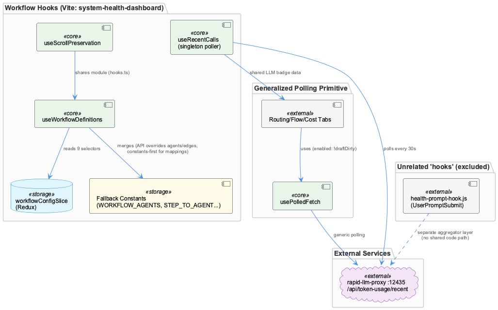
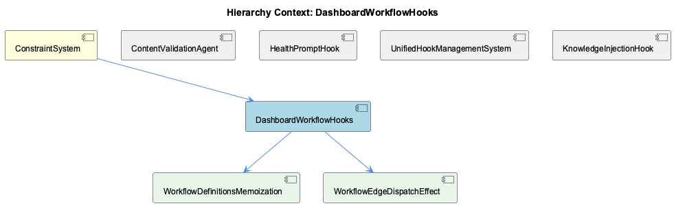

# DashboardWorkflowHooks

**Type:** SubComponent

## What It Is

DashboardWorkflowHooks is the collection of React hooks implemented in `integrations/system-health-dashboard/src/components/workflow/hooks.ts` (plus the general-purpose `integrations/system-health-dashboard/src/hooks/usePolledFetch.ts`) that power the workflow-visualization UI within the Vite-based `system-health-dashboard`. It centralizes four concerns: Redux-backed workflow graph data (agents, edges, step mappings) via `useWorkflowDefinitions`, scroll preservation via `useScrollPreservation`, and live LLM telemetry polling via `useRecentCalls`. As parent, `ConstraintSystem` relies on this component to feed the constraint-monitor dashboard tab that the tmux statusline's click-report feature opens/focuses.

## Architecture and Design

The core pattern in `useWorkflowDefinitions` (hooks.ts:20-84) is a constants-as-fallback / API-overrides-constants merge: for `agents`, `orchestrator`, and `edges`, live Redux data (from `selectAgents`, `selectOrchestrator`, `selectEdges`, etc., all reading `workflowConfigSlice`) wins when present, falling back to `WORKFLOW_AGENTS`, `ORCHESTRATOR_NODE`, `MULTI_AGENT_EDGES`. But for the three mapping objects (`STEP_TO_AGENT`, `STEP_TO_SUBSTEP`, `AGENT_SUBSTEPS`), the merge order is deliberately reversed — constants spread first, API data second — so a partial API response can never leave a step (notably `operator_* → kg_operators`) unmapped. This asymmetry is a key design decision documented directly in code comments, not an accident.

A second pattern is the single all-encompassing `useMemo`, implemented as the child entity WorkflowDefinitionsMemoization, wrapping both the uninitialized-fallback and initialized-merge branches. This exists to satisfy the Rules of Hooks after an earlier version used an early `return` for the fallback path, causing a variable hook count across renders.

A third pattern, `useRecentCalls`, is a shared-subscription/singleton poller: module-scope `_recentCalls`, `_subscribers`, `_intervalId` ensure exactly one `setInterval` services all components displaying the LLM badge, transitioning 0→1 subscribers to start polling and 1→0 to tear it down.

`usePolledFetch` generalizes a fourth pattern — visibility-aware polling with resume-triggers-immediate-refresh — attributed to `HealthRefreshManager`/`healthRefreshMiddleware.ts`, pausing on `document.hidden` and firing an immediate fetch on visibility resume rather than waiting out the interval.

## Implementation Details

`useWorkflowDefinitions` reads nine Redux selectors from `workflowConfigSlice` (`selectAgents`, `selectOrchestrator`, `selectEdges`, `selectStepMappings`, `selectStepToSubStep`, `selectAgentSubSteps`, `selectWorkflowConfigLoading`, `selectWorkflowConfigError`, `selectWorkflowConfigInitialized`). The `useMemo`'s dependency array lists all nine derived values: `[initialized, agents, orchestrator, edges, stepToAgent, stepToSubStep, agentSubSteps, isLoading, error]`. Without this memoization, the object-spread merges on lines 82-84 would allocate fresh objects every render, which the multi-agent-graph consumer's `stepStatusMap` memo would see as changed input — cascading through `getNodeStatus`, `renderNode`, and full node re-renders with duplicate `Logger.info` calls per paint.

The child WorkflowEdgeDispatchEffect corresponds to an unnamed inline `useEffect` (hooks.ts:36-40): `useEffect(() => { if (workflowName && initialized) { dispatch(setWorkflowEdges({ workflowName })) } }, [workflowName, initialized, dispatch])` — an edge-dispatch effect embedded in the larger hook rather than a standalone symbol.

`useRecentCalls` polls `rapid-llm-proxy` on port 12435 (`/api/token-usage/recent?limit=50`) every 30 seconds via the shared interval. `usePolledFetch` (usePolledFetch.ts:60-118) tracks a `wasPaused` ref, and exposes an `enabled` option described as "a real safety seam" — e.g., the Routing tab passes `enabled: !draftDirty` so in-flight refetches never clobber an unsaved operator edit; disabling mid-edit skips scheduling entirely via an early `return` after `setCountdown(null)`.

## Integration Points

`useWorkflowDefinitions` integrates tightly with `workflowConfigSlice` (Redux) and dispatches `setWorkflowEdges`. `usePolledFetch` is consumed by `token-usage.tsx`'s Routing/Flow/Cost tabs and mirrors `HealthRefreshManager` conventions, though it is architecturally separate from workflow/hooks.ts. Both `system-health-dashboard` files are reachable only through the shared `health-prompt-hook.js` status aggregator, which belongs to sibling HealthPromptHook — a distinct "hook" concept (a Claude Code `UserPromptSubmit` lifecycle hook querying `:3034`) sharing no code path despite naming overlap. Similarly, sibling KnowledgeInjectionHook and files like `tests/features/cli-and-rules-gating.test.mjs` are unrelated retrieval noise. Any shared-hook extraction toward the Next.js constraint-monitor dashboard must cross the ESLint flat-config/Vite boundary noted in the Dashboard ESLint Configuration record.

## Usage Guidelines

Preserve the merge-order asymmetry in `useWorkflowDefinitions`: mapping constants must be spread before API overrides, never after, to avoid unmapped steps. Never split the surrounding `useMemo` into conditional branches — keep hook-call counts invariant across renders. When adding new polling-based UI (badges, tabs), prefer subscribing to `useRecentCalls`'s existing singleton or adopting `usePolledFetch`'s `enabled`/visibility pattern rather than introducing a new per-component interval. Treat "hook" naming collisions carefully — this component's React hooks are unrelated to HealthPromptHook, UnifiedHookManagementSystem, or KnowledgeInjectionHook despite superficial naming similarity.

## Work Record

What working sessions recorded about this entity — decisions taken, problems hit, and why things are the way they are:

- The Dashboard ESLint Configuration record (about DashboardModule) establishes that dashboard codebases are split across two different ESLint regimes — Next.js flat-config for the constraint-monitor dashboard versus a Vite setup — and that the split exists specifically to prevent CLI syntax errors and missing-plugin crashes; any shared-hook extraction between `system-health-dashboard`'s `hooks.ts`/`usePolledFetch.ts` and the Next.js dashboard would cross that boundary and inherit its lint-config mismatch.
- The HealthDashboard architecture record establishes that `system-health-dashboard` (the Vite app hosting `workflow/hooks.ts` and `usePolledFetch.ts`) is distinct in framework and build/deploy pipeline from the Next.js constraint-monitor dashboard, and that both are reachable only through the shared `health-prompt-hook.js` status aggregator — meaning the two `health-prompt-hook.js`-adjacent files retrieved alongside this component (scripts/health-prompt-hook.js, tests/integration/health-prompt-hook-stall.test.mjs) belong to that separate aggregator layer, not to the dashboard's own workflow-visualization hooks, despite sharing the word 'hook'.

## Hierarchy Context

### Parent
- [ConstraintSystem](./ConstraintSystem.md) -- [SESSION] The Statusline Click-Report Feature record establishes that clicking the 'constraints' field in the tmux statusline opens or focuses the constraint-monitor dashboard tab, tying ConstraintSystem violation state directly into the click-driven statusline UX

### Children
- [WorkflowDefinitionsMemoization](./WorkflowDefinitionsMemoization.md) -- [LLM] The `useWorkflowDefinitions` hook in integrations/system-health-dashboard/src/components/workflow/hooks.ts:23-90 wraps its entire return value in a single `useMemo` (lines 53-90) whose dependency array lists all nine values it derives from: `[initialized, agents, orchestrator, edges, stepToAgent, stepToSubStep, agentSubSteps, isLoading, error]`. The memoization exists purely to prevent the object-spread merges on lines 82-84 (`{ ...STEP_TO_AGENT, ...(stepToAgent || {}) }` and its two siblings) from allocating fresh objects on every render — spreads by definition produce a new reference each call, so without the memo, three of the hook's six return fields would never be referentially stable even when their inputs hadn't changed.
- [WorkflowEdgeDispatchEffect](./WorkflowEdgeDispatchEffect.md) -- [LLM] No file in the supplied evidence defines, exports, or references a component named `WorkflowEdgeDispatchEffect`. The only candidate that plausibly matches this label is the anonymous `useEffect` inside `useWorkflowDefinitions` in integrations/system-health-dashboard/src/components/workflow/hooks.ts:36-40 — `useEffect(() => { if (workflowName && initialized) { dispatch(setWorkflowEdges({ workflowName })) } }, [workflowName, initialized, dispatch])` — which is structurally an 'edge dispatch effect' (it dispatches a Redux action that sets workflow edges), but it is an unnamed inline effect inside a larger hook, not a standalone entity with this name. Nothing in the code establishes that identifier as a real symbol.

### Siblings
- [ContentValidationAgent](./ContentValidationAgent.md) -- [SESSION] The obs-api Service Lifecycle and Dev Workflow Resumption record establishes that a coverage metric in obs-api computes a ratio whose denominator should exclude 'observations' and 'digests' entity types but currently includes them, skewing reported coverage.
- [HealthPromptHook](./HealthPromptHook.md) -- [SESSION] The HealthDashboard record establishes that health-prompt-hook.js is the 'status aggregator' feeding the tmux statusline click-report integration alongside the constraint-monitor dashboard.
- [UnifiedHookManagementSystem](./UnifiedHookManagementSystem.md) -- [SESSION] The tmux Statusline Copy-Mode / Mouse Configuration record and Tmux Pane Badge — ETM Entry Selection Logic record are both filed under HookManagementSystem, indicating this component's scope extends beyond agent tool hooks into tmux pane/statusline click-hook wiring.
- [KnowledgeInjectionHook](./KnowledgeInjectionHook.md) -- [LLM] None of the supplied code files implement, import, or reference a `KnowledgeInjectionHook` entity. `scripts/health-prompt-hook.js` is a `UserPromptSubmit` hook whose entire job is fetching `/health/state` from the host health-coordinator and reducing it to a one-line status string (`deriveSummary()`, `outputHealthContext()`) — it injects a health summary, not knowledge-base content, into the prompt context. The parent context's own description of knowledge injection lives in `lib/agent-api/hooks/hook-config.js` and `hook-manager.js` (per the parent's [LLM] observations), and neither file appears anywhere in the Code Files provided here.

---

*Generated from 10 observations*
