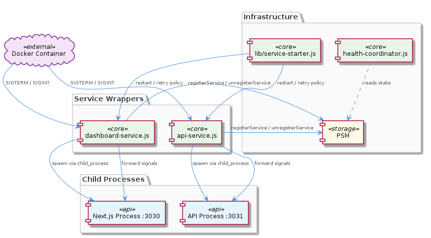
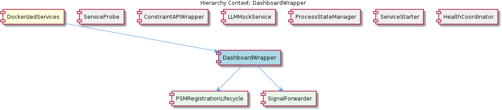

# DashboardWrapper

**Type:** SubComponent

The duplication between api-service.js and dashboard-service.js is explicitly a maintenance risk: adding a third service means copying this boilerplate rather than invoking a shared abstraction

# DashboardWrapper

## What It Is

DashboardWrapper is implemented in `scripts/dashboard-service.js` and serves as the process-lifecycle wrapper around the Next.js dashboard application running on port 3030. It is a SubComponent of the DockerizedServices group and exists specifically to bridge the gap between the OS-level Node.js child process hosting the dashboard and the in-process ProcessStateManager (PSM) registry that the rest of the system <USER_ID_REDACTED> for service state.

Structurally, `scripts/dashboard-service.js` mirrors the pattern of its sibling `scripts/api-service.js` exactly: it spawns the dashboard via Node's `child_process` module, calls `psm.registerService()` to record the new process handle, wires up signal forwarding for `SIGTERM` and `SIGINT`, and invokes `psm.unregisterService()` from the exit handler. The wrapper itself owns two distinct sub-responsibilities — PSMRegistrationLifecycle and SignalForwarder — which together compose the complete lifecycle contract that all Dockerized services in the project must satisfy.

The wrapper's existence is justified primarily by the need to translate Docker container signals into clean Node process termination and to keep the PSM registry consistent with the actual state of the dashboard process at all times.

## Architecture and Design

The architectural approach is a thin **process wrapper** pattern: `scripts/dashboard-service.js` does not contain dashboard business logic itself, but instead provides a controlled lifecycle envelope around a spawned Next.js child process. This is a deliberate separation of concerns that follows the same blueprint established by `scripts/api-service.js`, and the duplication is intentional — the wrapper script owns process lifecycle signals while the retry policy is delegated elsewhere, ensuring that signal handling and restart semantics never become entangled.

Port assignment is treated as a wrapper-level configuration concern rather than something the ProcessStateManager needs to know about. The dashboard runs on port 3030, distinct from the API's port 3031, and this distinction lives entirely inside the wrapper script. The PSM registry tracks services by identity, not by port, which is consistent with the broader design philosophy described at the parent DockerizedServices level: service identity is deliberately decoupled from OS-level process identity, allowing consumers like `scripts/health-coordinator.js` to query PSM state without needing direct PID or port awareness.

The composition of DashboardWrapper into PSMRegistrationLifecycle and SignalForwarder reflects a clean two-axis design. PSMRegistrationLifecycle handles the registerService-on-start / unregisterService-on-exit pattern that is shared verbatim with `scripts/api-service.js`, indicating a stable PSM contract across all Dockerized services. SignalForwarder is set up immediately after the child process is spawned, ensuring there is no window in which a container stop signal could arrive without being properly propagated to the child.

## Implementation Details

The startup sequence in `scripts/dashboard-service.js` proceeds in a strict order. First, the script spawns the Next.js dashboard as a child process on port 3030 using Node's `child_process` module. Immediately after the spawn returns a process handle, the script calls `psm.registerService()` to record the dashboard's presence in the singleton PSM registry. Signal handlers for `SIGTERM` and `SIGINT` are then attached to the parent (wrapper) process, with their handlers configured to forward the signal to the spawned child. Finally, an exit handler is registered that calls `psm.unregisterService()` so that the PSM state immediately reflects any process termination, whether graceful or crash-induced.

The SIGTERM/SIGINT forwarding logic is specifically what makes the wrapper compatible with Docker's container stop semantics. When Docker sends a stop signal to the container, it reaches the wrapper process first; without explicit forwarding, the underlying Next.js process would be orphaned and left running until the container's grace period expired and a SIGKILL was issued. By wiring signals through SignalForwarder during startup, the wrapper ensures that Docker container stop signals reach the Next.js process directly, producing clean shutdown behavior.

The exit handler's call to `psm.unregisterService()` has an important secondary property: a crashed dashboard is immediately reflected in PSM state without requiring `scripts/health-coordinator.js` to poll for liveness. This push-based deregistration means the health coordinator can trust the PSM registry as an authoritative, low-latency view of which services are actually running, rather than treating it as a cache that needs periodic reconciliation.

Restart and retry logic are deliberately absent from `scripts/dashboard-service.js` itself. That responsibility is delegated to `lib/service-starter.js`, which mirrors the same isolation applied to `scripts/api-service.js`. The wrapper's job ends at process lifecycle and signal propagation; deciding whether and when to relaunch a failed dashboard belongs to the ServiceStarter abstraction.

## Integration Points

DashboardWrapper integrates with the singleton ProcessStateManager through the `psm.registerService()` and `psm.unregisterService()` calls. Because PSM is a singleton shared across all wrapper scripts and `scripts/health-coordinator.js`, the wrapper does not need to pass explicit references — it simply imports and uses the shared registry instance, the same way `scripts/api-service.js` does.

The wrapper integrates with `lib/service-starter.js` by being launched and supervised by it. ServiceStarter owns the retry policy, while DashboardWrapper owns the in-process lifecycle once started; this clean split means that signal-handling code never needs to reason about restart conditions, and restart logic never needs to reason about signal semantics.

Indirectly, DashboardWrapper integrates with `scripts/health-coordinator.js` through the shared PSM state. The health coordinator reads service status from PSM without ever holding direct references to the dashboard's PID or port, which is the central decoupling described at the parent DockerizedServices level. Sibling components participate in this same pattern: ConstraintAPIWrapper applies the same child_process spawn approach for the constraint monitor Express API, and ServiceProbe (at `lib/utils/service-probe.js`) is consumed by the health coordinator as a utility that operates against the PSM registry.

The wrapper has no direct integration with LLMMockService, which manages its own state via `workflow-progress.json`, nor does it interact with `lib/utils/service-probe.js` directly — those concerns live at the orchestration layer above the wrappers.

## Usage Guidelines

When adding a new Dockerized service, developers should be aware that the current design requires copying the `scripts/dashboard-service.js` (or `scripts/api-service.js`) boilerplate rather than invoking a shared abstraction. This duplication is acknowledged as a maintenance risk: adding a third service means replicating the spawn / registerService / wire signals / unregisterService sequence, and any future change to the PSM contract would need to be applied to each wrapper script individually. If a third service is being introduced, this is the right time to consider extracting the shared pattern into a reusable factory.

Developers modifying `scripts/dashboard-service.js` should preserve the ordering of operations: spawn first, register with PSM immediately after, wire signals before any await or asynchronous gap, and ensure the exit handler always calls `psm.unregisterService()`. Breaking this ordering risks either orphaned child processes (if signals are wired too late) or stale PSM entries (if the exit handler is bypassed on crash paths).

Port configuration belongs in the wrapper script. The dashboard's port 3030 assignment is intentionally not a PSM concern, and pushing port logic into PSM would violate the service-identity-versus-process-identity decoupling that the parent DockerizedServices architecture depends on. Similarly, do not add restart logic to `scripts/dashboard-service.js` — that responsibility belongs to `lib/service-starter.js`, and mixing the two would re-couple concerns that have been carefully separated.

Finally, developers should treat the PSM registry as an authoritative, push-updated view of dashboard liveness. Because `psm.unregisterService()` runs in the exit handler, there is no need for `scripts/health-coordinator.js` or other consumers to poll for dashboard crashes — the registry will already reflect the change. Adding redundant polling logic elsewhere would undermine this guarantee and introduce race conditions.

## Hierarchy Context

### Parent
- [DockerizedServices](./DockerizedServices.md) -- [LLM] The ProcessStateManager (PSM) singleton implements a deliberate decoupling between service identity and process identity across both `scripts/api-service.js` and `scripts/dashboard-service.js`. Each script follows an identical structural pattern: spawn a child process via Node's `child_process` module, register the resulting process handle with the PSM via `psm.registerService()`, wire up `SIGTERM`/`SIGINT` forwarding so that signals delivered to the wrapper propagate to the child, and call `psm.unregisterService()` in the exit handler. This indirection means that the rest of the system (including `scripts/health-coordinator.js`) can query the PSM registry without holding direct references to OS-level process IDs. The practical consequence for developers is that a service restart — where a new child process replaces the old one — does not require the health coordinator or any consumer of PSM state to be aware of the PID change; only the wrapper scripts update the registry. This pattern also cleanly isolates the restart/retry logic in `lib/service-starter.js` from signal-handling responsibilities, since the wrapper owns the process lifecycle signals while the starter owns the retry policy. A new developer should note that adding a new containerized service almost certainly means creating a new wrapper script that replicates this boilerplate rather than centralizing it, which is a potential maintenance concern as the number of services grows.

### Children
- [PSMRegistrationLifecycle](./PSMRegistrationLifecycle.md) -- scripts/dashboard-service.js follows the same registerService-on-start / unregisterService-on-exit pattern as api-service.js, indicating a shared PSM contract across all Dockerized services in the project.
- [SignalForwarder](./SignalForwarder.md) -- scripts/dashboard-service.js wires signal handlers as part of its startup sequence (described as 'wire signals' in the structural pattern shared with api-service.js), meaning signal forwarding is set up immediately after the child process is spawned.

### Siblings
- [ServiceProbe](./ServiceProbe.md) -- ServiceProbe lives at lib/utils/service-probe.js and is consumed by scripts/health-coordinator.js, establishing a clear utility-to-orchestrator dependency direction
- [ConstraintAPIWrapper](./ConstraintAPIWrapper.md) -- scripts/api-service.js uses Node's child_process module to spawn the constraint monitor Express API, decoupling the OS-level PID from the service identity tracked by PSM
- [LLMMockService](./LLMMockService.md) -- llm-mock-service.ts persists LLM mode state to workflow-progress.json rather than keeping it in memory, making mode selection survive process restarts within the Docker environment
- [ProcessStateManager](./ProcessStateManager.md) -- PSM is a singleton, meaning all wrapper scripts (api-service.js, dashboard-service.js) and health-coordinator.js share a single registry instance without passing references explicitly
- [ServiceStarter](./ServiceStarter.md) -- lib/service-starter.js is explicitly isolated from SIGTERM/SIGINT handling — signal propagation is owned by the wrapper scripts (api-service.js, dashboard-service.js), not by the starter
- [HealthCoordinator](./HealthCoordinator.md) -- health-coordinator.js consumes PSM state by name rather than PID, so service restarts are transparent — it never needs to be notified of PID changes in api-service.js or dashboard-service.js

---

*Generated from 6 observations*
