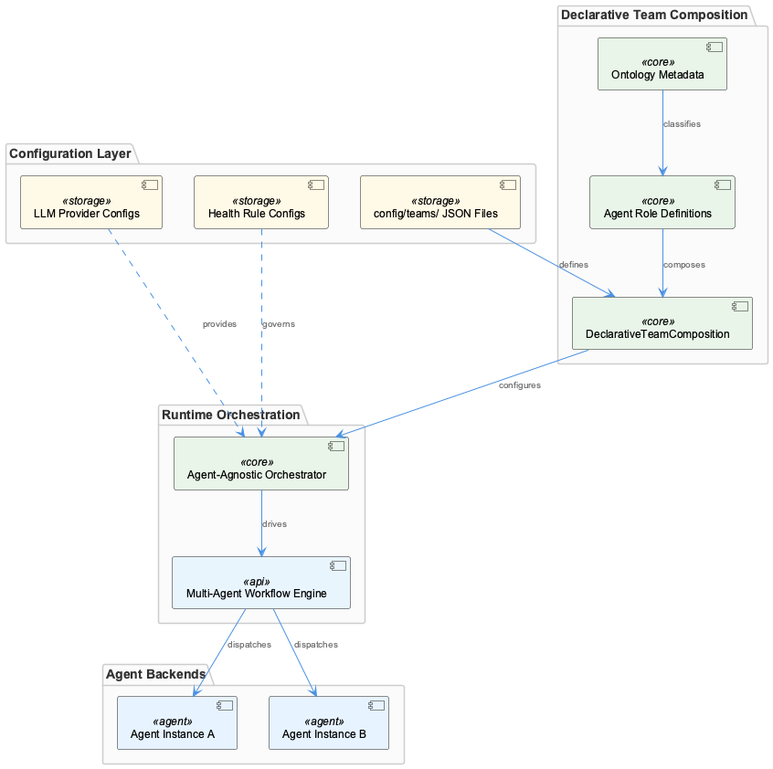
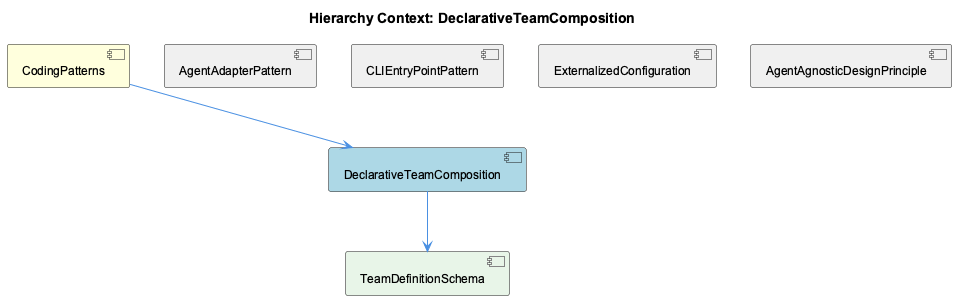

# DeclarativeTeamComposition

**Type:** SubComponent

CLAUDE.md identifies agent-agnostic design as a core principle, and team JSON files are the mechanism by which agent identities are composed without coupling to specific backend implementations

# DeclarativeTeamComposition

## What It Is

DeclarativeTeamComposition is a design pattern within CodingPatterns that governs how multi-agent workflows are assembled through configuration rather than code. Its primary implementation lives in the `config/teams/` directory, which holds JSON files that enumerate which agents participate in a given team and what roles they occupy. As documented in `docs/architecture/system-overview.md`, multi-agent workflow configuration is treated as a first-class architectural concern — team composition is externalized from runtime orchestration code entirely.

This pattern is one of several sibling conventions captured under CodingPatterns, sitting alongside ExternalizedConfiguration, AgentAgnosticDesignPrinciple, AgentAdapterPattern, and CLIEntryPointPattern. It is the concrete mechanism by which the AgentAgnosticDesignPrinciple is realized at the workflow level: just as agent adapters abstract over backend differences at the execution layer, team JSON files abstract over agent identity at the composition layer.

## Architecture and Design

The central design decision in DeclarativeTeamComposition is the separation of *who participates* from *how orchestration works*. Rather than embedding team membership in orchestration logic, the system delegates that responsibility entirely to the `config/teams/` JSON files. This mirrors the broader ExternalizedConfiguration pattern that governs LLM provider credentials and health rules — all of these live under `config/` and share the same separation philosophy: runtime code should not need to change when configuration changes.

The architecture documented in `docs/architecture/system-overview.md` treats this not as a convenience but as a structural constraint. Workflow configuration is a "first-class architectural concern," meaning the system is explicitly designed to be reconfigured at the team level without touching orchestration code. The pattern also aligns with the agent-agnostic design principle named in `CLAUDE.md`: because agents are referenced by identity in JSON rather than instantiated directly in code, the composition layer remains decoupled from specific backend implementations like Claude, Copilot, Mastra, or OpenCode.

A notable architectural nuance surfaces in `docs/RELEASE-2.0.md`, which references an ontology integration system. This suggests that team JSON files may carry ontology-aware metadata for classifying agent roles beyond simple string labels — meaning the schema may be richer than a flat roster, potentially encoding semantic role relationships. This detail is owned by the child component TeamDefinitionSchema.

## Implementation Details

The concrete structure of team definitions is governed by TeamDefinitionSchema, which is the direct child of this pattern. TeamDefinitionSchema is grounded in the `config/teams/` directory and referenced in both `docs/architecture/system-overview.md` and `docs/architecture-report.md`. Each JSON file in that directory encodes a named team — specifying agent participants and their assigned roles within the workflow.

The JSON-driven approach is mechanically straightforward: adding or removing an agent from a workflow is a file edit, not a code change. This lowers the operational cost of workflow experimentation significantly. A developer does not need to understand the orchestration runtime to compose a new team — they need only understand the schema that TeamDefinitionSchema defines.

The possibility of ontology-aware metadata in these files (implied by the `docs/RELEASE-2.0.md` reference) suggests the implementation may support structured role classification that integrates with a broader semantic layer. If so, agent roles in team JSON files are not arbitrary strings but terms drawn from or validated against an ontology, giving team composition a degree of semantic precision beyond simple naming conventions.

## Integration Points

DeclarativeTeamComposition connects most directly to ExternalizedConfiguration, its sibling pattern. Both patterns enforce the principle that the `config/` directory is the authoritative location for all system-shaping decisions — whether those decisions concern LLM provider endpoints and credentials or multi-agent team membership. They share the same separation boundary: runtime code reads config, it does not encode it.

The pattern also integrates with AgentAdapterPattern at a conceptual level. The AgentAdapterPattern ensures all agent backends conform to the unified Agent Abstraction API defined in `docs/architecture/agent-abstraction-api.md`. DeclarativeTeamComposition relies on that contract implicitly: team JSON files can reference any agent identity precisely because the adapter layer guarantees a consistent interface regardless of backend. The two patterns together form a complete agent abstraction — one at the execution layer, one at the composition layer.

If the ontology integration noted in `docs/RELEASE-2.0.md` is active, team JSON files also integrate with whatever ontology system classifies agent roles, creating a dependency on that classification layer for full role resolution.

## Usage Guidelines

When adding an agent to an existing workflow, the correct intervention point is a `config/teams/` JSON file — not the orchestration runtime. This is the primary rule the pattern encodes. Modifying orchestration code to change team membership would violate the separation this pattern establishes and reintroduce coupling that the architecture explicitly avoids.

New team definitions should follow the schema enforced by TeamDefinitionSchema. Developers should consult `docs/architecture/system-overview.md` and `docs/architecture-report.md` for the canonical shape of these files before authoring new ones. If ontology-aware role metadata is part of the active schema, role identifiers should be drawn from the recognized ontology terms rather than invented ad hoc, to preserve semantic consistency across teams.

Because this pattern is the mechanism through which AgentAgnosticDesignPrinciple is expressed at the composition layer, team JSON files should never reference backend-specific implementation details. Agent identities in team definitions should remain at the abstract adapter level, ensuring that swapping a backend (e.g., replacing a Claude-backed agent with a Copilot-backed one) requires no change to the team definition itself. This constraint is the direct application of the agent-agnostic principle to the configuration layer.

---

**Architectural Patterns Identified:** Declarative configuration over imperative composition; config/runtime separation; schema-governed external definitions.

**Design Trade-offs:** The JSON-driven approach maximizes reconfigurability and lowers experimentation cost, but shifts correctness responsibility to the schema layer (TeamDefinitionSchema) — malformed or semantically invalid team files will not be caught by the compiler.

**Scalability Considerations:** Adding new teams or agents scales as a file-system operation, with no code changes required. The limiting factor is schema governance and ontology coherence as the number of teams grows.

**Maintainability Assessment:** High, within the constraint that TeamDefinitionSchema remains well-documented and validated. The pattern's strength is directly proportional to the rigor of the schema definition its child component provides.

## Hierarchy Context

### Parent
- [CodingPatterns](./CodingPatterns.md) -- CodingPatterns serves as the architectural catch-all component for the Coding project, capturing cross-cutting programming conventions, design patterns, and best practices that permeate the entire codebase. The project follows consistent patterns visible across its configuration, tooling, and documentation: agent abstractions use a constructor+initialize+execute lifecycle, shell scripts in bin/ follow a proxy/delegation pattern to underlying services, and configuration is externalized into config/ YAML/JSON files rather than hardcoded values. The system emphasizes agent-agnostic design, enabling multiple AI backends (Claude, Copilot, Mastra, OpenCode) to operate under a unified interface.

### Children
- [TeamDefinitionSchema](./TeamDefinitionSchema.md) -- Referenced in docs/architecture/system-overview.md and docs/architecture-report.md as the config/teams/ directory holding JSON-based team definitions

### Siblings
- [AgentAdapterPattern](./AgentAdapterPattern.md) -- docs/architecture/agent-abstraction-api.md defines the unified Agent Abstraction API that all backends must conform to, serving as the contract between adapters and consumers
- [CLIEntryPointPattern](./CLIEntryPointPattern.md) -- CLAUDE.md describes bin/ scripts as proxies that delegate to underlying services, establishing delegation as the explicit architectural intent rather than an implementation detail
- [ExternalizedConfiguration](./ExternalizedConfiguration.md) -- LLM_PROXY_URL, RAPID_LLM_PROXY_URL, OPENAI_API_KEY, and ANTHROPIC_API_KEY are all documented as environment variables rather than in-code constants, enforcing externalization at the credential level
- [AgentAgnosticDesignPrinciple](./AgentAgnosticDesignPrinciple.md) -- CLAUDE.md explicitly names agent-agnostic design as a core architectural principle, making backend independence a first-class documented constraint rather than an emergent property

---

*Generated from 6 observations*
