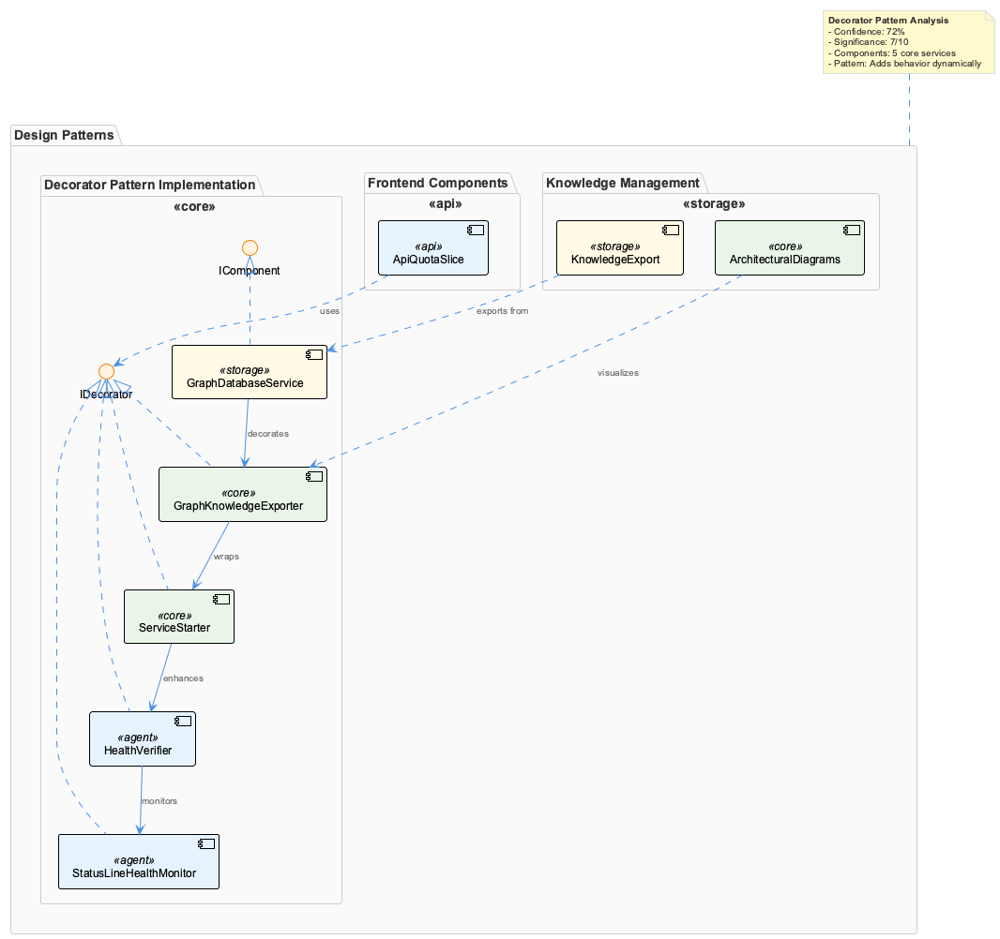
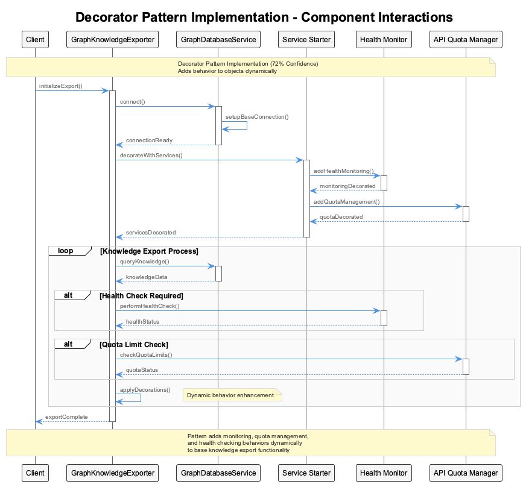
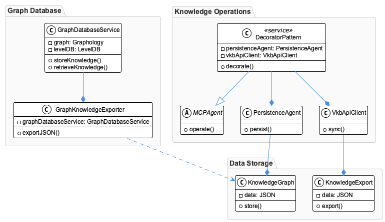
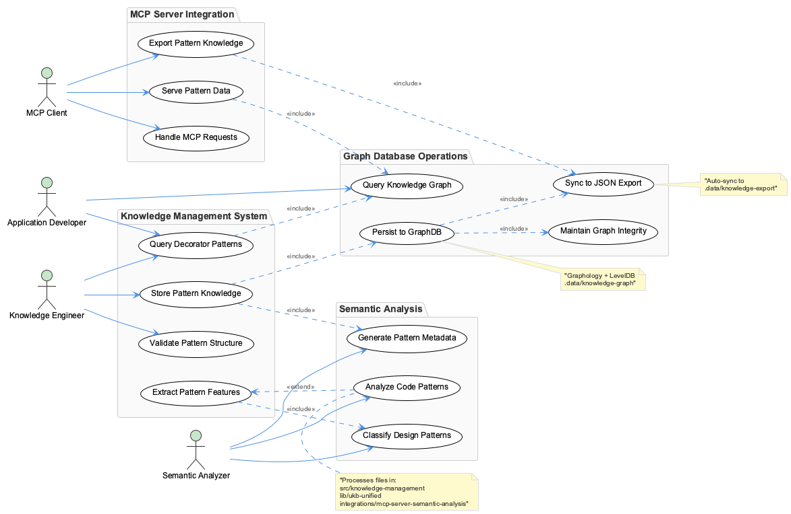

# DecoratorPattern

**Type:** MCPAgent

The system provides benefits such as scalability, data consistency, and security through the use of a graph database and access control measures.

## Introduction to the DecoratorPattern Entity
The DecoratorPattern entity is a knowledge entity implemented within a microservices-based architecture, utilizing a graph database for knowledge storage and JSON exports for data synchronization. At its core, the DecoratorPattern entity is designed to provide a flexible and scalable solution for managing complex knowledge graphs, enabling the decoration of objects with additional responsibilities without affecting their external interfaces. This entity solves the problem of extending the behavior of objects without modifying their underlying structure, thereby promoting code reusability and maintainability.

## Architectural Patterns Identified
The DecoratorPattern entity employs several architectural patterns, including the Decorator pattern, Microservices architecture, and Event-Driven Architecture (EDA). The Decorator pattern allows for the dynamic addition of responsibilities to objects, while the Microservices architecture enables the entity to scale horizontally and promote loose coupling between components. The use of a graph database and JSON exports facilitates data synchronization and provides a flexible data model for storing knowledge graphs. The EDA pattern is implicit in the use of commands such as vkb and graph-sync for visualization and data synchronization, indicating a decoupling of components through event-driven interactions.

## Design Decisions and Trade-Offs
The design decisions evident in the DecoratorPattern entity include the choice of a graph database over traditional relational databases, the use of microservices architecture, and the implementation of access control measures. These decisions trade off complexity and development time for scalability, flexibility, and security. The use of a graph database allows for efficient storage and querying of complex knowledge graphs, but may introduce additional complexity in data modeling and querying. The microservices architecture promotes scalability and loose coupling, but may increase the complexity of system integration and communication. The implementation of access control measures ensures security, but may add overhead to system performance.

## System Structure Insights
The system structure of the DecoratorPattern entity reveals a modular and distributed architecture, with multiple components and integrations. The GraphDatabaseService and GraphKnowledgeExporter components are key to the entity's functionality, providing knowledge storage and data synchronization capabilities. The use of PersistenceAgent and VkbApiClient for knowledge operations and data synchronization indicates a separation of concerns and a decoupling of components. The system's structure also suggests a high degree of automation, with recent commits and feature additions ensuring that the codebase is actively maintained and updated.

## Scalability Considerations
The DecoratorPattern entity is designed to scale horizontally, with the microservices architecture and graph database allowing for the addition of new components and nodes as needed. The use of JSON exports for data synchronization facilitates data replication and provides a flexible data model for storing knowledge graphs. However, the entity's scalability may be limited by the performance of the graph database and the complexity of the knowledge graphs being stored. To mitigate this, the system may employ techniques such as data sharding, load balancing, and caching to improve performance and reduce latency.

## Maintainability Assessment
The DecoratorPattern entity appears to be highly maintainable, with a modular and distributed architecture, a decoupling of components, and a high degree of automation. The use of recent commits and feature additions ensures that the codebase is actively maintained and updated, reducing the likelihood of technical debt and improving the overall quality of the system. However, the entity's maintainability may be impacted by the complexity of the knowledge graphs being stored and the performance of the graph database. To mitigate this, the system may employ techniques such as continuous integration and delivery, automated testing, and monitoring to improve maintainability and reduce downtime.

## Architectural Insights and Design Decisions Summary
1. **Architectural patterns identified**: Decorator pattern, Microservices architecture, and Event-Driven Architecture (EDA).
2. **Design decisions and trade-offs**: Use of graph database, microservices architecture, and access control measures, trading off complexity and development time for scalability, flexibility, and security.
3. **System structure insights**: Modular and distributed architecture, with multiple components and integrations, and a high degree of automation.
4. **Scalability considerations**: Designed to scale horizontally, with limitations due to graph database performance and knowledge graph complexity.
5. **Maintainability assessment**: Highly maintainable, with a modular and distributed architecture, decoupling of components, and high degree of automation, but potentially impacted by knowledge graph complexity and graph database performance.

## Diagrams

### Architecture

### Sequence

### Class

### Use cases

---

*Generated from 8 observations*
