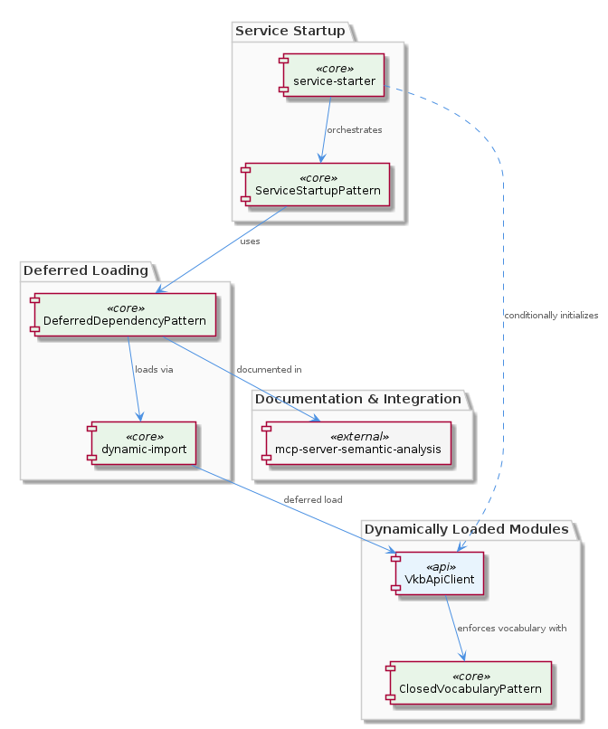
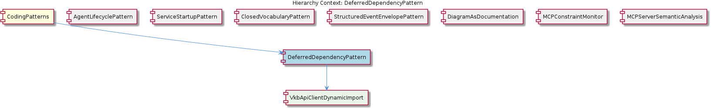

# DeferredDependencyPattern

**Type:** SubComponent

The DeferredDependencyPattern is used throughout the codebase, with examples in integrations/mcp-server-semantic-analysis/docs/installation/README.md

# DeferredDependencyPattern

## What It Is

The `DeferredDependencyPattern` is a SubComponent codified within the project's `CodingPatterns` parent collection, representing a deliberate strategy for loading modules on-demand rather than at process startup. Its canonical reference implementation lives in `lib/ukb-unified/core/VkbApiClient.js`, where the `VkbApiClient` module is loaded via dynamic-import rather than through a static `require` or ES module `import` statement. Documentation and usage examples for the pattern are surfaced in `integrations/mcp-server-semantic-analysis/docs/installation/README.md`, which provides developer-facing guidance on how the pattern is applied across the codebase.

At its core, the pattern resolves a recurring tension in Node.js service architectures: heavy dependencies that are only needed conditionally should not penalize the startup path of every process that imports the surrounding module. By deferring the resolution of those dependencies until the moment of first use — and by making that resolution asynchronous and conditional — the pattern keeps startup paths lightweight, enables flexible module loading based on runtime configuration, and prevents hard failures when an optional dependency is missing from the installed environment.

## Architecture and Design

Architecturally, the `DeferredDependencyPattern` sits alongside other foundational coding patterns under `CodingPatterns`, including `AgentLifecyclePattern`, `ServiceStartupPattern`, `ClosedVocabularyPattern`, `StructuredEventEnvelopePattern`, and `DiagramAsDocumentation`. Where `AgentLifecyclePattern` governs object lifecycle through methods like `init()`, `start()`, `stop()`, `pause()`, and `resume()` defined on the `BaseAgent` class in `base-agent.ts`, `DeferredDependencyPattern` governs *module* lifecycle — specifically, when the runtime cost of evaluating a module is paid. The two patterns are complementary: an agent may exist in a started state long before its deferred dependencies are actually resolved.

The pattern's primary design relationship is with `ServiceStartupPattern`, whose `startServiceWithRetry()` function in `lib/service-starter.js` wraps service startup with retry logic. By design, dynamic-import loading is intended to integrate with this startup machinery: deferring expensive or optional dependencies allows the retry-wrapped startup path to remain fast and resilient, since transient or missing dependencies do not prevent the service shell from coming online. A service can start, accept that some capabilities are not yet (or never) available, and surface those capabilities lazily as imports succeed.

A second important architectural relationship is with `ClosedVocabularyPattern`. The `VkbApiClient` module — the canonical example of `DeferredDependencyPattern` — is used in conjunction with `ClosedVocabularyPattern` to prevent vocabulary drift, the same pattern whose canonical type sets are enforced by migration scripts referenced in `integrations/mcp-constraint-monitor/docs/constraint-configuration.md`. This pairing demonstrates that deferred loading is not used to defer *semantics*; vocabulary contracts remain fixed and authoritative even when the modules that operationalize them are imported lazily.

## Implementation Details

The pattern's sole child component, `VkbApiClientDynamicImport`, is its prototypical implementation. `VkbApiClient` located at `lib/ukb-unified/core/VkbApiClient.js` is excluded from the initial synchronous bundle and fetched/evaluated on demand. Mechanically, this means call sites do not write a top-of-file `const VkbApiClient = require('./VkbApiClient')`; instead, they invoke the dynamic `import()` expression at the point of need, receive a promise that resolves to the module namespace, and then proceed to use the exported client.

The technical mechanics rely on three properties of dynamic import. First, evaluation is on-demand: the module body of `VkbApiClient.js` is not executed during the host module's initial load. Second, evaluation is conditional: an enclosing `if` branch, feature flag, or runtime check can gate whether `import()` is ever invoked, which is what the observations describe as "conditional initialization [enabling] flexible module loading." Third, evaluation is recoverable: because `import()` returns a promise, a `try/catch` around an `await` can absorb resolution failures, which is precisely how the pattern "helps prevent errors due to missing dependencies." A statically required module that is absent at install time would throw at process boot; a dynamically imported one fails only in the code paths that actually need it, and that failure can be caught and degraded gracefully.

Although no explicit code symbols are surfaced in the structural index for this pattern, its applied form is consistent: a deferred import expression, an awaited resolution, and a downstream consumption site that operates on the resolved module namespace. The pattern is intentionally minimal in surface area — it is a discipline about *how* to import rather than a runtime library that must be installed.

## Integration Points

The most concrete integration is with `lib/service-starter.js`, where `ServiceStartupPattern` provides the retry-wrapped startup harness. `DeferredDependencyPattern` is "designed to work with" that pattern, meaning services that adopt `startServiceWithRetry()` benefit most from deferring their non-critical dependencies: the retry loop becomes faster per attempt, and dependency-driven failures move out of the startup critical path into the operational request path where they can be handled per-request.

The second integration is with `ClosedVocabularyPattern`, mediated through `VkbApiClient`. The dynamically imported client carries vocabulary obligations that are enforced by the closed-vocabulary discipline, ensuring that lazy loading does not create a loophole through which informal or drifted type names could enter the system. Documentation surfaces in `integrations/mcp-server-semantic-analysis/docs/installation/README.md` provide installation-time guidance that explains how these deferred dependencies are expected to be resolved in deployed environments.

More broadly, `DeferredDependencyPattern` interfaces with the project-wide singleton conventions documented for `CodingPatterns` and diagrammed in `docs/puml/psm-singleton-pattern.puml`. A dynamically imported module that exports a stateful manager should still honor the guard-and-return singleton idiom: the first `import()` resolves and constructs the singleton, and subsequent `import()` calls receive the same module namespace from the module cache, returning the already-constructed instance without re-running initialization.

## Usage Guidelines

Developers introducing a new dependency should ask whether it is required on every startup path. If the dependency is optional, environment-specific, or expensive to evaluate, prefer dynamic-import loading along the lines of the `VkbApiClient` example in `lib/ukb-unified/core/VkbApiClient.js`. Co-locate the `import()` expression with the conditional that decides whether the dependency is needed, so that the deferred nature of the load is visible at the call site rather than hidden behind an abstraction.

Wrap the `await import()` call in error handling that distinguishes "module not installed" from "module installed but failed to initialize." Because one of the pattern's stated benefits is preventing errors due to missing dependencies, the catch path should degrade the feature rather than crash the surrounding service. When the deferred module participates in `ClosedVocabularyPattern` — as `VkbApiClient` does — ensure that any types, identifiers, or vocabulary terms used after resolution are drawn from the canonical sets enforced elsewhere in the codebase; deferred loading does not relax those constraints.

When integrating with `ServiceStartupPattern`, place the dynamic import *inside* the function passed to `startServiceWithRetry()` or invoked downstream of it, rather than at module top-level, so that the retry harness actually wraps the import attempt. This is the configuration in which the two patterns reinforce each other: startup remains lightweight, transient failures are retried, and missing dependencies fail in a localized, recoverable way.

Finally, consult the documentation in `integrations/mcp-server-semantic-analysis/docs/installation/README.md` for worked examples before introducing new uses of the pattern, and treat sibling patterns — `AgentLifecyclePattern` for object lifecycle, `ServiceStartupPattern` for service bootstrapping, `ClosedVocabularyPattern` for type discipline, `StructuredEventEnvelopePattern` for event format compliance, and `DiagramAsDocumentation` for architectural recording — as the surrounding conventions within which `DeferredDependencyPattern` is expected to operate.

## Hierarchy Context

### Parent
- [CodingPatterns](./CodingPatterns.md) -- [LLM] The project-wide singleton guard pattern is formally codified in `docs/puml/psm-singleton-pattern.puml` and manifests consistently wherever stateful managers are instantiated. The pattern follows a strict guard-and-return idiom: a module-level variable holds the single instance (initialized to null or undefined), and every access point checks that variable before constructing a new object. If an instance already exists, the existing reference is returned immediately without re-running any constructor or initialization logic. This prevents race conditions in async service environments where multiple subsystems might attempt to spin up the same stateful manager concurrently — a real concern in Node.js applications that use event-driven concurrency without explicit locking primitives. For new developers, the implication is that any class described as a 'manager' or 'session' object in this codebase should be assumed to follow this pattern: do not call `new` directly on these classes from arbitrary call sites; instead, always go through the designated factory or accessor function that enforces the singleton contract. The PlantUML diagram in `docs/puml/psm-singleton-pattern.puml` is authoritative and should be consulted before introducing any new singleton-style manager to ensure the guard logic is structurally consistent with the rest of the project.

### Children
- [VkbApiClientDynamicImport](./VkbApiClientDynamicImport.md) -- VkbApiClient (lib/ukb-unified/core/VkbApiClient.js) is loaded via dynamic-import rather than a static require or ES module import statement, meaning the module is excluded from the initial synchronous bundle and fetched/evaluated on demand.

### Siblings
- [AgentLifecyclePattern](./AgentLifecyclePattern.md) -- The BaseAgent class in base-agent.ts defines the lifecycle methods init(), start(), stop(), pause(), and resume()
- [ServiceStartupPattern](./ServiceStartupPattern.md) -- The startServiceWithRetry() function in lib/service-starter.js wraps the service startup with retry logic
- [ClosedVocabularyPattern](./ClosedVocabularyPattern.md) -- The migration scripts in integrations/mcp-constraint-monitor/docs/constraint-configuration.md enforce fixed canonical type sets
- [StructuredEventEnvelopePattern](./StructuredEventEnvelopePattern.md) -- The CLAUDE-CODE-HOOK-FORMAT.md document specifies the structured event envelope format
- [DiagramAsDocumentation](./DiagramAsDocumentation.md) -- The PlantUML diagrams in docs/puml/ capture architectural decisions and provide visual specification
- [MCPConstraintMonitor](./MCPConstraintMonitor.md) -- The MCPConstraintMonitor module in integrations/mcp-constraint-monitor/README.md monitors and enforces constraints
- [MCPServerSemanticAnalysis](./MCPServerSemanticAnalysis.md) -- The MCPServerSemanticAnalysis module in integrations/mcp-server-semantic-analysis/README.md performs semantic analysis

---

*Generated from 7 observations*
