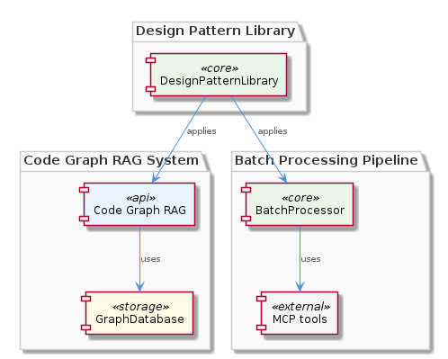
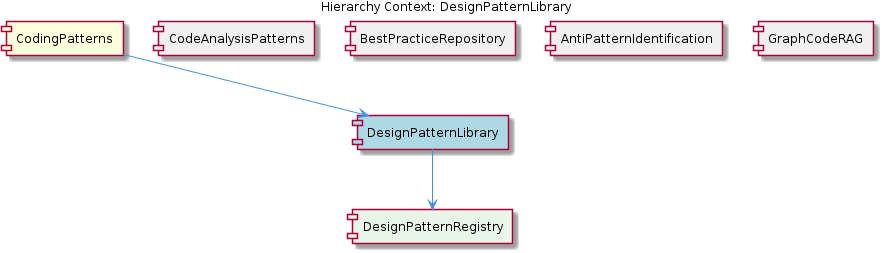

# DesignPatternLibrary

**Type:** SubComponent

The CONTRIBUTING.md file in integrations/code-graph-rag/CONTRIBUTING.md might indirectly relate to contributing design patterns, although it specifically targets the Code Graph RAG system.

## What It Is  

**DesignPatternLibrary** is a logical sub‑component of the broader **CodingPatterns** ecosystem.  Although the repository does not contain any source files that directly implement this library, the surrounding documentation and component hierarchy make its purpose clear: it is the curated collection of reusable design‑pattern definitions that other parts of the system can reference.  The library lives conceptually alongside the sibling sub‑components **CodeAnalysisPatterns**, **BestPracticeRepository**, **AntiPatternIdentification**, and **GraphCodeRAG**, and it is the parent of the **DesignPatternRegistry** child component, which is expected to provide the runtime lookup and management facilities for the patterns.

The parent **CodingPatterns** component is anchored in the graph‑based analysis pipeline described in `integrations/code-graph-rag/README.md` and the batch‑processing logic in `integrations/mcp-server-semantic-analysis/src/agents/ontology-classification-agent.ts`.  Within that context, **DesignPatternLibrary** supplies the “catalog” of pattern knowledge that the analysis agents can draw upon when classifying code structures or recommending refactorings.

> **Note:** No concrete file paths (e.g., `.ts` or `.js` files) were found that declare the library itself, which means the current source snapshot treats the library as an abstract data‑driven asset rather than a code‑level module.

---

## Architecture and Design  

The architecture of **DesignPatternLibrary** follows a *registry‑centric* style.  The presence of a child component named **DesignPatternRegistry** strongly suggests that the library’s contents are stored in a structured collection (e.g., JSON/YAML files, a database table, or a typed in‑memory map) and exposed through a registry façade.  This façade would provide lookup, enumeration, and possibly versioning services to consumers such as the **GraphCodeRAG** system or the ontology‑classification agents.

The overall system is organized as a hierarchy of loosely coupled sub‑components, each responsible for a distinct knowledge domain (patterns, best practices, anti‑patterns, etc.).  This modular decomposition is evident from the sibling relationship list and from the way the **CodingPatterns** parent delegates responsibilities to its children.  The design encourages *separation of concerns*: the **DesignPatternLibrary** supplies static knowledge, while **GraphCodeRAG** focuses on graph construction and retrieval, and the **ontology‑classification‑agent** handles batch processing and validation.

### Architectural Patterns Identified  

1. **Registry Pattern** – implied by the **DesignPatternRegistry** child; centralizes pattern definitions for easy lookup.  
2. **Modular Component Architecture** – the parent‑child‑sibling layout isolates responsibilities and enables independent evolution of each knowledge domain.  
3. **Batch Processing Integration** – the ontology‑classification agent (`integrations/mcp-server-semantic-analysis/src/agents/ontology-classification-agent.ts`) processes large codebases in batches, indicating that pattern look‑ups are likely performed at scale rather than per‑request.  

---

## Implementation Details  

Because the source snapshot contains **zero code symbols** for the library, the concrete implementation details must be inferred from the surrounding ecosystem:

* **Data Representation** – The library is expected to store each design pattern as a discrete entry (name, intent, structure diagram, applicability rules).  The sibling **BestPracticeRepository** and **AntiPatternIdentification** likely use the same storage format, reinforcing a shared schema across the knowledge base.

* **Registry Exposure** – The **DesignPatternRegistry** would expose an API such as `getPattern(name: string)`, `listPatterns()`, and possibly `search(criteria)`.  These functions would be consumed by the **GraphCodeRAG** component when it needs to map a discovered code structure to a known pattern, or by the **ontology‑classification‑agent** when annotating entities during batch analysis.

* **Integration with Graph‑Code RAG** – The **GraphCodeRAG** README (`integrations/code-graph-rag/README.md`) describes a graph‑based code analysis pipeline.  When a sub‑graph matches a known pattern shape, the registry can provide the semantic label, enabling downstream reasoning (e.g., “this sub‑graph implements the Strategy pattern”).

* **Validation Workflow** – The `EntityValidator` class inside `integrations/mcp-server-semantic-analysis/src/agents/ontology-classification-agent.ts` validates entities against a schema.  It is plausible that pattern definitions in **DesignPatternLibrary** are also validated by this component, ensuring that pattern metadata remains consistent across releases.

* **Contribution Process** – Although the `integrations/code-graph-rag/CONTRIBUTING.md` file is aimed at the Graph‑Code RAG system, its contribution guidelines (pull‑request workflow, review checklist) are likely reused for adding new design patterns to the library, preserving a uniform quality gate.

---

## Integration Points  

The **DesignPatternLibrary** sits at the nexus of several critical flows:

1. **Graph‑Code RAG** – When the RAG system constructs a code graph, it queries the **DesignPatternRegistry** to annotate sub‑graphs with pattern identifiers.  This enriches the graph with higher‑level semantics that downstream agents can exploit.

2. **Ontology Classification Agent** – The batch processing pipeline (`integrations/mcp-server-semantic-analysis/src/agents/ontology-classification-agent.ts`) consumes pattern metadata to classify code entities, using the `EntityValidator` to ensure that pattern descriptors conform to the ontology schema.

3. **Contribution Workflow** – Developers adding new patterns follow the contribution guidelines outlined in `integrations/code-graph-rag/CONTRIBUTING.md`.  This ensures that the library evolves in lockstep with the rest of the **CodingPatterns** suite.

4. **Sibling Knowledge Bases** – The **BestPracticeRepository** and **AntiPatternIdentification** components likely share the same registry interface, enabling a unified lookup mechanism across all knowledge domains.

---

## Usage Guidelines  

* **Access via the Registry** – All consumers should retrieve patterns through the **DesignPatternRegistry** API rather than reading raw data files.  This abstracts storage details and permits future changes (e.g., moving from flat files to a database) without breaking callers.

* **Versioning Discipline** – When introducing a new design pattern, increment the library’s version and update any dependent schema definitions in the **EntityValidator** to avoid mismatched expectations during batch processing.

* **Consistent Metadata** – Each pattern entry must include a unique identifier, a concise description, applicability criteria, and optionally a reference diagram.  Align these fields with the schema validated by `EntityValidator` to maintain integrity.

* **Leverage Contribution Guidelines** – Follow the pull‑request process described in `integrations/code-graph-rag/CONTRIBUTING.md`.  Run the same linting and testing suites used by the **GraphCodeRAG** component to ensure that pattern additions do not introduce regressions.

* **Scalability Awareness** – Because pattern look‑ups may occur thousands of times during a single batch run, the registry implementation should favor in‑memory caching or efficient indexing.  This mitigates latency in the **ontology‑classification‑agent** and keeps the overall pipeline performant.

---

### Summary of Key Insights  

1. **Architectural patterns identified** – Registry pattern, modular component architecture, batch‑processing integration.  
2. **Design decisions and trade‑offs** – Centralizing pattern knowledge in a registry simplifies consumption but introduces a single point of lookup; the modular layout isolates concerns but requires careful version coordination across siblings.  
3. **System structure insights** – **DesignPatternLibrary** acts as a knowledge hub feeding both graph‑based analysis (GraphCodeRAG) and semantic classification (ontology‑classification‑agent).  
4. **Scalability considerations** – Cacheable registry look‑ups and batch‑oriented processing are essential to handle large codebases without performance degradation.  
5. **Maintainability assessment** – The abstracted registry interface, shared contribution workflow, and strict validation via `EntityValidator` collectively promote a maintainable, extensible pattern catalog, even though concrete source files are currently absent.

## Hierarchy Context

### Parent
- [CodingPatterns](./CodingPatterns.md) -- [LLM] The CodingPatterns component utilizes a graph-based approach for code analysis, as seen in the integrations/code-graph-rag/README.md file, which describes the Graph-Code RAG system. This system is used for graph-based code analysis and implies the use of graph structures and algorithms within the CodingPatterns component. The entity validation is performed by the EntityValidator class in integrations/mcp-server-semantic-analysis/src/agents/ontology-classification-agent.ts, suggesting a structured approach to validating entities within the coding patterns. Furthermore, the batch processing pipeline is defined in integrations/mcp-server-semantic-analysis/src/agents/ontology-classification-agent.ts, indicating that the CodingPatterns component may leverage batch processing for efficient handling of coding pattern analysis.

### Children
- [DesignPatternRegistry](./DesignPatternRegistry.md) -- Although no direct source code is available, the parent context suggests a structured approach to coding patterns, implying the existence of a registry or similar mechanism for managing design patterns.

### Siblings
- [CodeAnalysisPatterns](./CodeAnalysisPatterns.md) -- CodeAnalysisPatterns utilizes the Graph-Code RAG system described in integrations/code-graph-rag/README.md for graph-based code analysis.
- [BestPracticeRepository](./BestPracticeRepository.md) -- BestPracticeRepository is acknowledged as a sub-component but lacks concrete references in the source files.
- [AntiPatternIdentification](./AntiPatternIdentification.md) -- AntiPatternIdentification is recognized as a sub-component but lacks direct references in the provided source files.
- [GraphCodeRAG](./GraphCodeRAG.md) -- GraphCodeRAG is described in integrations/code-graph-rag/README.md as a Graph-Code RAG system for any codebases.

---

*Generated from 6 observations*
