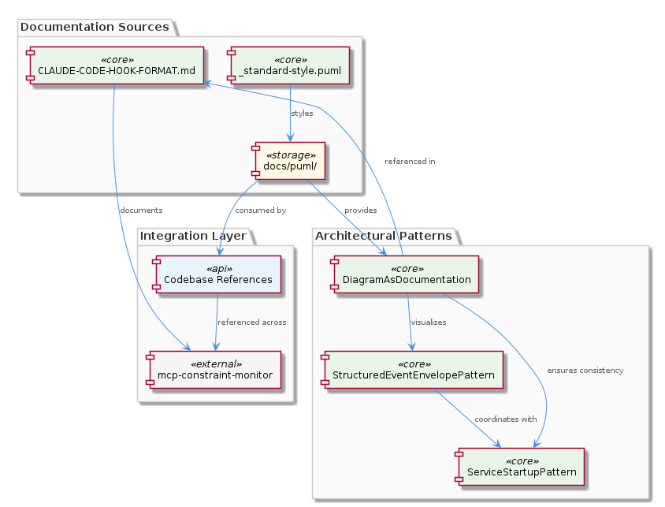
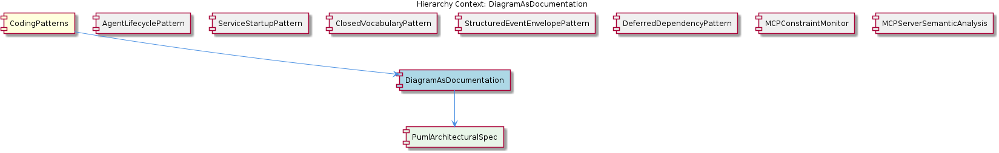

# DiagramAsDocumentation

**Type:** SubComponent

The PlantUML diagrams are designed to work with the StructuredEventEnvelopePattern, as seen in integrations/mcp-constraint-monitor/docs/CLAUDE-CODE-HOOK-FORMAT.md

# DiagramAsDocumentation

## What It Is

DiagramAsDocumentation is a SubComponent of the broader CodingPatterns family, implemented through PlantUML source files housed in the `docs/puml/` directory. It establishes a project-wide convention where architectural decisions, structural contracts, and design patterns are first captured as visual specifications in PlantUML format rather than being described exclusively in prose. These diagrams act as the authoritative reference for cross-cutting design concerns and are referenced from prose documentation when concrete implementation guidance is needed — for instance, `integrations/mcp-constraint-monitor/docs/CLAUDE-CODE-HOOK-FORMAT.md` consumes these diagrams when describing event flow and hook formats.

The pattern is composed of one identified child component: PumlArchitecturalSpec, which formalizes `docs/puml/` as the designated directory for PlantUML sources. Together, parent and child establish a clear separation of concerns: prose markdown documents describe context, rationale, and usage; PlantUML diagrams describe structure, relationships, and contracts. This separation prevents the common drift problem in software documentation where textual descriptions of architecture diverge from the actual structural intent.

## Architecture and Design

The architectural approach treats diagrams as **first-class documentation artifacts** rather than supplementary illustrations. Source PlantUML files in `docs/puml/` are version-controlled alongside code, which means they evolve through the same review processes as the implementation they describe. This is a deliberate design choice: by keeping `.puml` source files (rather than only rendered images) under version control, the diagrams remain diff-able, mergeable, and auditable. A canonical example is `docs/puml/psm-singleton-pattern.puml`, referenced by the parent CodingPatterns entity as the authoritative specification for the project-wide singleton guard idiom.

The design integrates tightly with sibling patterns. The StructuredEventEnvelopePattern, specified in `integrations/mcp-constraint-monitor/docs/CLAUDE-CODE-HOOK-FORMAT.md`, relies on PlantUML diagrams to convey the shape of structured event envelopes — the diagrams make the field contract immediately legible, while the prose document explains semantics. Similarly, the ServiceStartupPattern (centered on `lib/service-starter.js` and its `startServiceWithRetry()` function) uses diagrams to communicate retry state transitions that would be cumbersome to describe textually. This co-use across siblings demonstrates that DiagramAsDocumentation is not an isolated convention but a shared substrate that other patterns build upon.

The pattern positions visual specs as the **structural source of truth**: when prose documentation and a PlantUML diagram conflict, the diagram is authoritative for structural questions. This is explicit in how the parent CodingPatterns entity describes the singleton pattern — developers are instructed to consult `docs/puml/psm-singleton-pattern.puml` before introducing any new singleton-style manager.

## Implementation Details

Implementation is intentionally minimal from a code-symbol perspective — there are zero executable code symbols associated with this SubComponent because it is a documentation convention, not a runtime construct. Its substance lives entirely in the `docs/puml/` directory tree and in the cross-references from prose markdown files that consume those diagrams. The mechanics rely on three concrete artifacts working together:

1. **PlantUML source files** in `docs/puml/` (e.g., `docs/puml/psm-singleton-pattern.puml`), which encode structural intent in a textual diagram language.
2. **Rendered image assets** that markdown files embed when human-readable views are needed.
3. **Markdown cross-references** from documents like `integrations/mcp-constraint-monitor/docs/CLAUDE-CODE-HOOK-FORMAT.md` and `integrations/mcp-constraint-monitor/docs/constraint-configuration.md`, which point readers toward the authoritative diagram.

Because PlantUML is a text-based diagram language, the `.puml` files participate naturally in code review workflows. A change to the singleton guard pattern, for example, would be reflected as a diff in `docs/puml/psm-singleton-pattern.puml` and would prompt reviewers to verify that any affected manager classes (those following the guard-and-return idiom described by the parent CodingPatterns entity) remain consistent with the updated specification. The PumlArchitecturalSpec child component reinforces this by formally locating all such files under the single `docs/puml/` directory, so discovery of relevant specs is predictable.

## Integration Points

DiagramAsDocumentation integrates with several sibling patterns through cross-document references. The most explicit linkages observed are:

- **StructuredEventEnvelopePattern** — `integrations/mcp-constraint-monitor/docs/CLAUDE-CODE-HOOK-FORMAT.md` is the prose specification that pairs with diagrams describing the envelope's structure. The PlantUML representation makes the envelope's fields and their relationships visually explicit, while the markdown explains the semantic constraints.
- **ServiceStartupPattern** — Diagrams complement the prose around `startServiceWithRetry()` in `lib/service-starter.js` by capturing the state machine behavior of retry-and-backoff logic.
- **CodingPatterns (parent)** — The parent uses `docs/puml/psm-singleton-pattern.puml` as the authoritative reference for the project's singleton guard idiom, demonstrating that DiagramAsDocumentation is the mechanism through which CodingPatterns publishes its normative specifications.
- **PumlArchitecturalSpec (child)** — Formalizes the directory convention (`docs/puml/`) and the separation between visual specs and prose markdown.

There are no runtime integration points, no API surfaces, and no executable interfaces — integration is purely at the documentation and workflow layer. The "interfaces" are conventions: where to look for diagrams, how to interpret them relative to prose, and which artifact wins when they disagree.

## Usage Guidelines

When introducing or modifying architectural patterns, developers should follow these conventions derived from how the pattern is used throughout the codebase:

1. **Place all PlantUML sources in `docs/puml/`.** This directory is the established location per the PumlArchitecturalSpec child component. Do not scatter `.puml` files across feature directories or co-locate them with source code.
2. **Consult existing diagrams before introducing variants.** As the parent CodingPatterns guidance for singletons makes explicit, `docs/puml/psm-singleton-pattern.puml` should be consulted before introducing any new singleton-style manager. The same principle generalizes: check for an existing PlantUML spec before proposing a new structural pattern.
3. **Update the diagram, not just the prose.** When the structural intent of a pattern changes, the `.puml` file is the authoritative artifact. Prose documents that reference the pattern should be updated to match, but the diagram is the source of truth for structural questions.
4. **Reference diagrams from prose.** Prose documents like `integrations/mcp-constraint-monitor/docs/CLAUDE-CODE-HOOK-FORMAT.md` should link to the relevant `.puml` source or its rendered image rather than redescribing the structure in text. This prevents drift between two parallel descriptions of the same thing.
5. **Treat diagrams as reviewable code.** Because PlantUML is a textual format, `.puml` changes appear as diffs and should be reviewed with the same rigor as code changes. A diagram change often signals a structural change that may require corresponding code updates in modules that follow the pattern (for example, manager classes that implement the singleton guard idiom, or services that wrap startup through `startServiceWithRetry()`).

By adhering to these conventions, the codebase maintains a reliable, consistent, and discoverable architectural reference layer that scales as new patterns are added and existing ones evolve.

## Hierarchy Context

### Parent
- [CodingPatterns](./CodingPatterns.md) -- [LLM] The project-wide singleton guard pattern is formally codified in `docs/puml/psm-singleton-pattern.puml` and manifests consistently wherever stateful managers are instantiated. The pattern follows a strict guard-and-return idiom: a module-level variable holds the single instance (initialized to null or undefined), and every access point checks that variable before constructing a new object. If an instance already exists, the existing reference is returned immediately without re-running any constructor or initialization logic. This prevents race conditions in async service environments where multiple subsystems might attempt to spin up the same stateful manager concurrently — a real concern in Node.js applications that use event-driven concurrency without explicit locking primitives. For new developers, the implication is that any class described as a 'manager' or 'session' object in this codebase should be assumed to follow this pattern: do not call `new` directly on these classes from arbitrary call sites; instead, always go through the designated factory or accessor function that enforces the singleton contract. The PlantUML diagram in `docs/puml/psm-singleton-pattern.puml` is authoritative and should be consulted before introducing any new singleton-style manager to ensure the guard logic is structurally consistent with the rest of the project.

### Children
- [PumlArchitecturalSpec](./PumlArchitecturalSpec.md) -- The SubComponent description explicitly names docs/puml/ as the designated directory for PlantUML sources, establishing a project-wide convention that keeps visual specs co-located with but physically separated from prose markdown docs

### Siblings
- [AgentLifecyclePattern](./AgentLifecyclePattern.md) -- The BaseAgent class in base-agent.ts defines the lifecycle methods init(), start(), stop(), pause(), and resume()
- [ServiceStartupPattern](./ServiceStartupPattern.md) -- The startServiceWithRetry() function in lib/service-starter.js wraps the service startup with retry logic
- [ClosedVocabularyPattern](./ClosedVocabularyPattern.md) -- The migration scripts in integrations/mcp-constraint-monitor/docs/constraint-configuration.md enforce fixed canonical type sets
- [StructuredEventEnvelopePattern](./StructuredEventEnvelopePattern.md) -- The CLAUDE-CODE-HOOK-FORMAT.md document specifies the structured event envelope format
- [DeferredDependencyPattern](./DeferredDependencyPattern.md) -- The VkbApiClient module in lib/ukb-unified/core/VkbApiClient.js is loaded dynamically using dynamic-import
- [MCPConstraintMonitor](./MCPConstraintMonitor.md) -- The MCPConstraintMonitor module in integrations/mcp-constraint-monitor/README.md monitors and enforces constraints
- [MCPServerSemanticAnalysis](./MCPServerSemanticAnalysis.md) -- The MCPServerSemanticAnalysis module in integrations/mcp-server-semantic-analysis/README.md performs semantic analysis

---

*Generated from 6 observations*
