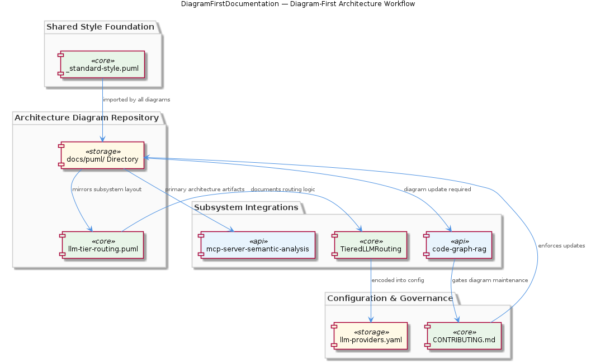
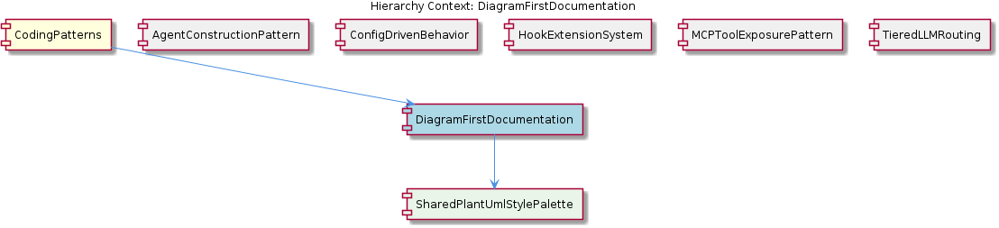

# DiagramFirstDocumentation

**Type:** SubComponent

integrations/mcp-server-semantic-analysis/docs/architecture/README.md references PlantUML diagrams as the primary architecture artifacts, with prose documentation as secondary explanation

# DiagramFirstDocumentation

## What It Is

DiagramFirstDocumentation is a documentation convention implemented primarily through the `docs/puml/` directory tree and reinforced by per-subsystem architecture references such as `integrations/mcp-server-semantic-analysis/docs/architecture/README.md`. Under this convention, PlantUML diagrams are treated as the **primary architecture artifact**, while prose documentation plays a secondary, explanatory role. Rather than letting written specifications drift from runtime behavior, the project anchors its design intent in visual `.puml` files that are version-controlled alongside the code they describe.

As a sub-component of CodingPatterns, this convention complements the parent pattern of **Externalized Configuration as Runtime Behavior Control**. Where the parent pattern externalizes *runtime behavior* into config files like `config/llm-providers.yaml`, DiagramFirstDocumentation externalizes *design intent* into `.puml` diagrams. Together they form a project-wide commitment: behavior lives in declarative files, and the rationale for that behavior lives in diagrams — neither buried in source code comments.

## Architecture and Design

The architectural approach centers on a **mirroring principle**: the `docs/puml/` directory layout mirrors the subsystem layout of the codebase. A developer navigating the diagrams uses the same mental model as a developer navigating directories under `integrations/` or `config/`. This isomorphism between documentation structure and code structure eliminates the cognitive overhead of maintaining two different taxonomies, and it makes it obvious where a new diagram belongs whenever a new subsystem is introduced.

A second architectural decision is the use of a **shared style foundation**. The child entity SharedPlantUmlStylePalette — implemented as `docs/puml/_standard-style.puml` — provides the color palette, font choices, and stereotype definitions imported by all other diagrams. This guarantees visual consistency across subsystem diagrams: a `<<service>>` stereotype in one diagram looks identical to a `<<service>>` stereotype in another. The leading underscore in `_standard-style.puml` is itself a convention signal, marking the file as a non-standalone include target rather than a renderable diagram.

The third design decision is **diagram-precedes-implementation ordering**. As demonstrated by `llm-tier-routing.puml` (associated with the sibling TieredLLMRouting), routing logic is documented as a diagram *before* being encoded in `config/llm-providers.yaml`. The diagram is not an after-the-fact illustration; it is the authoritative specification that the YAML configuration must match. This inverts the more common practice of writing code first and reverse-engineering diagrams from it.

## Implementation Details

The mechanical implementation rests on three concrete artifacts. First, `docs/puml/_standard-style.puml` defines reusable style primitives that downstream `.puml` files consume via PlantUML's `!include` or `!import` directive, rather than duplicating color codes and font settings. Second, individual diagram files (e.g., `llm-tier-routing.puml`) live in directories that parallel their subject subsystems. Third, per-subsystem `README.md` files — such as `integrations/mcp-server-semantic-analysis/docs/architecture/README.md` — explicitly reference these diagrams as the primary architectural source, ensuring readers are pointed at the diagrams first.

Enforcement is achieved through contribution gating. `integrations/code-graph-rag/CONTRIBUTING.md` includes diagram update requirements in its contribution guidelines, making diagram maintenance a **mandatory step in the development workflow** rather than an optional courtesy. This converts what is otherwise a soft convention into a hard process requirement: a pull request that changes architecturally significant behavior without updating the corresponding diagram is incomplete.

The relationship with the SharedPlantUmlStylePalette child is technical and direct: every `.puml` file in the tree depends on `docs/puml/_standard-style.puml` via an include directive. This creates a single point of stylistic control — changing a color or stereotype definition in `_standard-style.puml` propagates to every diagram on the next render, with no need to edit individual files.

## Integration Points

DiagramFirstDocumentation integrates tightly with several sibling patterns under CodingPatterns. With TieredLLMRouting, the integration is exemplary: `llm-tier-routing.puml` documents the routing topology before `config/llm-providers.yaml` encodes it operationally, and `integrations/mcp-server-semantic-analysis/docs/TIERED-MODEL-PROPOSAL.md` provides the prose narrative. The diagram, the proposal document, and the YAML form a three-layer specification stack.

With ConfigDrivenBehavior, the integration is conceptual: configuration files like `config/agent-profiles.json` define *what* the system does, while diagrams in `docs/puml/` define *how* those configurations interact structurally. With AgentConstructionPattern, diagrams provide the visual counterpart to the textual lifecycle description in `integrations/mcp-server-semantic-analysis/docs/architecture/agents.md`. With HookExtensionSystem and MCPToolExposurePattern, diagrams serve as the canonical depiction of integration contracts that are otherwise scattered across JSON payload specifications and README files.

The contribution workflow in `integrations/code-graph-rag/CONTRIBUTING.md` is the operational integration point that binds all of these together — it is the gate that ensures diagrams stay synchronized with code, configuration, and prose documentation.

## Usage Guidelines

When adding a new subsystem, create its `.puml` diagram in the corresponding location under `docs/puml/` **before** writing the implementation or its configuration entries. This ordering is not bureaucratic; it is the design discipline that makes the diagram authoritative rather than decorative. The diagram should establish component boundaries, data flows, and integration contracts that the subsequent code and config will faithfully implement.

Always include `docs/puml/_standard-style.puml` at the top of new `.puml` files via `!include` rather than copying style declarations. Duplicating styles defeats the purpose of the SharedPlantUmlStylePalette and creates drift that is difficult to detect. If a new stereotype or color is needed across multiple diagrams, add it to `_standard-style.puml` rather than defining it locally.

When making changes that affect architecture — adding an agent, changing routing logic, modifying a hook contract — update the relevant `.puml` diagram in the same pull request. The contribution guidelines in `integrations/code-graph-rag/CONTRIBUTING.md` formalize this expectation, and reviewers should treat a missing diagram update as a blocking issue. The per-subsystem `README.md` (modeled on `integrations/mcp-server-semantic-analysis/docs/architecture/README.md`) should always link to its diagrams as the primary architecture artifact, with prose serving only to elaborate on what the diagram shows.

Finally, preserve the directory mirror between `docs/puml/` and the codebase. If you create `integrations/new-subsystem/`, create the corresponding `docs/puml/new-subsystem/` (or equivalent) at the same time. The navigability of the diagram tree depends on this symmetry, and breaking it imposes hidden cognitive cost on every future developer.

---

### Summary Assessment

**Architectural patterns identified:** Diagram-as-source-of-truth, shared style include hierarchy, directory-mirroring documentation taxonomy, and contribution-gated documentation maintenance.

**Design decisions and trade-offs:** The decision to make diagrams primary trades higher upfront authoring cost for lower long-term drift between intent and implementation. Centralizing styles in `_standard-style.puml` trades a small coupling cost for global visual consistency.

**System structure insights:** The `docs/puml/` tree is a parallel structural representation of the codebase, not an independent artifact. Its value comes from its alignment with code, configuration, and prose layers.

**Scalability considerations:** The convention scales naturally because each new subsystem adds its own diagram file without modifying existing ones — the only shared dependency is `_standard-style.puml`, which changes rarely. Directory mirroring means cognitive load stays constant as the project grows.

**Maintainability assessment:** Maintainability is strong precisely because diagram updates are gated by `CONTRIBUTING.md` requirements. The main risk is that gating depends on reviewer discipline; if reviewers stop enforcing diagram updates, the convention degrades silently. The shared style file is a maintenance asset, concentrating cosmetic changes in one place.

## Hierarchy Context

### Parent
- [CodingPatterns](./CodingPatterns.md) -- [LLM] **Externalized Configuration as Runtime Behavior Control**: The project enforces a strict separation between behavior and code through a suite of JSON/YAML configuration files under config/. Files such as config/agent-profiles.json, config/health-verification-rules.json, config/llm-providers.yaml, config/knowledge-management.json, and config/hooks-config.json collectively replace what would otherwise be scattered hard-coded logic. A new developer should understand that adding a new agent profile, adjusting an LLM provider's model tier, or modifying a health rule does not require touching TypeScript or Python source files — only the relevant config file. This pattern means that operational changes (e.g., switching a task class from a lightweight to a heavyweight model, or disabling a health rule during an incident) are achievable at runtime or deploy time without code review cycles. The convention also implies that any new subsystem added to the project is expected to declare its configurable parameters in a corresponding config file rather than using environment variables alone or embedding defaults in source.

### Children
- [SharedPlantUmlStylePalette](./SharedPlantUmlStylePalette.md) -- `docs/puml/_standard-style.puml` is explicitly described in the parent sub-component as the single source of shared color palette, font, and stereotype definitions, meaning all other `.puml` files depend on it via an `!include` or `!import` directive rather than duplicating style rules.

### Siblings
- [AgentConstructionPattern](./AgentConstructionPattern.md) -- integrations/mcp-server-semantic-analysis/docs/architecture/agents.md documents the agent architecture showing each agent follows a constructor + lazy-init + execute() lifecycle rather than eager initialization at import time
- [ConfigDrivenBehavior](./ConfigDrivenBehavior.md) -- config/agent-profiles.json defines per-agent behavioral parameters (e.g., which LLM tier to use, concurrency limits) so adding a new agent type requires only a new JSON entry, not a code change
- [HookExtensionSystem](./HookExtensionSystem.md) -- integrations/mcp-constraint-monitor/docs/CLAUDE-CODE-HOOK-FORMAT.md specifies the exact JSON payload format that hooks emit on each tool call entry and exit, defining the contract between agents and monitors
- [MCPToolExposurePattern](./MCPToolExposurePattern.md) -- integrations/code-graph-rag/README.md describes the code-graph-rag system exposing its graph query capabilities as MCP tools, not as a Python library import or REST API
- [TieredLLMRouting](./TieredLLMRouting.md) -- integrations/mcp-server-semantic-analysis/docs/TIERED-MODEL-PROPOSAL.md formally proposes and documents the tiered model selection approach, classifying tasks into complexity buckets before provider assignment

---

*Generated from 5 observations*
