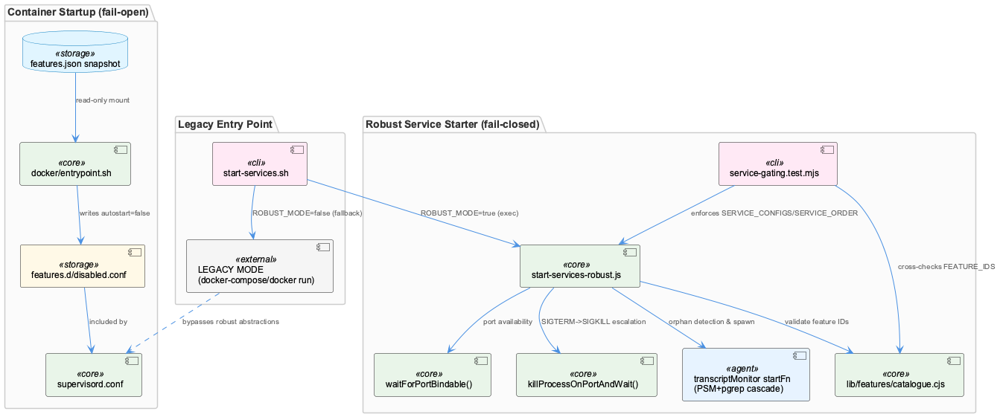
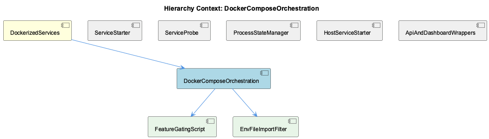

# DockerComposeOrchestration

**Type:** SubComponent

[LLM] docker/entrypoint.sh implements a fail-open feature-gating override rather than a rewrite of docker/supervisord.conf: it reads a flat host-written snapshot at /coding/.coding/runtime/features.json (mounted read-only) and, for each entry in the PROGRAM_FEATURES mapping (e.g. 'semantic-analysis:knowledge', 'constraint-monitor:constraints', 'health-dashboard-frontend:health'), shells out to `node -e` (not jq, which the comment notes isn't installed in the image) to check `snap.features?.[feature]`. Any program whose feature reads `false` gets an autostart=false stanza written into /etc/supervisor/features.d/disabled.conf, which supervisord includes alongside the main config. Critically, an unknown/missing feature key resolves to 'true' by design ('a snapshot written by an older host cannot silently switch a program off'), and a missing/unreadable snapshot file leaves the entire features.d directory empty, starting every program — the pre-existing historical behavior. This directly implements the DockerizedServices principle from the parent context that supervisord.conf is the single source of truth for in-container processes, while this script is merely an additive filter over it.

# DockerComposeOrchestration — Technical Insight Document

## What It Is

DockerComposeOrchestration is the subcomponent responsible for reconciling container-level process management with the host's feature-configuration and service-lifecycle model. It lives primarily in `docker/entrypoint.sh` (feature gating and secret filtering), `scripts/start-services-robust.js` (Node-based service starter with retry/health primitives), and `start-services.sh` (the dual-mode entry point that chooses between the robust starter and a legacy shell implementation). Its two named children, FeatureGatingScript and EnvFileImportFilter, both live inside `docker/entrypoint.sh` and represent two independent concerns bundled into the same script: which supervisord programs are allowed to autostart, and which host `.env` variables are allowed to cross into the container at all.

As a child of DockerizedServices, this subcomponent inherits the parent's mandate that `supervisord.conf` remains the single source of truth for in-container process definitions, while everything here — entrypoint scripting, robust starters, legacy fallbacks — operates as an additive or duplicative layer around that authority rather than replacing it.

## Architecture and Design

The dominant pattern is **override, not rewrite**. `docker/entrypoint.sh`'s FeatureGatingScript reads a host-written, read-only snapshot (`/coding/.coding/runtime/features.json`) and, for each `program:feature` pair in the hardcoded `PROGRAM_FEATURES` map, generates `/etc/supervisor/features.d/disabled.conf` with `autostart=false` stanzas that supervisord includes alongside its main config. Nothing about `supervisord.conf` itself is touched.

A second pervasive pattern is **fail-open at the boundary, fail-closed in the core**. Container startup gating is deliberately permissive: an unknown feature key, or an entirely missing/unreadable snapshot, resolves to "enabled" — the script's own comment reasons that a container silently running nothing is harder to diagnose than one running too much. This mirrors ServiceProbe's `wait_for_service()`, which times out but still returns 0 with a `WARNING: ... continuing anyway`, deferring the actual liveness judgment to supervisord. By contrast, the host-side service starter fails closed: `service-gating.test.mjs` asserts that `startOneService()` throws loudly on an unrecognized feature ID rather than silently skipping it. This asymmetry is intentional — a container that can't parse a late-arriving JSON file should still boot; a developer who typos a feature ID in `SERVICE_CONFIGS` should get an immediate, loud failure.

A third pattern is **dual implementation gated by a flag**, seen in `start-services.sh`'s `ROBUST_MODE` switch: the default path execs `scripts/start-services-robust.js`, while roughly 200 lines of LEGACY MODE logic remain intact underneath, reimplementing docker-compose polling and raw `docker run` fallbacks by hand. This is architecturally significant technical debt — two independently maintained implementations of the same readiness-polling problem, only one of which goes through the canonical `startServiceWithRetry()`/service-probe contract described at the DockerizedServices level.

## Implementation Details

`waitForPortBindable()` in `scripts/start-services-robust.js` solves a narrow race condition invisible to `probeHttpHealth`/`probeTcpPort`: after a crashed process, the kernel may hold a socket in a linger state that fails an HTTP probe but also fails a fresh bind attempt with `EADDRINUSE`. The function actively probes bindability by spinning up a throwaway `net.createServer()`, listening, and resolving only on the `'listening'` event, polling every 250ms up to a 5000ms deadline.

`killProcessOnPortAndWait()` encodes a SIGTERM-then-SIGKILL escalation at the port level: it signals every PID from `lsof -ti:<port>`, polls via `checkPortInUse()`, and only escalates to SIGKILL once more than half of `maxWaitMs` has elapsed. This complements the process-handle-level `withDeadline()`/PSM lifecycle logic described in the parent context but operates strictly at the OS/port layer.

The `transcriptMonitor` startFn demonstrates a three-layer duplicate-detection cascade: PSM global registry check, PSM per-project check (a documented holdover from a retired per-project LSL coordinator, "Phase 33 plan 07"), and finally an OS-level `pgrep -lf` scan via `isProcessRunningByScript()` that self-heals by re-registering orphans with `psm.registerService()`.

`prompt-classifier-service.mjs`, while adjacent rather than core to container lifecycle, shares the Docker/host path-and-secret duality theme: it loads secrets from a repo-relative `.env` and explicitly strips empty-string environment variables before calling `process.loadEnvFile()`, since `export FOO="$FOO"` on an unset `FOO` otherwise silently defeats override logic — a bug that once produced "asked: 18, answered: 0, failed: 18" in production.

## Integration Points

DockerComposeOrchestration sits directly beneath DockerizedServices and depends on its sibling ServiceStarter's deployment-agnostic `startServiceWithRetry()` contract, though the legacy branch of `start-services.sh` notably bypasses that contract entirely. It shares conceptual DNA with sibling ServiceProbe, whose bash-layer `wait_for_service()` embodies the same fail-open philosophy as FeatureGatingScript. It also depends on ProcessStateManager (PSM) for registry-based duplicate detection, and on HostServiceStarter's `SERVICE_CONFIGS`/`SERVICE_ORDER` structures, which `tests/features/service-gating.test.mjs` cross-validates against `lib/features/catalogue.cjs`'s `FEATURE_IDS`. The container-side FeatureGatingScript has a parallel but weaker guarantee, enforced only by the externally-referenced `tests/features/container-gating.test.mjs`, with no in-script self-check. EnvFileImportFilter integrates with the broader T2 egress-lockdown security model, ensuring `*_API_KEY`/`*_TOKEN`/`*_MANAGEMENT_KEY` variables never reach in-container SDK clients, preserving the host `llm-cli-proxy` (:12435) as the sole egress path.

## Usage Guidelines

Developers extending `PROGRAM_FEATURES` in `docker/entrypoint.sh` must manually keep it synchronized with `supervisord.conf`'s `[program:...]` sections and the features catalogue — there is no compile-time check, only CI-run tests. Conversely, extending `SERVICE_CONFIGS`/`SERVICE_ORDER` in `start-services-robust.js` is comparatively safe due to structural test coverage guaranteeing every service declares a real feature and that the two collections cover each other exactly; note also the hard-coded invariant that `SERVICE_ORDER.slice(0, 2)` must remain `['transcriptMonitor', 'liveLoggingCoordinator']`. Never treat `start-services.sh`'s LEGACY MODE as safe to modify casually — it's dead-weight technical debt kept only for `ROBUST_MODE=false` fallback and should ideally be retired rather than extended. Finally, any change to `.env` import logic must preserve the categorical secret-suffix exclusion in EnvFileImportFilter; it is a security boundary, not a convenience default.

## Hierarchy Context

### Parent
- [DockerizedServices](./DockerizedServices.md) -- [LLM] The DockerizedServices component enforces a strict separation between 'containerized' and 'host-process' deployment modes while sharing a single codebase for service lifecycle management. This is achieved via lib/service-starter.js's startServiceWithRetry(), which is deployment-mode agnostic: it doesn't care whether the service it's starting is a Docker container or a local Node process, it just needs a start function and a health probe callback. This design lets scripts/api-service.js and scripts/dashboard-service.js be used identically whether the orchestrator is docker-compose (via docker/docker-compose.yml and supervisord.conf) or a bare host machine running `npm start`. New developers should understand that the abstraction boundary is the probe/retry contract, not the process spawning mechanism itself — this is what allows the same health-check logic to apply uniformly across deployment targets.

### Children
- [FeatureGatingScript](./FeatureGatingScript.md) -- [LLM] docker/entrypoint.sh implements feature gating as a pure text-generation step over a fixed enumeration string (PROGRAM_FEATURES, a space-separated 'program:feature' list) rather than iterating JSON keys, which means the container-side mapping is duplicated by hand and only kept honest by an external test (tests/features/container-gating.test.mjs, referenced in the comment) that cross-checks it against supervisord.conf's [program:...] sections and the feature catalogue. This is a weaker consistency guarantee than the host-side equivalent in tests/features/service-gating.test.mjs, which structurally asserts SERVICE_CONFIGS/SERVICE_ORDER coverage in the same test file that also exercises the gating behavior — the container script's correctness depends on a test file not shown here actually running in CI, with no compile-time or runtime self-check inside entrypoint.sh itself.
- [EnvFileImportFilter](./EnvFileImportFilter.md) -- [LLM] docker/entrypoint.sh's .env import loop (`while IFS='=' read -r key value; do ... done < /coding/.env`) implements a T2 egress-lockdown filter distinct from the fail-open feature-gating logic described in the parent context: it uses a `case "$key" in *_API_KEY|*_TOKEN|*_MANAGEMENT_KEY) continue ;; esac` pattern to categorically refuse importing any variable whose name matches those suffixes, regardless of what the container might otherwise do with it. The comment is explicit that this is a security boundary, not a convenience filter: 'Importing them here would silently re-enable direct provider calls from in-container SDK clients,' meaning the entire purpose of routing LLM/embedding egress through the host llm-cli-proxy (:12435) depends on this loop never granting the container a raw provider credential, even one accidentally present in the bind-mounted host .env.

### Siblings
- [ServiceStarter](./ServiceStarter.md) -- startServiceWithRetry() in lib/service-starter.js accepts a startFn and healthCheckFn as parameters, making it agnostic to whether the underlying process is a Docker container or a Node child process
- [ServiceProbe](./ServiceProbe.md) -- [LLM] docker/entrypoint.sh's wait_for_service() function (lines defining `wait_for_service()`) implements the same epistemic-humility contract described for lib/utils/service-probe.js at the bash layer: it uses `timeout 2 bash -c "echo >/dev/tcp/$host/$port"` to prove only that a TCP socket accepted a connection, then explicitly returns 0 even after exhausting `max_attempts` with a `WARNING: ... continuing anyway` message and the comment `# Don't fail - let supervisord handle it`. This is a deliberate fail-open probe: the script never asserts 'healthy' or blocks container startup on a probe failure, deferring the actual liveness judgment to supervisord's own process management, which mirrors the SPEC R6 distinction between 'running/reachable' and 'functioning correctly' at a completely different layer of the stack (container boot vs. in-process service management).
- [ProcessStateManager](./ProcessStateManager.md) -- [CGR] ProcessStateManager (class) in process-state-manager.js
- [HostServiceStarter](./HostServiceStarter.md) -- start-services-robust.js defines SERVICE_CONFIGS and SERVICE_ORDER, asserted in tests/features/service-gating.test.mjs to cover each other exactly so no service is configured but never started
- [ApiAndDashboardWrappers](./ApiAndDashboardWrappers.md) -- [LLM] docker/entrypoint.sh implements a feature-gating override layer that sits ON TOP of supervisord.conf rather than replacing it: it reads a host-written flat snapshot (`/coding/.coding/runtime/features.json`, mounted read-only) and, for each entry in the hardcoded `PROGRAM_FEATURES` mapping (e.g. `constraint-monitor:constraints`, `health-dashboard:health`), generates a `/etc/supervisor/features.d/disabled.conf` with `autostart=false` stanzas. This is a deliberate override-not-rewrite design: supervisord.conf remains the single place where a program's command/logging is defined, while the generated conf only flips autostart. The script explicitly documents a fail-open philosophy: a missing/unreadable snapshot, or a feature name absent from the JSON, both resolve to 'enabled' — the comment states this is because 'a container that silently ran nothing because a JSON file was late would be far harder to diagnose than one that ran too much.' This is a real architectural risk: PROGRAM_FEATURES must be kept in sync with supervisord.conf's `[program:...]` sections and with the features catalogue by hand, and only `tests/features/container-gating.test.mjs` (referenced but not shown here) catches drift.

---

*Generated from 10 observations*
