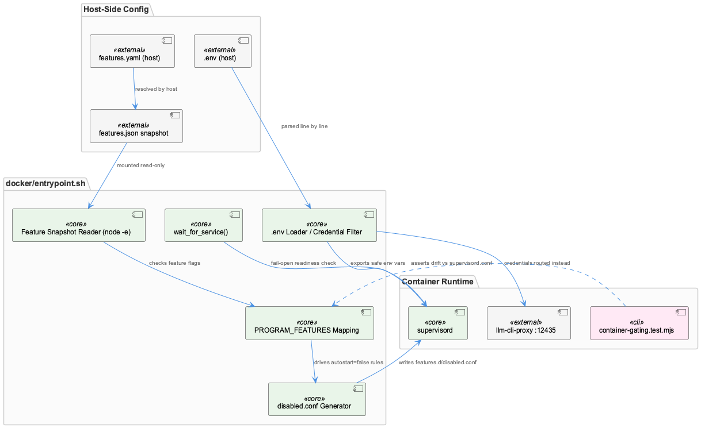
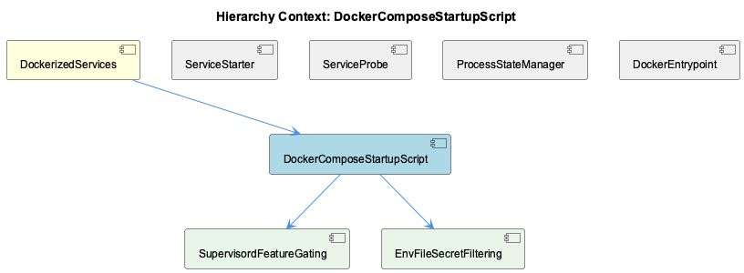

# DockerComposeStartupScript

**Type:** SubComponent

# DockerComposeStartupScript — Technical Insight Document

## What It Is

DockerComposeStartupScript is implemented in `docker/entrypoint.sh`, the sole container-side entrypoint invoked before supervisord takes over process management via `exec "$@"` at line 150. It is the parent of two focused subcomponents: SupervisordFeatureGating (lines 107–146) and EnvFileSecretFiltering (lines 64–82), and it also contains a service-readiness helper (`wait_for_service()`, lines 34–56). As a member of DockerizedServices alongside siblings ServiceStarter, ServiceProbe, ProcessStateManager, and DockerEntrypoint, it functions as the boot-time orchestrator that translates host-authored configuration (feature snapshots, `.env` files) into the runtime state supervisord will operate on.

## Architecture and Design

The script's dominant architectural pattern is **fail-open startup gating**: rather than treating missing or malformed configuration as a reason to block startup, entrypoint.sh treats it as "run everything." This appears twice, independently. `wait_for_service()` (lines 34–56) always returns 0 even after exhausting retry attempts, printing a WARNING and deferring to supervisord to handle a still-down dependency. Separately, the feature-gating block treats an unreadable `FEATURES_SNAPSHOT` as "no gating at all," printing an explicit "starting everything" message and leaving `/etc/supervisor/features.d/` empty rather than blocking all programs. Both decisions consciously trade a slower diagnostic path (a service quietly misbehaving downstream) against what the author considers a worse failure mode: a container that starts nothing because a JSON write raced container boot.

A second pattern is **config-driven supervisord include generation**: instead of editing `supervisord.conf` directly, SupervisordFeatureGating writes `autostart=false` fragments into `/etc/supervisor/features.d/disabled.conf`, keeping the base supervisor configuration untouched and generated overrides isolated.

A third pattern, **credential filtering at the environment-import boundary**, governs EnvFileSecretFiltering: a deny-list on key-name suffix (`*_API_KEY|*_TOKEN|*_MANAGEMENT_KEY`) rather than value inspection.

## Implementation Details

SupervisordFeatureGating reads a flat JSON snapshot at `/coding/.coding/runtime/features.json` — mounted read-only, written by the host, and deliberately distinct from the host's `~/.coding/features.yaml`, which is never mounted into the container. For each entry in the hardcoded `PROGRAM_FEATURES` mapping (e.g., `semantic-analysis:knowledge`, `constraint-monitor:constraints`, `health-dashboard:health`), it invokes `node -e` — not `jq`, which is absent from the image — to evaluate `snap.features[feature]`, writing disable directives for anything resolving false. Unknown feature names default to enabled, so a stale host snapshot can never accidentally disable an unrecognized program. `PROGRAM_FEATURES` is manually duplicated from `docs/architecture/features.md`; drift between it and the `[program:...]` sections of `supervisord.conf` is asserted only externally, by `tests/features/container-gating.test.mjs`, not by the script itself.

EnvFileSecretFiltering streams `/coding/.env` line by line with `IFS='=' read -r key value`, skipping comments and blanks, trimming keys via `xargs`, exporting only if docker-compose hasn't already set the variable, and `continue`-ing past any key matching the three deny-list suffixes before export — implementing the "T2 egress lockdown" so raw provider credentials never reach in-container SDK clients, which must instead route through the host llm-cli-proxy on port 12435. Filtering is purely name-pattern based; a secret under a non-matching name (`SECRET`, `PASSWORD`, a bespoke credential var) passes through unfiltered.

## Integration Points

Downstream, entrypoint.sh hands control to supervisord via `exec "$@"`, meaning every directive it generates (feature-disable fragments, exported env vars) must be correct before that handoff. Its correctness is cross-checked externally by `tests/features/container-gating.test.mjs`, and its reliability is validated operationally rather than structurally: per the Docker Container Restart Verification Baseline and Coding-Services Docker Container Health Verification Workflow session records, `docker-compose up -d` restarts are never trusted at the `docker ps`/supervisor-process-list level alone — every supervised process's health endpoint is confirmed live before downstream pipelines like wave-analysis depend on it, since entrypoint.sh's own fail-open design means a bad snapshot could silently leave feature-gating in an unintended state that only a live check would surface. This concern is corroborated by the still-unresolved Feature Snapshot Forensics investigation into `features.json` silently rewriting itself into a restrictive "logging-only" state, leaving services like Constraint Monitor "running" under supervisord but non-functional.

## Usage Guidelines

Any change to feature names or supervised programs must update `PROGRAM_FEATURES` in entrypoint.sh in lockstep with `docs/architecture/features.md` and `supervisord.conf`, and should be validated against `tests/features/container-gating.test.mjs`. Developers must not assume `docker ps`/supervisord "running" status reflects true health — the operational baseline of pairing restarts with explicit health-endpoint checks should be followed given the open feature-snapshot drift investigation. Anyone adding new secret-bearing environment variables must ensure their names conform to the `*_API_KEY|*_TOKEN|*_MANAGEMENT_KEY` convention, since EnvFileSecretFiltering filters by suffix pattern only, not value inspection.

## Work Record

What working sessions recorded about this entity — decisions taken, problems hit, and why things are the way they are:

- The Feature Snapshot Forensics — Runtime Config Drift Investigation session record documents an unresolved multi-session investigation into the exact runtime feature snapshot entrypoint.sh consumes (features.json) silently rewriting itself into a restrictive 'logging-only' state, causing services such as Constraint Monitor to appear 'running' under supervisord while actually non-functional; no root cause had been confirmed as of the last recorded session, which means the container-boot feature-gating logic in entrypoint.sh cannot yet be assumed to always reflect the intended host-side feature configuration after a restart.

## Hierarchy Context

### Parent
- [DockerizedServices](./DockerizedServices.md) -- [SESSION] Docker Container Restart Verification Baseline establishes a pre/post supervisor-process-list and container-state comparison habit around routine docker-compose up -d restarts to catch regressions like stale naming or misconfigured mounts

### Children
- [SupervisordFeatureGating](./SupervisordFeatureGating.md) -- entrypoint.sh reads FEATURES_SNAPSHOT=/coding/.coding/runtime/features.json, mounted read-only, and never mounts the host's ~/.coding/features.yaml.
- [EnvFileSecretFiltering](./EnvFileSecretFiltering.md) -- [LLM] The entire EnvFileSecretFiltering behavior lives in a single while-loop in docker/entrypoint.sh (the `if [ -f /coding/.env ]; then ... done < /coding/.env` block): it streams the bind-mounted host .env line by line with `IFS='=' read -r key value`, skips comment (`^[[:space:]]*#`) and blank lines, trims the key with `xargs`, and then runs a `case "$key" in *_API_KEY|*_TOKEN|*_MANAGEMENT_KEY) continue ;; esac` before ever exporting anything — so filtering happens by KEY-NAME PATTERN alone, never by inspecting the value, meaning a secret stored under a name that doesn't match one of those three suffixes (e.g. a bare `SECRET`, `PASSWORD`, or a service-specific credential var) passes through untouched.

### Siblings
- [ServiceStarter](./ServiceStarter.md) -- [SESSION] Docker Container Restart Verification Baseline establishes a habit of comparing supervisor process lists and container state before/after docker-compose up -d restarts to catch regressions like stale naming or misconfigured mounts, directly exercising the startup paths this library implements.
- [ServiceProbe](./ServiceProbe.md) -- [SESSION] coding --copilot Launcher Health Check reuses the same rebuild-and-verify Docker workflow as the restart-verification baseline, confirming supervised processes and health endpoints are live before downstream pipelines like wave-analysis depend on them.
- [ProcessStateManager](./ProcessStateManager.md) -- [CGR] ProcessStateManager (class) in process-state-manager.js
- [DockerEntrypoint](./DockerEntrypoint.md) -- [SESSION] Docker Container Restart Verification Baseline establishes a pre/post supervisor-process-list and container-state comparison habit around routine docker-compose up -d restarts to catch regressions like stale naming or misconfigured mounts.

---

*Generated from 9 observations*
