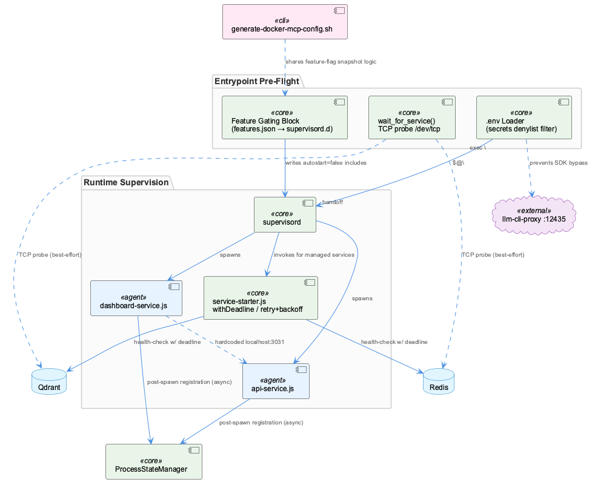
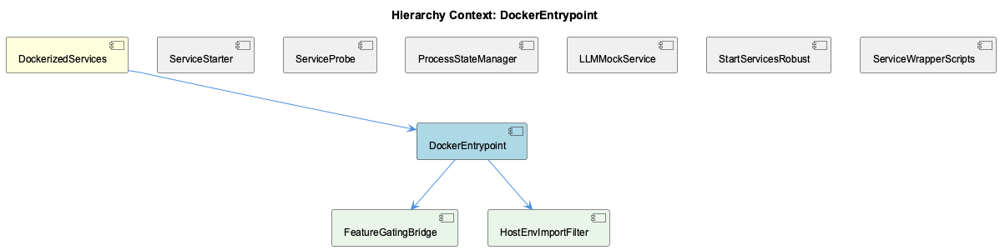

# DockerEntrypoint

**Type:** SubComponent

[Architecture Notes] entrypoint.sh treats database readiness as advisory (always returns 0), deferring actual failure handling to supervisord's restart policy rather than aborting container startup; Feature gating is intentionally fail-open on unknown/missing config (unknown feature = enabled, missing snapshot = start everything), inverting the fail-closed posture used for anything that starts a process elsewhere in the project; Tight coupling between dashboard-service.js and api-service.js's port number via a hardcoded literal (localhost:3031) rather than a shared config source, creating a silent drift risk if CONSTRAINT_API_PORT is overridden; PSM registration is decoupled from process lifecycle correctness — it's best-effort telemetry/visibility, not a gating dependency, in both wrapper scripts; MCP tool surface generation (generate-docker-mcp-config.sh) and container process supervision (entrypoint.sh) both consume the same class of feature-flag snapshot but apply it to different subsystems (agent tool schema vs. supervisord autostart), duplicating the feature-check logic across a bash script and a Node CLI invocation rather than sharing one implementation; supervisord is used as an in-container multi-process manager, with entrypoint.sh as a pre-flight script that execs into it via `exec "$@"`, preserving PID 1 signal handling semantics for the container runtime

# DockerEntrypoint — Technical Insight Document

## What It Is

DockerEntrypoint is implemented primarily in `docker/entrypoint.sh`, the pre-flight script that runs as PID 1 inside the container before handing off to supervisord via `exec "$@"` (docker/entrypoint.sh:145). As a SubComponent of DockerizedServices, it is responsible for three distinct concerns bundled into a single boot-time script: best-effort service readiness polling, secrets redaction on environment import, and feature-flag translation into supervisord process supervision. Its two children, FeatureGatingBridge and HostEnvImportFilter, formalize the latter two responsibilities as distinct sub-behaviors within the same file.

## Architecture and Design

The script's `wait_for_service()` function (docker/entrypoint.sh:14-31) TCP-probes Qdrant and Redis using bash's `/dev/tcp/$host/$port` pseudo-device redirection, but critically always `return 0` regardless of outcome, with an explicit comment that failure handling is deferred to supervisord. This is a weaker, single-bit version of the three-state pessimism enforced in ServiceProbe's `service-probe.js` (SPEC R6 invariant: never assert "healthy", only "stopped"/"unknown") — entrypoint.sh doesn't even distinguish those states, it just logs and proceeds, pushing all real health determination downstream to supervisord's restart policy and ultimately the health-coordinator.

The `.env` loading block, formalized as the HostEnvImportFilter child, is a denylist-based secrets firewall (docker/entrypoint.sh:52-66) built for the project's T2 egress-lockdown effort: it parses `/coding/.env` with `IFS='='`, skipping keys matching `*_API_KEY|*_TOKEN|*_MANAGEMENT_KEY` rather than exporting them, preventing in-container SDK clients from bypassing the host's llm-cli-proxy on :12435.

The feature-gating block, formalized as the FeatureGatingBridge child, reads a host-written `.coding/runtime/features.json` snapshot and generates `/etc/supervisor/features.d/*.conf` includes disabling programs (docker/entrypoint.sh:96-135). This is explicitly a one-shot, one-way translator — no inotify watch, no SIGHUP re-read — meaning mid-session feature toggles never affect an already-running process, consistent with the project's "apply tier" vs "live tier" model.

## Implementation Details

The embedded `node -e` snippet in the feature-gating block treats any unrecognized feature key as enabled — "an unknown feature reads as enabled" — a deliberate fail-open decision ensuring an older host snapshot never disables a newer program it doesn't recognize. This inverts the fail-closed posture applied elsewhere for anything that starts a process, an asymmetry documented in project CLAUDE.md.

Because `~/.coding/features.yaml` is host-only and unmounted, the container cannot re-derive feature policy independently; it is forced into a consumer role trusting the flattened JSON artifact, mirroring the LLM mock/local/public mode design in sibling LLMMockService where cross-boundary state is persisted via shared file rather than independently derived on each side.

The same feature-check logic (`bin/coding-features enabled codegraph`) is duplicated outside entrypoint.sh in `scripts/generate-docker-mcp-config.sh`, which applies an analogous CODEGRAPH_ENABLED gate to MCP tool-surface generation rather than supervisord autostart — semantic-analysis and constraint-monitor are intentionally omitted from the generated `mcpServers` map entirely, saving an estimated ~14KB/~3,540 tokens per context window.

## Integration Points

DockerEntrypoint sits atop DockerizedServices alongside siblings ServiceStarter, ServiceProbe, ProcessStateManager, LLMMockService, StartServicesRobust, and ServiceWrapperScripts. It hands off downstream health responsibility to supervisord and, ultimately, to the health-coordinator that combines ServiceProbe's stopped/unknown signals with ProcessStateManager registration state. Its output artifacts — supervisord include files and filtered environment variables — are consumed at process-supervision time, not by any code path directly, making the integration surface entirely file-based and boot-time.

The wrapper scripts `scripts/api-service.js` and `scripts/dashboard-service.js`, while structurally siblings of the entrypoint's spawned children rather than part of DockerEntrypoint itself, illustrate the same environment-variable-based service wiring philosophy: `dashboard-service.js` hardcodes `NEXT_PUBLIC_API_BASE_URL: 'http://localhost:3031'` rather than deriving it from `CONSTRAINT_API_PORT`, risking silent drift if the API port is overridden.

## Usage Guidelines

Developers extending the `.env` denylist (HostEnvImportFilter) must keep the `*_API_KEY|*_TOKEN|*_MANAGEMENT_KEY` pattern list in sync with any new secret-naming convention (e.g., `*_SECRET`, `*_CREDENTIAL`); otherwise, new secrets will silently leak through the filter.

Anyone modifying FeatureGatingBridge must preserve the fail-open-on-unknown behavior and remember the bridge only applies at container (re)start — toggling features live via the dashboard will not stop already-running programs.

Because `wait_for_service()` never fails hard, developers should not rely on entrypoint.sh for correctness guarantees around Qdrant/Redis availability; real readiness enforcement belongs in supervisord's restart policy or the health-coordinator, consistent with ServiceProbe's and ServiceStarter's `withDeadline()`/retry-based resilience patterns rather than entrypoint-level gating.

## Hierarchy Context

### Parent
- [DockerizedServices](./DockerizedServices.md) -- [LLM] The health-check subsystem enforces a strict invariant (documented as SPEC R6) that probing functions in service-probe.js—probeHttpHealth() and probeTcpPort()—must never report a 'healthy' status directly. Instead, these functions only distinguish between 'stopped' (connection refused, timeout, or non-2xx HTTP response) and 'unknown' (configuration errors, malformed URLs, or unresolvable hosts). This is a deliberate architectural choice: liveness probes are pessimistic by design, and the actual determination of 'healthy' is deferred to a higher-level coordinator that combines probe results with other signals (e.g., process registration state from ProcessStateManager). New developers extending probe logic must preserve this three-state contract rather than optimistically returning 'healthy' from a probe function, since downstream consumers (the health-coordinator) rely on the absence of false positives here.

### Children
- [FeatureGatingBridge](./FeatureGatingBridge.md) -- [LLM] docker/entrypoint.sh's feature-gating block (FEATURES_SNAPSHOT/FEATURES_DIR/PROGRAM_FEATURES) is deliberately a one-way, best-effort translator rather than a live config channel: it runs once at container boot, reads a single JSON snapshot the host wrote before `docker-compose up`, and produces a static `disabled.conf` include that supervisord reads only when it first parses its config tree. There is no inotify watch, no SIGHUP re-read, and no mechanism in this file for a feature toggled off mid-session (e.g. via the dashboard's Features tab) to stop an already-running `semantic-analysis` or `graphify` program — the bridge only ever influences the next `docker-compose restart`/container recreate, which is consistent with the project's documented 'apply tier' model where container programs are an `apply`-tier surface, not a `live`-tier one.
- [HostEnvImportFilter](./HostEnvImportFilter.md) -- [LLM] [object Object]

### Siblings
- [ServiceStarter](./ServiceStarter.md) -- [LLM] The core resilience primitive in lib/service-starter.js is withDeadline(), which wraps Promise.race() around a work promise and a timeout-rejecting promise, then clears the timer in a finally block regardless of which promise wins. This is not the naive Promise.race() pattern seen in many codebases — the naive version leaves the losing setTimeout timer armed on the event loop even after the work promise resolves, which is a classic cause of hung Node.js processes (a test runner or one-shot CLI that never exits cleanly, or a long-lived service that leaks a timer handle per retry attempt). startServiceWithRetry() calls withDeadline() twice per attempt (once wrapping startFn() with the attempt's `timeout` option, once wrapping healthCheckFn() with a hardcoded 10000ms), so the leak-avoidance matters doubly under the exponential-backoff retry loop where dozens of timers could otherwise accumulate across maxRetries attempts.
- [ServiceProbe](./ServiceProbe.md) -- [LLM] service-starter.js's startServiceWithRetry() (lib/service-starter.js) implements a three-layer resilience wrapper around arbitrary async start/health-check function pairs: an outer retry loop (default maxRetries=3) with exponential backoff (retryDelay * 2^(attempt-1)), an inner withDeadline() timeout guard applied separately to both the start call and the health check call (30000ms and 10000ms respectively by default), and post-failure cleanup that SIGTERMs then SIGKILLs an unhealthy child process before the next attempt. The withDeadline() helper is deliberately written with a try/finally that calls clearTimeout(timer) regardless of whether the race was won by the work or the timer — the accompanying comment explains this exists specifically to avoid leaving a dangling setTimeout handle that would hold the Node.js event loop open in short-lived callers like test runners or one-shot CLIs, even though in the long-lived service-starter context itself the leak would be invisible.
- [ProcessStateManager](./ProcessStateManager.md) -- [CGR] ProcessStateManager (class) in process-state-manager.js
- [LLMMockService](./LLMMockService.md) -- [LLM] The docker/entrypoint.sh script implements a feature-gating override mechanism that reads a host-written snapshot (/coding/.coding/runtime/features.json) and translates it into supervisord include files at /etc/supervisor/features.d/disabled.conf. This is architecturally significant because the container cannot run the feature resolver itself — ~/.coding/features.yaml lives on the host and is never mounted — so the container is forced into a consumer role, trusting a flattened JSON artifact rather than re-deriving policy. The `enabled` check inside the embedded `node -e` snippet explicitly treats any value other than `false` (including an unknown/missing key) as enabled, which is a deliberate fail-open default: an older host snapshot that predates a new feature must never accidentally disable it. This mirrors the LLM mock/local/public mode design in llm-mock-service.ts, where cross-boundary state (host vs container) is persisted in a shared file artifact rather than derived independently on each side, avoiding drift between host and containerized views of the same configuration.
- [StartServicesRobust](./StartServicesRobust.md) -- [LLM] lib/service-starter.js implements withDeadline() as a wrapper around Promise.race() specifically to solve a Node.js event-loop hygiene problem: when the wrapped work promise resolves before the timeout, the setTimeout timer created for the race is not automatically cancelled by Promise.race() itself. withDeadline() addresses this in a try/finally block that unconditionally calls clearTimeout(timer) regardless of whether the race was won by the work or the timeout. This is not a cosmetic detail — an uncleared timer keeps Node's event loop alive for the full duration of `ms`, which in startServiceWithRetry() is used twice per attempt (once with the caller-supplied `timeout` for startFn(), once hardcoded to 10000ms for healthCheckFn()), meaning a naive implementation would leave up to two dangling timers per retry attempt across `maxRetries` attempts, compounding into significant delayed-exit behavior for any process (test runner, CLI) that invokes this module and expects clean shutdown.
- [ServiceWrapperScripts](./ServiceWrapperScripts.md) -- api-service.js spawns `node src/dashboard-server.js` inside integrations/constraint-monitor with stdio:'inherit', propagating PORT and DASHBOARD_PORT env vars into the child

---

*Generated from 10 observations*
