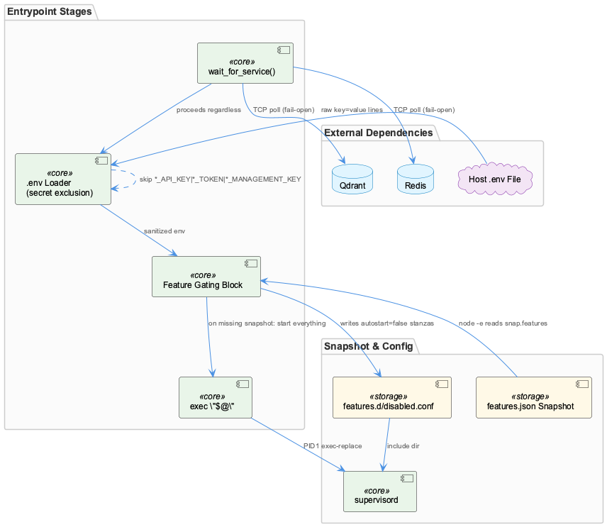
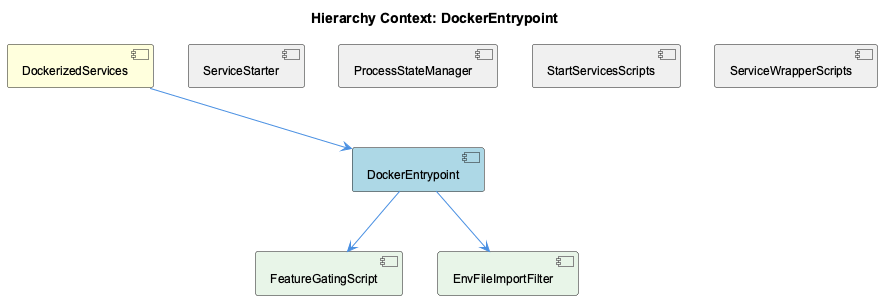

# DockerEntrypoint

**Type:** SubComponent

## What It Is

DockerEntrypoint is implemented at `docker/entrypoint.sh`, the shell shim that runs as PID 1 inside the container before supervisord takes over. It is the single point where three distinct pre-flight concerns converge: dependency readiness waiting, environment sanitization, and feature-to-autostart translation. Its two children, FeatureGatingScript and EnvFileImportFilter, are not separate files but named regions within this one script, and the entrypoint's final act is to hand off control entirely via `exec "$@"`.

## Architecture and Design

The dominant pattern across the script is fail-open degradation rather than fail-fast validation. `wait_for_service()` (lines ~13-31) polls TCP connectivity via bash's `/dev/tcp` pseudo-device under `timeout 2`, retrying up to 30 times, but on exhaustion it logs a warning and still `return 0` — the comment is explicit: "Don't fail — let supervisord handle it." The same philosophy governs FeatureGatingScript: a missing `FEATURES_SNAPSHOT` file, an unrecognized feature key, or a failing `node -e` invocation all resolve toward *running more programs*, never fewer. This is a deliberate asymmetry layered on top of `set -e` — the script aborts on genuine unexpected errors but is carved out to never let feature-detection failure silently stop a supervised program from starting.

A second pattern is snapshot-based configuration handoff across the host/container boundary: rather than running the full feature resolver in-container, the entrypoint reads a flat, host-written `/coding/.coding/runtime/features.json` snapshot, because `~/.coding/features.yaml` itself is never mounted in. This mirrors, but is architecturally independent from, the host-side gating performed by sibling StartServicesScripts and ServiceWrapperScripts via `scripts/start-services-robust.js`'s `SERVICE_CONFIGS`/`loadFeatures()` and validated by `tests/features/service-gating.test.mjs` — two disjoint gating mechanisms for two disjoint sets of processes.

## Implementation Details

FeatureGatingScript builds `/etc/supervisor/features.d` at every container start by iterating the space-separated `PROGRAM_FEATURES` mapping (e.g., `semantic-analysis:knowledge`, `constraint-monitor:constraints`, `health-dashboard:health`) and shelling out to `node -e` — not `jq`, since jq isn't installed in the image — to evaluate `snap.features?.[feature]`. Only an explicit `false` writes a `[program:...]\nautostart=false` stanza into `disabled.conf`; anything missing or unknown is treated as enabled, so a stale host snapshot can never accidentally silence a program it doesn't know about.

EnvFileImportFilter is the inline loop in the "Environment setup" section (~lines 55-75): it reads `/coding/.env` with `while IFS='=' read -r key value`, trims via `xargs`, and applies a `case "$key" in *_API_KEY|*_TOKEN|*_MANAGEMENT_KEY) continue ;; esac` denylist *before* the existing-value check (`if [ -z "${!key}" ]`) ever runs, implementing a first-writer-wins merge with secrets excluded first. The comment ties this directly to "T2 egress lockdown": importing raw provider credentials would let in-container SDK clients bypass the intended single egress path through the host llm-cli-proxy. Because this is glob-pattern matching, correctness depends on naming convention — a key like `OPENAI_SECRET` or `BEARER` would slip through undetected.

The script closes with `exec "$@"`, replacing its own process image so `docker stop`'s SIGTERM reaches supervisord directly rather than an intermediary bash process — a small but load-bearing detail for graceful shutdown of whatever set of programs the feature-gating step just enabled or disabled.

## Integration Points

DockerEntrypoint sits directly under parent DockerizedServices, which per the Health Verification Workflow session record requires every supervised process and its health endpoint to be explicitly confirmed live after a docker-compose rebuild — a discipline that exists precisely because this entrypoint's fail-open waits and gating never make hard guarantees. Sibling ServiceStarter shares that same verification obligation. Sibling StartServicesScripts and ServiceWrapperScripts operate a structurally analogous but mechanically separate gating pipeline on the host/Node side (`SERVICE_CONFIGS`, `startFn`/`healthCheckFn`, `isServiceRunning` via PSM, `pgrep` fallbacks) — the two systems gate disjoint process sets and should not be assumed to be interchangeable or mutually aware. ProcessStateManager is referenced only through this analogous host-side path, not directly consumed by entrypoint.sh itself.

## Usage Guidelines

Anyone modifying `docker/entrypoint.sh` should preserve the fail-open contract deliberately: readiness waits and feature-detection failures are not supposed to block startup, and "fixing" them to fail-fast would contradict the documented intent of deferring liveness enforcement to supervisord and downstream health checks. Any new secret pattern added to `.env` must be added to the `EnvFileImportFilter`'s case-statement denylist explicitly — the filter offers no structural guarantee beyond suffix convention. When adding a new supervised program, its feature key must be added to `PROGRAM_FEATURES` and reflected in the host-written `features.json` snapshot; because unknown keys default to enabled, omission is safe but silent. Finally, per the Restart Verification Baseline, operators should check for orphaned processes/ports from a prior incomplete shutdown before re-running docker-compose, since `wait_for_service`'s fail-open design does not itself detect or resolve stale state from a previous container instance.

## Work Record

What working sessions recorded about this entity — decisions taken, problems hit, and why things are the way they are:

- The 'Coding-Services Docker Container — Health Verification Workflow' record establishes that a rebuild here is performed via docker-compose and that, before trusting any downstream pipeline (e.g. wave-analysis) on this container, every supervised process and its health endpoint must be explicitly confirmed live rather than assumed — health confirmation is a hard gate, not an inference from a successful `docker-compose up`.
- The same record also establishes a 'Docker Container Restart Verification Baseline': before invoking docker-compose again, the operator is expected to check existing container/service state first, specifically to avoid restarting on top of orphaned or stale service state left behind by a prior incomplete shutdown — a concern this entrypoint's own `wait_for_service` fail-open design does not itself resolve, since it never inspects whether a previous container's processes are still holding ports.

## Hierarchy Context

### Parent
- [DockerizedServices](./DockerizedServices.md) -- [SESSION] Coding-Services Docker Container — Health Verification Workflow establishes that rebuild is performed via docker-compose and all supervised processes/health endpoints must be confirmed live before relying on downstream pipelines like wave-analysis

### Children
- [FeatureGatingScript](./FeatureGatingScript.md) -- [LLM] The feature-gating block in docker/entrypoint.sh is the actual implementation of 'FeatureGatingScript': it reads FEATURES_SNAPSHOT (/coding/.coding/runtime/features.json), iterates the space-separated PROGRAM_FEATURES mapping, and shells out to `node -e` per feature to decide whether to emit `[program:...]\nautostart=false` into /etc/supervisor/features.d/disabled.conf. This is a purely container-side mechanism distinct from the host-side feature resolver invoked in scripts/start-services-robust.js via `loadFeatures()`.
- [EnvFileImportFilter](./EnvFileImportFilter.md) -- [LLM] The EnvFileImportFilter is implemented as an inline bash loop in docker/entrypoint.sh (the 'Environment setup' section, roughly lines 55-75), not as a standalone module or function — it reads `/coding/.env` line-by-line with `while IFS='=' read -r key value`, trims the key with `key=$(echo "$key" | xargs)`, and applies a `case "$key" in *_API_KEY|*_TOKEN|*_MANAGEMENT_KEY) continue ;; esac` filter before any assignment happens. This means the 'filter' is a glob-pattern denylist evaluated per-line inside a larger script, so its correctness depends entirely on naming conventions (`_API_KEY`, `_TOKEN`, `_MANAGEMENT_KEY` suffixes) being followed by every secret ever added to `.env` — a credential named e.g. `OPENAI_SECRET` or `BEARER` would slip through undetected.

### Siblings
- [ServiceStarter](./ServiceStarter.md) -- [SESSION] Coding-Services Docker Container — Health Verification Workflow establishes that after docker-compose rebuild, all supervised processes/health endpoints must be confirmed live before relying on downstream pipelines like wave-analysis
- [ProcessStateManager](./ProcessStateManager.md) -- [CGR] ProcessStateManager (class) in process-state-manager.js
- [StartServicesScripts](./StartServicesScripts.md) -- [LLM] start-services.sh is a dual-mode dispatcher: with ROBUST_MODE (default true, overridable via env var) it simply execs `node scripts/start-services-robust.js` and exits immediately, deferring all real orchestration to that Node script; the remainder of the bash file (roughly 200+ lines of legacy port-killing, docker-compose invocation for Qdrant/Redis, and manual `docker run` fallbacks for constraint-monitor) only executes when ROBUST_MODE=false. This is a live-but-deprecated code path — it still constructs CONSTRAINT_MONITOR_STATUS/CONSTRAINT_MONITOR_WARNING strings and calls `check_docker`, `check_port`, `kill_port` — kept explicitly for backward compatibility rather than deleted.
- [ServiceWrapperScripts](./ServiceWrapperScripts.md) -- [LLM] scripts/start-services-robust.js defines SERVICE_CONFIGS as a map of per-service descriptors (transcriptMonitor, liveLoggingCoordinator, and others truncated below them) each carrying a `feature` id, `startFn`, `healthCheckFn`, `required`, and `maxRetries`/`timeout`. The `transcriptMonitor.startFn` is the clearest instance of the 'thin wrapper' pattern described for the parent DockerizedServices entity: before spawning anything it checks PSM (`psm.isServiceRunning('transcript-monitor', 'global')`) and an OS-level `pgrep` fallback (`isProcessRunningByScript`) to avoid double-starting an orphaned process, then spawns `enhanced-transcript-monitor.js` detached with stdio redirected to `.data/etm.log`, injects `OBS_API_URL` into the child's env, and calls `child.unref()` so the wrapper process itself can exit without keeping the child alive as a dependent.

---

*Generated from 10 observations*
