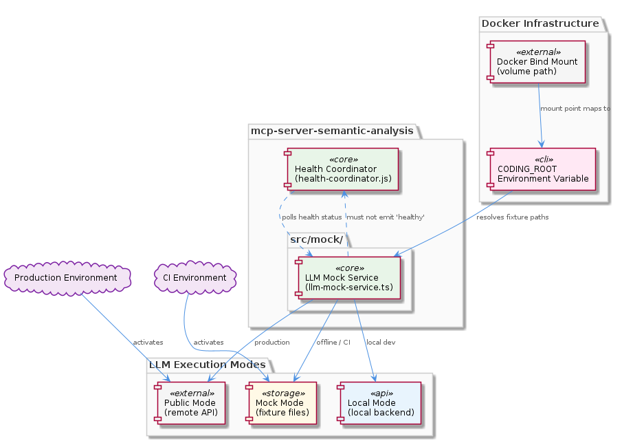
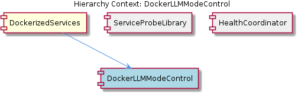

# DockerLLMModeControl

**Type:** SubComponent

The module in mcp-server-semantic-analysis/src/mock/ supports three distinct modes (mock/local/public), each likely mapping to a different LLM backend or fixture source to allow offline development inside containers

## What It Is

DockerLLMModeControl is a SubComponent of DockerizedServices, implemented within `mcp-server-semantic-analysis/src/mock/`, specifically centered on `llm-mock-service.ts`. Its purpose is to govern which LLM backend a containerized service instance communicates with at runtime, supporting three distinct operational modes: **mock**, **local**, and **public**. This trimodal design allows the same Docker image to serve CI pipelines, local developer workflows, and production deployments without requiring separate builds or image variants. The component is deliberately isolated in the `src/mock/` subdirectory, a structural choice that communicates its role as a seam between real LLM infrastructure and controlled test/development execution environments.

---

## Architecture and Design

The central architectural insight is **image-invariant mode selection**: by reading the `CODING_ROOT` environment variable for path resolution, `llm-mock-service.ts` delegates the question of "which mode am I in?" to the container's runtime environment rather than its build configuration. This mirrors Docker bind-mount conventions precisely — the same service image can have a CI-specific volume mounted at `CODING_ROOT` pointing to fixture files, or have that variable absent/redirected in production to route calls to the public LLM endpoint. The result is a single deployable artifact that traverses the entire dev-to-prod pipeline without rebuild.

The three modes — mock, local, and public — likely map to increasing levels of infrastructure dependency: mock uses static fixtures resolved via `CODING_ROOT`, local communicates with a locally running LLM (e.g., Ollama or a local model server), and public connects to an external hosted LLM API. This gradient allows developers to work offline inside containers while preserving a clear upgrade path to real infrastructure.

A critical architectural constraint binds DockerLLMModeControl tightly to its siblings within DockerizedServices. The HealthCoordinator polls service health every five seconds using results from ServiceProbeLibrary, and the parent DockerizedServices enforces SPEC R6: no probe or downstream component may ever emit the string `'healthy'` — only `'running'`, `'stopped'`, or `'unknown'` are valid states. Mode transitions within `llm-mock-service.ts` must therefore never propagate a `'healthy'` string into the health pipeline. This means mode-switching logic — even if it involves transient states like "reconnecting to a new backend" — must be designed so that any intermediate status resolves to one of the three permitted values before it reaches HealthCoordinator.

The isolation of this logic inside `src/mock/` is itself an architectural decision, not merely a folder convention. It signals that mock and mode-control concerns are explicitly separated from production LLM call paths, reducing the risk that test fixtures or mock routing logic leaks into the hot path of real inference requests.

---

## Implementation Details

`llm-mock-service.ts` is the primary implementation file. Its use of `CODING_ROOT` for path resolution is the load-bearing mechanism for the entire mode system. When the container starts, `CODING_ROOT` is evaluated to construct absolute paths to fixture files, meaning the service does not need to know or hardcode where mock data lives — it discovers it at runtime based on how the container was launched. This is consistent with Docker bind-mount conventions, where a host directory (e.g., a developer's local workspace or a CI workspace) is mounted into the container at a known path, and `CODING_ROOT` points into that mount.

The three-mode structure (mock/local/public) implies a dispatch or strategy layer inside `llm-mock-service.ts` that selects a backend handler based on the active mode. In mock mode, requests are likely satisfied by reading pre-recorded fixture files from the `CODING_ROOT`-resolved path. In local mode, the service presumably forwards requests to a locally accessible LLM endpoint. In public mode, it connects to an external API. The exact dispatch mechanism is not exposed in the available code symbols, but the design pattern is consistent with a strategy or factory approach where mode is resolved once at startup (or on explicit reconfiguration) and the appropriate handler is wired in.

The `src/mock/` subdirectory location reinforces that `llm-mock-service.ts` is not a thin wrapper but a substantive service module — it carries enough logic to stand in for a real LLM backend from the perspective of callers, which is why architectural separation from production paths was deemed necessary.

---

## Integration Points

DockerLLMModeControl sits inside DockerizedServices and must coexist peacefully with HealthCoordinator and ServiceProbeLibrary. The health-coordinator.js polling architecture (5-second interval, consuming probe results from `lib/utils/service-probe.js`) is the most significant integration constraint. Any mode transition in `llm-mock-service.ts` that alters service reachability — for example, switching from mock fixtures to a local LLM that hasn't started yet — must be handled so that ServiceProbeLibrary's `probeHttpHealth()` or `probeTcpPort()` returns `'stopped'` or `'unknown'`, not a novel status string, and certainly not `'healthy'`.

The `CODING_ROOT` environment variable is the primary external interface for configuring mode behavior. Container orchestration configuration (Docker Compose files, CI pipeline environment blocks) is responsible for injecting this variable correctly, making those configuration files implicit integration points even if they are not code artifacts of this component directly.

The `src/mock/` module likely exposes an interface consumed by the broader `mcp-server-semantic-analysis` service, meaning callers within that service are insulated from knowing which LLM backend is active — they call through DockerLLMModeControl and receive responses regardless of whether those responses came from a fixture file or a live API. This is the classic seam pattern: the rest of the application remains unchanged across deployment modes.

---

## Usage Guidelines

**Never introduce a fourth health status string.** Any code added to `llm-mock-service.ts` that interacts with health checking must respect SPEC R6 as enforced by DockerizedServices. Mode transitions, reconnection logic, and backend availability checks must all resolve to `'running'`, `'stopped'`, or `'unknown'` in the probe pipeline. Violations will corrupt HealthCoordinator's state machine, which has no handling for unexpected status values.

**Set `CODING_ROOT` explicitly in every container context.** The entire mock/local mode system depends on this variable being correctly resolved. In CI environments, `CODING_ROOT` should point to the workspace root where fixture files are available via bind mount. In production, the variable should either be absent (triggering public mode behavior) or explicitly set to signal the intended mode. Ambiguity in this variable is the most likely source of "wrong mode" bugs in containerized deployments.

**Respect the `src/mock/` boundary.** Production LLM call logic should not be placed inside this subdirectory, and mock/fixture logic should not leak outside it. The architectural separation is intentional and preserves the ability to audit which code paths are exercised in test vs. production environments. New developers adding LLM-adjacent features should determine early whether their code belongs in the mock path or the production path, and place it accordingly.

**Mode changes should be treated as configuration events, not runtime state transitions.** Given the health-coordinator.js polling interval and the constraints on valid status values, designing mode switching as a startup-time configuration choice (rather than a live hot-swap) reduces the risk of transient states reaching the probe pipeline in an invalid form.

---

### Design Trade-offs Summary

| Decision | Benefit | Cost |
|---|---|---|
| `CODING_ROOT` for path resolution | Image-invariant, no rebuild per environment | Implicit dependency on orchestration config correctness |
| Three-mode gradient (mock/local/public) | Supports full offline development | Mode dispatch logic must be maintained as LLM landscape changes |
| Isolation in `src/mock/` | Clean separation of test and production paths | Callers must be aware of the seam; interface contracts matter |
| Health status constraint (SPEC R6) | Uniform HealthCoordinator state machine | Mode transitions require careful status management |

## Hierarchy Context

### Parent
- [DockerizedServices](./DockerizedServices.md) -- [LLM] The DockerizedServices component uses a dual-probe health checking architecture implemented in lib/utils/service-probe.js that strictly separates HTTP-based and TCP-based service verification. probeHttpHealth() issues HTTP/HTTPS requests and maps 2xx/3xx response codes to the 'running' state, while probeTcpPort() opens a raw net.Socket connection to verify port reachability for non-HTTP protocols like Memgraph's Bolt protocol. A critical architectural invariant (documented as SPEC R6) enforces that neither probe ever returns the string 'healthy'—only 'running', 'stopped', or 'unknown' are valid return values. This distinction matters because health-coordinator.js in scripts/health-coordinator.js consumes these probes on a 5-second polling interval and must be able to uniformly handle all service types (Next.js dashboard, Node.js API, Memgraph, Redis) without special-casing the protocol. New developers adding services must use probeTcpPort() for any non-HTTP service and must not introduce a fourth status string, or the health-coordinator's state machine will behave incorrectly.

### Siblings
- [ServiceProbeLibrary](./ServiceProbeLibrary.md) -- probeHttpHealth() in lib/utils/service-probe.js maps 2xx/3xx HTTP/HTTPS response codes to the 'running' state, covering services like the Next.js dashboard and Node.js API
- [HealthCoordinator](./HealthCoordinator.md) -- health-coordinator.js polls service-probe.js results every 5 seconds, providing a consistent liveness heartbeat for Next.js dashboard, Node.js API, Memgraph, and Redis

---

*Generated from 5 observations*
