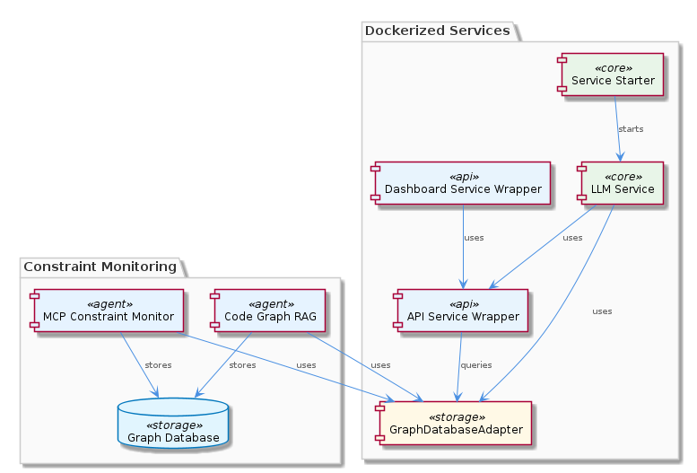

# DockerizedServices

**Type:** Component

[LLM] The constraint monitoring service relies on the MCP Constraint Monitor (integrations/mcp-constraint-monitor/README.md) to detect semantic constraints in code. This involves analyzing code graphs and identifying relationships between code elements. The constraint monitoring service uses the GraphDatabaseAdapter (storage/graph-database-adapter.ts) to store and query graph data, and the API Service Wrapper (scripts/api-service.js) to provide a RESTful interface for constraint-related operations. The Dashboard Service Wrapper (scripts/dashboard-service.js) starts the Next.js-based dashboard for the constraint monitoring service, offering a web-based interface for visualization and management. The use of environment variables, such as CONSTRAINT_DIR, allows for configuration and customization of service behavior without modifying the code.

## What It Is  

DockerizedServices is the **container‑orchestrated micro‑service layer** of the overall *Coding* system.  The implementation lives primarily under the `lib/`, `storage/`, and `scripts/` directories:

* **LLM Service** – `lib/llm/llm-service.ts` – a façade that routes LLM calls, applies caching, circuit‑breaking and provider fallback.  
* **Service Starter** – `lib/service-starter.js` – a reusable bootstrap helper that launches any service container with exponential‑backoff retries, timeout handling and health‑check verification.  
* **Graph Database Adapter** – `storage/graph-database-adapter.ts` – an abstraction over a Graphology + LevelDB persistence stack used by graph‑oriented services.  
* **API Service Wrapper** – `scripts/api-service.js` – the entry point that starts the constraint‑monitoring REST API.  
* **Dashboard Service Wrapper** – `scripts/dashboard-service.js` – boots a Next.js UI for visualising constraint data.

All of these pieces are packaged into Docker images and run as isolated containers, each exposing a well‑defined interface (HTTP, internal RPC, or shared storage).  The component therefore acts as the **runtime host** for the code‑graph analysis, constraint monitoring, and LLM‑driven services that power the broader Coding platform.  

---

## Architecture and Design  

The observations repeatedly point to a **microservices architecture**: every logical capability (LLM façade, constraint API, dashboard UI, graph persistence) lives in its own container and communicates via lightweight protocols.  This design is reinforced by the presence of a **service‑starter** helper (`lib/service-starter.js`) that standardises start‑up concerns—retry with exponential back‑off, timeout enforcement, and health‑check verification—ensuring that each microservice can be launched reliably even in flaky environments.

### Design patterns  

| Pattern | Where it appears | What it achieves |
|---------|------------------|------------------|
| **Facade** | `lib/llm/llm-service.ts` | Presents a single, high‑level API for all LLM operations while hiding mode routing, caching, circuit breaking, and provider fallback. |
| **Adapter** | `storage/graph-database-adapter.ts` | Normalises interaction with Graphology + LevelDB, allowing other services (constraint monitor, code‑graph RAG) to switch persistence implementations without code changes. |
| **Execute‑Pattern** | `execute(input, context)` used in LLM Service and Constraint Monitor | Guarantees a uniform entry point for service logic, simplifying debugging and orchestration. |
| **Retry/Back‑off** | `lib/service-starter.js` | Provides resilient start‑up; exponential back‑off mitigates cascading failures during container spin‑up. |
| **Environment‑Driven Configuration** | Variables like `CODING_REPO`, `CONSTRAINT_DIR` | Decouples deployment‑specific values from source, enabling the same image to run in dev, test, or prod. |

Interaction flows are straightforward: the **API Service Wrapper** (`scripts/api-service.js`) receives HTTP requests, forwards them to the appropriate internal service (e.g., the LLM Service or the Constraint Monitor), which may query the **GraphDatabaseAdapter** for persisted graph data.  The **Dashboard Service Wrapper** (`scripts/dashboard-service.js`) consumes the same API, rendering constraint insights in a Next.js UI.  

---

## Implementation Details  

### LLM Service (`lib/llm/llm-service.ts`)  
* **Mode routing** – decides between “chat”, “completion”, or “embedding” based on request payload.  
* **Caching** – an in‑memory map keyed by request parameters; a cache hit short‑circuits the provider call.  
* **Circuit breaking** – tracks failure counts per provider; after a threshold it temporarily disables the provider and falls back to a secondary one.  
* **Provider fallback** – abstracts over multiple LLM back‑ends (e.g., OpenAI, Anthropic) via a common interface, enabling graceful degradation.

### Service Starter (`lib/service-starter.js`)  
* Exposes a `start(serviceFn, options)` function.  
* Implements **exponential back‑off** (`baseDelay * 2^attempt`) with a configurable max‑retry count.  
* Performs a **health verification** after each start attempt (e.g., pinging an HTTP endpoint or checking a socket).  
* On repeated failure, logs the issue and optionally triggers a graceful shutdown of dependent containers.

### Graph Database Adapter (`storage/graph-database-adapter.ts`)  
* Wraps **Graphology** for in‑memory graph manipulation and **LevelDB** for durable storage.  
* Provides methods like `addNode`, `addEdge`, `query`, and `exportJSON`.  
* The adapter is used by both the **Constraint Monitor** (to store detected semantic constraints) and the **Code‑Graph RAG** integration (to retrieve code‑relationship sub‑graphs).  
* Because the adapter is a thin abstraction, swapping LevelDB for another key‑value store would require only changes inside this file.

### API Service Wrapper (`scripts/api-service.js`)  
* Creates an Express (or Fastify) server that mounts routes under `/constraints`.  
* Each route handler invokes the **execute** pattern (`execute(input, context)`) of the underlying monitor, ensuring consistent error handling and logging.  
* Reads configuration such as `CONSTRAINT_DIR` from the environment to locate constraint definition files.

### Dashboard Service Wrapper (`scripts/dashboard-service.js`)  
* Executes `next dev` (or `next start` in production) inside a container, exposing port 3000.  
* The UI fetches data from the API Service, visualising constraint violations and graph snapshots.  
* Because the dashboard is decoupled from the data layer, it can be replaced with any SPA framework without affecting the backend services.

### Shared Execution Model  
All services expose an `execute(input, context)` function that receives a plain‑object payload and a context object (containing logger, request metadata, etc.).  This contract is enforced by the **Service Starter**, which injects the context before invoking the service’s main logic.

---

## Integration Points  

* **Parent – Coding** – DockerizedServices sits under the root *Coding* component, inheriting global environment variables (e.g., `CODING_REPO`) and sharing the same Docker network as sibling services like **LiveLoggingSystem** and **KnowledgeManagement**.  
* **Sibling overlap** – Both **KnowledgeManagement** and **CodingPatterns** also depend on `storage/graph-database-adapter.ts`.  This common dependency creates a natural data‑sharing layer; any schema evolution in the adapter propagates across these siblings.  
* **Children** –  
  * **GraphDatabaseManager** (child) builds and maintains the Graphology instance that the adapter uses; its README (`integrations/code-graph-rag/README.md`) describes how it constructs the initial code graph.  
  * **ServiceStarter** (child) is leveraged by every container entry point (`scripts/api-service.js`, `scripts/dashboard-service.js`, etc.) to guarantee uniform start‑up semantics.  
* **External contracts** – The LLM Service can be swapped for any provider that implements the internal `ProviderInterface`.  The API Service exposes a RESTful contract consumed by the dashboard and potentially by external tooling.  
* **Data flow** –  
  1. A client hits the constraint API (`/constraints/check`).  
  2. The API handler calls `execute` on the Constraint Monitor, which may query the GraphDatabaseAdapter for relevant code‑graph nodes.  
  3. Results are cached (via the LLM Service’s cache if an LLM call is needed) and returned to the client.  
  4. The dashboard periodically polls the same endpoint to refresh its visualisation.

---

## Usage Guidelines  

1. **Start services through `ServiceStarter`** – never invoke a service’s main function directly from a Docker entry‑point.  Use `node lib/service-starter.js <service-module>` so that retry, timeout, and health‑check logic are applied consistently.  
2. **Configure via environment variables** – keep deployment‑specific values (e.g., `CODING_REPO`, `CONSTRAINT_DIR`, `LLM_PROVIDER`) out of source code.  The Docker compose files for DockerizedServices already expose placeholders for these variables.  
3. **Leverage the `execute` contract** – when extending the platform (e.g., adding a new analysis service), expose an `execute(input, context)` function and register it with the Service Starter.  This guarantees that logging, error handling, and context propagation remain uniform.  
4. **Respect the GraphDatabaseAdapter API** – add or modify graph structures only through the adapter’s methods (`addNode`, `addEdge`, `query`).  Direct manipulation of the underlying Graphology instance bypasses persistence hooks and can cause out‑of‑sync JSON exports.  
5. **Monitor health endpoints** – each microservice should expose a `/healthz` route that returns a 200 status when the service is ready.  The Service Starter uses this endpoint to decide whether a container has started successfully.  
6. **Avoid hard‑coding provider logic** – if you need to switch LLM providers, implement a new provider class that conforms to the LLM Service’s internal interface and register it in `llm-service.ts`.  The built‑in circuit‑breaker will automatically manage fallback.  

---

### Architectural patterns identified  

* Microservices (container‑isolated services)  
* Facade (LLM Service)  
* Adapter (GraphDatabaseAdapter)  
* Execute‑Pattern (`execute(input, context)`)  
* Retry/Exponential Back‑off (ServiceStarter)  
* Environment‑Driven Configuration  

### Design decisions and trade‑offs  

* **Microservice isolation** gives independent scaling and failure containment but adds operational overhead (Docker orchestration, network latency).  
* **Centralised ServiceStarter** reduces duplicated start‑up code, yet couples all services to a single bootstrapping library—changing its behaviour requires coordinated releases.  
* **GraphDatabaseAdapter abstraction** enables swapping persistence layers, but adds an indirection layer that may hide performance characteristics of the underlying LevelDB store.  
* **In‑memory caching** in the LLM Service speeds up repeated calls but limits cache size to the container’s RAM and does not survive restarts; a distributed cache would be more resilient at the cost of added complexity.  

### System structure insights  

DockerizedServices is the **execution spine** of the Coding ecosystem.  Its child components (GraphDatabaseManager, ServiceStarter) provide foundational capabilities that are reused across sibling components (KnowledgeManagement, CodingPatterns, ConstraintSystem).  The shared use of `storage/graph-database-adapter.ts` creates a de‑facto data‑layer contract, while the LLM Service’s façade pattern isolates provider‑specific quirks from the rest of the system.  

### Scalability considerations  

* **Horizontal scaling** – because each service runs in its own container, you can replicate the API Service, Constraint Monitor, or LLM Service behind a load balancer.  The stateless nature of the LLM façade (aside from its in‑memory cache) makes it trivially horizontally scalable.  
* **Graph storage** – LevelDB is fast for read‑heavy workloads but may become a bottleneck for massive graph writes; moving to a distributed graph store (e.g., Neo4j, Dgraph) would improve write scalability at the expense of operational complexity.  
* **Circuit breaking** – protects downstream LLM providers from overload, allowing the system to degrade gracefully under high request volume.  

### Maintainability assessment  

* **High cohesion, low coupling** – each microservice has a single responsibility (LLM routing, constraint API, dashboard UI), which simplifies testing and future enhancements.  
* **Reusable bootstrapping** – ServiceStarter centralises start‑up concerns, reducing duplicated boilerplate and making it easier to apply global policy changes.  
* **Shared adapters** – the single GraphDatabaseAdapter reduces code duplication but creates a **single point of change**; any modification must be vetted across all consumers (Constraint Monitor, Code‑Graph RAG, KnowledgeManagement).  
* **Clear execution contract** – the `execute(input, context)` pattern provides a predictable entry point, aiding debugging and onboarding of new developers.  
* **Potential technical debt** – reliance on in‑memory caches and LevelDB may need revisiting as data volume grows; adding a distributed cache or a more scalable graph DB would be a future refactor.  

Overall, DockerizedServices demonstrates a well‑engineered microservice foundation that balances modularity, resilience, and configurability, while leaving clear pathways for scaling and future evolution.

## Hierarchy Context

### Parent
- [Coding](./Coding.md) -- Root node of the coding project knowledge hierarchy, encompassing all development infrastructure knowledge. The project consists of 8 major components: LiveLoggingSystem: [LLM] The LiveLoggingSystem component's modular architecture allows for easy extension and modification of agent-specific transcript formats. This is ; LLMAbstraction: [LLM] The LLMAbstraction component utilizes the LLMService class (lib/llm/llm-service.ts) as a single entry point for all LLM operations. This class i; DockerizedServices: [LLM] The DockerizedServices component utilizes a microservices architecture, with each sub-component responsible for a specific service or functional; Trajectory: [LLM] The Trajectory component's architecture is characterized by its use of adapters, such as the SpecstoryAdapter, to connect to different extension; KnowledgeManagement: [LLM] The KnowledgeManagement component utilizes the GraphDatabaseAdapter (integrations/mcp-server-semantic-analysis/src/storage/graph-database-adapte; CodingPatterns: [LLM] The CodingPatterns component utilizes the GraphDatabaseAdapter class in storage/graph-database-adapter.ts for persistence, allowing for automati; ConstraintSystem: [LLM] The ConstraintSystem component utilizes the GraphDatabaseAdapter for persistence, which is implemented in the storage/graph-database-adapter.ts ; SemanticAnalysis: [LLM] The SemanticAnalysis component utilizes a multi-agent system architecture, with agents such as OntologyClassificationAgent, SemanticAnalysisAgen.

### Children
- [GraphDatabaseManager](./GraphDatabaseManager.md) -- GraphDatabaseManager utilizes Graphology to create and manage graph structures, as seen in integrations/code-graph-rag/README.md
- [ServiceStarter](./ServiceStarter.md) -- ServiceStarter uses exponential backoff for retrying service startup, as mentioned in lib/service-starter.js

### Siblings
- [LiveLoggingSystem](./LiveLoggingSystem.md) -- [LLM] The LiveLoggingSystem component's modular architecture allows for easy extension and modification of agent-specific transcript formats. This is achieved through the use of the TranscriptAdapter, which is implemented in the lib/agent-api/transcript-api.js file. The TranscriptAdapter provides a standardized interface for handling different agent formats, such as Claude Code and Copilot CLI, and converting them to the unified LSL format. For example, the ClaudeCodeTranscriptAdapter class in lib/agent-api/transcripts/claudia-transcript-adapter.js extends the TranscriptAdapter class and provides a specific implementation for handling Claude Code transcripts.
- [LLMAbstraction](./LLMAbstraction.md) -- [LLM] The LLMAbstraction component utilizes the LLMService class (lib/llm/llm-service.ts) as a single entry point for all LLM operations. This class is responsible for managing mode routing, caching, and provider fallback. For instance, the LLMService class includes a method for making LLM requests, which first checks the cache for a valid response before proceeding to make an actual request. This is evident in the use of the cache object within the LLMService class, where it attempts to retrieve a cached response before making a request to the provider. The cache is implemented using a simple in-memory object, where the keys are the request parameters and the values are the corresponding responses.
- [Trajectory](./Trajectory.md) -- [LLM] The Trajectory component's architecture is characterized by its use of adapters, such as the SpecstoryAdapter, to connect to different extensions and services. This is evident in the lib/integrations/specstory-adapter.js file, where the SpecstoryAdapter class is defined. The component's behavior is defined by its methods, including logConversation and connectViaHTTP, which enable logging and connection to the Specstory extension. For instance, the logConversation method in SpecstoryAdapter (lib/integrations/specstory-adapter.js:134) implements logging functionality, while the createLogger function from ../logging/Logger.js facilitates modular and flexible logging capabilities.
- [KnowledgeManagement](./KnowledgeManagement.md) -- [LLM] The KnowledgeManagement component utilizes the GraphDatabaseAdapter (integrations/mcp-server-semantic-analysis/src/storage/graph-database-adapter.ts) for persisting data in a graph database with automatic JSON export synchronization. This design decision enables efficient storage and retrieval of knowledge entities and relationships, which is crucial for the system's overall goals of knowledge discovery and insight generation. Furthermore, the use of Graphology+LevelDB persistence ensures a scalable and performant solution for managing the knowledge graph.
- [CodingPatterns](./CodingPatterns.md) -- [LLM] The CodingPatterns component utilizes the GraphDatabaseAdapter class in storage/graph-database-adapter.ts for persistence, allowing for automatic JSON export sync. This design decision enables seamless data synchronization and provides a robust foundation for the project's data management. The GraphDatabaseAdapter class is responsible for handling graph data storage and retrieval, making it a critical component of the project's architecture. By using this adapter, the CodingPatterns component can focus on its primary functionality, leaving data management to the GraphDatabaseAdapter.
- [ConstraintSystem](./ConstraintSystem.md) -- [LLM] The ConstraintSystem component utilizes the GraphDatabaseAdapter for persistence, which is implemented in the storage/graph-database-adapter.ts file. This adapter enables the system to store and manage constraints in a graph database, utilizing Graphology and LevelDB for efficient data storage and retrieval. The adapter also features automatic JSON export sync, allowing for seamless data exchange between the graph database and other components. For example, the ContentValidationAgent, located in integrations/mcp-server-semantic-analysis/src/agents/content-validation-agent.ts, relies on the GraphDatabaseAdapter to retrieve and validate entity content against configured rules.
- [SemanticAnalysis](./SemanticAnalysis.md) -- [LLM] The SemanticAnalysis component utilizes a multi-agent system architecture, with agents such as OntologyClassificationAgent, SemanticAnalysisAgent, and CodeGraphAgent, to process git history and LSL sessions. This is evident in the code files, such as integrations/mcp-server-semantic-analysis/src/agents/ontology-classification-agent.ts, integrations/mcp-server-semantic-analysis/src/agents/semantic-analysis-agent.ts, and integrations/mcp-server-semantic-analysis/src/agents/code-graph-agent.ts, which define the respective agents and their responsibilities. The use of multiple agents allows for a modular and scalable design, enabling the processing of large amounts of data and the integration of new agents as needed.

---

*Generated from 6 observations*
