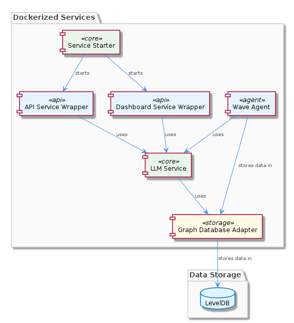
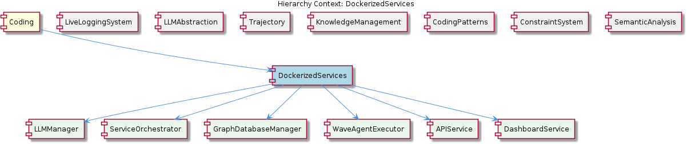

# DockerizedServices

**Type:** Component

[LLM] The DockerizedServices component's architecture is designed to provide a flexible and extensible framework for integrating with various services and components. The use of dependency injection, event-driven programming, and concurrency control mechanisms provides a solid foundation for building complex workflows and handling multiple requests. The component's use of standardized interfaces, such as the API Service Wrapper and Dashboard Service Wrapper, enables easy integration with other components and services, making it easier to extend and modify the component's functionality. Overall, the component's design decisions prioritize flexibility, extensibility, and reliability, making it well-suited for complex, distributed systems.

## What It Is  

The **DockerizedServices** component lives under the `lib/` and `scripts/` directories of the code base. Its core runtime logic is implemented in:

* `lib/llm/llm-service.ts` – the **LLMService** class that orchestrates high‑level LLM operations such as mode routing, caching and provider fallback.  
* `lib/service-starter.js` – the **ServiceStarter** class that supplies a robust, retry‑aware startup sequence for any internal service.  
* `lib/wave-agent.ts` – the **WaveAgent** class that executes “wave‑based” agents using an event‑driven flow.  
* `storage/graph-database-adapter.ts` – the **GraphDatabaseAdapter** that wraps Graphology + LevelDB for persistent graph storage.  
* `scripts/api-service.js` and `scripts/dashboard-service.js` – thin **API Service Wrapper** and **Dashboard Service Wrapper** scripts that launch the constraint‑monitoring API server and its UI dashboard respectively.

Collectively, DockerizedServices provides a **flexible, extensible framework** for coordinating LLM‑driven workflows, persisting execution artefacts, and exposing management APIs—all inside Docker containers that can be started, stopped, and recovered automatically.

## Architecture and Design  

DockerizedServices is built around three tightly coupled architectural choices that surface repeatedly in the source:

1. **Dependency Injection (DI)** – The `LLMService` is injected wherever high‑level LLM capabilities are needed (e.g., in `WaveAgent`). This DI layer decouples concrete provider implementations from the business logic, enabling easy mocking in tests and straightforward swapping of providers (e.g., Anthropic vs. local DMR). The same injection pattern is used by `ServiceOrchestrator` (via `ServiceStarter`) to obtain a ready‑to‑run service instance.

2. **Event‑Driven Execution** – The `WaveAgent` follows a constructor → `ensureLLMInitialized()` → `execute(input)` pattern, where `ensureLLMInitialized` registers asynchronous events that fire once the LLM is ready. This event‑driven approach lets the component accept multiple concurrent requests without blocking the main thread, mirroring the concurrency model used by the sibling **Trajectory** component’s work‑stealing logger.

3. **Concurrency Control & Resilience** – `ServiceStarter` embeds retry loops, configurable timeouts and graceful degradation hooks. The same resilience mindset appears in the lazy initialization of the LLM inside `WaveAgent`, which postpones heavyweight model loading until the first request arrives, thereby reducing start‑up latency.

These patterns are complemented by **Facade/Wrapper** scripts (`api-service.js`, `dashboard-service.js`) that expose a minimal, uniform interface for launching auxiliary services. The wrappers hide Docker‑specific command‑line intricacies and present a clean entry point to the rest of the system, a design decision echoed across the sibling **LiveLoggingSystem** and **ConstraintSystem** components.

## Implementation Details  

### LLM Service Layer (`lib/llm/llm-service.ts`)  
`LLMService` centralises all LLM interactions. It maintains a **provider registry**, selects the appropriate provider based on the requested mode, and applies a **caching layer** to avoid duplicate inference calls. Provider fallback logic is encoded as a chain of responsibility: if the primary provider fails, the service automatically retries with a secondary provider, preserving request continuity.

### Service Startup (`lib/service-starter.js`)  
`ServiceStarter` accepts a service factory, a maximum retry count, and a timeout value. Its `start()` method executes the factory inside a `while` loop, catching exceptions, waiting an exponential back‑off delay, and ultimately invoking a `gracefulDegrade()` callback if the retry budget is exhausted. This guarantees that even flaky downstream services (e.g., the constraint‑monitoring API) do not bring the whole component down.

### Wave Agent Execution (`lib/wave-agent.ts`)  
`WaveAgent` is instantiated with a repository path and a team identifier. The `ensureLLMInitialized()` method registers an **“LLMReady”** event that resolves once `LLMService` reports successful initialization. The `execute(input)` method then emits a **“WaveStart”** event, processes the input through the LLM, persists execution metadata via `GraphDatabaseAdapter`, and finally emits a **“WaveComplete”** event. This event chain enables other listeners (e.g., logging agents) to react without tight coupling.

### Persistence (`storage/graph-database-adapter.ts`)  
The adapter creates a Graphology graph backed by a LevelDB store. It offers CRUD helpers (`addNode`, `addEdge`, `query`) and an **automatic JSON export sync** that writes the current graph state to a JSON file after each mutation. `WaveAgent` calls `addNode`/`addEdge` to record the flow of a wave, making the execution history queryable by downstream analytics or the **KnowledgeManagement** sibling component.

### Service Wrappers (`scripts/api-service.js`, `scripts/dashboard-service.js`)  
Both scripts expose a single `run()` function that spawns the respective Docker container, monitors its health, and wires up the `ServiceStarter` retry logic. They act as **facade objects**, presenting a consistent `start/stop` API to the parent **Coding** component and to orchestration scripts elsewhere in the repository.

### Child Component Mapping  
* **LLMManager** – delegates to `LLMService`.  
* **ServiceOrchestrator** – builds on `ServiceStarter`.  
* **GraphDatabaseManager** – wraps `GraphDatabaseAdapter`.  
* **WaveAgentExecutor** – orchestrates `WaveAgent` lifecycles.  
* **APIService** and **DashboardService** – are the concrete implementations of the wrapper scripts.

## Integration Points  

DockerizedServices sits at the heart of the **Coding** parent node and shares several integration contracts with its siblings:

* **LLMAbstraction** supplies the provider registry that `LLMService` consumes. This ensures that any new LLM provider added at the abstraction layer is instantly usable by DockerizedServices without code changes.  
* **KnowledgeManagement** re‑uses the same `GraphDatabaseAdapter` implementation, guaranteeing a single source of truth for graph persistence across components.  
* **LiveLoggingSystem** and **Trajectory** both emit events that DockerizedServices can listen to (e.g., logging the start/end of a wave). The event‑driven model thus forms a loose‑coupled bus across the entire project.  
* The **APIService** wrapper forwards HTTP requests to the constraint‑monitoring server, which in turn may invoke `WaveAgentExecutor` to run a wave based on incoming constraints. The **DashboardService** consumes the same API for UI rendering, completing the request‑response loop.

All external dependencies are injected through constructor parameters or factory functions, keeping the component testable and replaceable.

## Usage Guidelines  

1. **Instantiate via DI containers** – When adding a new consumer of LLM capabilities, request an `LLMService` instance from the DI container rather than `new LLMService()`. This guarantees that caching and fallback are correctly wired.  
2. **Prefer the ServiceStarter API for any long‑running subprocess** – Wrap custom services (e.g., a new analytics micro‑service) with `new ServiceStarter(factory, {retry:5, timeout:30000})` to inherit the same resilience semantics used throughout DockerizedServices.  
3. **Trigger wave execution through WaveAgentExecutor** – Call `executor.run(repoPath, team, input)`; the executor will internally create a `WaveAgent`, ensure lazy LLM initialization, and persist results via the graph adapter. Do not call `WaveAgent` directly unless you need fine‑grained event handling.  
4. **Persist custom metadata through GraphDatabaseManager** – Use the manager’s `addNode`/`addEdge` helpers with explicit type tags; the automatic JSON export will keep external tools (e.g., the **SemanticAnalysis** component) in sync.  
5. **Start API and Dashboard services only via the wrapper scripts** – Run `node scripts/api-service.js` or `node scripts/dashboard-service.js` to benefit from built‑in health checks and retry logic. Direct Docker commands bypass these safeguards and are discouraged.  

---

### Architectural patterns identified
* Dependency Injection  
* Event‑Driven Programming  
* Retry/Timeout (Resilience) pattern  
* Facade/Wrapper (API & Dashboard services)  
* Lazy Initialization  

### Design decisions and trade‑offs
* **DI** improves testability and provider flexibility but adds a layer of indirection that newcomers must understand.  
* **Event‑driven execution** enables high concurrency but requires careful event naming to avoid collisions across siblings.  
* **Retry/timeout** guarantees availability at the cost of potentially delayed error reporting; exponential back‑off mitigates overload.  
* **Facade wrappers** simplify service launch scripts but hide Docker‑specific parameters, which may limit fine‑tuned performance tuning.  

### System structure insights
DockerizedServices functions as the orchestration hub within the **Coding** parent, coordinating LLM operations, wave‑based agents, and persistence while exposing managed APIs. Its children (LLMManager, ServiceOrchestrator, etc.) each encapsulate a single responsibility, reflecting a clean separation of concerns that mirrors the sibling components’ own modular designs.

### Scalability considerations
* **Horizontal scaling** is feasible because each wave execution is stateless aside from the shared graph store; additional container instances can be added behind a load balancer.  
* The **GraphDatabaseAdapter** relies on LevelDB, which scales well for read‑heavy workloads but may require sharding or migration to a more distributed store if write volume grows dramatically.  
* The retry logic in `ServiceStarter` protects against transient failures but could amplify load spikes; monitoring of retry metrics is recommended.  

### Maintainability assessment
The heavy use of DI and clear façade boundaries makes the codebase **highly maintainable**: new providers, services, or storage back‑ends can be introduced with minimal ripple effects. Event‑driven code is readable thanks to consistent naming (`ensureLLMInitialized`, `execute`, `WaveComplete`). However, the reliance on custom adapters (Graphology + LevelDB) introduces a niche dependency that may require specialized knowledge for future contributors. Overall, the component balances flexibility with disciplined separation of concerns, positioning it well for ongoing evolution.

## Hierarchy Context

### Parent
- [Coding](./Coding.md) -- Root node of the coding project knowledge hierarchy, encompassing all development infrastructure knowledge. The project consists of 8 major components: LiveLoggingSystem: [LLM] The LiveLoggingSystem component utilizes a modular architecture, with separate components for logging, transcript processing, and configuration ; LLMAbstraction: [LLM] The LLMAbstraction component uses a provider-agnostic approach, allowing for easy switching between different LLM providers. This is achieved th; DockerizedServices: [LLM] The DockerizedServices component utilizes dependency injection to manage complex workflows and handle multiple requests efficiently. This is evi; Trajectory: [LLM] The Trajectory component utilizes the SpecstoryAdapter class, defined in lib/integrations/specstory-adapter.js, for logging conversations and ev; KnowledgeManagement: [LLM] The KnowledgeManagement component utilizes a GraphDatabaseAdapter for persistence, which is implemented in the file integrations/mcp-server-sema; CodingPatterns: [LLM] The CodingPatterns component utilizes a graph-based approach for code analysis, as seen in the integrations/code-graph-rag/README.md file, which; ConstraintSystem: [LLM] The ConstraintSystem component utilizes a GraphDatabaseAdapter for persistence, which is implemented in the storage/graph-database-adapter.ts fi; SemanticAnalysis: [LLM] The SemanticAnalysis component employs a multi-agent architecture, utilizing agents such as the OntologyClassificationAgent, SemanticAnalysisAge.

### Children
- [LLMManager](./LLMManager.md) -- LLMManager utilizes the LLMService class in lib/llm/llm-service.ts for high-level LLM operations.
- [ServiceOrchestrator](./ServiceOrchestrator.md) -- ServiceOrchestrator uses the ServiceStarter class in lib/service-starter.js to provide robust service startup with retry, timeout, and graceful degradation.
- [GraphDatabaseManager](./GraphDatabaseManager.md) -- GraphDatabaseManager likely uses Graphology and LevelDB to provide persistence and data storage capabilities.
- [WaveAgentExecutor](./WaveAgentExecutor.md) -- WaveAgentExecutor likely uses a specific constructor and execution pattern to execute wave-based agents.
- [APIService](./APIService.md) -- APIService likely interacts with the constraint monitoring API server to provide easy startup and management.
- [DashboardService](./DashboardService.md) -- DashboardService likely interacts with the constraint monitoring dashboard to provide easy startup and management.

### Siblings
- [LiveLoggingSystem](./LiveLoggingSystem.md) -- [LLM] The LiveLoggingSystem component utilizes a modular architecture, with separate components for logging, transcript processing, and configuration validation. This is evident in the directory structure, where the 'integrations' folder contains subfolders for 'browser-access', 'code-graph-rag', and 'copi', each representing a distinct aspect of the system. For instance, the 'copi' subfolder contains files such as 'INSTALL.md' and 'USAGE.md', which provide installation and usage guidelines for the Copi component. The 'lib/agent-api' folder contains the TranscriptAdapter abstract base class, which is responsible for reading and converting transcripts from different agent formats. The 'scripts' folder contains the LSLConfigValidator, which is used for validating and optimizing LSL configuration. The logging module, located in 'integrations/mcp-server-semantic-analysis/src/logging.ts', provides a unified logging interface and is used throughout the system.
- [LLMAbstraction](./LLMAbstraction.md) -- [LLM] The LLMAbstraction component uses a provider-agnostic approach, allowing for easy switching between different LLM providers. This is achieved through the ProviderRegistry class (lib/llm/provider-registry.js), which manages the different LLM providers and their configurations. For instance, the AnthropicProvider class (lib/llm/providers/anthropic-provider.ts) is used to interact with the Anthropic API, while the DMRProvider class (lib/llm/providers/dmr-provider.ts) is used for local LLM inference. The use of a provider registry enables the component to be highly flexible and scalable, as new providers can be easily added or removed without affecting the overall architecture.
- [Trajectory](./Trajectory.md) -- [LLM] The Trajectory component utilizes the SpecstoryAdapter class, defined in lib/integrations/specstory-adapter.js, for logging conversations and events via Specstory. This class follows a specific pattern of constructor() + initialize() + logConversation() for its initialization and logging functionality. The logConversation() method employs a work-stealing concurrency pattern via a shared atomic index counter, allowing for efficient and concurrent logging of conversations and events.
- [KnowledgeManagement](./KnowledgeManagement.md) -- [LLM] The KnowledgeManagement component utilizes a GraphDatabaseAdapter for persistence, which is implemented in the file integrations/mcp-server-semantic-analysis/src/storage/graph-database-adapter.ts. This adapter provides an interface for agents to interact with the central Graphology + LevelDB knowledge graph. The adapter also includes automatic JSON export sync, ensuring that the knowledge graph remains up-to-date. Furthermore, the migrateGraphDatabase script, located in scripts/migrate-graph-db-entity-types.js, is used to update entity types in the live LevelDB/Graphology database, demonstrating a clear focus on data consistency and integrity.
- [CodingPatterns](./CodingPatterns.md) -- [LLM] The CodingPatterns component utilizes a graph-based approach for code analysis, as seen in the integrations/code-graph-rag/README.md file, which describes the Graph-Code RAG system. This system is used for graph-based code analysis and implies the use of graph structures and algorithms within the CodingPatterns component. The entity validation is performed by the EntityValidator class in integrations/mcp-server-semantic-analysis/src/agents/ontology-classification-agent.ts, suggesting a structured approach to validating entities within the coding patterns. Furthermore, the batch processing pipeline is defined in integrations/mcp-server-semantic-analysis/src/agents/ontology-classification-agent.ts, indicating that the CodingPatterns component may leverage batch processing for efficient handling of coding pattern analysis.
- [ConstraintSystem](./ConstraintSystem.md) -- [LLM] The ConstraintSystem component utilizes a GraphDatabaseAdapter for persistence, which is implemented in the storage/graph-database-adapter.ts file. This adapter enables the system to store and retrieve graph structures using Graphology and LevelDB, with automatic JSON export sync. The use of Graphology allows for efficient graph operations, while LevelDB provides a robust and scalable storage solution. The GraphDatabaseAdapter class in storage/graph-database-adapter.ts is responsible for managing the graph database, including creating and deleting graphs, as well as handling graph queries. The automatic JSON export sync feature ensures that the graph data is consistently updated and available for other components to access.
- [SemanticAnalysis](./SemanticAnalysis.md) -- [LLM] The SemanticAnalysis component employs a multi-agent architecture, utilizing agents such as the OntologyClassificationAgent, SemanticAnalysisAgent, and CodeGraphAgent, to perform tasks such as code analysis, ontology classification, and insight generation. The OntologyClassificationAgent, for instance, is implemented in the file integrations/mcp-server-semantic-analysis/src/agents/ontology-classification-agent.ts and is responsible for classifying observations against the ontology system. This agent-based approach allows for a modular and scalable design, enabling the component to handle large-scale codebases and provide meaningful insights.

---

*Generated from 6 observations*
