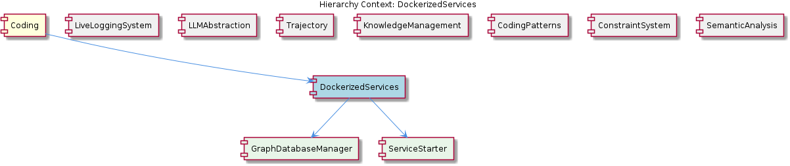

# DockerizedServices

**Type:** Component

[LLM] The ProcessStateManager (scripts/process-state-manager.js) is used to manage and register child processes with the Global Service Coordinator. The ProcessStateManager class is responsible for managing the lifecycle of child processes, including starting and stopping them, and registering them with the Global Service Coordinator. The ProcessStateManager is used by the ServiceStarter class to start and stop services, and it provides a way to manage the lifecycle of child processes in a centralized way. For example, the startProcess function in scripts/process-state-manager.js is used to start a child process, and the stopProcess function is used to stop a child process. The ProcessStateManager also provides a way to register child processes with the Global Service Coordinator, which allows the component to keep track of all running child processes.

## What It Is  

The **DockerizedServices** component lives under the top‑level source tree of the *Coding* project and is the container for three concrete sub‑components: **LLMService** (`lib/llm/llm-service.ts`), **BrowserAccess** (described in `integrations/browser-access/README.md`) and **CodeGraphRAG** (described in `integrations/code-graph-rag/README.md`).  
Its primary responsibility is to expose a **high‑level façade** for all Large‑Language‑Model (LLM) interactions while also orchestrating the lifecycle of the auxiliary services that run inside the Docker environment. The façade is embodied by the `LLMService` class, which receives every external request, decides which provider should handle it, and delegates the work downstream. Supporting this façade are a set of infrastructure helpers – a `ProviderRegistry`, a `CircuitBreaker`, a `ServiceStarter` that implements retry‑with‑back‑off, and a `ProcessStateManager` that registers child processes with the Global Service Coordinator. Persistence of the knowledge graph that backs the LLM calls is abstracted through a **GraphDatabaseAdapter** (inferred to exist at `lib/db/graph-database-adapter.js`).  

Together these pieces give DockerizedServices a clear separation between request routing, provider selection, fault tolerance, and process orchestration, making it the “engine room” for any LLM‑driven workflow that runs inside the Dockerized environment.

---

## Architecture and Design  

### Facade & Registry  
`LLMService` acts as a **Facade** (see `lib/llm/llm-service.ts`) that hides the complexity of mode resolution, provider fallback and health‑checking from callers. Internally it consults the **ProviderRegistry** (`lib/llm/provider-registry.js`), a classic **Registry pattern**, to look up the concrete provider implementation (mock, local, public) that matches the requested mode. The registry also encodes provider priority, ensuring that higher‑priority providers are tried first and that a fallback chain is automatically honoured.

### Adapter & Persistence  
Although the `GraphDatabaseAdapter` source file is not listed, the observation explicitly calls it out as the abstraction over a **Graphology + LevelDB** store. This is an **Adapter pattern** that isolates the rest of the component from the particulars of the underlying graph database and supplies the automatic JSON export‑sync feature that is critical for backup and recovery of sensitive LLM‑generated data.

### Resilience Patterns  
Two well‑known resilience mechanisms are baked into the design:

* **Circuit Breaker** – implemented in `lib/llm/circuit-breaker.js`. The `isCircuitOpen` method guards outbound calls to a provider, while `resetTimeout` handles the transition back to a closed state after a cooldown period. This prevents a single failing provider from cascading failures throughout DockerizedServices.  
* **Retry‑with‑Back‑off** – realized in `lib/service-starter.js`. The `startService` function retries a failed service start with exponentially increasing delays, protecting the system from endless loops and allowing graceful degradation when optional services cannot be launched.

### Process Coordination  
`ProcessStateManager` (`scripts/process-state-manager.js`) centralises child‑process lifecycle management. Its `startProcess` / `stopProcess` APIs register each spawned process with the **Global Service Coordinator**, giving the rest of the system a single source of truth for “what is running”. This mirrors the **Supervisor** role often found in container orchestration layers.

### Relationship to the Rest of the System  
DockerizedServices sits under the **Coding** root component and shares architectural DNA with its siblings. For example, the **LLMAbstraction** sibling also uses dependency injection in its own `LLMService` implementation, reinforcing the idea that providers can be swapped or mocked. The **KnowledgeManagement** sibling supplies the same Graphology+LevelDB stack that the inferred `GraphDatabaseAdapter` wraps, while **Trajectory** demonstrates an adapter‑based integration (SpecstoryAdapter) that is conceptually similar to how DockerizedServices isolates its database behind an adapter. This commonality makes cross‑component collaboration straightforward.

---

## Implementation Details  

### `LLMService` (`lib/llm/llm-service.ts`)  
* **Entry Point** – The public method `handleRequest(request)` receives a normalized request object.  
* **Mode Routing** – It extracts the requested mode (e.g., *chat*, *completion*, *embedding*) and asks the `ProviderRegistry` for the best‑matched provider.  
* **Provider Delegation** – Once a provider instance is obtained, `LLMService` forwards the request, wrapping the call in a `CircuitBreaker` check. If the circuit is open, the request is short‑circuited to the next provider in the priority list.  
* **Event Emission** – The class extends `EventEmitter` (as noted in the LLMAbstraction sibling), emitting lifecycle events such as `initialized`, `request-start`, and `request-complete`, which other components can listen to for logging or metrics.

### `ProviderRegistry` (`lib/llm/provider-registry.js`)  
* **Registration** – `registerProvider(name, providerInstance, priority)` stores providers in an internal map keyed by name and ordered by priority.  
* **Lookup** – `getProvider(name)` returns the highest‑priority provider that matches the requested name or mode. The registry also exposes `listProviders()` for introspection, useful for debugging or health dashboards.  

### `CircuitBreaker` (`lib/llm/circuit-breaker.js`)  
* **State Machine** – Tracks three states: *closed*, *open*, and *half‑open*.  
* **Health Monitoring** – Counts consecutive failures; once a threshold is reached, `isCircuitOpen` flips the state to *open* and starts a timeout.  
* **Recovery** – `resetTimeout` schedules a transition to *half‑open* after the cooldown, allowing a probe request to test the provider’s health before fully closing the circuit again.

### `ServiceStarter` (`lib/service-starter.js`)  
* **Retry Logic** – `startService(service, options)` attempts to start the supplied service. On failure it waits `baseDelay * 2^attempt` milliseconds (capped by a max delay) before retrying, up to a configurable maxAttempts.  
* **Graceful Degradation** – If the service is optional and maxAttempts are exhausted, the function returns a sentinel value rather than throwing, letting the rest of DockerizedServices continue operating.

### `ProcessStateManager` (`scripts/process-state-manager.js`)  
* **Process Lifecycle** – `startProcess(command, args, options)` spawns a child process, records its PID, and registers it with the Global Service Coordinator via an IPC channel.  
* **Shutdown Coordination** – `stopProcess(pid)` sends a termination signal, removes the registration, and ensures any dependent services are notified.  
* **State Persistence** – The manager keeps an in‑memory map of active processes that can be dumped to a JSON file for post‑mortem analysis, aligning with the automatic JSON export sync described for the GraphDatabaseAdapter.

### `GraphDatabaseAdapter` (inferred, `lib/db/graph-database-adapter.js`)  
* **Adapter Interface** – Exposes `saveNode(node)`, `getNode(id)`, `query(criteria)` and `exportToJson(filePath)`.  
* **Underlying Store** – Internally uses Graphology for in‑memory graph operations and LevelDB for durable storage. The export‑sync feature periodically writes the whole graph to a JSON snapshot, providing a quick recovery path if the LevelDB files become corrupted.

---

## Integration Points  

1. **Provider Ecosystem** – The `ProviderRegistry` is populated by the **LLMAbstraction** sibling (which provides mock, local, and public provider implementations). DockerizedServices can therefore reuse the same provider binaries without duplication.  

2. **Knowledge Graph** – The `GraphDatabaseAdapter` directly consumes the Graphology+LevelDB stack that the **KnowledgeManagement** sibling maintains. Any updates performed by `LLMService` (e.g., storing embeddings or conversation metadata) are instantly visible to KnowledgeManagement’s query layer.  

3. **Process Supervision** – `ProcessStateManager` registers child processes with the **Global Service Coordinator**, a cross‑component orchestrator that also tracks services started by **LiveLoggingSystem** and **Trajectory**. This shared coordinator enables system‑wide health dashboards and coordinated shutdowns.  

4. **BrowserAccess & CodeGraphRAG** – Both child integrations are launched as separate processes via `ServiceStarter` and tracked by `ProcessStateManager`. They expose HTTP or IPC endpoints that `LLMService` may call (e.g., to fetch code snippets for retrieval‑augmented generation).  

5. **Circuit Breaker & Retry** – The resilience layer is used not only for LLM providers but also for external services such as BrowserAccess. If a browser‑automation container becomes unresponsive, the circuit breaker will short‑circuit further calls while `ServiceStarter` attempts to restart it with exponential back‑off.  

6. **Event Bus** – Because `LLMService` inherits from `EventEmitter`, sibling components (e.g., **LiveLoggingSystem**) can subscribe to request‑level events for logging, metrics collection, or dynamic throttling.

---

## Usage Guidelines  

* **Always go through `LLMService`** – Treat `LLMService.handleRequest` as the sole public API for any LLM‑related operation. Directly invoking providers or the database bypasses the circuit‑breaker and retry logic and is discouraged.  

* **Register providers early** – During application bootstrap, call `ProviderRegistry.registerProvider` for each implementation you intend to use. Assign sensible priority values; a typical ordering is *public* > *local* > *mock*.  

* **Respect the circuit‑breaker contract** – Do not manually reset the circuit state; let `CircuitBreaker` manage it. If you need to override thresholds for testing, expose them via a configuration object passed to `LLMService` at construction time.  

* **Start optional services with `ServiceStarter`** – When adding a new child process (e.g., a custom RAG service), wrap its launch in `ServiceStarter.startService`. Configure `maxAttempts` and `baseDelay` according to the service’s expected startup time to avoid unnecessary back‑off delays.  

* **Persist graph changes via the adapter** – All mutations to the knowledge graph should be performed through the `GraphDatabaseAdapter`. This guarantees that the automatic JSON export sync runs, preserving data integrity across container restarts.  

* **Monitor events** – Subscribe to `LLMService` events (`request-start`, `request-failure`, `circuit-open`) for observability. The same events are emitted by sibling components, enabling a unified logging pipeline (as used by LiveLoggingSystem).  

* **Graceful shutdown** – On container termination, invoke `ProcessStateManager.stopAll()` (or iterate over registered PIDs) before exiting. This ensures the Global Service Coordinator receives the final state and can clean up any lingering resources.

---

### 1. Architectural patterns identified  

| Pattern | Where it appears | Purpose |
|---------|------------------|---------|
| **Facade** | `LLMService` (`lib/llm/llm-service.ts`) | Provides a single, high‑level entry point for all LLM operations. |
| **Registry** | `ProviderRegistry` (`lib/llm/provider-registry.js`) | Centralises provider instances and priority rules. |
| **Adapter** | `GraphDatabaseAdapter` (inferred `lib/db/graph-database-adapter.js`) | Decouples the component from the concrete Graphology + LevelDB store and adds JSON export sync. |
| **Circuit Breaker** | `CircuitBreaker` (`lib/llm/circuit-breaker.js`) | Prevents cascading failures when a provider becomes unresponsive. |
| **Retry‑with‑Back‑off** | `ServiceStarter` (`lib/service-starter.js`) | Handles transient startup failures for optional services. |
| **Supervisor / Process Registry** | `ProcessStateManager` (`scripts/process-state-manager.js`) | Tracks child processes and registers them with the Global Service Coordinator. |
| **Event‑Driven** | `LLMService` extends `EventEmitter` (inherited from sibling LLMAbstraction) | Enables loose coupling for logging, metrics, and external reaction to lifecycle events. |

---

### 2. Design decisions and trade‑offs  

* **Single façade vs. direct provider calls** – Centralising all LLM traffic through `LLMService` simplifies routing and fault‑tolerance but adds a small indirection overhead. The trade‑off is worthwhile for the consistency and testability it yields.  
* **Provider priority list** – By encoding priority in the registry, the system can automatically fall back to cheaper or more reliable providers. However, mis‑configured priorities could lead to sub‑optimal cost usage or unexpected latency.  
* **Circuit breaker granularity** – The breaker is applied per‑provider rather than per‑request type, which reduces complexity but may mask failures that only affect a subset of operations (e.g., embeddings vs. completions).  
* **Retry‑with‑Back‑off on service start** – This protects the container from hanging on a mis‑behaving optional service, but if the back‑off parameters are too aggressive the system may give up on a service that would have recovered quickly. Configurability is therefore essential.  
* **Process registration with a global coordinator** – Gives a holistic view of the system state, but introduces a single point of coordination; the coordinator must be highly available and performant.  

---

### 3. System structure insights  

DockerizedServices is a **layered orchestration hub**:  

1. **Presentation layer** – `LLMService.handleRequest` (facade).  
2. **Routing layer** – `ProviderRegistry` decides which concrete implementation to invoke.  
3. **Resilience layer** – `CircuitBreaker` and `ServiceStarter` protect against provider and service failures.  
4. **Persistence layer** – `GraphDatabaseAdapter` abstracts the graph store, providing automatic JSON sync.  
5. **Process‑management layer** – `ProcessStateManager` registers all child processes with the Global Service Coordinator, enabling cross‑component visibility.  

Each layer communicates through well‑defined interfaces (e.g., `getProvider`, `saveNode`, `startProcess`), keeping the overall system loosely coupled and allowing individual layers to evolve independently.

---

### 4. Scalability considerations  

* **Horizontal scaling of providers** – Because providers are selected at runtime via the registry, multiple instances of a “public” provider can be added behind a load balancer without changing DockerizedServices code. The registry can be extended to return a round‑robin list of healthy instances.  
* **Circuit breaker per provider** – Allows the system to continue serving requests using healthy providers while isolating the failing ones, supporting graceful degradation under load spikes.  
* **Back‑off parameters** – Exponential back‑off prevents thundering‑herd problems when many containers attempt to restart a failing optional service simultaneously.  
* **Graph database sharding** – The `GraphDatabaseAdapter` abstracts the underlying store, making it feasible to replace the single LevelDB instance with a sharded or replicated Graphology backend if the knowledge graph grows beyond a single node’s capacity.  
* **Process supervision** – `ProcessStateManager` can be extended to spawn multiple instances of BrowserAccess or CodeGraphRAG, each registered separately, enabling parallel processing of RAG queries.  

---

### 5. Maintainability assessment  

* **Clear separation of concerns** – Each responsibility (routing, provider management, resilience, persistence, process supervision) lives in its own module, which simplifies unit testing and future refactoring.  
* **Explicit registration APIs** – `ProviderRegistry.registerProvider` and `ProcessStateManager.startProcess` make the system’s extensibility surface obvious; new providers or child services can be added with minimal code churn.  
* **Event‑driven hooks** – By emitting lifecycle events, `LLMService` allows logging, metrics, and other cross‑cutting concerns to be implemented in separate listeners, reducing code duplication.  
* **Consistent naming and file placement** – All LLM‑related helpers reside under `lib/llm/`, while process‑management lives under `scripts/`, making navigation intuitive for developers familiar with sibling components.  
* **Potential hidden coupling** – The inferred `GraphDatabaseAdapter` is not present in the observed file list, so developers must ensure its contract stays stable; otherwise, changes to the underlying Graphology+LevelDB implementation could ripple into LLMService logic.  
* **Documentation dependencies** – Several key pieces (e.g., the exact shape of the provider interface, the JSON export sync schedule) are described only

## Diagrams

### Relationship

## Architecture Diagrams

## Hierarchy Context

### Parent
- [Coding](./Coding.md) -- Root node of the coding project knowledge hierarchy, encompassing all development infrastructure knowledge. The project consists of 8 major components: LiveLoggingSystem: [LLM] The LiveLoggingSystem component utilizes lazy LLM initialization, as seen in the integrations/mcp-server-semantic-analysis/src/agents/ontology-c; LLMAbstraction: [LLM] The LLMAbstraction component's architecture is designed with dependency injection in mind, as seen in the LLMService class (lib/llm/llm-service.; DockerizedServices: [LLM] The DockerizedServices component utilizes a high-level facade for LLM operations, with the LLMService (lib/llm/llm-service.ts) acting as the sin; Trajectory: [LLM] The Trajectory component utilizes the SpecstoryAdapter in lib/integrations/specstory-adapter.js for logging conversations via Specstory, demonst; KnowledgeManagement: The KnowledgeManagement component is responsible for managing the knowledge graph, which includes storing, querying, and updating entities and relatio; CodingPatterns: [LLM] The CodingPatterns component utilizes a modular approach to hook management, as seen in the HookConfigLoader class in lib/agent-api/hooks/hook-c; ConstraintSystem: [LLM] The ConstraintSystem component's architecture is designed to be modular and scalable, with multiple sub-components working together to validate ; SemanticAnalysis: [LLM] The SemanticAnalysis component employs a modular architecture with various agents, each responsible for a specific task, such as ontology classi.

### Children
- [LLMService](./LLMService.md) -- The LLMService class in lib/llm/llm-service.ts handles incoming requests and delegates the work to the corresponding provider.
- [BrowserAccess](./BrowserAccess.md) -- The BrowserAccess MCP server is described in integrations/browser-access/README.md.
- [CodeGraphRAG](./CodeGraphRAG.md) -- The CodeGraphRAG system is described in integrations/code-graph-rag/README.md.

### Siblings
- [LiveLoggingSystem](./LiveLoggingSystem.md) -- [LLM] The LiveLoggingSystem component utilizes lazy LLM initialization, as seen in the integrations/mcp-server-semantic-analysis/src/agents/ontology-classification-agent.ts file, which defines the OntologyClassificationAgent class. This approach enables the system to handle diverse log data and ensures data consistency. The use of lazy initialization allows for more efficient resource allocation and improves the overall performance of the system. Furthermore, the LoggingMechanism in integrations/mcp-server-semantic-analysis/src/logging.ts employs async buffering and non-blocking file I/O to prevent event loop blocking, ensuring that the logging process does not interfere with other system operations.
- [LLMAbstraction](./LLMAbstraction.md) -- [LLM] The LLMAbstraction component's architecture is designed with dependency injection in mind, as seen in the LLMService class (lib/llm/llm-service.ts), which allows for the incorporation of various trackers and classifiers. This design decision enables a high degree of flexibility and testability, as different components can be easily swapped out or mocked. For instance, the budget tracker and sensitivity classifier can be replaced with mock implementations for testing purposes. The use of dependency injection also facilitates the addition of new providers, as the core service logic remains unchanged. The LLMService class extends EventEmitter, which provides a way to handle initialization, mode resolution, and completion requests in an event-driven manner.
- [Trajectory](./Trajectory.md) -- [LLM] The Trajectory component utilizes the SpecstoryAdapter in lib/integrations/specstory-adapter.js for logging conversations via Specstory, demonstrating an adapter pattern for integration with different tools and services. This adapter pattern allows for a standardized interface to interact with various extensions, such as Specstory, facilitating the addition of new integrations with minimal modifications to the existing codebase. The SpecstoryAdapter class, specifically, employs connection methods in order of preference, starting with HTTP, then IPC, and finally file watch, as seen in the connectViaHTTP, connectViaIPC, and connectViaFileWatch methods. This approach ensures that the most efficient and reliable connection method is used, while providing fallback options in case of failures.
- [KnowledgeManagement](./KnowledgeManagement.md) -- The KnowledgeManagement component is responsible for managing the knowledge graph, which includes storing, querying, and updating entities and relationships. It utilizes a Graphology+LevelDB database for persistence and provides a JSON export sync feature. The component's architecture is designed to handle concurrent access and provides an intelligent routing mechanism for storing and retrieving data. Key patterns include the use of adapters for database interactions, lazy initialization of LLM (Large Language Model) providers, and work-stealing concurrency for efficient data processing.
- [CodingPatterns](./CodingPatterns.md) -- [LLM] The CodingPatterns component utilizes a modular approach to hook management, as seen in the HookConfigLoader class in lib/agent-api/hooks/hook-config.js. This class loads and merges hook configurations, allowing for a flexible and scalable hook system. The ensureLLMInitialized() method in base-agent.ts further promotes efficient resource utilization by ensuring lazy LLM initialization. This pattern is also observed in the Wave agents, which follow a consistent structure for agent implementation, comprising a constructor, ensureLLMInitialized(), and execute() method.
- [ConstraintSystem](./ConstraintSystem.md) -- [LLM] The ConstraintSystem component's architecture is designed to be modular and scalable, with multiple sub-components working together to validate code actions and file operations. For example, the ContentValidationAgent (integrations/mcp-server-semantic-analysis/src/agents/content-validation-agent.ts) is responsible for validating entity content against the current codebase, while the HookConfigLoader (lib/agent-api/hooks/hook-config.js) loads and merges hook configurations from multiple sources. This modular design allows for easy maintenance and extension of the system.
- [SemanticAnalysis](./SemanticAnalysis.md) -- [LLM] The SemanticAnalysis component employs a modular architecture with various agents, each responsible for a specific task, such as ontology classification, semantic analysis, and content validation. The OntologyClassificationAgent, located in integrations/mcp-server-semantic-analysis/src/agents/ontology-classification-agent.ts, is responsible for classifying observations against the ontology system. This agent utilizes the LLMService, found in lib/llm/dist/index.js, for large language model operations, such as text generation and classification. The GraphDatabaseAdapter, located in storage/graph-database-adapter.js, is used for interacting with the graph database, which stores knowledge entities and their relationships.

---

*Generated from 6 observations*
