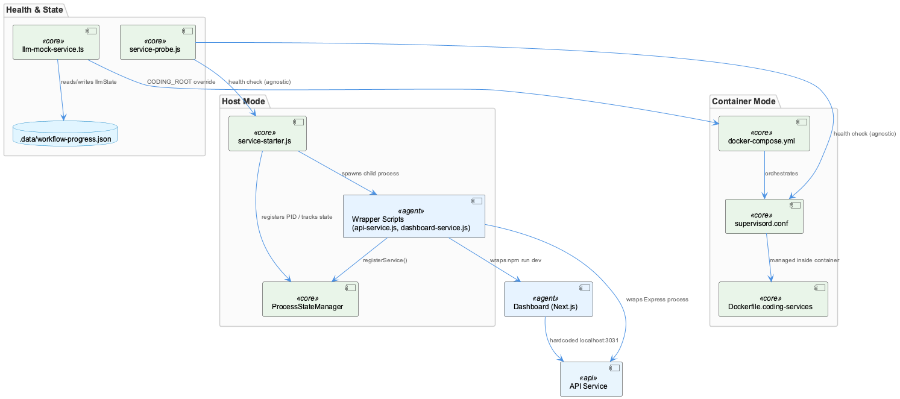
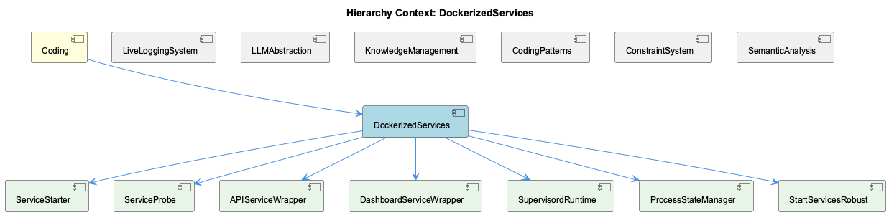

# DockerizedServices

**Type:** Component

[LLM] The health-check subsystem enforces a strict invariant (documented as SPEC R6) that probing functions in service-probe.js—probeHttpHealth() and probeTcpPort()—must never report a 'healthy' status directly. Instead, these functions only distinguish between 'stopped' (connection refused, timeout, or non-2xx HTTP response) and 'unknown' (configuration errors, malformed URLs, or unresolvable hosts). This is a deliberate architectural choice: liveness probes are pessimistic by design, and the actual determination of 'healthy' is deferred to a higher-level coordinator that combines probe results with other signals (e.g., process registration state from ProcessStateManager). New developers extending probe logic must preserve this three-state contract rather than optimistically returning 'healthy' from a probe function, since downstream consumers (the health-coordinator) rely on the absence of false positives here.

# DockerizedServices: Technical Insight Document

## What It Is

DockerizedServices is the infrastructure component within the Coding project responsible for orchestrating, health-checking, and containerizing the system's runtime services. It spans a set of concrete implementation files: `lib/service-starter.js` (retry/backoff orchestration), `service-probe.js` (liveness probing), `process-state-manager.js` (global process tracking), `llm-mock-service.ts` (cross-boundary LLM mode state), and the Docker packaging layer itself — `docker/docker-compose.yml`, `Dockerfile.coding-services`, `entrypoint.sh`, and `supervisord.conf`. Wrapper scripts under `scripts/` (`api-service.js`, `dashboard-service.js`) tie these pieces together by spawning and registering real backend processes (Express's `dashboard-server.js` on port 3031, Next.js's dev server on port 3030).

As the parent of ServiceStarter, ServiceProbe, ProcessStateManager, LLMMockService, DockerEntrypoint, StartServicesRobust, and ServiceWrapperScripts, DockerizedServices functions as the umbrella for "how services get started, watched, and packaged" across both native host execution and containerized Docker execution — a duality that recurs throughout its design.

## Architecture and Design

The component's defining architectural trait is a strict separation between *pessimistic detection* and *optimistic determination*. SPEC R6, enforced in `service-probe.js`, mandates that `probeHttpHealth()` and `probeTcpPort()` never report "healthy" — only "stopped" or "unknown" — deferring true health determination to a higher-level health-coordinator that combines probe results with ProcessStateManager's registration state. This same pessimism-by-design philosophy echoes down into DockerEntrypoint, whose `wait_for_service()` TCP-probes Qdrant and Redis but explicitly returns success regardless of outcome ("Don't fail — let supervisord handle it"), pushing real health determination further downstream still.

A second major architectural decision is bundling multiple independent Node/Next.js services plus datastores (Redis, Memgraph) into a single Docker image using supervisord as an in-container process manager, rather than the conventional one-process-per-container model. This trades Docker/Kubernetes-native process supervision for deployment simplicity, shifting the burden of restart policy and log multiplexing onto `entrypoint.sh` and `supervisord.conf`.

A third recurring pattern is externalized, file-based state sharing across the host/container boundary — seen both in `llm-mock-service.ts` (LLM mode persisted in `.data/workflow-progress.json`, path-resolved via `CODING_ROOT`) and in DockerEntrypoint's consumption of a host-written `/coding/.coding/runtime/features.json` snapshot, translated into supervisord include files. Both avoid independent state derivation on each side of the boundary, preventing drift.

## Implementation Details

ServiceStarter's `startServiceWithRetry()` implements a three-layer resilience wrapper: an outer retry loop (default `maxRetries=3`) with exponential backoff (`retryDelay * 2^(attempt-1)`), an inner `withDeadline()` timeout guard applied separately to the start call (30000ms default) and health check call (10000ms hardcoded), and post-failure cleanup that SIGTERMs then SIGKILLs unhealthy children before retrying. Critically, `withDeadline()` wraps `Promise.race()` and clears its timer in a `finally` block regardless of which promise wins — avoiding the classic Node.js dangling-timer leak that would otherwise accumulate across retry attempts and hang test runners or CLIs. ServiceStarter also distinguishes "required" from "optional" services, letting the system boot even if a service like graphify fails.

ServiceWrapperScripts (`api-service.js`, `dashboard-service.js`) follow a consistent spawn-register-unregister pattern: each spawns a real backend child process, registers it with ProcessStateManager's `ProcessStateManager` class for global visibility, and unregisters on exit — giving a Global Service Coordinator system-wide process visibility without bespoke IPC. `dashboard-service.js` additionally injects `NEXT_PUBLIC_API_BASE_URL` into the child environment, illustrating environment-variable-based cross-service wiring rather than service discovery.

DockerEntrypoint's feature-gating logic embeds a `node -e` snippet that treats any value other than `false` as enabled — a deliberate fail-open default ensuring older host snapshots never accidentally disable new features.

## Integration Points

ServiceProbe's three-state output feeds a higher-level health-coordinator that also consumes ProcessStateManager's registration state — the two children compose to produce actual health determination. ServiceStarter's health-check calls likely invoke ServiceProbe functions under its `withDeadline()` timeout guard. LLMMockService's mode-state file is read identically by host-run and Dockerized processes, coupling it to DockerEntrypoint's analogous host/container state-sharing pattern. Port configuration (3030/3031) is environment-driven across ServiceWrapperScripts, aligning with `CODING_ROOT`-aware path resolution so services behave identically whether run natively or inside docker-compose's network namespace, where hostnames/ports may be remapped.

Within the broader Coding hierarchy, DockerizedServices sits alongside LLMAbstraction, LiveLoggingSystem, KnowledgeManagement, ConstraintSystem, SemanticAnalysis, and CodingPatterns; it shares with LLMAbstraction the same mock/local/public mode machinery (`llm-mock-service.ts`) and echoes CodingPatterns' cross-cutting conventions like `*Manager`-suffixed classes (ProcessStateManager) and config-driven behavior.

## Usage Guidelines

Developers extending probe logic must preserve ServiceProbe's three-state contract (SPEC R6) — never optimistically return "healthy" from a probe function, since the health-coordinator relies on the absence of false positives. Anyone adding retry/timeout logic should model new code on ServiceStarter's `withDeadline()` pattern, always clearing timers in a `finally` block to avoid event-loop leaks. New service wrappers should follow ServiceWrapperScripts' spawn/register/unregister convention against ProcessStateManager rather than inventing bespoke tracking. Because ports and paths are environment-driven, new services should avoid hardcoding host/port values and instead support override via environment variables, consistent with the CODING_ROOT/container-path duality baked into LLMMockService and DockerEntrypoint. Finally, remember that supervisord-based bundling in the Docker layer means restart/log-multiplexing behavior lives in `entrypoint.sh`/`supervisord.conf`, not in Docker/Kubernetes primitives — changes to service supervision must be made there.

## Hierarchy Context

### Parent
- [Coding](./Coding.md) -- Root node of the coding project knowledge hierarchy, encompassing all development infrastructure knowledge. The project consists of 7 major components: LiveLoggingSystem: [LLM] The LiveLoggingSystem's configuration validation is centralized in scripts/validate-lsl-config.js through the LSLConfigValidator class, which ac; LLMAbstraction: LLMAbstraction provides a provider-agnostic interface over multiple LLM backends (Anthropic, OpenAI, Groq, and local Docker Model Runner) enabling tie; DockerizedServices: [LLM] The health-check subsystem enforces a strict invariant (documented as SPEC R6) that probing functions in service-probe.js—probeHttpHealth() and ; KnowledgeManagement: [LLM] The KnowledgeManagement component centers on the VKB (Virtual Knowledge Base) server, which acts as the primary interface for storing, querying,; CodingPatterns: CodingPatterns serves as a catch-all component for general programming wisdom, design patterns, conventions, and best practices that are applied acros; ConstraintSystem: [LLM] The ConstraintSystem's configuration architecture follows a strict two-tier layered merge pattern implemented in HookConfigLoader (lib/agent-api; SemanticAnalysis: SemanticAnalysis is a multi-agent pipeline (integrations/semantic-analysis/src/agents/) that processes git history and LSL session data to extract, cl.

### Children
- [ServiceStarter](./ServiceStarter.md) -- [LLM] The core resilience primitive in lib/service-starter.js is withDeadline(), which wraps Promise.race() around a work promise and a timeout-rejecting promise, then clears the timer in a finally block regardless of which promise wins. This is not the naive Promise.race() pattern seen in many codebases — the naive version leaves the losing setTimeout timer armed on the event loop even after the work promise resolves, which is a classic cause of hung Node.js processes (a test runner or one-shot CLI that never exits cleanly, or a long-lived service that leaks a timer handle per retry attempt). startServiceWithRetry() calls withDeadline() twice per attempt (once wrapping startFn() with the attempt's `timeout` option, once wrapping healthCheckFn() with a hardcoded 10000ms), so the leak-avoidance matters doubly under the exponential-backoff retry loop where dozens of timers could otherwise accumulate across maxRetries attempts.
- [ServiceProbe](./ServiceProbe.md) -- [LLM] service-starter.js's startServiceWithRetry() (lib/service-starter.js) implements a three-layer resilience wrapper around arbitrary async start/health-check function pairs: an outer retry loop (default maxRetries=3) with exponential backoff (retryDelay * 2^(attempt-1)), an inner withDeadline() timeout guard applied separately to both the start call and the health check call (30000ms and 10000ms respectively by default), and post-failure cleanup that SIGTERMs then SIGKILLs an unhealthy child process before the next attempt. The withDeadline() helper is deliberately written with a try/finally that calls clearTimeout(timer) regardless of whether the race was won by the work or the timer — the accompanying comment explains this exists specifically to avoid leaving a dangling setTimeout handle that would hold the Node.js event loop open in short-lived callers like test runners or one-shot CLIs, even though in the long-lived service-starter context itself the leak would be invisible.
- [ProcessStateManager](./ProcessStateManager.md) -- [CGR] ProcessStateManager (class) in process-state-manager.js
- [LLMMockService](./LLMMockService.md) -- [LLM] The docker/entrypoint.sh script implements a feature-gating override mechanism that reads a host-written snapshot (/coding/.coding/runtime/features.json) and translates it into supervisord include files at /etc/supervisor/features.d/disabled.conf. This is architecturally significant because the container cannot run the feature resolver itself — ~/.coding/features.yaml lives on the host and is never mounted — so the container is forced into a consumer role, trusting a flattened JSON artifact rather than re-deriving policy. The `enabled` check inside the embedded `node -e` snippet explicitly treats any value other than `false` (including an unknown/missing key) as enabled, which is a deliberate fail-open default: an older host snapshot that predates a new feature must never accidentally disable it. This mirrors the LLM mock/local/public mode design in llm-mock-service.ts, where cross-boundary state (host vs container) is persisted in a shared file artifact rather than derived independently on each side, avoiding drift between host and containerized views of the same configuration.
- [DockerEntrypoint](./DockerEntrypoint.md) -- [LLM] entrypoint.sh implements a two-phase startup gate before ever invoking supervisord: a `wait_for_service()` loop that TCP-probes Qdrant and Redis via `/dev/tcp/$host/$port` bash pseudo-device redirection, followed by unconditional `return 0` regardless of success — the comment 'Don't fail - let supervisord handle it' makes explicit that this is a best-effort readiness delay, not a hard dependency gate. This mirrors the three-state pessimism described in the parent SPEC R6 invariant (service-probe.js never asserts 'healthy'), except here entrypoint.sh doesn't even distinguish stopped/unknown — it just logs a warning and proceeds, pushing all real health determination downstream to supervisord's own restart policy and, ultimately, the health-coordinator.
- [StartServicesRobust](./StartServicesRobust.md) -- [LLM] lib/service-starter.js implements withDeadline() as a wrapper around Promise.race() specifically to solve a Node.js event-loop hygiene problem: when the wrapped work promise resolves before the timeout, the setTimeout timer created for the race is not automatically cancelled by Promise.race() itself. withDeadline() addresses this in a try/finally block that unconditionally calls clearTimeout(timer) regardless of whether the race was won by the work or the timeout. This is not a cosmetic detail — an uncleared timer keeps Node's event loop alive for the full duration of `ms`, which in startServiceWithRetry() is used twice per attempt (once with the caller-supplied `timeout` for startFn(), once hardcoded to 10000ms for healthCheckFn()), meaning a naive implementation would leave up to two dangling timers per retry attempt across `maxRetries` attempts, compounding into significant delayed-exit behavior for any process (test runner, CLI) that invokes this module and expects clean shutdown.
- [ServiceWrapperScripts](./ServiceWrapperScripts.md) -- api-service.js spawns `node src/dashboard-server.js` inside integrations/constraint-monitor with stdio:'inherit', propagating PORT and DASHBOARD_PORT env vars into the child

### Siblings
- [LiveLoggingSystem](./LiveLoggingSystem.md) -- [LLM] The LiveLoggingSystem's configuration validation is centralized in scripts/validate-lsl-config.js through the LSLConfigValidator class, which acts as a schema enforcement gatekeeper for two distinct config artifacts: .specstory/config/lsl-config.json (structural/behavioral settings) and .specstory/config/redaction-config.yaml (privacy/classification rules). This separation reflects a deliberate architectural decision to decouple 'how the logger behaves' from 'what the logger is allowed to record', allowing redaction policy to be iterated on independently from file-management or session-windowing logic. The initializeSchemas() method enumerates five required top-level sections (version, multiUser, fileManager, operationalLogger, classification), meaning any config missing even one of these fails validation outright—this is a strict fail-closed design rather than a permissive fail-open one, which is notable for a system handling potentially sensitive session transcripts.
- [LLMAbstraction](./LLMAbstraction.md) -- LLMAbstraction provides a provider-agnostic interface over multiple LLM backends (Anthropic, OpenAI, Groq, and local Docker Model Runner) enabling tier-based routing, mock mode for testing, and resilient proxy communication. The component spans mock-mode simulation for frontend testing, a local-inference DMR provider that mirrors OpenAI's API shape, a direct-fetch proxy client that patches gaps in the SDK's request schema, and shared JSON-repair utilities that harden all LLM response parsing against malformed replies.

Architecturally, the component favors thin wrappers over deep abstraction: llm-mock-service.ts persists mode state (mock/local/public) per-agent in a shared workflow-progress.json file with legacy fallback support; dmr-provider.ts implements a singleton client pattern with cached health checks and YAML-based config loading across multiple candidate paths; llm-with-process.ts is explicitly documented as a deliberate 'Option B' single-repo wrapper chosen over modifying the upstream @rapid/llm-proxy SDK, preserving SDK metrics tracking while injecting a missing 'process' telemetry field into requests.

A cross-cutting concern is defensive parsing of LLM output: parse-llm-json.ts implements a narrow, character-level state machine that repairs only raw control characters inside string literals (the specific failure mode observed in production on 2026-09-07), deliberately avoiding broader JSON-guessing to keep failures loud and diagnosable rather than silently misinterpreted.
- [KnowledgeManagement](./KnowledgeManagement.md) -- [LLM] The KnowledgeManagement component centers on the VKB (Virtual Knowledge Base) server, which acts as the primary interface for storing, querying, and decaying knowledge graph entities. This server sits atop a graph database backend (KMCore) that replaced an earlier LevelDB-based storage engine. Developers working on this component should understand that the VKB server is not just a passthrough to the database—it implements query logic, caching, and decay scheduling that must be preserved across any storage backend swap, as evidenced by the dedicated migration test suite.
- [CodingPatterns](./CodingPatterns.md) -- CodingPatterns serves as a catch-all component for general programming wisdom, design patterns, conventions, and best practices that are applied across the Coding project but do not belong to any single functional subsystem. Rather than being a discrete module with its own directory, it manifests as recurring architectural idioms observed across the codebase—such as adapter patterns for storage backends, lazy initialization patterns for agent classes, circuit-breaker and caching wrappers around external services, and shared concurrency utilities like work-stealing task distribution. These patterns are documented in docs/architecture/*.md files and implemented consistently across SubComponents like GraphDatabaseManager, LLMServiceProvider, and CircuitBreakerManager.

Because no representative source files were directly attributed to this component, its presence is inferred from cross-cutting conventions referenced in the broader Existing Knowledge graph (e.g., Detail-level entities like ProviderRegistryManager and GraphDatabaseManager) and from architecture documentation describing system-wide approaches (health monitoring, LLM routing, memory systems). The component effectively functions as a conceptual umbrella capturing idiomatic code style, naming conventions (e.g., *Manager, *Adapter, *Service suffixes), and best-practice enforcement mechanisms like the ConstraintMonitoringService and egress-lint-allowlist.json.

Key architectural patterns include the consistent use of dependency-injected registries (ProviderRegistryManager), decorator-like wrapping of network calls (CircuitBreakerManager, CachingMechanism), and configuration-driven behavior (config/features.yaml, config/agent-profiles.json) rather than hardcoded logic, reflecting a broader project convention of externalizing policy from mechanism.
- [ConstraintSystem](./ConstraintSystem.md) -- [LLM] The ConstraintSystem's configuration architecture follows a strict two-tier layered merge pattern implemented in HookConfigLoader (lib/agent-api/hooks/hook-config.js). User-level configuration lives at ~/.coding-tools/hooks.json and represents global defaults applicable across all projects, while project-level configuration at .coding/hooks.json can override specific handlers or add project-specific constraints. The mergeConfigs() function performs this layering, meaning a new developer modifying constraint behavior needs to understand which file actually takes effect at runtime — project config wins on key collisions, but non-overlapping keys from both sources are preserved. This design allows teams to ship organization-wide constraints via user config while individual projects retain the ability to loosen or tighten specific rules without forking the entire config file.
- [SemanticAnalysis](./SemanticAnalysis.md) -- SemanticAnalysis is a multi-agent pipeline (integrations/semantic-analysis/src/agents/) that processes git history and LSL session data to extract, classify, and persist structured knowledge entities into the ontology-backed knowledge graph. It orchestrates specialized agents extending BaseAgent (base-agent.ts) which wrap agent-specific logic in a standardized AgentResponse envelope, computing confidence breakdowns, detecting issues, and generating routing suggestions for retry/escalation between workflow steps.

At its core, OntologyClassificationAgent (ontology-classification-agent.ts) assigns ontology metadata (class, confidence, method) to observations by combining heuristic classifiers, an LLM-backed OntologyClassifier, and hard-coded hierarchy-root guards for closed-set entities (CollectiveKnowledge, Coding, DynArch, Timeline, Normalisa) imported from @fwornle/km-core's HIERARCHY_ROOTS. A newer L2 refinement layer (Phase 57/60) further refines generic L1 classes (Component/SubComponent/Detail) into specific subsystem classes declared in coding.lower.json, using pure, independently-testable helper functions (loadL2Classes, buildL2RefinementPrompt, extractL2FromLLMResponse) alongside a deterministic keyword-based fallback classifier (l2-subsystem-classifier.ts).

The SemanticAnalysisAgent (semantic-analysis-agent.ts) performs the actual code/git/vibe cross-analysis, reading files from git history, computing complexity metrics and architectural pattern detection, and invoking an LLM (via @rapid/llm-proxy's LLMService) to generate deeper semantic insights that are merged with heuristically-detected patterns. The pipeline emphasizes testability (extensive node:test suites with tmpdir-isolated ontology fixtures) and graceful degradation (e.g., absent coding.lower.json yields empty L2 refinement rather than errors), reflecting an incremental, plan-driven development process (Phase 42/57/60 markers throughout the code).

---

*Generated from 6 observations*
