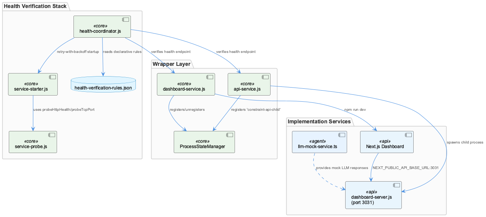
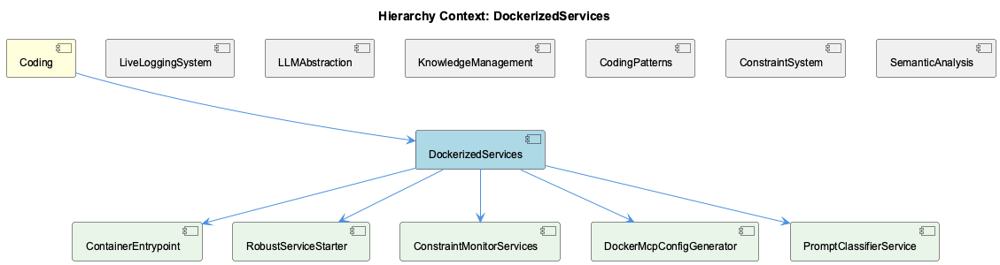

# DockerizedServices

**Type:** Component

# DockerizedServices — Technical Insight Document

## What It Is

DockerizedServices is the supervised-process and health-verification layer for the Coding project's containerized backend, implemented centrally in `lib/service-probe.js` (health-check polling) and `lib/service-starter.js` (process lifecycle management). Rather than mapping one Docker Compose entry to one process, this component manages multiple logical services — including `scripts/api-service.js`, `scripts/dashboard-service.js`, semantic analysis MCP, and the constraint monitor — as supervised child processes within a shared container context. Its children realize this architecture concretely: `ContainerEntrypoint` (`docker/entrypoint.sh`) gates process startup on database availability, `RobustServiceStarter` (`scripts/start-services-robust.js`) drives feature-gated, retry-aware startup, `ConstraintMonitorServices` provisions and launches the constraint-monitor stack, `PromptClassifierService` handles classifier backend routing, and `DockerMcpConfigGenerator` is listed as a child but has no corroborating implementation in the supplied sources.

## Architecture and Design

The defining architectural decision is centralized in-container orchestration rather than per-service container isolation. `lib/service-starter.js` acts as a single Node-based supervisor for multiple logical services, trading Docker-level isolation for simpler inter-process communication via shared filesystem and in-process ports. This is a deliberate trade-off: it sacrifices fault isolation (a starter crash takes down all supervised services) in exchange for operational simplicity.

Layered on top is a tiered readiness model. At the lowest level, `ContainerEntrypoint`'s `docker/entrypoint.sh` blocks on raw TCP `wait_for_service()` checks for Qdrant and Redis before `exec`-ing into supervisord — a weaker guarantee than true readiness, since a TCP-open port doesn't mean the service has finished cold-starting. Above that, `lib/service-probe.js` implements HTTP-level health polling with a "consecutive failures within a window" heuristic to distinguish genuine failure from transient slowness — critical given highly variable container cold-start times (model loading, DB connections). `RobustServiceStarter`'s `SERVICE_CONFIGS` (in `scripts/start-services-robust.js`) formalizes this further with per-service required/optional classification, `maxRetries`, `timeout`, `startFn`, and `healthCheckFn`, giving graceful degradation for optional services while blocking on required ones — confirmed by `tests/features/service-gating.test.mjs`.

Health verification is explicitly *not* automatic: the standard operating procedure (documented in the Coding-Services Docker Container workflow) is rebuild via docker-compose, then explicitly confirm supervised processes and health endpoints before downstream pipelines like wave-analysis proceed. A container reporting "up" in Docker does not imply its internal processes are healthy.

## Implementation Details

`lib/service-probe.js`'s polling logic is reused across multiple entry points rather than being bespoke per command — the same ServiceProbe machinery backs both direct container verification and the `coding --copilot` launcher's health check, meaning probe-timing changes have cross-cutting effects system-wide. `ConstraintMonitorServices`'s legacy path in `start-services.sh` (used when `ROBUST_MODE=false`) is illustrative of the less-robust alternative: it conditionally `git clone`s `constraint-monitor`, runs `npm install --production`, and prefers `docker-compose up -d` (checking for `qdrant`/`redis` reporting `Up.*healthy`), falling back to raw `docker run` for `constraint-monitor-qdrant` (6333/6334) and `constraint-monitor-redis` (6379), then backgrounds the dashboard (`PORT=3030`) and API (`3031`) as shell jobs — with status captured only in shell-local variables and no structured health object returned to callers. This contrasts sharply with the HTTP-polling model elsewhere and represents a maintainability gap.

`PromptClassifierService` addresses a related resilience issue: the classifier previously held one fixed backend URL from boot, causing HTTP 502s when network topology changed. `config/prompt-classifier.yaml` now declares an ordered backend list with first-enabled-network-match semantics, mirroring `llm-routing.yaml`'s offload pattern.

## Integration Points

DockerizedServices' health-check machinery feeds directly into system-wide observability: per the LiveLoggingSystem (LSL) + ETM record, the health coordinator probes dockerized services including obs-api and llm-proxy/llm-cli-proxy, surfacing timeouts through the multi-project statusline and System Health Dashboard rather than failing silently. `integrations/semantic-analysis/src/mock/llm-mock-service.ts` enables swapping the real LLM proxy for a mock backend via environment configuration (e.g., `LLM_PROXY_URL`/`LLM_CLI_PROXY_URL`), supporting CI and local docker-compose runs without external API dependencies. This mock-swap capability is a sibling concern to LLMAbstraction's routing-tier logic, since both govern how LLM backends are selected and substituted. Downstream, wave-analysis pipelines depend on confirmed service health before running, tying DockerizedServices operationally to KnowledgeManagement workflows.

## Usage Guidelines

Always treat a Docker "up" state as necessary but not sufficient — run the explicit rebuild-and-verify workflow after any code or data change (e.g., KB Stage 1 fixes) before relying on downstream consumers. Because `lib/service-probe.js` is shared across the container verification flow and the `coding --copilot` launcher, any change to health endpoint behavior or probe timing must be validated against both usage paths. Prefer the `RobustServiceStarter` path (`ROBUST_MODE=true`) over the legacy `start-services.sh` path for constraint-monitor provisioning, since the legacy path lacks structured health reporting and only prints status to console. When modifying classifier backend behavior, follow the `config/prompt-classifier.yaml` ordered-backend-list pattern rather than reintroducing a single fixed URL.

## Work Record

What working sessions recorded about this entity — decisions taken, problems hit, and why things are the way they are:

- The 'Coding-Services Docker Container — Health Verification Workflow' record establishes that the standard operating procedure for this component is: rebuild the coding-services container via docker-compose after code/data changes (e.g. KB Stage 1 fixes), then explicitly confirm all supervised processes and health endpoints are live before relying on downstream pipelines like wave-analysis. This means health verification is a manual/scripted gating step performed after every rebuild, not an automatic property of the container starting successfully — a rebuilt container can report 'up' in Docker while its internal supervised processes are not yet healthy.
- The 'coding --copilot Launcher Health Check' record, describing the same rebuild-and-verify procedure as the Coding-Services Docker Container workflow, indicates that ServiceProbe-based health checks are reused across different entry points (the copilot launcher and the coding-services container verification flow) rather than being bespoke per-command, meaning changes to health endpoint behavior or probe timing in lib/service-probe.js have cross-cutting effects on both direct container verification and higher-level launcher commands.
- The 'LiveLoggingSystem (LSL) + ETM' record establishes that the health coordinator issues periodic probes against dockerized services including obs-api and llm-proxy/llm-cli-proxy, and that probe timeouts on these services are surfaced through a multi-project statusline and the System Health Dashboard rather than failing silently. This ties the DockerizedServices component's health-check machinery directly into system-wide observability, meaning a hung or slow container process for llm-proxy is visible to operators outside of the container logs themselves.

## Hierarchy Context

### Parent
- [Coding](./Coding.md) -- Root node of the coding project knowledge hierarchy, encompassing all development infrastructure knowledge. The project consists of 7 major components: LiveLoggingSystem: [LLM] The classification layer for LiveLoggingSystem is implemented in ontology-classification-agent.ts, which categorizes captured session content as; LLMAbstraction: [SESSION] 'LLM Routing Tier Priority' establishes that LLM requests must follow fallback tier order — max-subscription models first, then work/GH Copi; DockerizedServices: [LLM] lib/service-probe.js implements the health-check polling logic that determines readiness of dockerized services (semantic analysis MCP, constrai; KnowledgeManagement: [SESSION] Wave Insight Persistence work record establishes that Wave 4 wrote 73 insight documents but zero Insight graph nodes, because the History si; CodingPatterns: [SESSION] Documentation Style Guide for Diagrams and Markdown establishes that .puml source files must live in docs/puml/ and generated diagram artifa; ConstraintSystem: [SESSION] Statusline Click-Report Feature establishes that clicking the 'constraints' field in the tmux statusline opens or focuses the constraint-mon; SemanticAnalysis: [SESSION] Pipeline CodingLowerOntologySource Emission Bug documents an unresolved defect where the pipeline emits a CodingLowerOntologySource referenc.

### Children
- [ContainerEntrypoint](./ContainerEntrypoint.md) -- [LLM] docker/entrypoint.sh implements the ContainerEntrypoint directly: it blocks on wait_for_service() TCP checks for Qdrant and Redis before ever invoking supervisord via `exec "$@"`, meaning the container's supervised process tree (feeding into service-probe/service-starter health checks described in the parent) only begins after database reachability is confirmed at the raw TCP level — a weaker guarantee than the HTTP health-endpoint polling the parent describes, since a TCP-open Qdrant/Redis could still be mid-cold-start.
- [RobustServiceStarter](./RobustServiceStarter.md) -- [LLM] scripts/start-services-robust.js implements the actual RobustServiceStarter logic: SERVICE_CONFIGS declares each service (transcriptMonitor, liveLoggingCoordinator, etc.) with required/optional classification, maxRetries, timeout, a startFn, and a healthCheckFn, and startOneService (referenced in tests/features/service-gating.test.mjs) drives feature-gated startup with blocking semantics for required services. This confirms the parent's description of retry-with-timeout and graceful degradation is concretely realized here rather than being aspirational documentation.
- [ConstraintMonitorServices](./ConstraintMonitorServices.md) -- [LLM] start-services.sh's legacy path (invoked when ROBUST_MODE=false) contains the only executable logic for provisioning constraint-monitor in this file set: it conditionally `git clone`s `github.com/fwornle/constraint-monitor.git` into `integrations/constraint-monitor` if absent, runs `npm install --production`, then either `docker-compose up -d` (preferred, checking for `qdrant`/`redis` containers reporting `Up.*healthy`) or falls back to raw `docker run` for `constraint-monitor-qdrant` (ports 6333/6334) and `constraint-monitor-redis` (port 6379). It further starts `constraint-monitor`'s own dashboard (`PORT=3030 npm run dashboard`) and API (`npm run api`, implicitly port 3031) as background shell jobs when the docker-compose path isn't used, with success/failure captured only in shell-local `CONSTRAINT_MONITOR_STATUS`/`_WARNING` variables printed to console — there is no structured health object returned to a caller.
- [DockerMcpConfigGenerator](./DockerMcpConfigGenerator.md) -- [LLM] No file among the supplied sources — docker/entrypoint.sh, scripts/prompt-classifier-service.mjs, scripts/start-services-robust.js, start-services.sh, tests/features/service-gating.test.mjs — defines, imports, or references a class, function, or module named 'DockerMcpConfigGenerator'. The closest thematic neighbors are docker/entrypoint.sh's feature-gating block (lines building /etc/supervisor/features.d/disabled.conf from a features.json snapshot) and lib/service-starter.js (referenced by start-services-robust.js), neither of which generates MCP configuration.
- [PromptClassifierService](./PromptClassifierService.md) -- [SESSION] A live-network dial failure was traced to the classifier holding one fixed backend URL from boot: two --pi turns hit 'classifier HTTP 502' when the network changed and the laptop backend went unreachable while the on-prem cluster destination stayed up; config/prompt-classifier.yaml now declares an ordered backend list with first-enabled-network-match, mirroring llm-routing.yaml's offload target pattern.

### Siblings
- [LiveLoggingSystem](./LiveLoggingSystem.md) -- [LLM] The classification layer for LiveLoggingSystem is implemented in ontology-classification-agent.ts, which categorizes captured session content as it flows through the logging pipeline. Its hierarchy-root validation logic is tested separately in ontology-classification-agent.hierarchy-roots.test.ts, indicating that root-node classification (i.e., correctly assigning top-level ontology categories rather than leaf nodes) is treated as a distinct correctness concern from general classification accuracy — likely because incorrect root assignment cascades into misfiled session data across the entire per-person or per-project vault structure.
- [LLMAbstraction](./LLMAbstraction.md) -- [SESSION] 'LLM Routing Tier Priority' establishes that LLM requests must follow fallback tier order — max-subscription models first, then work/GH Copilot models, then Groq Llama-70B only as a last resort — rather than demoting to lower-tier providers as primary
- [KnowledgeManagement](./KnowledgeManagement.md) -- [SESSION] Wave Insight Persistence work record establishes that Wave 4 wrote 73 insight documents but zero Insight graph nodes, because the History sidebar filters strictly to entityType 'Insight' — documents alone are invisible to graph queries
- [CodingPatterns](./CodingPatterns.md) -- [SESSION] Documentation Style Guide for Diagrams and Markdown establishes that .puml source files must live in docs/puml/ and generated diagram artifacts have defined placement rules, enforcing a convention for the docs pipeline to render correctly.
- [ConstraintSystem](./ConstraintSystem.md) -- [SESSION] Statusline Click-Report Feature establishes that clicking the 'constraints' field in the tmux statusline opens or focuses the constraint-monitor dashboard tab, integrating HookManagementSystem-driven violation data with the dashboard UI
- [SemanticAnalysis](./SemanticAnalysis.md) -- [SESSION] Pipeline CodingLowerOntologySource Emission Bug documents an unresolved defect where the pipeline emits a CodingLowerOntologySource reference in output despite documentation stating this source type should never be produced, indicating a gap between the L2 refinement design and current emission behavior

---

*Generated from 6 observations*
