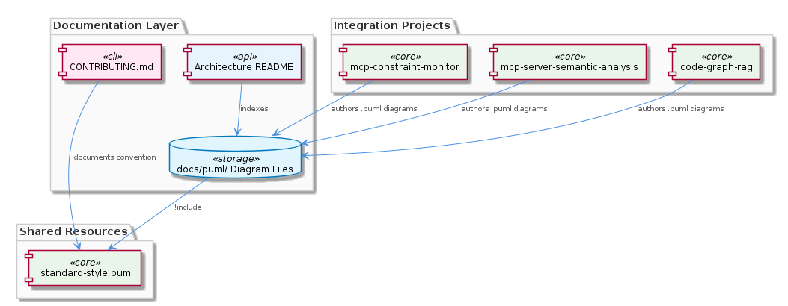
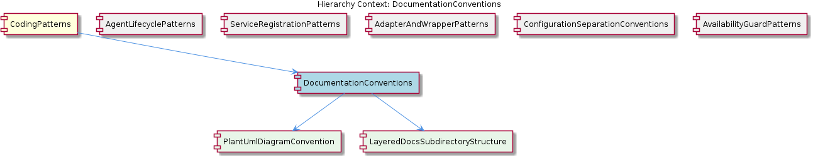

# DocumentationConventions

**Type:** SubComponent

All architecture diagrams are stored as .puml files under docs/puml/ directories, as evidenced by the documentation listing showing integrations/mcp-server-semantic-analysis/docs/architecture/ containing multiple .md files that reference PlantUML sources.

# DocumentationConventions

## What It Is

`DocumentationConventions` is a project-wide SubComponent within the `CodingPatterns` family that codifies how architectural and reference documentation is authored, organized, and visually rendered across the repository. It is not implemented as runtime code; rather, it manifests as a set of file-system and authoring conventions visible under paths such as `integrations/mcp-server-semantic-analysis/docs/architecture/`, `integrations/code-graph-rag/`, and `integrations/mcp-constraint-monitor/`. The convention is anchored by two concrete artifacts: shared PlantUML source files stored beneath `docs/puml/` directories, and per-area `README.md` index files (e.g., `integrations/mcp-server-semantic-analysis/docs/architecture/README.md`) that reference those diagrams in context.

Structurally, `DocumentationConventions` decomposes into two child SubComponents that capture its two orthogonal axes. `PlantUmlDiagramConvention` governs the visual/diagrammatic dimension — the rule that every architecture diagram is authored as a `.puml` file under a `docs/puml/` directory. `LayeredDocsSubdirectoryStructure` governs the organizational dimension — the rule that documentation is partitioned into named, self-describing subdirectories (`architecture/`, `api/`, `installation/`), each with its own `README.md` acting as an index for that documentation layer.

Sitting alongside siblings like `AgentLifecyclePatterns`, `ServiceRegistrationPatterns`, `AdapterAndWrapperPatterns`, `ConfigurationSeparationConventions`, and `AvailabilityGuardPatterns` under the `CodingPatterns` parent, `DocumentationConventions` is the only sibling that targets documentation artifacts rather than runtime code. Where `AgentLifecyclePatterns` constrains the shape of `BaseAgent` constructors and `ConfigurationSeparationConventions` constrains where runtime config lives, `DocumentationConventions` constrains where and how the *explanations* of those patterns are written down — including the agent lifecycle contract documented in `integrations/mcp-server-semantic-analysis/docs/architecture/agents.md`.

## Architecture and Design

The architectural approach centers on **centralized style with distributed authorship**. The file `docs/puml/_standard-style.puml` serves as a single shared style source that is imported by every PlantUML diagram in the repository. This is a classic "single source of truth" pattern applied to diagrammatic style: independently authored diagrams across `mcp-server-semantic-analysis`, `code-graph-rag`, and `mcp-constraint-monitor` all reference the same style definitions, preventing visual drift (inconsistent colors, fonts, line styles) that would otherwise emerge naturally when many contributors author diagrams in isolation.

The second architectural choice is **layered documentation partitioning with self-describing entry points**. Rather than dumping all documentation into a flat directory, the convention (formalized by the child `LayeredDocsSubdirectoryStructure`) divides documentation into purpose-named subdirectories — `architecture/`, `api/`, `installation/` — and places a `README.md` at the root of each. The README headings observed in the wild (`Architecture Documentation - MCP Server Semantic Analysis`, `API Reference - MCP Server Semantic Analysis`, `Installation Guide - MCP Server Semantic Analysis`) confirm that each subdirectory's purpose is immediately legible without further navigation.

A third design decision is the **separation of diagram source from prose**. PlantUML `.puml` files live in dedicated `docs/puml/` subdirectories, while the rendered references and surrounding narrative live in `.md` files under the architecture documentation. This separation lets the diagrams be regenerated, restyled, or migrated independently of the surrounding explanatory text. It also means that a global visual refresh — updating brand colors, line weights, or font choices — requires editing only `docs/puml/_standard-style.puml`, after which all diagrams pick up the change.

## Implementation Details

The mechanics rest on PlantUML's `!include` directive. Each `.puml` file in the project imports `docs/puml/_standard-style.puml` at the top, which establishes shared theming. When a diagram is rendered (either by a build step or by tooling at view time), the style file is resolved relative to the diagram source, applying the canonical look and feel. Because the include is textual rather than runtime, there is no compilation or dependency-management overhead — the file system path itself is the contract.

Documentation directory structure is implemented purely by filesystem convention. Under any integration root such as `integrations/mcp-server-semantic-analysis/docs/`, contributors are expected to find or create one of the named subdirectories. Each subdirectory's `README.md` serves two roles: it is the human entry point for that documentation layer, and it is the index that references the `.puml` diagrams residing nearby (typically under a sibling `puml/` directory). For example, `integrations/mcp-server-semantic-analysis/docs/architecture/README.md` references the PlantUML sources that visually depict the agent lifecycle described in `agents.md` — the same `agents.md` that documents the three-phase `constructor → ensureLLMInitialized → execute` contract enforced by sibling `AgentLifecyclePatterns`.

The convention is intentionally lightweight in its enforcement mechanism: there is no validator, no schema, no lint rule. Enforcement instead happens through contributor onboarding documentation, most notably `integrations/code-graph-rag/CONTRIBUTING.md`, which references these conventions as part of the requirements new contributors must internalize. This makes the convention social rather than mechanical, suitable for a small team where reviewers can catch deviations during pull-request review.

## Integration Points

`DocumentationConventions` integrates with the broader codebase at three levels. First, it spans multiple integrations — `mcp-server-semantic-analysis`, `code-graph-rag`, and `mcp-constraint-monitor` — meaning every team adding a new integration directory under `integrations/` inherits the obligation to follow the same `docs/` and `docs/puml/` layout. Second, it integrates with the contributor workflow via `integrations/code-graph-rag/CONTRIBUTING.md`, which functions as the human-facing on-ramp explaining how contributors should produce documentation.

Third, the convention integrates downstream with whatever PlantUML rendering tooling is used to produce images for the `.md` files. Because all diagrams transitively depend on `docs/puml/_standard-style.puml`, the rendering pipeline must preserve the relative path between any diagram and the shared style file. This is the implicit interface between the documentation source and any rendering tool: the directory structure under `docs/puml/` is the contract.

Within the `CodingPatterns` hierarchy, `DocumentationConventions` is the documentation counterpart to runtime-code siblings. Where `ServiceRegistrationPatterns` (driven by `scripts/api-service.js` calling `ProcessStateManager.registerService()`) and `AdapterAndWrapperPatterns` (exemplified by `GraphDatabaseAdapter` wrapping Graphology and LevelDB) prescribe how runtime code is structured, `DocumentationConventions` prescribes how the architectural narrative *about* that code is structured. The two children, `PlantUmlDiagramConvention` and `LayeredDocsSubdirectoryStructure`, each implement one half of this prescription.

## Usage Guidelines

When adding new documentation, contributors should always place architecture diagrams as `.puml` source files under a `docs/puml/` directory belonging to the relevant integration. The diagrams must `!include` `docs/puml/_standard-style.puml` (via the appropriate relative path) rather than declaring inline styles, colors, or fonts. Declaring local styles defeats the centralization that makes global visual updates possible and will produce visually inconsistent diagrams across the repository.

When adding a new category of documentation under an integration's `docs/` directory, contributors should create a purpose-named subdirectory (following the precedent of `architecture/`, `api/`, `installation/`) and seed it with a `README.md` whose title clearly identifies the subdirectory's purpose and the integration it belongs to (e.g., `Architecture Documentation - MCP Server Semantic Analysis`). The README should serve as the index for that layer, linking to the PlantUML diagrams and any deeper Markdown documents.

Cross-cutting visual changes — updating brand colors, switching fonts, adjusting default line styles — should be made exclusively in `docs/puml/_standard-style.puml`. Editing styles in individual diagrams is a smell that indicates either a missing capability in the shared style file (which should be added there) or a contributor unfamiliar with the convention (who should be redirected to `integrations/code-graph-rag/CONTRIBUTING.md`).

Finally, new integrations added under `integrations/` should mirror the established `docs/` and `docs/puml/` structure from day one. Because the convention is project-wide and enforced socially rather than mechanically, the cost of deviation is paid not at commit time but later, when documentation begins to fragment and global updates become impractical. Following the convention from the start preserves the maintainability benefits — a single style edit propagating across every diagram, and a predictable navigation experience for anyone exploring any integration's documentation.

## Hierarchy Context

### Parent
- [CodingPatterns](./CodingPatterns.md) -- [LLM] The project enforces a strict three-phase lazy initialization contract for all LLM-backed agents, documented in integrations/mcp-server-semantic-analysis/docs/architecture/agents.md. The contract mandates the sequence: constructor(repoPath, team) → ensureLLMInitialized() → execute(input). In the constructor phase, the agent captures only its configuration context (repository path and team assignment) without touching LLM infrastructure. The second phase, ensureLLMInitialized(), is an idempotent guard method that performs the actual LLM client instantiation and is designed to be safe to call multiple times — only the first call allocates resources. The third phase, execute(input), is the sole public entry point for agent work and implicitly relies on ensureLLMInitialized() having been called (either explicitly by a harness or at the top of execute() itself). This pattern is a deliberate trade-off: it keeps agent construction cheap for cases where agents are instantiated in bulk but only a subset are actually invoked, preventing unnecessary LLM connection overhead. A new contributor adding an agent must not acquire LLM connections in the constructor — doing so would break the lifecycle contract and cause resource exhaustion in orchestrator scenarios that pre-instantiate agents.

### Children
- [PlantUmlDiagramConvention](./PlantUmlDiagramConvention.md) -- The parent L2 context explicitly states that all architecture diagrams are stored as .puml files under docs/puml/ directories, establishing this as a project-wide convention rather than a per-integration choice.
- [LayeredDocsSubdirectoryStructure](./LayeredDocsSubdirectoryStructure.md) -- The integrations/mcp-server-semantic-analysis/docs/ tree contains at least three named subdirectories — architecture/, api/, and installation/ — each with its own README.md (e.g., 'Architecture Documentation - MCP Server Semantic Analysis', 'API Reference - MCP Server Semantic Analysis', 'Installation Guide - MCP Server Semantic Analysis'), making the subdirectory purpose self-describing.

### Siblings
- [AgentLifecyclePatterns](./AgentLifecyclePatterns.md) -- BaseAgent subclasses documented in integrations/mcp-server-semantic-analysis/docs/architecture/agents.md all follow a constructor(repoPath, team) signature that captures only configuration context, explicitly forbidding any LLM client instantiation at this stage.
- [ServiceRegistrationPatterns](./ServiceRegistrationPatterns.md) -- scripts/api-service.js calls ProcessStateManager.registerService() immediately after process spawn, establishing the registration as the canonical signal that a service is live and trackable.
- [AdapterAndWrapperPatterns](./AdapterAndWrapperPatterns.md) -- GraphDatabaseAdapter wraps the Graphology graph library combined with LevelDB persistence, exposing a domain-oriented API rather than the raw Graphology or LevelDB interfaces directly.
- [ConfigurationSeparationConventions](./ConfigurationSeparationConventions.md) -- config/agent-profiles.json holds runtime behavioral configuration for agents (model selection, parameters, capabilities), deliberately separated from topology concerns.
- [AvailabilityGuardPatterns](./AvailabilityGuardPatterns.md) -- isServerAvailable() is called before dynamic imports of VkbApiClient, ensuring the optional external API client is never loaded if its backing server cannot be reached.

---

*Generated from 6 observations*
