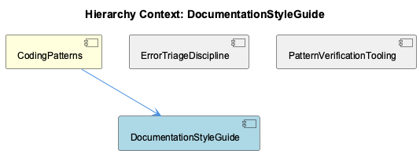
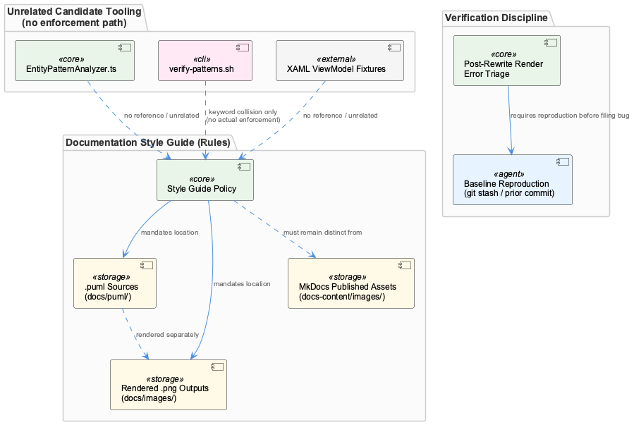

# DocumentationStyleGuide

**Type:** SubComponent

## What It Is

DocumentationStyleGuide is a documentation/process rule set, not a code component — the observations confirm this repeatedly. Its actual content is a placement contract: `.puml` diagram sources must live in `docs/puml/`, their rendered `.png` outputs must live in `docs/images/`, and both must remain distinct from `docs-content/images/`, the MkDocs-served tree of published site assets. This is defined at the level of its parent, CodingPatterns, which establishes it as one of several mandatory formatting/placement conventions alongside its siblings ErrorTriageDiscipline and PatternVerificationTooling.

## Architecture and Design

No code artifact in the supplied observations implements or enforces this guide. `EntityPatternAnalyzer.ts` (src/ontology/heuristics/EntityPatternAnalyzer.ts) classifies team ownership of arbitrary artifacts via path-prefix and regex matching, but never touches `docs/puml`, `docs/images`, or `docs-content/images`. `verify-patterns.sh` performs compliance auditing for logging, Redux usage, and network-aware install checks, plus a generic "Code Documentation" regex over undocumented exported functions — none of which inspects diagram placement. The XAML/C# fixtures in `integrations/graphify/tests/fixtures/xaml_viewmodel/` are unrelated parser test data. The design of DocumentationStyleGuide, as far as observations show, is purely a human/process convention recorded in session notes, sitting conceptually beside its sibling PatternVerificationTooling (which *is* code-backed) but without an analogous enforcement script of its own.

## Implementation Details

There is no implementation to detail. The rule itself is simple and declarative: keep `.puml` sources and their rendered `.png` counterparts in separate authoring directories (`docs/puml/`, `docs/images/`), and keep both separate from the publishing tree `docs-content/images/` so build tooling doesn't conflate authoring artifacts with MkDocs-served site assets. A related but distinct process convention, also recorded at the session level, is the Post-Rewrite Render Error Triage discipline (owned by sibling ErrorTriageDiscipline): after a large rewrite, engineers must reproduce render errors against a pre-rewrite baseline (git stash, prior commit, or tagged release) before filing or prioritizing a bug.

## Integration Points

The only structural integration is hierarchical: DocumentationStyleGuide is contained by CodingPatterns, and shares that parent with ErrorTriageDiscipline and PatternVerificationTooling. PatternVerificationTooling's script (`scripts/knowledge-management/verify-patterns.sh`) audits several *other* conventions (ConditionalLoggingPattern, ReduxStateManagementPattern, NetworkAwareInstallationPattern, undocumented-function detection) but its own source and code references (lines 36, 94) confirm it does not check `.puml`/`.png` placement — so no automated enforcement bridge currently exists between DocumentationStyleGuide and PatternVerificationTooling, despite them being siblings under the same parent.

## Usage Guidelines

Developers adding a new diagram must place the `.puml` source in `docs/puml/` and its rendered `.png` in `docs/images/`, never mixing the two trees and never committing a `.puml` alongside its own rendered `.png` in the same location. Critically, `docs-content/images/` is reserved for MkDocs-published site assets and must not be conflated with the raw diagram-authoring trees. Because no tooling currently verifies this (verify-patterns.sh's "Code Documentation" check is unrelated, targeting undocumented functions, not diagram placement), compliance is presently manual/reviewer-enforced rather than automated — a gap worth noting if PatternVerificationTooling is extended in the future.

---

**Architectural/design synthesis:**

1. **Architectural patterns identified:** None applicable to this entity itself — it is a convention, not code. Adjacent code patterns (two-step matcher chain in EntityPatternAnalyzer, shell-based compliance auditing in verify-patterns.sh) exist in sibling/unrelated components but are explicitly not part of this guide's enforcement.
2. **Design decisions and trade-offs:** The trade-off of separating authoring artifacts (`docs/puml`, `docs/images`) from publishing artifacts (`docs-content/images`) is to prevent build tooling from conflating raw sources with generated site content — at the cost of requiring manual discipline since no script currently verifies it.
3. **System structure insights:** DocumentationStyleGuide sits as a sibling of PatternVerificationTooling under CodingPatterns, highlighting a structural gap — one sibling has tooling, the other (this one) does not.
4. **Scalability considerations:** Not applicable; this is a static process rule with no runtime component.
5. **Maintainability assessment:** Currently low-risk but unenforced; maintainability would improve if PatternVerificationTooling were extended to check diagram directory placement, closing the gap between documented convention and automated compliance.

## Work Record

What working sessions recorded about this entity — decisions taken, problems hit, and why things are the way they are:

- Documentation Style Guide for Diagrams and Markdown: .puml sources must live in docs/puml/, distinct from rendered output locations.
- Documentation Style Guide for Diagrams and Markdown: rendered .png files must live in docs/images/, kept separate from the MkDocs-served docs-content/images/ tree so build tooling doesn't conflate authoring and publishing artifacts.
- The 'Documentation Style Guide for Diagrams and Markdown' work record establishes that .puml source files must live in docs/puml/ and their rendered .png outputs in docs/images/, explicitly distinct from docs-content/images/ (the MkDocs-served tree of published site assets, not raw diagram exports) — a placement rule that a developer adding a new diagram must follow by never mixing the two trees or committing a .puml alongside its own rendered .png.
- The 'Post-Rewrite Render Error Triage' work record establishes a distinct verification discipline: after a large rewrite lands and render errors surface, engineers must reproduce against a pre-rewrite baseline (git stash, prior commit, or tagged release) before filing or prioritizing a bug, so that pre-existing defects aren't misattributed to the rewrite and genuine regressions aren't dismissed as pre-existing.

## Hierarchy Context

### Parent
- [CodingPatterns](./CodingPatterns.md) -- [SESSION] Documentation Style Guide for Diagrams and Markdown establishes mandatory formatting/placement rules: .puml sources live in docs/puml/, rendered .png files live in docs/images/, distinct from the MkDocs-served docs-content/images/ tree.

### Siblings
- [ErrorTriageDiscipline](./ErrorTriageDiscipline.md) -- [SESSION] Post-Rewrite Render Error Triage: establishes verification discipline for distinguishing pre-existing render errors from regressions introduced by a large rewrite.
- [PatternVerificationTooling](./PatternVerificationTooling.md) -- [LLM] scripts/knowledge-management/verify-patterns.sh implements the actual PatternVerificationTooling: it runs rg-based checks for ConditionalLoggingPattern (console.log vs Logger usage), ReduxStateManagementPattern (useState vs useSelector/useDispatch counts), NetworkAwareInstallationPattern (grep for check_network/timeout in install.sh), and undocumented-function detection, aggregating results into a timestamped markdown report and a compliance score.

---

*Generated from 11 observations*
