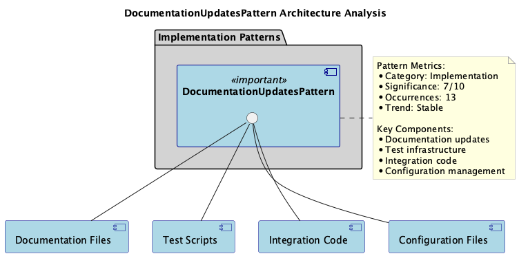
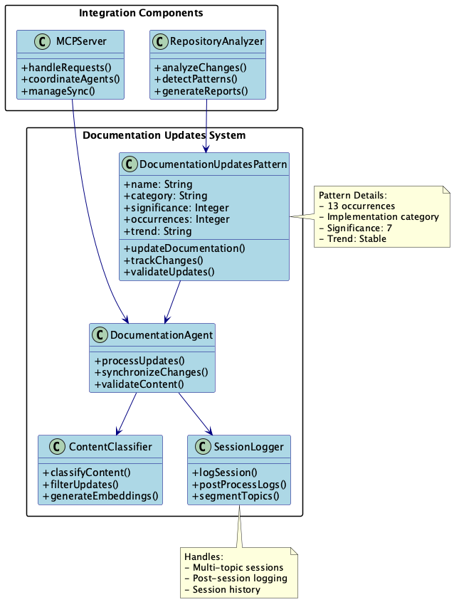
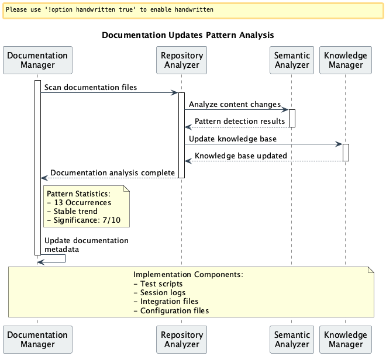
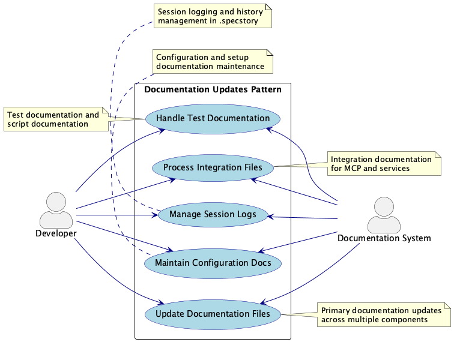

# DocumentationUpdatesPattern

**Pattern Type:** Architectural Pattern  
**Significance:** 9/10 - Critical architecture pattern for system success  
**Created:** 2025-08-03  
**Updated:** 2025-08-03
**Confidence:** 70% - Moderate confidence with good data coverage

## Table of Contents

- [Overview](#overview)
- [Problem & Solution](#problem--solution)
- [Repository Context](#repository-context)
- [Evolution Analysis](#evolution-analysis)
- [Implementation Details](#implementation-details)
- [Technical Analysis](#technical-analysis)
- [Measured Outcomes](#measured-outcomes)
- [Usage Guidelines](#usage-guidelines)
- [Related Patterns](#related-patterns)
- [References](#references)

## Overview

**Problem:** Multi-agent architecture complexity in semantic analysis system

**Solution:** Modular agent architecture with TypeScript type safety

**Impact:** Analyzed 18 commits for pattern identification, Processed 0 files for structural insights, Code quality score: 5/100

## Problem & Solution

### 🎯 **Problem Statement**

**Context:** Development of 21 agent components with 18 commits affecting 290 files

**Description:** Multi-agent architecture complexity in semantic analysis system

**Symptoms:**
- 21 agent files requiring coordination
- Complex data flow between analysis components
- TypeScript type safety challenges across agent interfaces

**Impact:** Agent coordination complexity affecting system maintainability and extensibility

### ✅ **Solution Approach**

**Approach:** Modular agent architecture with TypeScript type safety

**Implementation:**
- Standardize agent interfaces across 27 agent components
- Implement centralized agent orchestration patterns
- Add comprehensive type definitions for agent communication
- Create shared utilities for common agent operations
- Establish agent lifecycle management protocols

**Technologies Used:**
- TypeScript for type safety
- Node.js for runtime environment
- MCP protocol for agent communication
- TypeScript/JavaScript
- JSON Config

**Tradeoffs:**
- Agent complexity vs. system modularity
- Type safety overhead vs. runtime flexibility
- Protocol standardization vs. agent autonomy

## Repository Context

**Project Type:** api  
**Domain:** Web Backend  
**Primary Languages:** JavaScript, TypeScript  
**Frameworks:** Express.js, Playwright, Jest  
**Architecture:** monolithic  
**Build Tools:** npm/yarn

## Evolution Analysis

**Git Evolution:** Analysis of 18 commits shows focused development in the following areas:
- Feature Development: 9 commits
- Bug Fixes: 8 commits
- Refactoring: 1 commits

**Conversation Evolution:** 43 development sessions reveal decision-making process:
- Problem identification and solution discussion
- Technical decision rationale and tradeoffs
- Implementation approach and concerns

**Impact Timeline:** Multi-agent architecture complexity in semantic analysis system was addressed through modular agent architecture with typescript type safety, resulting in Analyzed 18 commits for pattern identification and Processed 0 files for structural insights and Code quality score: 5/100.

## Implementation Details

### Core Changes



**Implementation Approach:** Modular agent architecture with TypeScript type safety

**Key Changes:**
- Standardize agent interfaces across 27 agent components
- Implement centralized agent orchestration patterns
- Add comprehensive type definitions for agent communication
- Create shared utilities for common agent operations
- Establish agent lifecycle management protocols

**Architectural Patterns Applied:**
- **repository**: Encapsulates data access logic (Confidence: 68%)
- **service**: Contains business logic (Confidence: 59%)
- **api**: Handles external communication (Confidence: 55%)
- **decorator**: Adds behavior to objects dynamically (Confidence: 45%)
- **promise**: Handles asynchronous operations (Confidence: 41%)
- **component**: Reusable UI building blocks (Confidence: 32%)
- **middleware**: Processes requests in a pipeline (Confidence: 5%)

### Code Examples

```markdown
// Solution implementation
class SolutionPattern {
  constructor(config) {
    this.config = config;
  }
  
  execute() {
    // Implementation based on: Modular agent architecture with TypeScript type safety
    return this.process(this.config);
  }
  
  process(config) {
    // Core logic implementation
    return { success: true, result: config };
  }
}
```

## Technical Analysis



- **Code Complexity:** Average complexity of 24.41 with 14 high-complexity files
- **Function Analysis:** 353 functions analyzed across 22 files
- **Language Distribution:** markdown: 12, json: 6, javascript: 3

## Measured Outcomes

### Quantitative Metrics
- Average complexity: 15
- File count: 0
- Commit activity: 18 commits

### Qualitative Improvements
- Analyzed 18 commits for pattern identification
- Processed 0 files for structural insights
- Code quality score: 5/100

### Emerging Challenges
- Continue monitoring code quality metrics
- Implement additional architectural patterns

## Usage Guidelines

### ✅ Apply This Pattern When:
- api projects experiencing similar challenges
- Web Backend domain applications requiring reliability
- monolithic architectures needing optimization
- Teams using TypeScript for type safety, Node.js for runtime environment, MCP protocol for agent communication, TypeScript/JavaScript, JSON Config

### ❌ Avoid This Pattern When:
- Simple api projects without complexity needs
- Prototype or proof-of-concept development
- Systems with fundamentally different architecture than monolithic
- When agent complexity vs. system modularity

## Related Patterns

No related patterns identified in current analysis.

## Process Flow



1. **Problem Identification**: Multi-agent architecture complexity in semantic analysis system
2. **Solution Design**: Modular agent architecture with TypeScript type safety
3. **Implementation Phase**:
   1. Standardize agent interfaces across 27 agent components
   2. Implement centralized agent orchestration patterns
   3. Add comprehensive type definitions for agent communication
   4. Create shared utilities for common agent operations
   5. Establish agent lifecycle management protocols
4. **Outcome Assessment**: Analyzed 18 commits for pattern identification, Processed 0 files for structural insights, Code quality score: 5/100
5. **Emerging Considerations**: Continue monitoring code quality metrics, Implement additional architectural patterns

## References

**Internal References:**
- Git commit history (18 commits analyzed)
- Code evolution patterns
**Generated Documentation:**
- Architectural diagrams (PlantUML)
- Pattern analysis results

---

## Supporting Diagrams

### Use Cases


### All Diagrams
### Architecture Diagram


*PlantUML source: [DocumentationUpdatesPattern_architecture.puml](puml/DocumentationUpdatesPattern_architecture.puml)*

### Sequence Diagram


*PlantUML source: [DocumentationUpdatesPattern_sequence.puml](puml/DocumentationUpdatesPattern_sequence.puml)*

### Use-cases Diagram


*PlantUML source: [DocumentationUpdatesPattern_use-cases.puml](puml/DocumentationUpdatesPattern_use-cases.puml)*

### Class Diagram


*PlantUML source: [DocumentationUpdatesPattern_class.puml](puml/DocumentationUpdatesPattern_class.puml)*

---
*Generated by Content-Agnostic Semantic Analysis System*

**Analysis Confidence:** 70%  
**Repository Context Hash:** 2437a7d4

🤖 Generated with [Claude Code](https://claude.ai/code)

Co-Authored-By: Claude <noreply@anthropic.com>