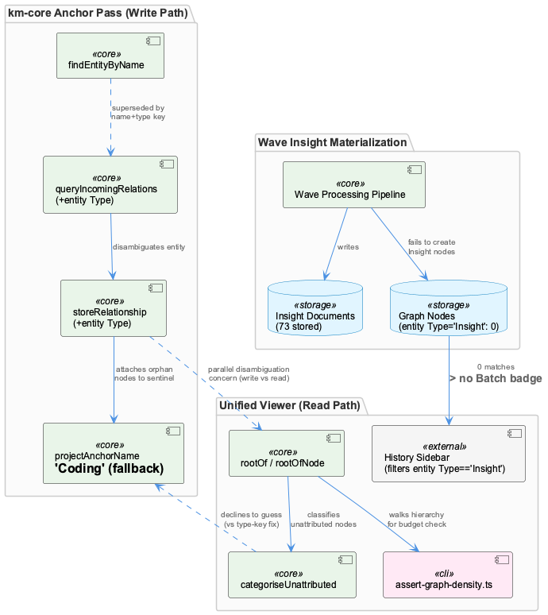
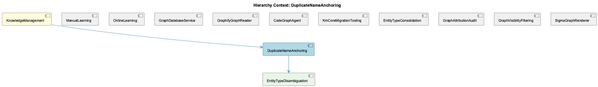

# DuplicateNameAnchoring

**Type:** SubComponent

## What It Is

DuplicateNameAnchoring is a SubComponent of KnowledgeManagement, but none of the supplied code files actually implement it — the retrieved files (`ukb-workflow-modal.tsx`, `assert-graph-density.ts`, `D3GraphCanvas.tsx`, `SigmaCanvas.tsx`, `attribution.test.ts`) belong to the unified-viewer and system-health-dashboard packages, not the km-core/graphify anchor-pass code path where `findEntityByName`, `queryIncomingRelations`, and `storeRelationship` are described as living. What we know comes entirely from the [SESSION] work record: the anchor pass originally resolved entities by name only, causing a newly created Detail-type node to silently inherit 24 incoming edges belonging to an unrelated same-named SubComponent. This is the write-side bug that its child, EntityTypeDisambiguation, is specifically named after.

## Architecture and Design

The documented fix is a type-scoped lookup key pattern: threading `entityType` through both `queryIncomingRelations` and `storeRelationship` so lookups disambiguate on (name, type) pairs instead of name alone. A secondary design decision bundled into the same fix is a fallback sentinel anchor — `projectAnchorName = 'Coding'` — so that nodes with no other resolvable parent attach to a known anchor rather than becoming orphans. This same wave also surfaced a second, structurally distinct failure at a different materialization point: Wave 4 produced 73 insight documents with zero corresponding `entityType: 'Insight'` graph nodes, breaking the viewer's History sidebar (a concern owned by parent KnowledgeManagement and siblings ManualLearning, OnlineLearning, and GraphDatabaseService). Both are framed as failures of the same wave-processing pipeline at different points of entity materialization/resolution.

Notably, the same class of ambiguity — same-named entities — recurs independently in the unified-viewer's read-side attribution logic (`attribution.test.ts`'s `categoriseUnattributed`), which resolves it by declining to guess ("a recorded name that resolves to TWO rooted entities is NOT a suggestion") rather than adding a type key. This is a deliberate divergence: the write-side anchor pass commits to a resolution (type-scoped key or fallback anchor), while the read-side attribution code refuses to fabricate a parent when ambiguity exists, noting 40 of 98 live roll-up parents share their child's name.

## Implementation Details

The core mechanics described are: `findEntityByName` as the original, insufficiently-scoped lookup (now the named concern of child EntityTypeDisambiguation); `queryIncomingRelations` and `storeRelationship` as the two call sites that needed `entityType` threaded through them; and `projectAnchorName = 'Coding'` as a hardcoded fallback constant for orphan prevention. No class structure, module boundaries, or surrounding code are available in the current file set — the `rootOf` walk, `rootOfNode`, and `categoriseUnattributed` functions found in the viewer are architecturally adjacent (same class of problem: nodes with no resolvable parent) but live in a different subsystem and operate on the read path via `assert-graph-density.ts`'s density-budget check, not the write-path anchor pass this component names.

## Integration Points

Structurally, DuplicateNameAnchoring sits under KnowledgeManagement alongside ManualLearning, OnlineLearning, GraphDatabaseService, GraphifyGraphReader, CodeGraphAgent, and several graph-tooling siblings (KmCoreMigrationTooling, EntityTypeConsolidation, GraphAttributionAudit, GraphVisibilityFiltering, SigmaGraphRenderer) — the presence of EntityTypeConsolidation and GraphAttributionAudit as siblings suggests this same-name/same-type disambiguation theme is a recognized cluster of problems across the KnowledgeManagement surface, not an isolated bug. Its only child, EntityTypeDisambiguation, directly represents the `findEntityByName` root cause. On the consuming side, the viewer's `assert-graph-density.ts` and `attribution.test.ts` both depend on a shared `rootOf`/hierarchy-parent primitive, and their comments cite prior drift when that logic was duplicated — a cautionary parallel for whatever shared resolution primitive the anchor pass itself may need to avoid similar duplication.

## Usage Guidelines

Given the evidence gap, the primary guideline is procedural: this document should not be treated as a full account of DuplicateNameAnchoring's implementation, since the actual anchor-pass code (in km-core/graphify) was not in the retrieved file set — retrieval here was filename/keyword-driven off the parent's neighborhood, pulling in viewer/dashboard files instead. Future work should locate `findEntityByName`, `queryIncomingRelations`, and `storeRelationship` directly rather than relying on this pass's substitutes. Architecturally, when resolving same-named entities, teams should be conscious of the two competing strategies already in use elsewhere in the system — type-key disambiguation (write path, this component) versus declining to suggest under ambiguity (read path, `categoriseUnattributed`) — and pick deliberately rather than assuming one approach is universally correct. Any fallback-anchor mechanism (like `projectAnchorName = 'Coding'`) should be treated as a known trade-off: it prevents orphaned nodes but can mask real resolution failures, similar to how `assert-graph-density.ts` treats unrooted nodes as explicit findings rather than silently folding them into a pseudo-project.

## Work Record

What working sessions recorded about this entity — decisions taken, problems hit, and why things are the way they are:

- The Wave Insight Persistence work record documents that the anchor pass originally resolved entities by name only via `findEntityByName`, and because of that a newly created Detail-type node silently inherited 24 incoming edges belonging to an unrelated same-named SubComponent created weeks earlier. The record states the fix required threading entityType through both `queryIncomingRelations` and `storeRelationship` so entity lookups disambiguate by (name, type) pairs rather than name alone, with a fixed fallback `projectAnchorName = 'Coding'` introduced so nodes with no other resolvable parent attach to a known anchor instead of becoming orphans.
- The same work record establishes a related but distinct failure in the same wave: Wave 4 produced 73 insight documents in storage but created zero corresponding graph nodes of entityType 'Insight', which silently broke the viewer's History sidebar since that sidebar filters strictly on entityType == 'Insight' to decide whether to render a Batch badge for a run's conclusions. Read together, both findings describe the same wave-processing pipeline failing at two different points of entity materialization/resolution rather than a single isolated bug.

## Hierarchy Context

### Parent
- [KnowledgeManagement](./KnowledgeManagement.md) -- [SESSION] Wave Insight Persistence work record establishes that Wave 4 was writing 73 insight documents but zero corresponding Insight graph nodes, meaning the viewer's History sidebar (which filters strictly to entityType 'Insight') could never surface a Batch badge for that run's conclusions.

### Children
- [EntityTypeDisambiguation](./EntityTypeDisambiguation.md) -- [SESSION] Wave Insight Persistence work record states the anchor pass originally called `findEntityByName`, which matches purely on name and ignores type.

### Siblings
- [ManualLearning](./ManualLearning.md) -- [SESSION] Wave Insight Persistence work record establishes that Wave 4 wrote 73 insight documents but zero corresponding Insight graph nodes, showing manually/human-curated conclusions can exist as documents without ever being anchored into the graph as entities.
- [OnlineLearning](./OnlineLearning.md) -- [SESSION] Wave Insight Persistence work record establishes that the History sidebar filters strictly to entityType 'Insight', so a Batch badge for a run's conclusions can only appear if the online pipeline actually writes Insight-typed graph nodes, not just insight documents.
- [GraphDatabaseService](./GraphDatabaseService.md) -- [SESSION] Wave Insight Persistence work record establishes that the persistence layer can silently accept writes to one representation (insight documents) while never receiving corresponding writes to another (Insight graph nodes), leaving the two out of sync with no error raised.
- [GraphifyGraphReader](./GraphifyGraphReader.md) -- [LLM] None of the supplied Code Files implement or reference a component named GraphifyGraphReader, nor do they import from or call into `integrations/semantic-analysis/src/agents/graphify-graph.ts`. The five files retrieved — `ukb-workflow-modal.tsx`, `assert-graph-density.ts`, `D3GraphCanvas.tsx`, `SigmaCanvas.tsx`, and `attribution.test.ts` — belong to `system-health-dashboard` and `unified-viewer`, two consumer-facing viewer packages that read graph data over HTTP from `obs-api` (port 12436), not the `semantic-analysis` agent layer where a 'GraphifyGraphReader' would plausibly live alongside `GraphifyGraph` and `CodeGraphAgent`.
- [CodeGraphAgent](./CodeGraphAgent.md) -- [LLM] The parent entity's own description characterizes CodeGraphAgent (integrations/semantic-analysis/src/agents/code-graph-agent.ts) as a compatibility shim: it preserves its full historical public interface — CodeEntity, CodeRelationship types, and the checkMemgraphConnection method — from an era when it queried a live Memgraph/Cypher backend, while internally delegating entirely to GraphifyGraph's static file-based reads. This is a Facade/Adapter pattern applied to a backend migration: callers written against the old contract, including guard clauses like `if (!connectionCheck.connected)`, continue to work unmodified even though the underlying 'connection' concept is now meaningless — a deliberate decoupling of consumer code changes from the storage-layer migration, at the cost of a permanently misleading method name in the API surface.
- [KmCoreMigrationTooling](./KmCoreMigrationTooling.md) -- [LLM] Every code file supplied for this analysis — integrations/system-health-dashboard/src/components/ukb-workflow-modal.tsx, integrations/unified-viewer/scripts/assert-graph-density.ts, integrations/unified-viewer/src/graph/D3GraphCanvas.tsx, integrations/unified-viewer/src/graph/SigmaCanvas.tsx, and integrations/unified-viewer/src/graph/attribution.test.ts — belongs to the dashboard/unified-viewer rendering layer (workflow progress UI, force-directed graph canvases, a node-count budget check, and an attribution-category test). None of them touch km-core's own migration surface: there is no reference in any of these files to LevelDB persistence, entity-type consolidation tables, or a Memgraph-to-file-store transition path.
- [EntityTypeConsolidation](./EntityTypeConsolidation.md) -- [LLM] None of the supplied files (ukb-workflow-modal.tsx, assert-graph-density.ts, D3GraphCanvas.tsx, SigmaCanvas.tsx, attribution.test.ts) implement entity-type consolidation logic. They concern workflow history pagination, graph density budgeting, and D3/Sigma rendering of already-typed entities — none touch a mapping table or type-folding migration.
- [GraphAttributionAudit](./GraphAttributionAudit.md) -- [LLM+CGR] `categoriseUnattributed` (imported by `integrations/unified-viewer/scripts/assert-graph-density.ts` and exercised in `integrations/unified-viewer/src/graph/attribution.test.ts`) splits unrooted graph nodes into four mutually exclusive categories — `recordedParent`, `wrongClass`, `danglingRef`, `unclaimed` — instead of one generic 'unattributed' bucket. The test `'a recorded name that resolves to TWO rooted entities is NOT a suggestion'` shows why: when a `parentEntityName` string matches two same-named rooted entities (the comment notes 40 of 98 live roll-up parents share their child's name), the function refuses to guess and falls back to `unclaimed` rather than emitting a `suggestedParentId` that would be a coin flip presented as an answer.
- [GraphVisibilityFiltering](./GraphVisibilityFiltering.md) -- [LLM] The actual implementation of the visibility predicate — `@/graph/visibility-predicate.ts` (exporting `isEntityVisible` and the `VisibilityFilters` type) and `@/graph/useGraphVisibility.ts` (the hook wrapping it) — is not present in the supplied files. What is present are two CONSUMERS: `integrations/unified-viewer/scripts/assert-graph-density.ts`, which imports `isEntityVisible`/`VisibilityFilters` directly to replay the canvas's filtering offline, and `integrations/unified-viewer/src/graph/D3GraphCanvas.tsx`, which calls a `useGraphVisibility()` hook. Both treat the predicate as an opaque contract rather than defining it, so any statement about the internal branching logic of the filter would be inference, not observation.
- [SigmaGraphRenderer](./SigmaGraphRenderer.md) -- [LLM] SigmaCanvas.tsx implements the actual WebGL graph renderer via <SigmaContainer> and a nested GraphSetup component that builds a graphology Graph from useGraphData() output, runs graphology-layout-force as a polish pass over graph-builder's hierarchical seed positions, and wires click/hover events through makeEventHandlers(). This is the component most plausibly referred to as 'SigmaGraphRenderer' in the parent context, though no file in the supplied set literally bears that name.

---

*Generated from 9 observations*
