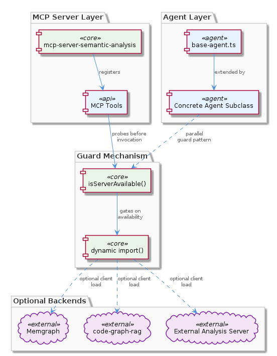
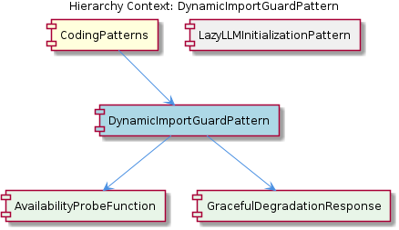

# DynamicImportGuardPattern

**Type:** SubComponent

The guard pattern enables the MCP server described in integrations/mcp-server-semantic-analysis/docs/architecture/integration.md to degrade gracefully — tools backed by unavailable services return capability-absent responses rather than crashing the process

# DynamicImportGuardPattern

## What It Is

The `DynamicImportGuardPattern` is a SubComponent implemented within `integrations/mcp-server-semantic-analysis`, where it governs how the MCP server interacts with optional external services such as Memgraph and external analysis backends (notably `code-graph-rag`). At its core, the pattern is a coding convention: before any `import()` statement is invoked to load a client library for an optional service, a guard function — `isServerAvailable()` — must first confirm that the target service is actually reachable. This couples module loading directly to runtime service reachability, rather than to module-graph resolution order.

The pattern exists because the side-effects of importing a client library for these optional services are non-trivial: importing the module can trigger network handshakes, credential validation, and other I/O operations that fail loudly if the dependency is offline. By interposing an availability probe, the codebase ensures that these side-effects only manifest when the dependency is confirmed reachable, allowing the rest of the MCP server to start, register tools, and serve traffic regardless of which optional backends happen to be running.

As a child of `CodingPatterns`, this pattern sits alongside its sibling `LazyLLMInitializationPattern` and shares the same underlying philosophy: defer I/O-bound resource acquisition out of the synchronous initialization phase. Where the sibling pattern lazily initializes LLM clients via `ensureLLMInitialized()` in `base-agent.ts`, the `DynamicImportGuardPattern` lazily — and conditionally — loads entire client modules.

## Architecture and Design

The architectural shape of the pattern is a three-phase pipeline: **probe → import → invoke**. The probe phase is implemented by the child entity `AvailabilityProbeFunction`, which performs a port-level reachability check against the configured endpoints. According to `integrations/mcp-server-semantic-analysis/docs/configuration.md`, the probe targets services declared via `CODE_GRAPH_RAG_PORT` and `CODE_GRAPH_RAG_SSE_PORT`, indicating that the check operates at the TCP or HTTP layer rather than relying on application-level readiness signals. Only after the probe returns truthy does the code proceed to the dynamic `import()` step, and only after a successful import does invocation of the remote service occur.

This design produces what can be characterized as **optional capability zones** within the agent layer. Concrete agent subclasses — which extend the patterns defined in `integrations/mcp-server-semantic-analysis/src/agents/base-agent.ts` — only gain access to a dependency's API surface inside the conditional branch where the guard has confirmed availability. Outside that zone, the dependency simply does not exist in the agent's reachable scope, which is enforceable by the module system itself rather than by runtime convention.

The pattern is architecturally parallel to the `LazyLLMInitializationPattern` sibling. Both patterns refuse to perform I/O-bound resource acquisition during constructor execution or module load, instead deferring that work to call-time. The difference is one of *modality*: lazy LLM initialization assumes the resource will eventually be available and merely defers acquisition, whereas the dynamic import guard treats the resource as genuinely optional and may never load the module at all. Together, these two patterns form the structural backbone of how `mcp-server-semantic-analysis` handles external dependencies.

## Implementation Details

The central technical mechanism is the pairing of `isServerAvailable()` with a deferred `import()` expression. In JavaScript/TypeScript, the `import()` function returns a Promise resolving to a module namespace, and — critically — its side-effects only occur when the call is awaited. This means the Node.js module graph for the MCP server can fully initialize even when optional backends like `code-graph-rag` are entirely offline; the import is never invoked, so no handshake is attempted, no credentials are validated, and no exception is thrown.

The `AvailabilityProbeFunction` child component performs the actual reachability test. Based on the documented configuration in `integrations/mcp-server-semantic-analysis/docs/configuration.md`, the probe consults `CODE_GRAPH_RAG_PORT` and `CODE_GRAPH_RAG_SSE_PORT` to determine where to direct its check. The probe is non-throwing by design — it returns a boolean (or boolean-equivalent) result that the guard expression can consume directly, since throwing from the probe would defeat the entire purpose of detecting absence gracefully.

When the probe returns false, control flows to the `GracefulDegradationResponse` child component. As documented in `integrations/mcp-server-semantic-analysis/docs/architecture/tools.md` under "Tool Extensions," each tool exposed by the MCP server must satisfy a tool-level contract that requires returning a well-formed response object even when the optional backing service is unavailable. This means tools backed by unreachable services return capability-absent responses rather than crashing the process or propagating a network exception to the MCP host. The MCP server described in `integrations/mcp-server-semantic-analysis/docs/architecture/integration.md` relies on this contract to maintain its own uptime guarantees.

## Integration Points

The pattern integrates vertically through the agent layer and horizontally across the tool registry. Vertically, it interacts with the agent base class machinery in `integrations/mcp-server-semantic-analysis/src/agents/base-agent.ts` — the same file that defines the sibling `LazyLLMInitializationPattern`. Concrete agent subclasses that need access to optional services apply the guard pattern in their method bodies, creating localized regions of code where the optional dependency's API surface is bound to a local identifier returned by `await import()`.

Horizontally, the pattern integrates with the tool extension contract defined in `integrations/mcp-server-semantic-analysis/docs/architecture/tools.md`. Every tool that backs onto an optional service must observe the contract that produces a `GracefulDegradationResponse` in the negative branch of the guard. This propagates the pattern beyond individual code sites into a structural property of the entire tool surface: the MCP host can call any tool at any time without knowing which optional backends happen to be running.

Configuration integration occurs via the environment variables `CODE_GRAPH_RAG_PORT` and `CODE_GRAPH_RAG_SSE_PORT`, documented in `integrations/mcp-server-semantic-analysis/docs/configuration.md`. These are the reachability targets that `AvailabilityProbeFunction` consults. The integration architecture overview in `integrations/mcp-server-semantic-analysis/docs/architecture/integration.md` ties these threads together, describing how the MCP server presents a stable external interface while internally orchestrating optional dependencies through the guard pattern.

## Usage Guidelines

Developers working in `mcp-server-semantic-analysis` should treat the `DynamicImportGuardPattern` as a hard requirement whenever introducing a new optional dependency. The rule is: **never place a top-level `import` statement for an optional service's client library, and never call `import()` for such a library without first awaiting `isServerAvailable()` (or the appropriate probe).** Violating this rule reintroduces the failure mode the pattern was designed to prevent — module-load-time side-effects that crash the MCP server when the optional backend is offline.

When implementing a new tool that depends on an optional service, the implementer must also fulfill the `GracefulDegradationResponse` half of the contract from `docs/architecture/tools.md`. A tool that throws when its backing service is unavailable does not satisfy the contract; instead, it should return a capability-absent response that the MCP host can interpret. This complements the import guard: the guard prevents the crash on the module side, and the degradation response prevents the crash on the response side.

The pattern composes naturally with its sibling `LazyLLMInitializationPattern`. A concrete agent may need to lazily initialize an LLM (via `ensureLLMInitialized()`) and also lazily import an optional service client in the same method body. Both mechanisms defer I/O until call-time and both depend on the agent being constructible without any outbound network activity. Developers should think of these two patterns as a coordinated discipline: object graph construction is pure, and all I/O-bound resource acquisition — whether mandatory-but-deferred or genuinely-optional — happens at method invocation time. New patterns added under `CodingPatterns` should adhere to this same discipline to remain consistent with the existing architecture.

Finally, the probe itself should remain inexpensive. Because it is invoked on a code path that may be hot — every tool invocation that touches an optional service — a heavyweight probe would erode the very responsiveness the guard pattern is meant to protect. Port-level checks against `CODE_GRAPH_RAG_PORT` and `CODE_GRAPH_RAG_SSE_PORT` are appropriately lightweight; more elaborate readiness checks should be cached or amortized rather than executed on every call.

## Hierarchy Context

### Parent
- [CodingPatterns](./CodingPatterns.md) -- [LLM] The lazy LLM initialization pattern enforced in `integrations/mcp-server-semantic-analysis/src/agents/base-agent.ts` represents a deliberate architectural constraint: constructors across all agent classes are prohibited from instantiating LLM clients directly. Instead, a deferred `ensureLLMInitialized()` method is invoked at the beginning of any method that requires an active LLM connection. This two-phase construction approach solves a concrete problem in environments where LLM provider credentials, network availability, or configuration may not be ready at object construction time — for example, when agents are instantiated during application boot before environment variables are fully resolved.

This pattern also has a secondary benefit for testability: unit tests can construct agent instances without triggering any outbound LLM calls or credential validation, and can inject mock clients by controlling when and how `ensureLLMInitialized()` resolves. A new developer working in this codebase should treat the base-agent convention as a hard rule — placing LLM client construction in a constructor is an anti-pattern that would break offline startup, degrade test isolation, and violate the separation between object graph initialization and I/O-bound resource acquisition. The pattern propagates to all concrete agents that extend `base-agent.ts`, making it a structural invariant across the entire agent layer of `mcp-server-semantic-analysis`.

### Children
- [AvailabilityProbeFunction](./AvailabilityProbeFunction.md) -- The probe targets port-based services: integrations/mcp-server-semantic-analysis/docs/configuration.md documents both CODE_GRAPH_RAG_PORT and CODE_GRAPH_RAG_SSE_PORT as the reachability endpoints, indicating the probe performs a TCP or HTTP-level check against these configured ports before loading any client module.
- [GracefulDegradationResponse](./GracefulDegradationResponse.md) -- integrations/mcp-server-semantic-analysis/docs/architecture/tools.md ('Tool Extensions') defines the tool-level contract that each tool must satisfy; graceful degradation is a required part of that contract so that the MCP host receives a well-formed response object regardless of optional-service state.

### Siblings
- [LazyLLMInitializationPattern](./LazyLLMInitializationPattern.md) -- base-agent.ts in integrations/mcp-server-semantic-analysis/src/agents/ is the authoritative source of the pattern, defining ensureLLMInitialized() as the single entry point for LLM client acquisition across all concrete agent subclasses

---

*Generated from 6 observations*
