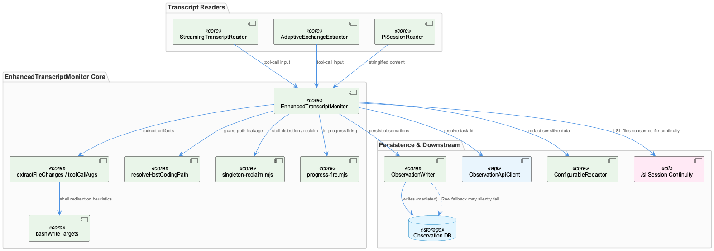
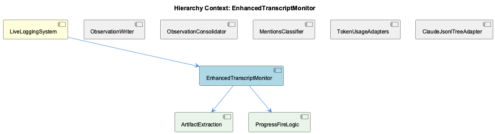

# EnhancedTranscriptMonitor

**Type:** SubComponent

# EnhancedTranscriptMonitor — Technical Insight Document

## What It Is

EnhancedTranscriptMonitor (ETM) is implemented in `scripts/enhanced-transcript-monitor.js` as the `EnhancedTranscriptMonitor` class. It is the live transcript-polling monitor within LiveLoggingSystem, responsible for watching agent transcripts, extracting artifacts, resolving fire timing, and handing off observations for persistence. Rather than implementing its logic inline as a monolith, ETM composes many small, pure-function modules from `lib/live-logging/*.mjs` and `lib/lsl/token/*.mjs`, and delegates heavily to helper functions defined alongside it in the same file (`resolveHostCodingPath`, `extractFileChanges`, `toolCallArgs`, `bashWriteTargets`).

## Architecture and Design

ETM's design reflects several deliberate patterns. First, an **Adapter/normalization pattern** (`toolCallArgs`) unifies cross-agent tool-call shapes — StreamingTranscriptReader/AdaptiveExchangeExtractor's `input` object versus PiSessionReader's stringified `content` — into a single lookup path. Second, a **Mediator pattern** decouples ETM from direct database writes: ETM imports `ObservationWriter` from `../src/live-logging/ObservationWriter.js` directly, and all persistence flows through that mediator rather than through ETM itself. Third, a **heuristic allowlist/denylist filtering** approach in `bashWriteTargets()` biases toward false negatives over false positives, an explicit design philosophy that a missed artifact is preferable to an invented one. Fourth, a **singleton-lock with liveness-based reclaim** pattern governs multi-instance coordination, layered onto the core transcript-polling loop as an independent concern from cadence/progress firing.

Two of ETM's own children formalize distinct sub-concerns: ArtifactExtraction (the `toolCallArgs`/`bashWriteTargets`/`extractFileChanges` trio) and ProgressFireLogic (imported from `progress-fire.mjs`). This separation shows ETM acting as an orchestrator that stitches together liveness detection, artifact extraction, and progress cadence rather than owning all logic monolithically.

## Implementation Details

`extractFileChanges()` and its helper `toolCallArgs()` implement agent-agnostic artifact extraction. `extractFileChanges` is explicitly documented as "a FREE FUNCTION, not just a method," so backfill tools can re-derive artifacts using exactly the same rules as the live tap — `_extractFileChanges` on the monitor delegates to it, avoiding drift between live capture and offline repair. This fixed a concrete data-loss bug: reading only `input` made the pi agent structurally incapable of reporting an artifact (0 of 21 pi observations carried one), corrected by broadening the args lookup.

`bashWriteTargets()` is a narrow, corpus-tuned heuristic for shell redirection artifacts (`>`, `>>`, `tee`, `sed -i`), built from measurement (136 of 1667 sampled bash calls carried a write signal) and tuned to avoid false positives from heredoc bodies, quoted operators, and scratch paths.

ETM also imports singleton-reclaim primitives (`computeObservationStalled`, `evaluateHolderLiveness`, `decideReclaim`) and progress-fire primitives (`sumOutputTokens`, `progressFireDecision`, `DEFAULT_PROGRESS_TOKEN_DELTA`) from `singleton-reclaim.mjs` and `progress-fire.mjs` respectively — implementing stall-detection/reclaim and periodic in-progress firing so long turns (e.g., 40-minute turns) aren't collapsed into a single prompt-time row. `resolveHostCodingPath` guards against container/host path leakage into ETM's own filesystem operations.

## Integration Points

ETM sits within LiveLoggingSystem alongside siblings ObservationWriter, ObservationConsolidator, MentionsClassifier, TokenUsageAdapters, and ClaudeJsonlTreeAdapter. Its tightest coupling is to ObservationWriter, which mediates all observation persistence, applying turn-aware semantic dedup and snapshot promotion — but with a known caveat: `[Raw]` fallback observations (generated when a proxy call times out during classification) are logged by ETM as "storing" yet have been repeatedly observed to silently fail to persist, meaning ETM's own fire-and-log success signal is not trustworthy evidence of durable storage for that observation class.

ETM's fire-time logic also shares the task-id resolution path (`resolveLiveTaskIdSafe` from `lib/lsl/token/task-id.mjs`, plus `ObservationApiClient`) used by the token-capture subsystem, coupling it to the same infrastructure as TokenUsageAdapters. Downstream, the `/sl` (Session Logs) command reads the same LSL-format transcript files ETM writes via `LSLFileManager`/`lslWritePath`, positioning ETM as the upstream producer whose output `/sl` consumes for session-continuity reconstruction — a dependency not visible from ETM's source alone. Test coverage reflects this intersection of concerns: `testEnhancedTranscriptMonitorCoordination` (multi-user-collision.test.js) exercises singleton coordination, while `enhancedTranscriptMonitorIntegration` (redaction-system.test.js) exercises redaction integration via `ConfigurableRedactor` and the `redact` call.

## Usage Guidelines

Developers modifying artifact extraction should treat `extractFileChanges()` as the single source of truth and route both live and backfill code paths through it, rather than reintroducing inline copies that could drift from the daemon's rules (as happened previously with Edit/Write-only, `file_path`/`filePath`-only logic). Changes to `bashWriteTargets()` should preserve its conservative bias — prefer missed artifacts over invented ones — and any adjustment should be validated against representative bash-call corpora. Because ObservationWriter's "storing" log line is not proof of persistence for `[Raw]` fallback observations, do not treat ETM's own logs as a durability guarantee; downstream verification against the database is needed for that observation class. Finally, because `/sl` and other consumers depend on ETM's LSL output format, changes to file-writing behavior should be checked against that consumption path, not just against ETM's own tests.

## Code Evidence

Key code artifacts grounding this entity's analysis:

**Structural:**
- EnhancedTranscriptMonitor (class) in enhanced-transcript-monitor.js
- testEnhancedTranscriptMonitorCoordination (method) in multi-user-collision.test.js
- enhancedTranscriptMonitorIntegration (method) in redaction-system.test.js

**Relationships:**
- Calls: generateLSLFilename, initialize, redact
- scripts/enhanced-transcript-monitor.js is the actual implementation file for the EnhancedTranscriptMonitor component, and it imports ObservationWriter from '../src/live-logging/ObservationWriter.js' directly, corroborating the [SESSION] record that ObservationWriter mediates all observation persistence between ETM and the database. The import also pulls in ObservationApiClient and resolveLiveTaskIdSafe from lib/lsl/token/task-id.mjs, showing ETM's fire-time logic is coupled to the same task-id resolution path used by the token-capture subsystem.
- bashWriteTargets() in enhanced-transcript-monitor.js is a deliberately narrow heuristic for extracting shell redirection artifacts (`>`, `>>`, `tee`, `sed -i`), built from corpus measurement (136 of 1667 sampled bash calls carried any write signal) and tuned to avoid false positives from heredoc bodies, quoted operators, and scratch paths — reflecting a design philosophy that a missed artifact is preferable to an invented one.
- ETM imports singleton-reclaim.mjs primitives (computeObservationStalled, evaluateHolderLiveness, decideReclaim) and progress-fire.mjs primitives (sumOutputTokens, progressFireDecision), indicating the monitor implements both a singleton-lock stall-detection/reclaim policy and periodic in-progress observation firing for long turns — two independent liveness/cadence concerns layered onto the core transcript-polling loop.

**Other:**
- extractFileChanges() and its helper toolCallArgs() in enhanced-transcript-monitor.js implement agent-agnostic artifact extraction across differing tool-call shapes (StreamingTranscriptReader/AdaptiveExchangeExtractor's `input` object vs PiSessionReader's stringified `content`), with an explicit note that reading only `input` made pi structurally incapable of reporting an artifact (0 of 21 pi observations carried one) — a concrete data-loss bug fixed by broadening the args lookup.

## Work Record

What working sessions recorded about this entity — decisions taken, problems hit, and why things are the way they are:

- Per the 'ObservationWriter — Semantic Dedup, Snapshot Promotion, and Raw Fallback Silent' record, ETM's own logs report [Raw] fallback observations (generated when a proxy call times out during classification) as 'storing', but these have been repeatedly observed to silently fail to persist to the database — meaning ETM's fire-and-log success signal is not trustworthy evidence of durable storage for this observation class.
- The 'Cross-Agent /sl (Session Logs) Command / LSL Session Continuity Bootstrap' record establishes that /sl reads LSL transcript files (the same LSL-format artifacts ETM writes via LSLFileManager and lslWritePath) to reconstruct a continuity summary — positioning ETM as the upstream producer whose output /sl later consumes for session recovery, a dependency not visible from ETM's own source alone.

## Hierarchy Context

### Parent
- [LiveLoggingSystem](./LiveLoggingSystem.md) -- [SESSION] ObservationWriter.js (per the 'ObservationWriter — Semantic Dedup, Snapshot Promotion, and Raw Fallback Silent' record) mediates all observation persistence between ETM and the database, applying turn-aware semantic dedup and snapshot promotion, but [Raw] fallback observations generated on proxy timeout are logged as 'storing' yet have been repeatedly observed to silently fail to persist

### Children
- [ArtifactExtraction](./ArtifactExtraction.md) -- [LLM+CGR] The component's implementation lives in scripts/enhanced-transcript-monitor.js as a trio of free functions — toolCallArgs(), bashWriteTargets(), and extractFileChanges() — matching the parent's [Calls] edge list (generateLSLFilename, initialize, redact) as siblings within the same file rather than a separate module. extractFileChanges() is explicitly documented as 'a FREE FUNCTION, not just a method' so that backfill tools can re-derive artifacts with exactly the rules the live tap uses, since prior inline copies (Edit/Write only, file_path/filePath only) could disagree with the daemon that originally wrote a row. This is a deliberate single-source-of-truth pattern: `_extractFileChanges` delegates to the free function and stays the monitor's entry point, avoiding logic drift between live capture and offline repair.
- [ProgressFireLogic](./ProgressFireLogic.md) -- [LLM+CGR] scripts/enhanced-transcript-monitor.js imports `DEFAULT_PROGRESS_TOKEN_DELTA, sumOutputTokens, progressFireDecision` from `../lib/live-logging/progress-fire.mjs`, with an inline comment describing the purpose as firing 'an extra observation each time a turn accumulates another token-delta of model output, so a 40-min turn isn't collapsed into a single prompt-time row.' This is the only trace of ProgressFireLogic in the supplied files — the import site, not the implementation.

### Siblings
- [ObservationWriter](./ObservationWriter.md) -- [SESSION] ObservationWriter — Semantic Dedup, Snapshot Promotion, and Raw Fallback Silent: [Raw] fallback observations generated on proxy timeout are logged as 'storing' yet have been repeatedly observed to silently fail to persist.
- [ObservationConsolidator](./ObservationConsolidator.md) -- [SESSION] Stage 5 Scheduled Observation Consolidation — Cost Model and Routing Gap: implements a dirty-parent-only scheduled re-consolidation strategy that re-synthesizes only parents with new children, far cheaper than full re-synthesis while nearly matching quality.
- [MentionsClassifier](./MentionsClassifier.md) -- [CGR] MentionsClassifier.js (module) in MentionsClassifier.js
- [TokenUsageAdapters](./TokenUsageAdapters.md) -- [LLM] `STOP_ADAPTERS` (lib/lsl/token/stop-adapter-registry.mjs) is the component's core data structure: a per-agent keyed registry where each entry declares `mode: 'transcript'` (claude, copilot, opencode) or `mode: 'stamp-only'` (pi), with only 'transcript' entries carrying a `build`/`locate` pair. This is a deliberate Strategy/Adapter hybrid — the keyed-map shape lets `captureForegroundTokens` treat all four agents uniformly while the mode flag encodes a hard invariant (D-04): only agents that bypass rapid-llm-proxy get a transcript rebuild, because building one for a proxy-routed agent would double-count tokens already present in `token_usage`.
- [ClaudeJsonlTreeAdapter](./ClaudeJsonlTreeAdapter.md) -- [LLM] lib/lsl/adapters/claude-jsonl-tree.mjs implements the Claude sub-agent transcript discovery path via `walkSubAgentJsonl()`, which recursively visits `~/.claude/projects/<encoded-cwd>/<parent-uuid>/subagents/agent-<hex>.jsonl` and filters every candidate through `SUBAGENT_PATH_RE` at the candidate stage rather than after conversion. The regex captures three groups — encoded-cwd, parent session UUID, and agent hex id — that are re-extracted downstream by three separate single-purpose functions (`projectFromClaudeSubagentPath`, `parentSessionFromClaudeSubagentPath`, `agentIdFromClaudeSubagentPath`) instead of being threaded through as a parsed object, so every caller that needs row metadata re-runs the same regex against the same path.

---

*Generated from 14 observations*
