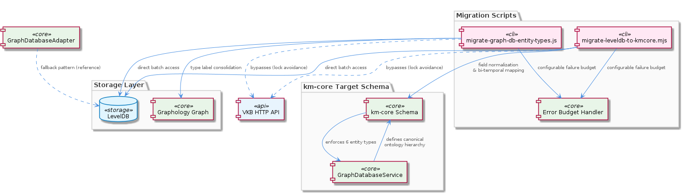
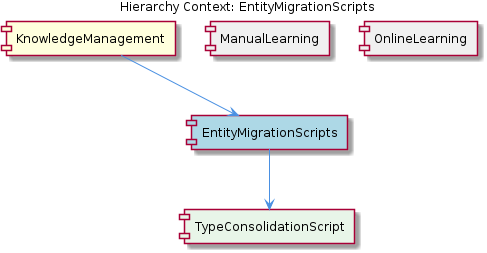

# EntityMigrationScripts

**Type:** SubComponent

migrate-leveldb-to-kmcore.mjs targets the six canonical entity types (System, Project, Component, SubComponent, Pattern, Detail) as the destination schema, enforcing the ontology hierarchy defined in GraphDatabaseService.

# EntityMigrationScripts

## What It Is

EntityMigrationScripts is a SubComponent of the KnowledgeManagement system that bundles the offline batch utilities responsible for evolving the shape and labeling of entities stored in the Graphology+LevelDB graph database. It is implemented as two distinct Node.js scripts: `migrate-graph-db-entity-types.js`, which handles entity-type consolidation (renaming or merging type labels in place), and `migrate-leveldb-to-kmcore.mjs`, which performs the canonical shape migration from raw LevelDB records into the km-core schema. Together they cover the two principal migration concerns: label/type mutation and field-level schema normalization.

Within the parent KnowledgeManagement component — which provides the Graphology+LevelDB graph store, the VKB HTTP API, and the entity ontology — these scripts occupy the maintenance/lifecycle role. While sibling components such as ManualLearning and OnlineLearning produce and update typed entities at authoring or extraction time, EntityMigrationScripts is the mechanism that retroactively brings the persisted dataset into conformance with the current ontology and schema. The child entity TypeConsolidationScript narrowly scopes one of these concerns: it is the specific implementation behind `migrate-graph-db-entity-types.js`, focused on entity-type label mutation rather than general graph restructuring.

## Architecture and Design

The architectural approach is best characterized as **direct-store batch transformation with bounded fault tolerance**. Both scripts deliberately bypass the VKB HTTP API and operate on LevelDB directly. This is not an oversight but a considered design choice: large batch rewrites would otherwise contend with the API server's locks on the underlying store, leading to deadlocks or degraded throughput. By taking the direct path, the scripts mirror the GraphDatabaseAdapter fallback pattern that is already used in OnlineLearning when the MCP semantic analysis server is unavailable — reusing an established escape hatch from the parent component's dual-path access model (VKB API plus direct LevelDB).

A second architectural decision shared by both scripts is the **error budget pattern**. Rather than failing fast on the first malformed record — which would be catastrophic for long-running migrations over potentially thousands of entities — each script accepts a configurable threshold of per-entity failures before aborting. This converts migration from an all-or-nothing operation into a resilient batch process where partial progress is preserved and a small number of corrupt or unexpected records do not block the larger transformation. The trade-off is explicit: operators must inspect failure logs after a run to verify the survivors and remediate the rejected entities.

The split into two scripts reflects a **separation of migration concerns** by transformation type. `migrate-graph-db-entity-types.js` is a vocabulary-level operation: it mutates type labels but leaves the underlying record shape intact. `migrate-leveldb-to-kmcore.mjs` is a structural operation: it rewrites records into the km-core schema, normalizing fields for ontology classification and bi-temporal tracking. Keeping these in separate executables means each can be run independently, ordered as needed, and reasoned about in isolation.

## Implementation Details

`migrate-graph-db-entity-types.js` performs type consolidation within the existing Graphology+LevelDB store. Its purpose is to rename or merge entity type labels — for example, collapsing two near-duplicate labels into a single canonical one — without reconstructing the graph from scratch. Because Graphology nodes carry their type as a metadata field, this operation traverses nodes, rewrites the type field, and persists the updated node back to LevelDB. The graph topology (edges and parent/child relationships) is preserved across the rewrite.

`migrate-leveldb-to-kmcore.mjs` is the heavier transformation. It reads raw LevelDB records and produces records that conform to the km-core schema, which is the canonical destination shape used by the GraphDatabaseService. This includes normalizing the fields that support ontology classification and the bi-temporal staleness tracking that the parent KnowledgeManagement component relies on. The migration targets the six canonical entity types — **System, Project, Component, SubComponent, Pattern, and Detail** — enforcing the ontology hierarchy defined in GraphDatabaseService. Records whose source types map cleanly into one of these six are normalized; records that fail mapping count against the error budget.

Both scripts implement the error-budget mechanism as a counter incremented on each per-entity failure, compared against a configurable ceiling. When the ceiling is exceeded, the script aborts cleanly rather than continuing into uncertain state. This implementation pattern provides both safety (catastrophic data corruption is detected early) and forgiveness (a handful of bad records does not destroy a multi-hour run).

## Integration Points

The most important integration boundary is with the **GraphDatabaseService** in the parent KnowledgeManagement component. The migration scripts read and write the same Graphology+LevelDB store that GraphDatabaseService manages at runtime, and they encode knowledge of that service's ontology hierarchy — specifically the six-type canonical schema (System, Project, Component, SubComponent, Pattern, Detail). Any change to the canonical ontology in GraphDatabaseService implies a corresponding update to `migrate-leveldb-to-kmcore.mjs`.

The scripts also have a deliberate **non-integration** with the VKB HTTP API. By bypassing it, they avoid the lock conflicts that would otherwise arise during batch rewrites. This is the same operational concern that motivates the GraphDatabaseAdapter fallback used by OnlineLearning's PersistenceAgent — when the MCP semantic analysis server is running, writes route through the VKB API, but when it is unavailable (or when, as here, the API would contend for locks), the direct LevelDB path is used. EntityMigrationScripts can be understood as a permanent occupant of that direct-access path.

Relative to its siblings: ManualLearning and OnlineLearning are the *producers* of entity records that EntityMigrationScripts later transforms. ManualLearning entities are authored as typed nodes carrying rich metadata; OnlineLearning entities flow through `mapEntityToSharedMemory()` in the PersistenceAgent to pre-populate ontology fields. EntityMigrationScripts ensures that records produced by either path, possibly under earlier schema versions, end up consistent with the current km-core shape.

## Usage Guidelines

Run migration scripts only when the VKB HTTP API server and any MCP semantic analysis server consumers are stopped. Although the scripts are designed to bypass the API, concurrent writes from other components against the same LevelDB store will produce undefined results. Treat each migration run as an exclusive operation on the database.

Choose the right script for the task. Use `migrate-graph-db-entity-types.js` (the TypeConsolidationScript) when only entity-type labels need to change — for instance, when consolidating duplicate or deprecated type names. Use `migrate-leveldb-to-kmcore.mjs` when the underlying record shape needs to be brought into the km-core schema, including normalization of ontology classification and bi-temporal fields. When both operations are needed, run shape migration first so that subsequent type consolidation operates against the canonical record shape.

Configure the error budget thoughtfully. A budget of zero gives strict fail-fast behavior suitable for clean, well-understood datasets. A more generous budget is appropriate for legacy data where a small fraction of records is expected to be malformed; in those cases, always review the failure log after the run and decide whether to manually remediate or discard the rejected entities. Because the scripts write directly to LevelDB, take a backup of the store before running, since the operations are not transactional across the full dataset.

Finally, remember that the destination schema is anchored to the six canonical entity types enforced by GraphDatabaseService. Do not extend `migrate-leveldb-to-kmcore.mjs` to introduce new top-level types without first updating the ontology hierarchy in GraphDatabaseService — the migration script is a consumer of that contract, not the place to define it.

## Hierarchy Context

### Parent
- [KnowledgeManagement](./KnowledgeManagement.md) -- The KnowledgeManagement component provides knowledge graph storage, query, and lifecycle management for the Coding project. It centers on a Graphology+LevelDB graph database (GraphDatabaseService) that stores entities as typed nodes with rich metadata, exposed through both a direct-access path and a VKB HTTP API. The component supports multiple entity types (System, Project, Component, SubComponent, Pattern, Detail) with ontology classification, bi-temporal staleness tracking, embedding vectors, and hierarchical parent/child relationships. It integrates with the MCP semantic analysis server via PersistenceAgent and GraphDatabaseAdapter, which route writes through the VKB API when the server is running or fall back to direct LevelDB access to avoid lock conflicts.

### Children
- [TypeConsolidationScript](./TypeConsolidationScript.md) -- The sub-component description explicitly names migrate-graph-db-entity-types.js as the implementation file, scoping this script narrowly to entity-type label mutations rather than general graph restructuring.

### Siblings
- [ManualLearning](./ManualLearning.md) -- ManualLearning entities are typed nodes in the GraphDatabaseService (Graphology+LevelDB) with entity types including System, Project, Component, SubComponent, Pattern, and Detail, each carrying rich metadata fields set at authoring time.
- [OnlineLearning](./OnlineLearning.md) -- The batch analysis pipeline routes extracted entities through the PersistenceAgent, which calls mapEntityToSharedMemory() to pre-populate ontology metadata fields before persisting via the VKB HTTP API or direct LevelDB fallback.

---

*Generated from 5 observations*
