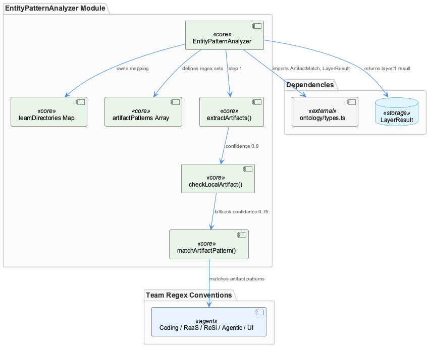
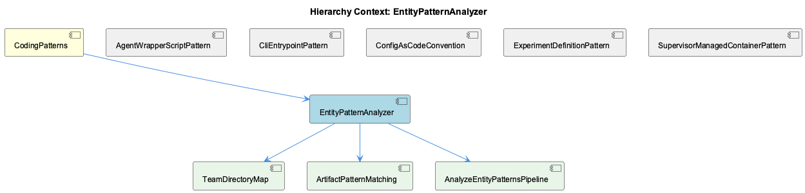

# EntityPatternAnalyzer

**Type:** SubComponent

Five teams are modeled (Coding, RaaS, ReSi, Agentic, UI), each with distinct regex conventions, e.g. ReSi matches /VirtualTarget|EmbeddedFunction/i and UI matches /React(Component)?|Redux/i

# EntityPatternAnalyzer: Technical Insight Document

## What It Is

`EntityPatternAnalyzer` is a class implemented in `EntityPatternAnalyzer.ts`, functioning as the first classification layer (`layer:1`) in a broader entity/artifact analysis pipeline. It exists as a child concept of `CodingPatterns`, and its role is to inspect artifacts extracted from some source of "knowledge" content and classify them by team ownership and entity type using a combination of directory conventions and regex-based pattern matching. The module imports its core types (`ArtifactMatch`, `LayerResult`) from `ontology/types.ts`, indicating it participates in a shared typed ontology system used across the Coding infrastructure.

## Architecture and Design

The design centers on two complementary classification strategies, both encapsulated within the class and exposed as distinct conceptual children: `TeamDirectoryMap` and `ArtifactPatternMatching`. `TeamDirectoryMap` is a hardcoded `Map` (`teamDirectories`) tying directory paths — e.g., `src/ontology`, `src/knowledge-management`, `scripts`, `.specstory` — to owning teams such as 'Coding'. `ArtifactPatternMatching` complements this with an `artifactPatterns` array, where each entry defines a team, a list of `RegExp` patterns, and an `entityClassMap` for resolving matched artifacts to specific entity classes (e.g., `/LSL(Session|Monitor|Classifier)/i`, `/VirtualTarget|EmbeddedFunction/i` for ReSi, `/React(Component)?|Redux/i` for UI).

This dual-strategy design reflects a deliberate precedence order: structural/location-based matching is treated as more reliable evidence than lexical/regex matching, which is reified in the confidence scoring (0.9 vs 0.75, discussed below). The five hardcoded teams (Coding, RaaS, ReSi, Agentic, UI) mirror the organizational structure of the codebase itself, embedding team boundaries directly into the analysis logic rather than deriving them dynamically.

## Implementation Details

The orchestration entry point, `analyzeEntityPatterns()` — implemented as `AnalyzeEntityPatternsPipeline` — first calls `extractArtifacts(knowledge.content)` to pull candidate artifacts out of raw content, short-circuiting with `null` if none are found. For each artifact, it applies a two-step matching cascade: `checkLocalArtifact()` is tried first, awarding confidence 0.9 when a directory-based match succeeds, and `matchArtifactPattern()` is used as a fallback, awarding confidence 0.75 for regex-based matches. This ordering encodes a design decision that physical location within the repository is stronger evidence of team ownership than naming convention alone.

The result of analysis is a `LayerResult` object, annotated with `layer:1`, `layerName:'EntityPatternAnalyzer'`, the derived confidence score, and a `processingTime` measured via `performance.now()`. The explicit performance instrumentation and stated target of sub-millisecond response time indicate this layer is designed to be a fast, low-overhead first-pass filter rather than an exhaustive or expensive classifier — consistent with its position as "layer 1" in what is implied to be a multi-layer analysis pipeline.

## Integration Points

`EntityPatternAnalyzer` depends on shared ontology types (`ArtifactMatch`, `LayerResult` from `ontology/types.ts`), tying it into a broader typed contract used elsewhere in the system. As a component of `CodingPatterns`, it sits alongside sibling patterns like `AgentWrapperScriptPattern`, `CliEntrypointPattern`, `ConfigAsCodeConvention`, `ExperimentDefinitionPattern`, and `SupervisorManagedContainerPattern` — though these are largely unrelated in mechanism, they share the same parent grouping of Coding-infrastructure conventions. Its own children — `TeamDirectoryMap`, `ArtifactPatternMatching`, and `AnalyzeEntityPatternsPipeline` — are not independent modules but decomposed aspects of the single class's internal logic, useful for reasoning about the class in parts.

## Usage Guidelines

Developers extending team coverage or artifact classification should treat `teamDirectories` and `artifactPatterns` as the two canonical extension points: new directories should be added to the `teamDirectories` Map, and new naming conventions should be added as `RegExp` entries within the appropriate team's `artifactPatterns` entry along with corresponding `entityClassMap` keys. Because directory-based matches are trusted more (confidence 0.9) than regex matches (0.75), any ambiguity between the two should be resolved by preferring accurate directory placement over relying on naming heuristics alone. Given the stated <1ms performance target, implementers should avoid introducing expensive operations (e.g., complex regex backtracking or I/O) into either `checkLocalArtifact()` or `matchArtifactPattern()`, preserving the layer's role as a lightweight first-pass classifier ahead of any subsequent, more expensive analysis layers.

## Code Evidence

Key code artifacts grounding this entity's analysis:

**Structural:**
- EntityPatternAnalyzer (class) in EntityPatternAnalyzer.ts

**Relationships:**
- Imports: ontology/types.ts, ArtifactMatch, LayerResult

**Other:**
- EntityPatternAnalyzer.ts (module) in EntityPatternAnalyzer.ts

## Hierarchy Context

### Parent
- [CodingPatterns](./CodingPatterns.md) -- [LLM] The agent wrapper scripts under config/agents/ (claude.sh, copilot.sh, opencode.sh, pi.sh) implement a consistent adapter pattern where each script normalizes a distinct third-party CLI's invocation surface into a common interface expected by the rest of the Coding infrastructure. Rather than having callers branch on which agent is being invoked, each wrapper reads its own set of environment variables (e.g., CODING_OPENCODE_MODEL for opencode.sh) and translates them into the flags or config files that the underlying binary expects. This pattern lets orchestration code (likely in bin/coding or docs/architecture/agent-abstraction-api.md-described layers) treat all agents uniformly, at the cost of needing to keep each wrapper script in sync whenever a new common capability (like model selection or proxy routing) is added — a new developer adding agent support should look at an existing wrapper like claude.sh as the canonical template, per docs/architecture/adding-new-agent.md.

### Children
- [TeamDirectoryMap](./TeamDirectoryMap.md) -- teamDirectories in EntityPatternAnalyzer.ts constructor is a Map with keys 'Coding', 'RaaS', 'ReSi', 'Agentic', 'UI' mapping to arrays of directory strings
- [ArtifactPatternMatching](./ArtifactPatternMatching.md) -- artifactPatterns array in EntityPatternAnalyzer.ts defines ArtifactPattern objects each with team, patterns (RegExp[]), and entityClassMap
- [AnalyzeEntityPatternsPipeline](./AnalyzeEntityPatternsPipeline.md) -- analyzeEntityPatterns() in EntityPatternAnalyzer.ts calls extractArtifacts(knowledge.content) and returns null if no artifacts found

### Siblings
- [AgentWrapperScriptPattern](./AgentWrapperScriptPattern.md) -- Each wrapper reads a distinct env var namespace, e.g. CODING_OPENCODE_MODEL for opencode.sh, to select model configuration without changing caller code
- [CliEntrypointPattern](./CliEntrypointPattern.md) -- scripts/knowledge-management/verify-patterns.sh acts as a standalone CLI entrypoint invoked directly rather than through a shared bin/ dispatcher, computing paths relative to SCRIPT_DIR
- [ConfigAsCodeConvention](./ConfigAsCodeConvention.md) -- verify-patterns.sh reads pattern definitions dynamically from a jq-queried JSON knowledge base file ($SHARED_MEMORY) filtering entities by entityType == 'TransferablePattern' and significance >= 8
- [ExperimentDefinitionPattern](./ExperimentDefinitionPattern.md) -- docs/benchmarks/coding-v1/README.md and RESULTS.md describe a benchmark named coding-v1 whose configuration/results are documented separately from code, implying a declarative experiment definition
- [SupervisorManagedContainerPattern](./SupervisorManagedContainerPattern.md) -- No supervisord configuration files or Dockerfile content were present in the provided Source Files to substantiate specific observations

---

*Generated from 8 observations*
