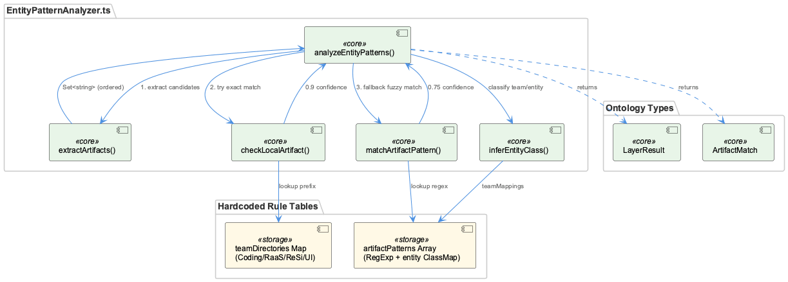
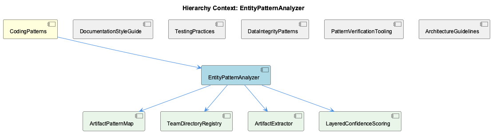

# EntityPatternAnalyzer

**Type:** SubComponent

# EntityPatternAnalyzer — Technical Insight Document

## What It Is

EntityPatternAnalyzer is implemented as a single class in `src/ontology/heuristics/EntityPatternAnalyzer.ts` (module docstring at lines 1-15), positioned as "Layer 1" of what the documentation implies is a multi-layer classification pipeline. It imports `LayerResult` and `ArtifactMatch` from `../types.js` (the ontology types module) and has no other external dependencies — all team and pattern knowledge is compiled directly into the class body. Structurally it belongs to the CodingPatterns parent grouping, sitting alongside sibling documentation and process concerns like TestingPractices and DataIntegrityPatterns, though its actual function is code-level heuristic classification rather than documentation or process governance.

Its core job is to inspect raw knowledge content, extract candidate artifact strings (file paths, npm packages, class names, directories), and classify them against a hardcoded set of four teams — Coding, RaaS, ReSi, and UI — producing a `LayerResult`/`ArtifactMatch` with an associated confidence score.

## Architecture and Design

The class follows a chain-of-responsibility pattern with short-circuit evaluation: `analyzeEntityPatterns()` calls `extractArtifacts()` to generate candidates, then for each candidate tries `checkLocalArtifact()` (a fast directory-prefix match) before falling back to `matchArtifactPattern()` (regex-based matching against per-team `ArtifactPattern` definitions). The method returns on the **first** artifact producing either kind of match — an implicit priority policy driven entirely by `extractArtifacts()`'s Set insertion order (file paths, then npm packages, then class names, then bare directories), a design decision that is not documented anywhere in the class itself.

The rule-table pattern is central to the design: team ownership is expressed as data (a `teamDirectories` Map and an `artifactPatterns` array) rather than branching logic, giving the appearance of extensibility. In practice, however, this data is compiled directly into the class rather than externalized to a config file — the only conceptual children, ArtifactPatternMap and TeamDirectoryRegistry, are not standalone modules but simply named views onto this internal constructor state. Extending team coverage therefore requires direct code edits, not data-driven configuration.

## Implementation Details

`extractArtifacts()` (child concept ArtifactExtractor, though no such standalone module exists) runs four independent regexes — `filePathPattern`, `npmPattern`, `classPattern`, `dirPattern` — and unions their matches into a single `Set<string>`. This union can produce overlapping or duplicate-feeling entries when a single token satisfies multiple patterns, and the resulting iteration order directly determines match precedence downstream. Notably, `classPattern` whitelists suffixes including `Analyzer`, meaning EntityPatternAnalyzer's own class name would satisfy its own extraction regex — a self-referential edge case with no visible guard.

`checkLocalArtifact()` and `matchArtifactPattern()` assign confidence scores of 0.9 and 0.75 respectively — static literals tied to which code branch executed rather than any measured precision (child concept LayeredConfidenceScoring formalizes this observation but corresponds to no real class, just these two constants). The "Layer 1"/fast-first-pass framing and the docstring's "<1ms response time" claim are similarly aspirational: `performance.now()` is used to measure `processingTime` per call, but nothing in the file aggregates or asserts against that budget.

The `teamDirectories` Map and `artifactPatterns` array hardcode exactly four teams with disjoint directory prefixes (e.g., `src/ontology` only under Coding) and disjoint regex vocabularies (Kubernetes/Argo for RaaS vs. VirtualTarget/MF4Container for ReSi). `inferEntityClass()`/`inferEntityClassFromPattern()` (partially truncated in source) draw on a `teamMappings` table that additionally references an "Agentic" category not present in the directory/pattern data structures.

## Integration Points

The only formal external dependency is the ontology `types.ts` module, supplying `LayerResult` and `ArtifactMatch` — the shapes this analyzer must produce. Everything else (team taxonomy, directory prefixes, regex vocabularies) is self-contained within the class, which makes the component easy to reason about in isolation but tightly couples team-specific knowledge to this one file rather than a shared registry.

Downstream, the entity-class inference performed here presumably feeds manifest/graph entity creation — the DataIntegrityPatterns sibling's Metadata Merge Bug record is directly relevant here: a misclassification at this layer is a plausible upstream source of the manifest/graph description drift that record describes, since a stale or incorrect team classification would propagate into whatever entity gets built from it.

## Usage Guidelines

Because the short-circuit chain returns on the first artifact match, callers should be aware that when content contains multiple plausible artifacts, `extractArtifacts()`'s implicit ordering (paths > packages > class names > directories) — not any explicit priority rule — decides the outcome. Anyone modifying `extractArtifacts()`'s regex order or adding new extraction patterns should treat this as a behavior-changing edit, not a safe refactor.

The confidence values (0.9, 0.75) should not be treated as statistically meaningful; they are branch-tied constants and should be revisited if this analyzer's output is ever used for threshold-based decisions elsewhere. Similarly, the "<1ms" performance claim in the docstring is unverified in-file and should not be relied upon without separate benchmarking.

Adding a fifth team, or supporting new artifact conventions, requires direct edits to `teamDirectories` and `artifactPatterns` inside EntityPatternAnalyzer.ts — there is no plugin or config-file extension point. Finally, the TestingPractices sibling's node:test discovery lesson applies directly here: because this analyzer is fundamentally a heuristic regex/string classifier, content in an unanticipated shape (e.g., a path not matching the expected lowercase directory structure of `filePathPattern`) will be silently dropped rather than flagged, so classification gaps may not surface as errors.

## Code Evidence

Key code artifacts grounding this entity's analysis:

**Structural:**
- EntityPatternAnalyzer (class) in EntityPatternAnalyzer.ts

**Relationships:**
- Imports: ontology/types.ts, ArtifactMatch, LayerResult
- EntityPatternAnalyzer.ts imports LayerResult and ArtifactMatch from ontology/types.ts and implements a two-step, single-layer classification: analyzeEntityPatterns() first calls extractArtifacts() to pull candidate strings out of raw knowledge content, then for each candidate tries checkLocalArtifact() (directory-prefix match against a hardcoded Map of team->directories) before falling back to matchArtifactPattern() (regex match against per-team ArtifactPattern definitions). The function returns on the FIRST artifact that produces either kind of match, so ordering of extractArtifacts()'s output (Set insertion order: file paths, then npm packages, then class names, then bare directories) determines which candidate wins when a content blob contains multiple plausible artifacts — this is an implicit priority policy that isn't documented anywhere in the class.
- The teamDirectories Map and artifactPatterns array both hardcode exactly four teams (Coding, RaaS, ReSi, UI) with disjoint, non-overlapping directory prefixes (e.g. 'src/ontology' only under Coding) and disjoint regex vocabularies (Kubernetes/Argo for RaaS vs VirtualTarget/MF4Container for ReSi). Adding a fifth team or a new artifact convention requires editing this class directly since there is no external config file or plugin registration visible in the imports (only LayerResult/ArtifactMatch types come from outside) — team taxonomy is compiled into the analyzer rather than data-driven.

**Other:**
- EntityPatternAnalyzer.ts (module) in EntityPatternAnalyzer.ts

## Work Record

What working sessions recorded about this entity — decisions taken, problems hit, and why things are the way they are:

- The Test Inventory Discovery — node:test Compatibility work record establishes that this project's test-inventory tooling previously used import-style heuristics (matching mocha/jest-style imports) to decide which files count as tests, and silently skipped node:test-based files as a result; this is directly relevant to EntityPatternAnalyzer's own extractArtifacts()/pattern-matching design, which is structurally the same kind of heuristic string/regex classifier and carries the same class of risk — a content blob referencing an artifact in a style the regexes don't anticipate (e.g. a path lacking the expected 'lowercase/lowercase/...' directory shape required by filePathPattern) would be silently dropped rather than flagged.
- The Metadata Merge Bug — Destructive Overwrite Pattern work record establishes a discipline of not treating a fix as closed until re-measured, because manifest-level and graph-level descriptions and capturedBy edge counts had drifted out of sync across a multi-stage effort. This is germane to EntityPatternAnalyzer's entityClass inference (inferEntityClass/inferEntityClassFromPattern), where a team-classification decision made here presumably feeds into whatever manifest/graph entity gets created downstream — a classification bug in this layer would manifest as exactly the kind of stale/drifted entity metadata that record describes, making this component a plausible upstream source of that class of defect.

## Hierarchy Context

### Parent
- [CodingPatterns](./CodingPatterns.md) -- [SESSION] Documentation Style Guide for Diagrams and Markdown establishes that .puml source files must live in docs/puml/, and clarifies which generated diagram artifacts belong in version control versus being build outputs, enforcing consistent authoring and correct rendering across the docs pipeline.

### Children
- [ArtifactPatternMap](./ArtifactPatternMap.md) -- [LLM+CGR] The 'ArtifactPatternMap' component is not itself a distinct file or class — it appears only conceptually, as the composite of EntityPatternAnalyzer.ts's teamDirectories Map and artifactPatterns array. No separate module named ArtifactPatternMap exists in the code graph; the closest artifacts are the constructor-defined data structures inside EntityPatternAnalyzer's class body.
- [TeamDirectoryRegistry](./TeamDirectoryRegistry.md) -- [LLM+CGR] No file, class, or export named 'TeamDirectoryRegistry' appears anywhere in the supplied code. The closest structure is the private `teamDirectories` field declared in `src/ontology/heuristics/EntityPatternAnalyzer.ts` (constructor, lines ~30-46) — a `Map<string, string[]>` built inline with four hardcoded teams (Coding, RaaS, ReSi, UI) and their directory prefixes. It is a field of `EntityPatternAnalyzer`, not an independently named or exported registry component, and there is no separate module, class, or interface that constitutes 'TeamDirectoryRegistry' as a standalone entity.
- [ArtifactExtractor](./ArtifactExtractor.md) -- [LLM] No entity or file named 'ArtifactExtractor' appears anywhere in the supplied code. The only structurally similar element is the private method `extractArtifacts()` inside `EntityPatternAnalyzer` (src/ontology/heuristics/EntityPatternAnalyzer.ts), which is a lowercase-verb method on the analyzer class, not a standalone 'ArtifactExtractor' component. Retrieval appears to have matched on the word 'Artifact' (also present in the imported `ArtifactMatch` type and the `ArtifactPattern` interface) rather than surfacing a real ArtifactExtractor definition.
- [LayeredConfidenceScoring](./LayeredConfidenceScoring.md) -- [LLM+CGR] The two hardcoded confidence values (0.9 in checkLocalArtifact, 0.75 in matchArtifactPattern) inside EntityPatternAnalyzer.ts constitute the entire 'layered confidence' scheme visible in this file: there is no LayeredConfidenceScoring class, function, or module present anywhere in the supplied code — only these two literal numbers assigned directly in analyzeEntityPatterns() when constructing the returned LayerResult objects.

### Siblings
- [DocumentationStyleGuide](./DocumentationStyleGuide.md) -- [SESSION] Documentation Style Guide for Diagrams and Markdown establishes that .puml source files must live in docs/puml/, enforcing a single canonical location for diagram authoring.
- [TestingPractices](./TestingPractices.md) -- [SESSION] Test Inventory Discovery — node:test Compatibility ensures test files using node:test imports are recognized and included by the test-inventory tooling, so they actually execute instead of being silently skipped.
- [DataIntegrityPatterns](./DataIntegrityPatterns.md) -- [SESSION] Metadata Merge Bug — Destructive Overwrite Pattern tracks a multi-stage effort to keep manifest-level and graph-level parent entity descriptions synchronized after a merge bug caused divergence.
- [PatternVerificationTooling](./PatternVerificationTooling.md) -- [SESSION] Post-Rewrite Render Error Triage establishes the verification discipline for distinguishing pre-existing render errors from regressions after a large rewrite, so fixes are prioritized correctly and false blame isn't assigned to unrelated recent changes.
- [ArchitectureGuidelines](./ArchitectureGuidelines.md) -- [SESSION] Design System — Editorial Methodology and Token-Based Theme Architecture establishes a token-based theming methodology, applying an editorial design discipline to system-level UI/architecture decisions.

---

*Generated from 12 observations*
