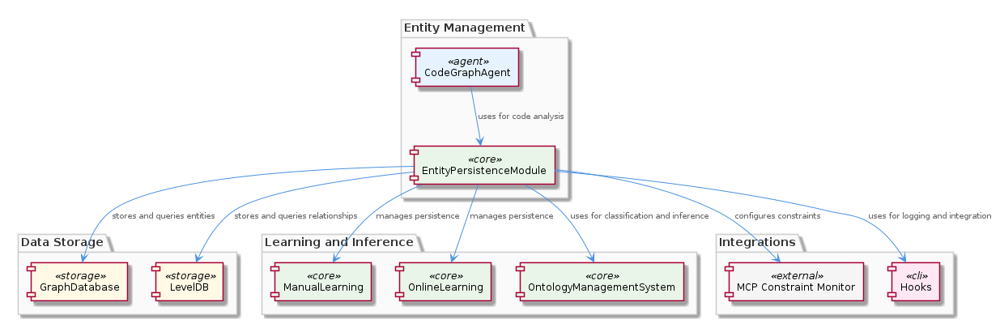
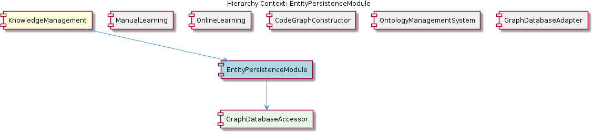

# EntityPersistenceModule

**Type:** SubComponent

EntityPersistenceModule may leverage the automatic JSON export sync feature provided by the GraphDatabaseAdapter to simplify the process of exporting entity and relationship data in JSON format.

## What It Is  

The **EntityPersistenceModule** lives inside the **KnowledgeManagement** component and is the concrete sub‑component responsible for persisting the entities and relationships that make up the system’s knowledge graph. Its implementation is anchored by the `GraphDatabaseAccessor` child component, which in turn relies on the shared **GraphDatabaseAdapter** (found at `storage/graph-database-adapter.ts`).  The module’s primary duty is to translate in‑memory representations of entities—produced by agents such as the **CodeGraphAgent** (`integrations/mcp-server-semantic-analysis/src/agents/code-graph-agent.ts`)—into durable graph structures stored via Graphology and LevelDB.  Because the adapter supplies an automatic JSON‑export sync capability, the EntityPersistenceModule can also keep a JSON snapshot of the graph up‑to‑date without additional plumbing.

## Architecture and Design  

The design follows a **layered persistence architecture** where the EntityPersistenceModule sits in the domain layer, delegating low‑level storage concerns to the GraphDatabaseAdapter.  The adapter abstracts the underlying Graphology‑LevelDB stack, exposing a thin API that the module’s accessor (`GraphDatabaseAccessor`) uses to create, read, update, and delete vertices and edges.  This separation mirrors the **Adapter pattern** (the GraphDatabaseAdapter adapts Graphology/LevelDB to the module’s needs) and a **Facade** provided by the accessor, which shields the rest of the system from storage‑specific details.

Interaction patterns are evident in the way sibling components share the same storage backbone.  **ManualLearning** and **OnlineLearning** both persist their extracted knowledge through the same adapter, ensuring a uniform data model across learning pipelines.  The **OntologyManagementSystem** also stores its classification and inference data via the adapter, reinforcing a single source of truth for all graph‑based artifacts.  The EntityPersistenceModule therefore acts as a hub that coordinates persistence for code‑analysis results (via CodeGraphAgent), ontology updates, and learning outcomes.

## Implementation Details  

At its core, the EntityPersistenceModule delegates every graph operation to **GraphDatabaseAccessor**, a child component whose responsibilities include constructing query objects, handling transaction boundaries, and invoking the adapter’s sync mechanisms.  The accessor likely exposes methods such as `saveEntity(entity)`, `fetchEntityById(id)`, and `linkEntities(sourceId, targetId, relationshipType)`.  These methods internally call the GraphDatabaseAdapter’s API, which wraps Graphology’s graph manipulation functions (`addNode`, `addEdge`, etc.) and persists changes to LevelDB.

The **automatic JSON export sync** feature of the adapter is leveraged by the module to maintain an up‑to‑date JSON representation of the graph.  Whenever the accessor commits a mutation, the adapter triggers a background job that serializes the current graph state to JSON and writes it to a predefined location, enabling downstream tools (e.g., visualization dashboards or external analytics pipelines) to consume a lightweight snapshot without directly querying LevelDB.

Configuration hooks are defined in `integrations/copi/docs/hooks.md`, allowing developers to plug in custom logging, monitoring, or tmux‑based session management around persistence events.  Similarly, constraint definitions found in `integrations/mcp-constraint-monitor/docs/constraint-configuration.md` can be loaded by the module to enforce semantic constraints (e.g., type consistency, relationship cardinality) before committing changes, ensuring data integrity across the knowledge graph.

## Integration Points  

The EntityPersistenceModule is tightly coupled with several peers:

* **CodeGraphAgent** (`integrations/mcp-server-semantic-analysis/src/agents/code-graph-agent.ts`) – feeds code‑analysis entities and relationships into the module for storage.  
* **OntologyManagementSystem** – supplies classification metadata that the module persists alongside code entities, enabling inference queries.  
* **ManualLearning** and **OnlineLearning** – both invoke the module to record manually curated knowledge or batch‑extracted insights, respectively.  
* **GraphDatabaseAdapter** (`storage/graph-database-adapter.ts`) – the foundational storage layer that the module’s accessor calls into.  

Hooks and constraint files (`hooks.md` and `constraint-configuration.md`) serve as extension points, allowing the module’s persistence workflow to be augmented without modifying core logic.  The parent **KnowledgeManagement** component orchestrates these interactions, positioning the EntityPersistenceModule as the central persistence gateway for all knowledge‑graph‑related activities.

## Usage Guidelines  

1. **Always route graph mutations through GraphDatabaseAccessor.** Direct calls to the GraphDatabaseAdapter bypass validation hooks and constraint checks, risking data inconsistency.  
2. **Leverage the JSON export sync** by ensuring that any bulk import or batch update triggers the accessor’s `commit` method, which in turn activates the adapter’s background serialization.  
3. **Configure hooks and constraints early** in the project’s initialization phase.  Adding entries to `integrations/copi/docs/hooks.md` (e.g., logging before `saveEntity`) and to `integrations/mcp-constraint-monitor/docs/constraint-configuration.md` (e.g., forbidding circular dependencies) guarantees they are applied to all subsequent persistence operations.  
4. **Respect the shared storage contract** with sibling components.  When extending the schema (adding new vertex or edge types), coordinate with ManualLearning, OnlineLearning, and OntologyManagementSystem to keep the graph model coherent.  
5. **Monitor LevelDB health** via the adapter’s health‑check utilities.  Since the entire KnowledgeManagement stack depends on this storage layer, periodic verification prevents cascading failures.

---

### Architectural Patterns Identified  
* **Adapter Pattern** – GraphDatabaseAdapter adapts Graphology/LevelDB to the module’s domain API.  
* **Facade (Accessor)** – GraphDatabaseAccessor provides a simplified interface for higher‑level components.  
* **Layered Persistence** – Separation of domain logic (EntityPersistenceModule) from storage mechanics (adapter).  

### Design Decisions and Trade‑offs  
* **Single‑source graph storage** simplifies consistency but creates a tight coupling to LevelDB; scaling beyond a single node would require re‑architecting the adapter.  
* **Automatic JSON export** reduces boilerplate for downstream consumers but adds background I/O overhead; developers must weigh snapshot frequency against performance.  

### System Structure Insights  
* The EntityPersistenceModule is the nexus for all graph‑based data, sitting under KnowledgeManagement and sharing the GraphDatabaseAdapter with multiple siblings, fostering a unified data model across learning, ontology, and code‑analysis domains.  

### Scalability Considerations  
* Current reliance on LevelDB limits horizontal scalability; sharding or migrating to a distributed graph store would be a future architectural evolution.  
* JSON export can be throttled or made incremental to mitigate bottlenecks as the graph grows.  

### Maintainability Assessment  
* Clear separation via accessor and adapter promotes testability and isolates changes to storage implementation.  
* Centralized hook and constraint configuration files provide extensibility without code changes, enhancing maintainability.  
* However, the tight inter‑dependency on a single storage technology means that any major upgrade to the persistence layer will ripple through all sibling components, requiring coordinated updates.

## Hierarchy Context

### Parent
- [KnowledgeManagement](./KnowledgeManagement.md) -- [LLM] The KnowledgeManagement component's utilization of the GraphDatabaseAdapter for persistence is a notable architectural aspect. This adapter, located in storage/graph-database-adapter.ts, enables the use of Graphology and LevelDB for storing and querying the knowledge graph. The automatic JSON export sync feature provided by this adapter simplifies the process of exporting graph data in JSON format, which can be beneficial for further analysis or integration with other components. For instance, the CodeGraphAgent, found in integrations/mcp-server-semantic-analysis/src/agents/code-graph-agent.ts, can leverage this adapter to store and retrieve code analysis results, thereby facilitating the management of entities and relationships within the knowledge graph.

### Children
- [GraphDatabaseAccessor](./GraphDatabaseAccessor.md) -- The parent analysis suggests the existence of a GraphDatabaseAccessor, which is likely utilized by the EntityPersistenceModule.

### Siblings
- [ManualLearning](./ManualLearning.md) -- ManualLearning likely utilizes the GraphDatabaseAdapter for persistence, as seen in storage/graph-database-adapter.ts, to store and query the knowledge graph.
- [OnlineLearning](./OnlineLearning.md) -- OnlineLearning likely utilizes the batch analysis pipeline to extract knowledge from various sources, such as git history and LSL sessions.
- [CodeGraphConstructor](./CodeGraphConstructor.md) -- CodeGraphConstructor likely utilizes the GraphDatabaseAdapter to store and query the constructed code graph.
- [OntologyManagementSystem](./OntologyManagementSystem.md) -- OntologyManagementSystem likely utilizes the GraphDatabaseAdapter to store and query the ontology.
- [GraphDatabaseAdapter](./GraphDatabaseAdapter.md) -- GraphDatabaseAdapter likely utilizes Graphology and LevelDB to store and query the knowledge graph.

---

*Generated from 7 observations*
