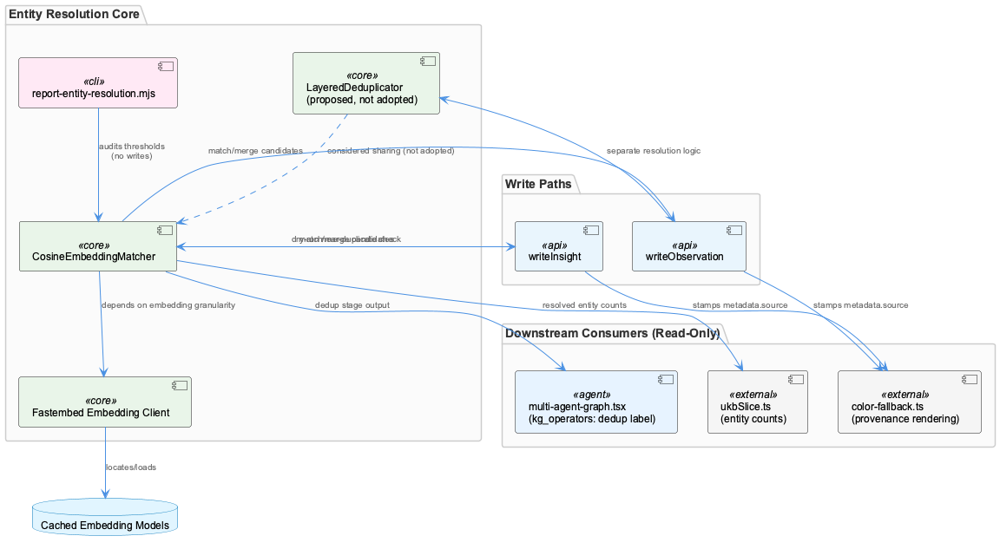
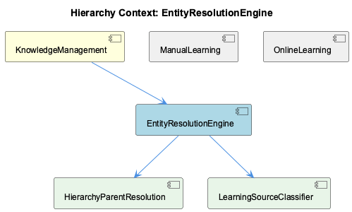

# EntityResolutionEngine

**Type:** SubComponent

## What It Is

EntityResolutionEngine is a subcomponent of KnowledgeManagement (km-core) responsible for deduplicating and merging entities using embedding-based similarity matching. Its concrete implementation is not present in the retrieved files — the actual resolver classes (e.g., `CosineEmbeddingMatcher`, `LayeredDeduplicator`) and the `report-entity-resolution.mjs` tuning script live outside the supplied file set. All five directly-inspected files (ukb-workflow-modal.tsx, multi-agent-graph.tsx, ukbSlice.ts, D3GraphCanvas.tsx, color-fallback.ts) are downstream dashboard/viewer consumers that render already-resolved entities rather than perform resolution. What can be documented here comes from session-level records describing the km-core resolution path and its dependencies, plus what the UI layer reveals indirectly about resolution's existence and outputs.

## Architecture and Design

The engine's design centers on embedding-based near-duplicate detection: a `CosineEmbeddingMatcher` compares vector embeddings produced via fastembed to identify candidate merges. This is a similarity-threshold architecture, not rule-based matching, and its correctness is entirely contingent on fastembed locating the correct pre-downloaded/cached model at the correct embedding granularity — a dependency documented as "silent-correctness" rather than availability-based, since a granularity mismatch doesn't fail loudly but instead produces false-positive entity merges.

A significant architectural decision surfaced in the Stage 3 investigation: unifying Observation and Insight writers behind a single shared `LayeredDeduplicator` resolver instance was proposed and explicitly **not adopted**, left open pending further direction. Consequently, Observations and Insights currently persist through **separate resolution logic paths** rather than a shared resolver — a deliberate (if provisional) divergence from a unified-service pattern.

Safety-first rollout is another recurring theme: embedding-based dedup is being integrated into the writeInsight write path behind a dry-run flag, so live writes remain unaffected until latency and precision are validated. Similarly, `report-entity-resolution.mjs` audits configured similarity thresholds against match/merge candidates without performing writes, enabling safe threshold tuning before any resolver logic is allowed to mutate persisted data.

## Implementation Details

Key named implementation elements (per session records, not directly viewable): `CosineEmbeddingMatcher` for cosine-similarity-based matching, `LayeredDeduplicator` as a candidate shared resolver, and `report-entity-resolution.mjs` as a threshold-auditing script. The fastembed client underpins embedding generation and is the load-bearing dependency for correctness.

On the consumption side, the wave pipeline UI (multi-agent-graph.tsx, `AGENT_SUBSTEPS['kg_operators']`) names but does not implement three pipeline stages relevant to this engine: `embed` (vector embeddings), `dedup` ("Remove duplicate entities using fuzzy matching and semantic comparison," `llmUsage: 'fast'`), and `merge` (graph merge). This confirms the engine's operational placement in the pipeline sequence even though its logic isn't present in the front-end code.

Downstream, resolved entities carry a `metadata.source` provenance flag (values like 'auto'/'online' vs batch) that `color-fallback.ts`'s `nodeFillColor()`/`isOnlineSource()` read to distinguish visualization treatment — an online-ring overlay (`ONLINE_RING_COLOR`) layered atop batch-palette fill colors, per an explicit "Hybrid" UI design decision. This is the only resolution-adjacent signal visible in retrieved code, and it is purely a rendering artifact, not resolution logic itself.

## Integration Points

EntityResolutionEngine sits under KnowledgeManagement and works alongside its children HierarchyParentResolution and LearningSourceClassifier — the former presumably resolving parent/child entity placement in the knowledge graph, the latter classifying entities as online- vs batch-learned (surfaced via the `isOnlineLearned` function imported from `./learning-source`, called in color-fallback.ts:64 and D3GraphCanvas.tsx:33, though that module's implementation is unverified here). Both children's actual logic remains outside the retrieved file set, mirroring the engine's own opacity in this codebase slice.

Its primary technical dependency is fastembed for embedding retrieval/caching. It integrates with the writeInsight write path (dry-run gated) and interacts with Observation/Insight writers, which currently do not share a common deduplication resolver instance.

Sibling components ManualLearning and OnlineLearning are not directly evidenced as consumers, though OnlineLearning's UI-facing provenance display (the online-ring convention) plausibly reflects entities that passed through this engine's resolution and were stamped with 'online' provenance.

## Usage Guidelines

Given fastembed's silent-correctness dependency, any deployment or environment change must verify model cache paths and embedding granularity before trusting dedup output — mismatches won't throw errors, they'll silently produce bad merges. New write-path integrations (like writeInsight) should follow the established dry-run-first pattern before enabling live writes. Before adjusting similarity thresholds, use `report-entity-resolution.mjs` to audit match/merge candidates against candidate thresholds rather than tuning blind. Finally, treat the Observation/Insight shared-resolver question as an open architectural decision, not a settled one — do not assume unification without checking current direction, since it was explicitly deferred rather than rejected outright.

## Work Record

What working sessions recorded about this entity — decisions taken, problems hit, and why things are the way they are:

- Fastembed Embedding Client work record establishes that km-core's entity deduplication (CosineEmbeddingMatcher) depends on fastembed correctly locating pre-downloaded/cached models at the right embedding granularity, since mismatches produce false-positive merges.
- writeInsight Embedding-Based Dedup Integration establishes that embedding-based near-duplicate detection is being wired into the writeInsight write path behind a dry-run flag so live writes are unaffected until latency and precision are validated.
- Entity Resolution — Stage 3 Shared Deduplicator Investigation establishes that a proposal for Observation and Insight writers to share a single LayeredDeduplicator resolver was investigated and explicitly NOT adopted as-is, left open pending user direction.
- Entity Resolution Reporting — Threshold Configuration and Dry-Run Validation establishes that report-entity-resolution.mjs audits configured similarity thresholds against match/merge candidates without performing writes, supporting safe threshold tuning.
- The Fastembed Embedding Client — Cache Resolution and Entity Resolution Tuning record establishes that km-core's entity deduplication path (CosineEmbeddingMatcher) is only as reliable as fastembed's ability to locate pre-downloaded/cached embedding models and apply them at the correct granularity — a mismatch does not fail loudly but manifests as false-positive entity merges, a silent-correctness dependency rather than an availability one.
- The Entity Resolution — Stage 3 Shared Deduplicator Investigation record documents that architects considered, and explicitly did not adopt, unifying Observation and Insight writers behind a single LayeredDeduplicator resolver instance; the decision was left open pending further direction, so Observations and Insights continue to be persisted through separate resolution logic.

## Hierarchy Context

### Parent
- [KnowledgeManagement](./KnowledgeManagement.md) -- [SESSION] Fastembed Embedding Client work record establishes that km-core's entity deduplication (CosineEmbeddingMatcher) depends on fastembed correctly locating pre-downloaded/cached models at the right embedding granularity, since mismatches produce false-positive merges

### Children
- [HierarchyParentResolution](./HierarchyParentResolution.md) -- [LLM] None of the five supplied files — ukb-workflow-modal.tsx, multi-agent-graph.tsx, ukbSlice.ts, D3GraphCanvas.tsx, and color-fallback.ts — implement or reference anything resembling hierarchy parent resolution (i.e., determining or reconciling which parent entity a given Project/Component/SubComponent/Detail node belongs to during knowledge-graph construction). All five are front-end/dashboard code that consumes already-resolved entities: ukb-workflow-modal.tsx and multi-agent-graph.tsx render workflow progress UI (ETA calculation, step/substep status), ukbSlice.ts is a Redux slice holding execution/preferences state, and D3GraphCanvas.tsx/color-fallback.ts render a force-directed graph of entities that were persisted upstream by some other, unseen writer.
- [LearningSourceClassifier](./LearningSourceClassifier.md) -- [LLM] None of the five supplied files define a 'LearningSourceClassifier'. The closest thread is `isOnlineLearned`, a function imported from a sibling module `./learning-source` in both integrations/unified-viewer/src/graph/color-fallback.ts and integrations/unified-viewer/src/graph/D3GraphCanvas.tsx — but that module's own source is not among the files provided, so its classification logic (what makes an entity 'online-learned' vs batch-learned) cannot be verified or described here. What IS visible is only the calling contract: `isOnlineLearned({ metadata: { source } })` in color-fallback.ts:64 and `isOnlineLearned` imported at D3GraphCanvas.tsx:33.

### Siblings
- [ManualLearning](./ManualLearning.md) -- [LLM] None of the five supplied files reference a 'ManualLearning' entity, type, or code path. ukb-workflow-modal.tsx and multi-agent-graph.tsx implement the wave-analysis workflow dashboard (progress tracking, ETA calculation via calculateDynamicEta, agent-graph rendering), ukbSlice.ts is the Redux state for that same workflow, and D3GraphCanvas.tsx/color-fallback.ts implement the unified-viewer's knowledge-graph visualization. These are UI/orchestration surfaces for the automated wave/online learning pipelines, not a manual-learning subsystem.
- [OnlineLearning](./OnlineLearning.md) -- [LLM] integrations/unified-viewer/src/graph/color-fallback.ts defines `isOnlineSource()` and the canonical `nodeFillColor()` resolver, which together implement the *display* contract for online-learned entities: rather than giving online-learned nodes their own fill color, the code deliberately keeps fill class/hierarchy-based (BATCH_PALETTE walked via parent chain) and reserves `ONLINE_RING_COLOR` ('#f472b6') as a ring overlay applied on top. The inline comment documents this as an explicit 'Hybrid' operator decision reached after two prior schemes (entityType+source in D3, ontologyClass+registry in buildGraph) diverged from the legend. This is evidence of how online-learned provenance is surfaced in the UI, not of how entities come to be marked online-learned in the first place.

---

*Generated from 11 observations*
