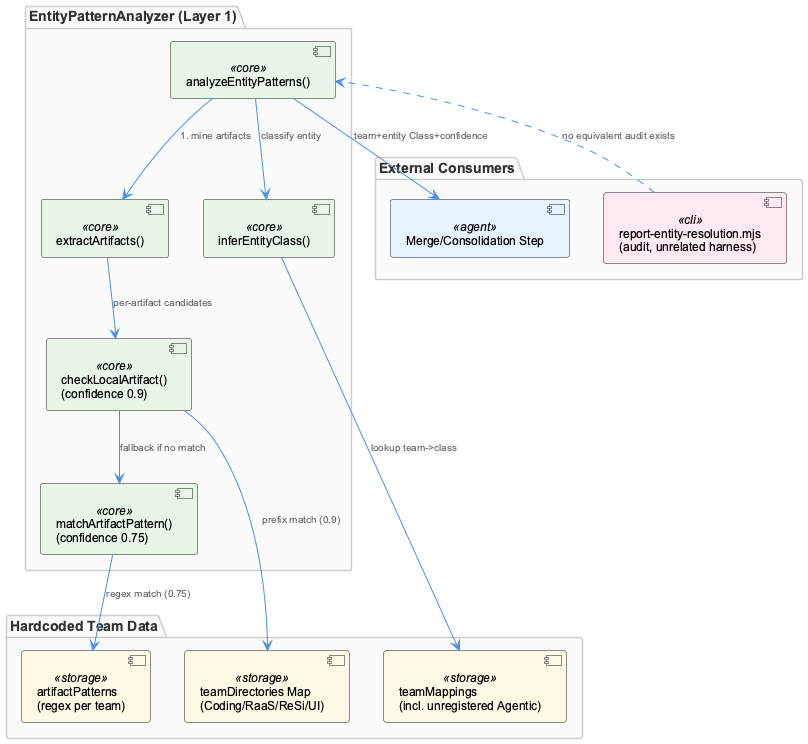
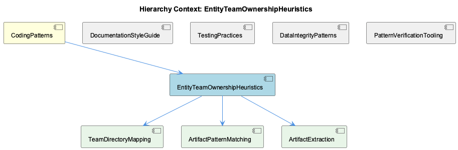

# EntityTeamOwnershipHeuristics

**Type:** SubComponent

## What It Is

EntityTeamOwnershipHeuristics is implemented as the `EntityPatternAnalyzer` class in `src/ontology/heuristics/EntityPatternAnalyzer.ts`, whose header comment explicitly labels it "Layer 1: File/Artifact Detection" for determining which team owns a given entity. It works by mining free-form knowledge content for artifact-like strings and then classifying each artifact against team-ownership tables to produce a team, an entity class, and a confidence score. It is a subcomponent of CodingPatterns, sitting alongside DocumentationStyleGuide, TestingPractices, DataIntegrityPatterns, and PatternVerificationTooling as one of several codified conventions/heuristics maintained under that parent.

## Architecture and Design

The component follows a chain-of-responsibility / layered-fallback pattern: `analyzeEntityPatterns()` first attempts a direct, location-based match via `checkLocalArtifact()` (confidence 0.9), and only falls back to name-based regex matching via `matchArtifactPattern()` (confidence 0.75) if the direct lookup fails. This "known location beats plausible name" ordering is a deliberate design decision favoring precision over recall for the primary signal. Team-specific matching logic is organized as a strategy table — per-team arrays of regexes and entityClassMap objects (`artifactPatterns`) — selected by team key rather than branching logic.

Underlying both branches is a heuristic text-mining extraction stage, `extractArtifacts()`, which runs four independent regexes (file paths, npm-scoped packages, class-name suffixes, bare directory paths) and unions their matches into a single `Set`. Because the passes run sequentially and Set iteration preserves insertion order, classification order is an artifact of regex-pass order rather than of the artifact's position in the source text — a subtle but consequential implementation detail affecting which team "wins" when multiple artifacts appear in one knowledge item.

## Implementation Details

The three child components map directly onto pieces of this single class: TeamDirectoryMapping is the `teamDirectories` `Map<string, string[]>` in the constructor (Coding, RaaS, ReSi, UI teams to directory-prefix arrays), consulted via `Array.some()` with `startsWith()` — a prefix test, not path-segment-aware, so `scripts-legacy/` would false-positive match `scripts`. ArtifactPatternMatching corresponds to the private `matchArtifactPattern()` branch, using per-team regex arrays (e.g. `/LSL(Session|Monitor|Classifier)/i`, `/Kubernetes(Cluster|Pod|Service)/i`). ArtifactExtraction is `extractArtifacts()` itself, doing pure regex text-mining (no AST/import-graph analysis) over nine hardcoded file extensions and nine hardcoded class-name suffixes.

A separate, third source of team truth exists in the private `inferEntityClass()`'s `teamMappings` table, which includes an "Agentic" team (Agent→AgentFramework, RAG→RAGSystem, etc.) absent from both `teamDirectories` and `artifactPatterns` — meaning that branch of code is effectively unreachable dead mapping, evidence that the three data structures have already drifted out of sync.

Confidence values (0.9, 0.75) are static constants tied to match *type*, not computed from match strength or specificity — two very different directory-prefix matches receive identical scores. Despite a docstring claim of "<1ms response time," `extractArtifacts()` has no memoization, and `performance.now()` is used only to report `processingTime`, not to enforce or short-circuit against that target.

## Integration Points

This heuristic's output — team, entityClass, and confidence — is exactly the sort of per-entity classification data flagged by the sibling DataIntegrityPatterns record (the Metadata Merge Bug / Destructive Overwrite Pattern): if this heuristic's automated result and a manually-curated team assignment are ever merged without an explicit reconciliation rule, one could silently clobber the other. Similarly, the discipline documented in the KB Architecture Audit — Gap Analysis Initiative (auditing `report-entity-resolution.mjs` similarity thresholds before trusting a writer/consolidator) applies directly here: the 0.9/0.75 confidence thresholds are hardcoded with no accompanying evaluation harness, so there is no measured precision/recall check comparable to that entity-resolution auditor. Note that `scripts/knowledge-management/verify-patterns.sh` and the XAML/C# graphify test fixtures, though retrieved alongside this component, are unrelated filename-substring noise and should not be treated as integration points.

## Usage Guidelines

Anyone modifying team-ownership behavior must edit three separate hardcoded structures in concert — `teamDirectories`, `artifactPatterns`, and `inferEntityClass()`'s `teamMappings` — since there is no single source of truth; the orphaned "Agentic" mapping is a cautionary example of what happens when only one is updated. Because `checkLocalArtifact()` uses simple `startsWith()` prefix matching, directory names should be chosen to avoid unintended prefix collisions. Given the extraction order-dependency in `extractArtifacts()`, developers should not assume artifact classification reflects textual position in source content. Finally, before changing confidence constants or adding new regex patterns, consider building an evaluation harness analogous to the entity-resolution auditor, and ensure any downstream merge of this heuristic's output with manually curated ownership data has an explicit precedence rule to avoid the destructive-overwrite failure mode already documented for related metadata merges.

## Work Record

What working sessions recorded about this entity — decisions taken, problems hit, and why things are the way they are:

- The Metadata Merge Bug — Destructive Overwrite Pattern record documents that manifest-level and graph-level entity descriptions were destructively overwritten during merges because no representation was treated as authoritative. EntityPatternAnalyzer's output (team + entityClass + confidence) is exactly the kind of per-entity classification data that a merge/consolidation step could silently clobber if this heuristic's result and a manually-curated team assignment are ever combined without an explicit reconciliation rule.
- The KB Architecture Audit — Gap Analysis Initiative record establishes report-entity-resolution.mjs as a dry-run auditor that checks whether configured similarity thresholds correctly match/merge candidate entities within an ontology class before any writer/consolidator change is trusted. The same discipline — audit before write — applies directly to EntityPatternAnalyzer's confidence thresholds (0.9 direct, 0.75 pattern): those numbers are hardcoded with no accompanying evaluation harness in the supplied files, so changing them currently has no measured precision/recall check comparable to the entity-resolution auditor's.

## Hierarchy Context

### Parent
- [CodingPatterns](./CodingPatterns.md) -- [SESSION] Documentation Style Guide for Diagrams and Markdown establishes that .puml source files must live in docs/puml/ and generated diagram artifacts have defined placement rules, enforcing a convention for the docs pipeline to render correctly.

### Children
- [TeamDirectoryMapping](./TeamDirectoryMapping.md) -- [LLM] The literal 'TeamDirectoryMapping' entity is realized as the `teamDirectories` private field in `src/ontology/heuristics/EntityPatternAnalyzer.ts`'s constructor: a `Map<string, string[]>` with four hardcoded team keys (Coding, RaaS, ReSi, UI), each holding a flat array of directory-prefix strings (e.g. Coding → `src/ontology`, `src/knowledge-management`, `src/live-logging`, `scripts`, `.specstory`). This is not a generic config object but the exact lookup table `checkLocalArtifact()` iterates via `this.teamDirectories.entries()`, using `dirs.some((dir) => artifact.startsWith(dir))` — a simple prefix test, not a path-segment-aware match, so a hypothetical directory named e.g. `scripts-legacy/` would also satisfy `startsWith('scripts')`.
- [ArtifactPatternMatching](./ArtifactPatternMatching.md) -- [LLM] The supplied code implements the underlying EntityPatternAnalyzer class (Layer 1 of EntityTeamOwnershipHeuristics), but there is no distinct 'ArtifactPatternMatching' symbol, module, or exported member anywhere in the file — the closest match is the private matchArtifactPattern() method, one of two branches inside analyzeEntityPatterns() (the other being checkLocalArtifact()). The requested component name appears to be an entity-graph abstraction layered over this single method rather than a standalone unit of code, so any file/line-level analysis of 'ArtifactPatternMatching' is really an analysis of this one branch of a larger class.
- [ArtifactExtraction](./ArtifactExtraction.md) -- [LLM] The component named "ArtifactExtraction" maps directly onto the private extractArtifacts() method in src/ontology/heuristics/EntityPatternAnalyzer.ts, which is the sole artifact-mining routine in the supplied code. It runs four independent regex passes over the raw knowledge-content string and unions every hit into a single `Set<string>`: a file-path pattern requiring a two-segment lowercase/hyphen directory prefix before one of nine hardcoded extensions (ts/js/cpp/java/tsx/jsx/py/go/rs), an npm-scoped-package pattern (`@scope/name`), a class-name pattern requiring a capitalized identifier ending in one of nine hardcoded suffixes (Service|Agent|Manager|Engine|Handler|Analyzer|Classifier|Filter|Monitor), and a bare two-segment directory pattern (`x/y/`). Because `Array.from(artifacts)` preserves Set insertion order and the four `.forEach` calls run strictly sequentially (file paths, then npm packages, then class names, then directories), a class-name artifact is always inserted before a directory artifact extracted from the same line of text, even if the directory appeared first in the source string — insertion order is a function of regex pass order, not of position in the content.

### Siblings
- [DocumentationStyleGuide](./DocumentationStyleGuide.md) -- [SESSION] Documentation Style Guide for Diagrams and Markdown: .puml source files must live in docs/puml/, establishing a single canonical location for diagram source control.
- [TestingPractices](./TestingPractices.md) -- [SESSION] Test Inventory Discovery — node:test Compatibility: ensures test files using node:test imports are recognized by the project's test-inventory tooling so they are executed rather than silently skipped.
- [DataIntegrityPatterns](./DataIntegrityPatterns.md) -- [SESSION] Metadata Merge Bug — Destructive Overwrite Pattern: tracks a multi-stage effort to keep manifest-level and graph-level parent entity descriptions in sync.
- [PatternVerificationTooling](./PatternVerificationTooling.md) -- [SESSION] Post-Rewrite Render Error Triage: establishes the verification discipline for distinguishing pre-existing render errors from regressions after a large rewrite, so fixes are prioritized correctly.

---

*Generated from 9 observations*
