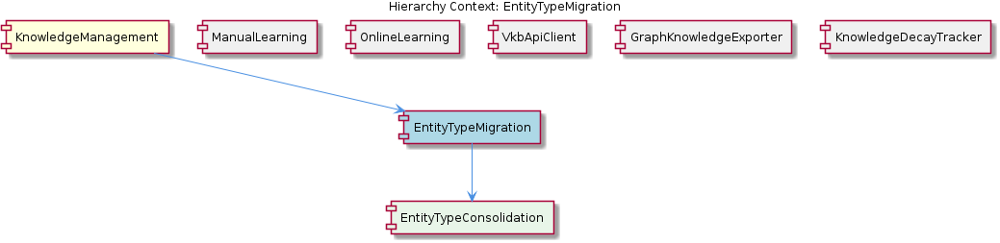

# EntityTypeMigration

**Type:** SubComponent

scripts/migrate-graph-db-entity-types.js consolidates legacy entity type names into the canonical six-type set (Project, Component, SubComponent, Pattern, Detail, System), rewriting node attributes in the Graphology graph

# EntityTypeMigration — Technical Insight Document

## What It Is

EntityTypeMigration is a one-shot data migration SubComponent of the KnowledgeManagement system, implemented as two coordinated Node.js scripts: `scripts/migrate-graph-db-entity-types.js` and `scripts/migrate-leveldb-to-kmcore.mjs`. Together these scripts bring pre-existing knowledge stores into compliance with the canonical EntityMetadata schema that the rest of KnowledgeManagement now enforces.

The first script, `scripts/migrate-graph-db-entity-types.js`, consolidates legacy entity type names into the canonical six-type set — Project, Component, SubComponent, Pattern, Detail, System — by rewriting node attributes directly in the Graphology in-memory graph. The second script, `scripts/migrate-leveldb-to-kmcore.mjs`, reshapes raw LevelDB records into the km-core canonical shape, populating missing ontology classification and bi-temporal staleness fields. Both run against existing data stores once, before the new schema is enforced at runtime, and are not part of any ongoing service loop.

## Architecture and Design

The architectural approach is a **staged batch migration**: rather than attempting one monolithic transformation, the work is split into two phases that can be executed and verified independently. Phase one normalizes type labels (a small, surgical edit to node attributes); phase two reshapes the full record payload (a larger, structural transformation). This separation reflects a deliberate trade-off — additional orchestration complexity in exchange for the ability to validate type consolidation before committing to payload reshaping.

The migration sits below KnowledgeManagement's runtime layer and must operate on both storage tiers the parent component uses: the Graphology in-memory graph (the working representation) and the LevelDB persistent store accessed through GraphDatabaseService. Because KnowledgeManagement keeps these two stores synchronized during normal operation, the migration scripts must touch both to leave the system in a consistent post-migration state. Unlike sibling components such as GraphKnowledgeExporter, which subscribes to `entity:stored` events for eventually-consistent exports, EntityTypeMigration operates *outside* the event loop — it directly rewrites the underlying data while the system is quiescent.

The child component **EntityTypeConsolidation** embodies the core ontology rule enforced by the migration: a closed, six-member canonical type set. Any legacy type label that does not map to one of {Project, Component, SubComponent, Pattern, Detail, System} must be either remapped or flagged. This is not a soft convention — it is a hard constraint that the migration uses to bring the data store into a state the runtime can trust.

## Implementation Details

`scripts/migrate-graph-db-entity-types.js` operates at the Graphology layer. It iterates the graph's nodes, inspects each node's type attribute, and rewrites legacy values into one of the six canonical labels. Because Graphology is an in-memory graph, this rewriting is a direct attribute mutation; the script must subsequently ensure the rewritten graph is persisted back through GraphDatabaseService so that LevelDB reflects the same type labels.

`scripts/migrate-leveldb-to-kmcore.mjs` works one level deeper, reading raw LevelDB records and producing km-core-shaped objects. The reshaping logic is responsible for populating fields that older records simply did not have: ontology classification metadata and the bi-temporal staleness fields that sibling KnowledgeDecayTracker now expects to find embedded in every EntityMetadata record. Where the source record lacks these fields, the script supplies defaults rather than failing, ensuring every migrated entity emerges with a complete EntityMetadata footprint.

The choice of `.mjs` for the LevelDB script versus `.js` for the graph-db script is consistent with each script's import surface — the LevelDB reshape script uses ES modules to align with the km-core module conventions, while the graph-db script uses CommonJS for direct access to the Graphology integration code. Neither script declares external exports; they are entry points, invoked from the command line.

## Integration Points

EntityTypeMigration integrates with the KnowledgeManagement stack at two distinct layers. At the **graph layer**, it touches the Graphology in-memory representation that ManualLearning and OnlineLearning siblings both write into during normal operation — those components store entities as typed nodes using the same six-type ontology that the migration is enforcing. At the **persistence layer**, the migration reads and writes LevelDB through (or alongside) GraphDatabaseService, the same service that sibling components ultimately depend on for durability.

The migration does **not** interact with the VKB HTTP API or VkbApiClient. Because it runs as a one-shot offline transformation against the data stores directly, it bypasses the lock-free HTTP path that runtime callers use. This is appropriate: migrations must have exclusive access to the data and cannot tolerate concurrent writes from the live system.

The child EntityTypeConsolidation supplies the type-mapping rules that `scripts/migrate-graph-db-entity-types.js` applies. Downstream of the migration, every consumer of EntityMetadata — including KnowledgeDecayTracker (which reads embedded staleness state) and GraphKnowledgeExporter (which exports entities after `entity:stored` events) — benefits from the guarantee that all records now conform to the canonical shape.

## Usage Guidelines

These scripts are **one-shot operations** and should be treated as such. Run them once against an existing data store before the new EntityMetadata schema is enforced at runtime, and do not include them in any recurring job, startup hook, or service loop. Re-running them against an already-migrated store is unnecessary and risks masking real data anomalies under the migration's defaulting behavior.

Execute the scripts in the correct order: first `scripts/migrate-graph-db-entity-types.js` to normalize type labels, then `scripts/migrate-leveldb-to-kmcore.mjs` to reshape record payloads. The graph-db script's output is the precondition for the kmcore reshape — the latter assumes type labels already belong to the canonical six-type set. Before running either script, stop any process that might be writing to LevelDB or holding the Graphology graph open (including the VKB server), since the migration assumes exclusive access.

When extending or maintaining the migration, preserve the closed-set ontology rule enforced by EntityTypeConsolidation. New entity types must not be silently added; they require an explicit decision to either expand the canonical set (a breaking change touching the entire KnowledgeManagement parent) or to remap the legacy label into one of the existing six. Any defaulting logic for missing ontology classification or bi-temporal staleness fields should be conservative — prefer marking records as stale or unclassified over inventing plausible-looking metadata, so that downstream consumers like KnowledgeDecayTracker can identify migrated entities for later enrichment.

Finally, treat these scripts as **archival artifacts** once executed against production data. They document the historical schema transition and remain useful as reference for understanding the shape of pre-migration records, but the runtime system should never depend on them being present or runnable.

## Hierarchy Context

### Parent
- [KnowledgeManagement](./KnowledgeManagement.md) -- The KnowledgeManagement component provides graph-based knowledge storage, entity lifecycle management, and query capabilities for the Coding project. At its core it combines a Graphology in-memory graph with LevelDB persistent storage (via GraphDatabaseService), accessed either through a lock-free VKB HTTP API when the server is running or through direct file access as a fallback. The component manages typed entities (Project, Component, SubComponent, Pattern, Detail, System) with rich metadata including ontology classification, bi-temporal staleness tracking, embedding vectors, and hierarchy relationships.

### Children
- [EntityTypeConsolidation](./EntityTypeConsolidation.md) -- scripts/migrate-graph-db-entity-types.js enforces a closed, six-member canonical type set (Project, Component, SubComponent, Pattern, Detail, System), meaning any node whose legacy type label does not map to one of these six values must either be remapped or flagged — the finite set is a deliberate ontology constraint, not a convention.

### Siblings
- [ManualLearning](./ManualLearning.md) -- ManualLearning entities are stored as typed nodes (Project, Component, SubComponent, Pattern, Detail, System) in the GraphDatabaseService-backed graph, using the same ontology classification fields as automated entities
- [OnlineLearning](./OnlineLearning.md) -- The batch analysis pipeline ingests git history, LSL sessions, and code analysis outputs, mapping findings to the canonical typed entity set (Project, Component, SubComponent, Pattern, Detail, System) before writing to GraphDatabaseService
- [VkbApiClient](./VkbApiClient.md) -- VkbApiClient is located at lib/ukb-unified/core/VkbApiClient.js and is dynamically imported at runtime, so callers must handle the case where the import fails (server not running) and fall back to direct LevelDB access
- [GraphKnowledgeExporter](./GraphKnowledgeExporter.md) -- GraphKnowledgeExporter subscribes to entity:stored events emitted by GraphDatabaseService, making exports eventually consistent with writes rather than synchronously blocking them
- [KnowledgeDecayTracker](./KnowledgeDecayTracker.md) -- KnowledgeDecayTracker embeds staleness state directly in EntityMetadata rather than a separate store, so every entity read returns its own decay signal without additional <USER_ID_REDACTED>

---

*Generated from 5 observations*
