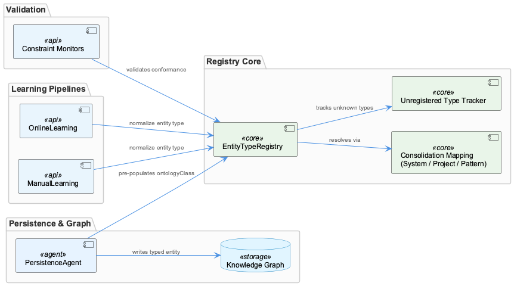
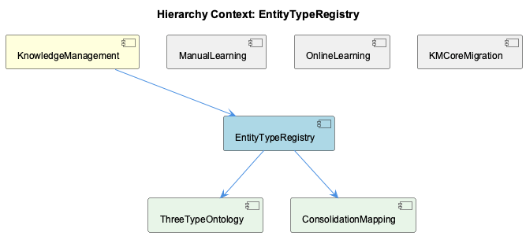

# EntityTypeRegistry

**Type:** SubComponent

PersistenceAgent (referenced in docs/architecture/adding-new-agent.md context) pre-populates entityType and metadata.ontologyClass fields before graph writes, consuming EntityTypeRegistry mappings to avoid redundant LLM re-classification

# EntityTypeRegistry — Technical Insight Document

## What It Is

EntityTypeRegistry is a SubComponent of KnowledgeManagement responsible for enforcing a canonical three-type ontology across all entity classifications in the knowledge graph. It was introduced as part of the Release 2.0 Ontology Integration System (documented in `docs/RELEASE-2.0.md`), explicitly designed to retrofit ontology discipline onto a previously untyped entity store — meaning the registry exists not as a greenfield design but as a disciplined correction layer over accumulated inconsistency.

At its core, EntityTypeRegistry owns two child components: ThreeTypeOntology, which defines the canonical classification surface, and ConsolidationMapping, which provides the runtime translation table mapping arbitrary incoming type strings to one of the three canonical forms. Together, these two children make the registry the single authoritative source of truth for what constitutes a valid entity type in the system.

## Architecture and Design

The central architectural decision in EntityTypeRegistry is the enforcement of a **three-type closed ontology** — System, Project, and Pattern — as the only valid classifications for graph entities. This is not a filtering mechanism that discards non-conforming input; rather, ConsolidationMapping translates diverse or legacy type strings into these three canonical forms before any graph insertion occurs. This distinction is critical: the registry is a normalization layer, not a validation gate that rejects data.

A key design trade-off is the explicit tracking of unregistered ontology classes — types that arrive without a mapping entry in ConsolidationMapping. Rather than silently dropping these or raising hard failures, the registry records them. This design supports incremental ontology extension: new entity types encountered in the wild can be surfaced, reviewed, and formally mapped without causing data loss during the gap. This reflects a pragmatic approach suited to a system that was retrofitted rather than built schema-first.

The registry's position within KnowledgeManagement places it upstream of graph writes, serving as the normalization checkpoint that both ManualLearning and OnlineLearning pipelines must pass through. This shared consolidation path is an intentional architectural choice: regardless of whether an entity originates from human-authored input (ManualLearning) or automated pipeline ingestion (OnlineLearning), the same type normalization rules apply. This prevents ontology drift between the two ingestion paths, which was likely a root cause of the pre-2.0 inconsistency the registry was designed to address.

## Implementation Details

EntityTypeRegistry operates through the interplay of its two child components. ThreeTypeOntology defines the bounded set of valid canonical types (System, Project, Pattern) and was formally documented in `docs/RELEASE-2.0.md` as the classification surface introduced to consolidate previously inconsistent typing. ConsolidationMapping holds the actual translation table — the mapping from arbitrary incoming strings to one of these three canonical forms — and is the runtime mechanism by which ThreeTypeOntology's constraints are enforced without requiring upstream producers to emit perfectly normalized types.

The PersistenceAgent (referenced in `docs/architecture/adding-new-agent.md`) consumes EntityTypeRegistry mappings directly, pre-populating `entityType` and `metadata.ontologyClass` fields on entities before graph writes. This pre-population pattern is architecturally significant: it means the registry's normalization work happens at write time in the agent layer, avoiding the need for re-classification by an LLM on subsequent reads or <USER_ID_REDACTED>. The cost of normalization is paid once, at ingestion, and the canonical form is stored durably.

The unregistered class tracking mechanism deserves particular attention. When an incoming type string has no entry in ConsolidationMapping, the registry does not silently discard it or default it to an arbitrary canonical type — it records the gap. This creates an observable surface for ontology maintenance: developers can inspect which unregistered types have been encountered and make deliberate mapping decisions rather than discovering data loss after the fact.

## Integration Points

EntityTypeRegistry sits at the intersection of all entity-producing subsystems within KnowledgeManagement. Both ManualLearning and OnlineLearning pipelines route entity type normalization through the shared ConsolidationMapping, making EntityTypeRegistry a cross-cutting dependency for all write paths. The KMCoreMigration component, which rewrites raw LevelDB records with stable UUIDv7 identifiers, implicitly depends on the type system the registry enforces — migrated entities must conform to the same three-type ontology to be valid in the post-migration graph.

The constraint monitoring system described in `docs/constraints/README.md` uses EntityTypeRegistry as its reference set for entity type conformance checks. This means the registry serves a dual role: it normalizes types at write time (via PersistenceAgent) and provides the canonical valid-type set against which constraint monitors validate the graph at rest. Any extension to the ontology must therefore be reflected in the registry before constraint monitors will accept the new types as conformant.

The broader KnowledgeManagement graph infrastructure — built on Graphology in-memory storage with LevelDB as the persistence backend — receives only pre-normalized entities, because EntityTypeRegistry normalization happens upstream in the PersistenceAgent layer. The graph itself does not enforce the ontology; that enforcement lives entirely in the registry and the agents that consume it.

## Usage Guidelines

Developers adding new entity types to the system must register a ConsolidationMapping entry before those types will normalize correctly to a canonical form. Bypassing this step does not cause immediate data loss — the unregistered class tracking will capture the gap — but it means affected entities may be written with non-canonical types that fail constraint monitor validation. The correct workflow is: define the mapping in ConsolidationMapping first, then introduce the new entity type in upstream producers.

When extending the ontology, changes to ThreeTypeOntology (the canonical type set itself) are significantly more impactful than adding entries to ConsolidationMapping. Adding a fourth canonical type, for example, would affect constraint monitors, PersistenceAgent pre-population logic, and potentially downstream query patterns that assume exactly three types. ConsolidationMapping extensions — mapping new incoming strings to existing canonical types — are low-risk by comparison and represent the intended extension path for most cases.

The shared nature of the registry across ManualLearning and OnlineLearning pipelines means that any change to normalization rules has system-wide effect. Developers should not introduce pipeline-specific type mappings outside of EntityTypeRegistry, as this would undermine the single source of truth guarantee and recreate the ontology drift the registry was designed to eliminate.

---

**Architectural Patterns Identified:** Normalization-at-write, single source of truth for type classification, observable gap tracking for incremental schema extension, constraint reference set separation from enforcement logic.

**Key Design Trade-off:** Closed three-type ontology for consistency versus flexibility — resolved by placing the translation burden in ConsolidationMapping rather than requiring upstream producers to emit canonical types natively.

**Scalability Consideration:** The three-type constraint is intentionally narrow; ontology growth is expected to occur via ConsolidationMapping additions (many-to-three mappings), not by expanding the canonical type count, which keeps downstream consumers stable.

**Maintainability Assessment:** High, given the explicit unregistered-class tracking and the clear separation between the canonical type definition (ThreeTypeOntology) and the translation mechanism (ConsolidationMapping). The primary maintenance risk is the registry becoming a hidden dependency that developers bypass under time pressure, which would silently reintroduce the pre-2.0 inconsistency problem.

## Hierarchy Context

### Parent
- [KnowledgeManagement](./KnowledgeManagement.md) -- The KnowledgeManagement component provides the core knowledge graph infrastructure for the Coding project, encompassing persistent storage, entity lifecycle management, and graph query capabilities. It is built on a Graphology in-memory graph with LevelDB as the persistence backend, exposing entities with typed attributes (System, Project, Pattern) and relationships. The system supports both local graph operations and integration with external graph databases like Memgraph via the CodeGraphAgent, which uses Tree-sitter AST parsing to index repositories into a queryable knowledge graph.

### Children
- [ThreeTypeOntology](./ThreeTypeOntology.md) -- Documented in docs/RELEASE-2.0.md ('Release 2.0 - Ontology Integration System'), this three-type ontology was introduced as a formal classification surface to consolidate previously inconsistent entity typing across the knowledge system.
- [ConsolidationMapping](./ConsolidationMapping.md) -- Referenced in the parent component context as the mechanism by which EntityTypeRegistry enforces its three-type ontology, mapping arbitrary incoming strings to canonical forms.

### Siblings
- [ManualLearning](./ManualLearning.md) -- ManualLearning entities are distinguished by provenance metadata that marks their origin as human-authored, contrasting with the automated pipeline provenance stamps applied by KMCoreMigration
- [OnlineLearning](./OnlineLearning.md) -- docs/architecture/memory-systems.md describes the Graph-Based Knowledge Storage Architecture that OnlineLearning populates, with Graphology as the in-memory layer backed by LevelDB
- [KMCoreMigration](./KMCoreMigration.md) -- The migration script migrate-leveldb-to-kmcore.mjs reads raw LevelDB B-shape records and rewrites them with UUIDv7 identifiers, providing stable, time-ordered IDs for all canonical entities

---

*Generated from 6 observations*
