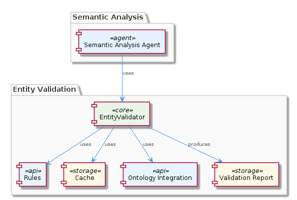
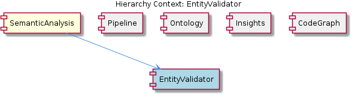

# EntityValidator

**Type:** SubComponent

The entity validation is integrated with the ontology, using the ontology definitions to validate the entities, as seen in the integrations/mcp-server-semantic-analysis/src/entity-validator/ontology-integration.ts file.

## What It Is  

The **EntityValidator** lives in the **SemanticAnalysis** sub‑component of the MCP server. Its primary implementation resides in  

* `integrations/mcp-server-semantic-analysis/src/entity-validator.ts`  

and is supported by a set of auxiliary modules:

* **Rule definitions** – `integrations/mcp-server-semantic-analysis/src/entity-validator/rules.ts`  
* **Cache layer** – `integrations/mcp-server-semantic-analysis/src/entity-validator/cache.ts`  
* **Ontology bridge** – `integrations/mcp-server-semantic-analysis/src/entity-validator/ontology-integration.ts`  
* **Validation report model** – `integrations/mcp-server-semantic-analysis/src/entity-validator/validation-report.ts`  

EntityValidator is a rule‑based engine that inspects incoming entities, applies a configurable collection of validation rules, consults the shared ontology for semantic constraints, and emits a structured **validation report**. The validator is invoked by the processing pipeline (see `semantic-analysis-agent.ts`) to filter or enrich entities before downstream agents consume them.

---

## Architecture and Design  

### Rule‑Based Engine  

The core design follows a **rule‑engine** pattern. All validation logic is encapsulated in discrete rule objects defined in `rules.ts`. The validator iterates over this collection, applying each rule to an entity. Because the rule list is imported rather than hard‑coded, new validation criteria can be introduced simply by adding a new rule module – an explicit **extensibility** decision that aligns with the Open/Closed Principle.

### Caching for Performance  

A dedicated cache module (`cache.ts`) sits between the validator and any expensive data look‑ups (e.g., ontology queries). The cache follows a **cache‑aside** strategy: the validator first checks the cache for a pre‑computed result; on a miss it performs the full validation and then stores the outcome. This design reduces repeated ontology look‑ups when the same entity appears multiple times in a batch.

### Ontology Integration  

The validator does not embed ontology knowledge directly. Instead, `ontology-integration.ts` acts as an **adapter** that translates the internal entity representation into the ontology’s API calls. This separation keeps the validation engine agnostic of ontology implementation details and makes future ontology replacements straightforward.

### Interaction with the Pipeline  

`semantic-analysis-agent.ts` (the pipeline entry point) calls EntityValidator to decide whether an entity should continue through the pipeline. This creates a **pipeline pattern** where each agent performs a single responsibility (e.g., classification, code‑graph generation) and relies on the validator to enforce data quality early in the flow.

### Relationship to Siblings  

EntityValidator shares the same parent **SemanticAnalysis** with sibling components such as **Pipeline**, **Ontology**, **Insights**, and **CodeGraph**. While the Pipeline orchestrates the overall batch flow, Ontology provides the semantic vocabulary, Insights generates higher‑level observations, and CodeGraph builds structural representations. The validator sits at the intersection of these concerns: it consumes ontology definitions, produces clean entities for the pipeline, and supplies validation metadata that InsightGenerator can later reference.

---

## Implementation Details  

1. **EntityValidator Class (`entity-validator.ts`)**  
   * Exposes a public `validate(entity: Entity): ValidationReport` method.  
   * Internally loads the rule set from `rules.ts` and iterates through each rule, passing the entity and a shared context object.  
   * Collects rule outcomes (pass/fail, messages) into a `ValidationReport` instance defined in `validation-report.ts`.

2. **Rule Set (`rules.ts`)**  
   * Each rule is a plain function or class implementing a common interface, e.g., `interface ValidationRule { run(entity: Entity, context: ValidationContext): RuleResult; }`.  
   * Rules cover structural checks (required fields), semantic checks (type compatibility with ontology), and custom business constraints.  
   * The file exports an array `export const rules: ValidationRule[] = [...]`, which the validator imports, making rule addition as simple as appending a new export.

3. **Cache (`cache.ts`)**  
   * Provides `get(entityId: string): ValidationReport | undefined` and `set(entityId: string, report: ValidationReport): void`.  
   * Likely backed by an in‑memory `Map` or a lightweight LRU store; the exact implementation is hidden behind the module’s API, preserving encapsulation.

4. **Ontology Integration (`ontology-integration.ts`)**  
   * Contains helper functions such as `fetchConcept(entityType: string): OntologyConcept` and `validateAgainstOntology(entity, concept)`.  
   * Acts as a thin wrapper around the broader Ontology component, translating between the validator’s data model and the ontology’s schema.

5. **Validation Report (`validation-report.ts`)**  
   * Defines a serializable structure: `entityId`, `passed: boolean`, `failedRules: string[]`, and optional `details`.  
   * This report is returned to the pipeline and can be persisted or logged for later analysis by InsightGenerator.

The implementation deliberately isolates concerns: rule logic, caching, ontology access, and reporting are each in their own module, facilitating unit testing and independent evolution.

---

## Integration Points  

* **Pipeline (semantic‑analysis‑agent.ts)** – The agent calls `EntityValidator.validate()` for each incoming entity. The returned `ValidationReport` determines whether the entity proceeds to downstream agents (e.g., OntologyClassificationAgent, CodeGraphAgent).  

* **Ontology Component** – Through `ontology-integration.ts`, the validator consumes the shared ontology definitions that are also used by the OntologyClassificationAgent. Any change to the ontology API propagates through this adapter without touching rule code.  

* **Insights Generation** – The `ValidationReport` can be consumed by `insight-generator.ts` to surface data‑quality metrics or rule‑failure trends across a batch.  

* **CodeGraph Generation** – Clean, validated entities are fed into `code-graph-generator.ts` (in the CodeGraph sibling) to ensure that the graph reflects only semantically correct nodes.  

* **Caching Layer** – The cache module is a shared service that other components (e.g., OntologyClassificationAgent) could also reuse for ontology look‑ups, promoting consistency and reducing duplicated effort.

All interactions are mediated through explicit TypeScript imports, keeping the dependency graph clear and avoiding circular references.

---

## Usage Guidelines  

1. **Add New Rules via `rules.ts`** – To introduce a new validation constraint, create a function or class that conforms to the `ValidationRule` interface and export it from `rules.ts`. Do **not** modify the core `EntityValidator` class; the rule engine will automatically pick up the new rule on the next run.  

2. **Leverage the Cache** – When writing custom rules that require expensive external calls (e.g., additional ontology queries), first check `cache.ts` for a pre‑computed result. Populate the cache after a successful lookup to maximize reuse across the same batch.  

3. **Respect the Ontology Adapter** – Direct calls to the ontology should be routed through `ontology-integration.ts`. This ensures that any future changes to the ontology’s shape are isolated to the adapter.  

4. **Handle Validation Reports** – Agents downstream should inspect the `passed` flag and `failedRules` list. If an entity fails validation, the typical pattern is to log the report, optionally emit a metric, and drop the entity from further processing.  

5. **Testing** – Unit tests should target individual rules, the cache behavior, and the adapter separately. Because the validator composes these pieces, integration tests can verify that a full entity passes or fails as expected when a specific rule is toggled.  

---

### Architectural Patterns Identified  

1. **Rule‑Engine (Strategy) Pattern** – Decouples validation logic into interchangeable rule objects.  
2. **Cache‑Aside Pattern** – Improves performance by storing validation results for reuse.  
3. **Adapter Pattern** – `ontology-integration.ts` isolates ontology specifics from the validator.  
4. **Pipeline Pattern** – EntityValidator is a stage in the broader semantic‑analysis pipeline.  
5. **Open/Closed Principle** – Extensible rule set without modifying core validator code.

### Design Decisions and Trade‑offs  

* **Extensibility vs. Runtime Overhead** – Keeping rules in a dynamically loaded array enables easy addition but incurs a per‑entity iteration cost. The cache mitigates this by avoiding re‑validation of identical entities.  
* **Separation of Concerns** – Splitting ontology access, caching, and rule evaluation into distinct modules improves maintainability but adds indirection, which can slightly increase call‑stack depth.  
* **In‑Memory Cache** – Simplicity and speed are gained, but the cache is volatile; in a distributed deployment a shared cache (e.g., Redis) would be needed for cross‑process reuse.  

### System Structure Insights  

EntityValidator sits at the core of the **SemanticAnalysis** component, acting as the gatekeeper for entity quality. It bridges the **Ontology** sibling (via the adapter), supplies clean data to **Pipeline** and **CodeGraph**, and enriches the **Insights** layer with validation metrics. The modular file layout (`entity-validator/*`) mirrors the logical separation of responsibilities, reinforcing a clean, layered architecture.

### Scalability Considerations  

* **Rule Set Size** – As the number of rules grows, validation latency may increase linearly. Profiling and possibly parallelizing rule execution could be explored.  
* **Cache Scope** – For large batch jobs, the in‑memory cache may consume significant RAM. Introducing size limits or eviction policies would keep memory usage bounded.  
* **Distributed Execution** – If the pipeline runs across multiple workers, a shared caching mechanism would be required to prevent duplicate ontology look‑ups.

### Maintainability Assessment  

The clear module boundaries and adherence to well‑known patterns make the EntityValidator highly maintainable. Adding or retiring rules does not touch the validator core, reducing regression risk. The explicit adapter for ontology interactions shields the validator from upstream changes. The only maintenance pressure comes from the cache’s lifecycle management and ensuring that rule side‑effects remain deterministic. Overall, the design promotes straightforward testing, clear ownership, and low coupling, which are strong indicators of long‑term maintainability.

## Hierarchy Context

### Parent
- [SemanticAnalysis](./SemanticAnalysis.md) -- [LLM] The SemanticAnalysis component utilizes a multi-agent system architecture, with agents such as OntologyClassificationAgent, SemanticAnalysisAgent, and CodeGraphAgent, to process git history and LSL sessions. This is evident in the code files, such as integrations/mcp-server-semantic-analysis/src/agents/ontology-classification-agent.ts, integrations/mcp-server-semantic-analysis/src/agents/semantic-analysis-agent.ts, and integrations/mcp-server-semantic-analysis/src/agents/code-graph-agent.ts, which define the respective agents and their responsibilities. The use of multiple agents allows for a modular and scalable design, enabling the processing of large amounts of data and the integration of new agents as needed.

### Siblings
- [Pipeline](./Pipeline.md) -- The batch processing pipeline is defined in integrations/mcp-server-semantic-analysis/src/agents/ontology-classification-agent.ts, which outlines the responsibilities of the OntologyClassificationAgent.
- [Ontology](./Ontology.md) -- The OntologyClassificationAgent in integrations/mcp-server-semantic-analysis/src/agents/ontology-classification-agent.ts is responsible for classifying entities based on the ontology.
- [Insights](./Insights.md) -- The insight generation is performed by the InsightGenerator class in integrations/mcp-server-semantic-analysis/src/insights/insight-generator.ts.
- [CodeGraph](./CodeGraph.md) -- The code graph generation is performed by the CodeGraphGenerator class in integrations/code-graph-rag/src/code-graph-generator.ts.

---

*Generated from 7 observations*
