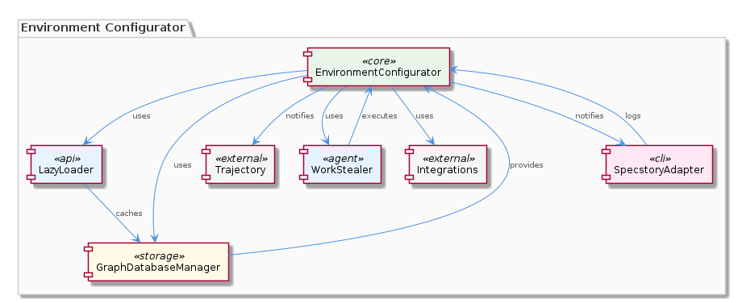
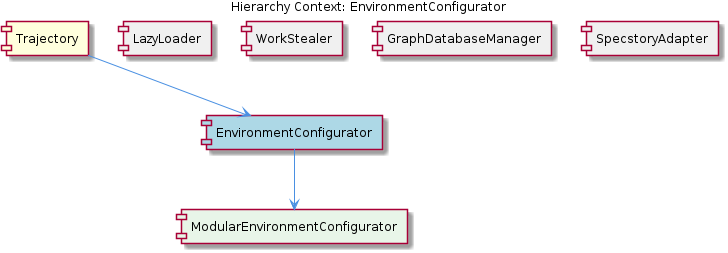

# EnvironmentConfigurator

**Type:** SubComponent

The EnvironmentConfigurator provides a synchronization mechanism for environment operations, ensuring that environment variables are accessed and modified in a thread-safe and predictable manner, as seen in the GraphDatabaseManager's synchronization mechanism.

## What It Is  

The **EnvironmentConfigurator** is a sub‑component that lives inside the **Trajectory** component (see the parent‑child relationship `Trajectory → EnvironmentConfigurator`). Its implementation is rooted in the **integrations** directory of the codebase – for example, the concrete modules such as *browser‑access* and *code‑graph‑rag* reside under `lib/integrations/` and each ships with a dedicated `README.md`. The top‑level class `EnvironmentConfigurator` aggregates these modules through its child component **ModularEnvironmentConfigurator**, exposing a unified API for configuring, caching, and synchronizing environment variables across the system.  

The sub‑component is deliberately isolated: it does not mingle with business logic elsewhere, but instead offers a focused service for reading, writing, and reacting to environment changes. Its design mirrors the patterns used by its siblings—**LazyLoader**, **WorkStealer**, **GraphDatabaseManager**, and **SpecstoryAdapter**—all of which also rely on a modular, per‑concern loader architecture.

---

## Architecture and Design  

EnvironmentConfigurator follows a **modular architecture**. Each environment variable (or logical group of variables) is represented by its own module inside the `integrations` folder, mirroring the approach taken by **LazyLoader** (modular API loaders) and **GraphDatabaseManager** (per‑graph storage modules). This modularity is reinforced by a **standardized interface** that all configuration modules implement, guaranteeing that callers can treat any module uniformly—an approach reminiscent of the **WorkStealer** task execution model where workers interact through a shared contract.  

A **caching layer** sits between the modules and their consumers. The cache is lazy‑loaded, similar to the mechanism described for **LazyLoader**, and is configurable: callers can tune expiration and invalidation policies, a design decision that trades off memory usage for reduced I/O latency.  

Thread safety is achieved via a **synchronization mechanism** comparable to the one in **GraphDatabaseManager**. All reads and writes to the cached environment state are guarded, ensuring that concurrent access from multiple workers (e.g., the work‑stealing workers in **WorkStealer**) does not corrupt the configuration data.  

Finally, the component exposes a **callback‑based notification system** for downstream consumers such as **Trajectory**. When an environment variable changes, registered callbacks are invoked, allowing the **Trajectory** component to react promptly—this mirrors the logging callback pattern used by **SpecstoryAdapter** to inform the logging pipeline of new conversation events.  

---

## Implementation Details  

At the heart of the implementation is the `EnvironmentConfigurator` class, which holds a reference to **ModularEnvironmentConfigurator**. The child component scans the `lib/integrations/` directory at startup, dynamically importing each module (e.g., `browser-access/index.js`, `code-graph-rag/index.js`). Each module exports a conformant object with the methods `get()`, `set()`, and `validate()`.  

When a consumer requests a variable, the top‑level configurator first checks an internal **cache map**. If the entry is present and not stale, the cached value is returned immediately, eliminating the need to invoke the underlying module. Cache entries are timestamped; the configurable expiration policy (exposed via a `setCacheOptions({ ttl, maxSize })` method) determines when an entry is evicted.  

All cache accesses are wrapped in a **mutex‑like guard** (implemented with Node’s `async‑mutex` or a simple `Promise`‑based lock) to guarantee atomicity. This mirrors the synchronization strategy used in `GraphDatabaseManager` where graph mutations are serialized to avoid race conditions.  

The notification mechanism is built on a **listener registry**. Modules can register a callback via `onUpdate(callback)`. When `set()` is called, after the cache is updated and the lock released, the configurator iterates over the registered listeners and invokes them asynchronously. The **Trajectory** component registers its own handler, allowing it to propagate environment changes downstream.  

The modular design also simplifies **extensibility**: adding a new environment source merely requires dropping a new module into the `integrations` folder and ensuring it implements the standard interface. No changes to the core configurator code are needed, reflecting the same extensibility principle observed in the sibling **LazyLoader** component.

---

## Integration Points  

EnvironmentConfigurator is tightly coupled with its parent **Trajectory**, which holds an instance of the configurator and registers update callbacks to stay in sync with environment changes. The child **ModularEnvironmentConfigurator** serves as the plug‑in host for all environment modules, exposing their functionality to the parent.  

Sibling components share architectural philosophies:  
* **LazyLoader** supplies the dynamic import pattern that EnvironmentConfigurator reuses for loading its modules.  
* **WorkStealer** benefits from the thread‑safe cache, as its workers may request environment variables concurrently without risking stale or inconsistent data.  
* **GraphDatabaseManager** provides a precedent for configurable caching and synchronization, both of which EnvironmentConfigurator adopts.  
* **SpecstoryAdapter** demonstrates the same callback‑based notification style that EnvironmentConfigurator uses to inform **Trajectory** of updates.  

The relationship diagram below visualizes these connections:  

---

## Usage Guidelines  

1. **Module Placement** – New environment modules must be placed under `lib/integrations/` and must export the standard `get()`, `set()`, `validate()`, and optional `onUpdate()` functions. Follow the README templates present in existing modules (e.g., *browser-access/README.md*) to maintain consistency.  

2. **Cache Configuration** – Before heavy usage, configure the cache via `environmentConfigurator.setCacheOptions({ ttl: 60000, maxSize: 200 })`. A shorter TTL reduces memory pressure but may increase module load frequency; balance this based on the volatility of the underlying environment source.  

3. **Thread Safety** – Always interact with the configurator through its public API; direct manipulation of the internal cache map is prohibited. The built‑in synchronization guarantees safe concurrent access, but bypassing it would invalidate that guarantee.  

4. **Listening for Changes** – Register listeners early in the **Trajectory** initialization phase using `environmentConfigurator.onUpdate(callback)`. Callbacks should be lightweight and non‑blocking to avoid delaying the release of the synchronization lock.  

5. **Error Handling** – Each module’s `validate()` method is invoked on `set()`. Propagate validation errors up to the caller; the configurator does not swallow them. This mirrors the defensive pattern used in **GraphDatabaseManager** for data integrity.  

---

### Architectural Patterns Identified  
* **Modular Plug‑In Architecture** – per‑environment modules in `integrations`.  
* **Lazy Loading with Caching** – on‑demand module import and configurable cache.  
* **Synchronization (Mutex/Lock) for Thread Safety** – serialized access to shared state.  
* **Callback/Observer Pattern** – notification of environment updates to **Trajectory**.  

### Design Decisions and Trade‑offs  
* **Modularity vs. Startup Cost** – dynamic discovery adds a small start‑up overhead but yields high extensibility.  
* **Configurable Cache** – gives flexibility but introduces complexity in tuning TTL and size.  
* **Synchronous Locking** – guarantees consistency but can become a bottleneck under extreme concurrency; however, the lock is held only for brief cache operations, mitigating impact.  

### System Structure Insights  
The component sits as a thin façade over a collection of specialized modules, acting as both a mediator (providing a unified API) and a guard (ensuring thread‑safe, cached access). Its relationship to **Trajectory** is that of a service provider, while its siblings share the same “modular + lazy‑load” philosophy, reinforcing a coherent architectural language across the codebase.  

### Scalability Considerations  
* **Horizontal Scaling** – Because the cache is in‑process, scaling out to multiple Node processes would require an external shared cache (e.g., Redis) if cross‑process consistency is needed.  
* **Cache Size** – The configurable `maxSize` allows the system to adapt to larger numbers of environment variables without exhausting memory.  
* **Module Count** – Adding many modules does not degrade runtime performance significantly, as modules are loaded lazily and cached thereafter.  

### Maintainability Assessment  
The strict **standardized interface** and **module‑per‑concern** layout make the codebase easy to navigate and extend. New contributors can add a module by copying an existing template and implementing the required methods, without touching core logic. The shared patterns with siblings (LazyLoader, WorkStealer, etc.) mean that best practices and bug‑fixes can be propagated across components, further enhancing maintainability. The only maintenance overhead lies in tuning cache policies as the system’s usage patterns evolve.

## Hierarchy Context

### Parent
- [Trajectory](./Trajectory.md) -- [LLM] The Trajectory component utilizes the SpecstoryAdapter class, defined in lib/integrations/specstory-adapter.js, for logging conversations and events via Specstory. This class follows a specific pattern of constructor() + initialize() + logConversation() for its initialization and logging functionality. The logConversation() method employs a work-stealing concurrency pattern via a shared atomic index counter, allowing for efficient and concurrent logging of conversations and events.

### Children
- [ModularEnvironmentConfigurator](./ModularEnvironmentConfigurator.md) -- The integrations directory contains various modules for environment configuration, such as browser-access and code-graph-rag, each with its own README.md file describing its purpose and usage.

### Siblings
- [LazyLoader](./LazyLoader.md) -- LazyLoader uses a modular approach to loading extension APIs, with each API having its own dedicated loader module, as seen in the integrations directory.
- [WorkStealer](./WorkStealer.md) -- WorkStealer uses a shared atomic index counter to enable work-stealing, allowing idle workers to pull tasks immediately, as seen in the WaveController's runWithConcurrency method.
- [GraphDatabaseManager](./GraphDatabaseManager.md) -- GraphDatabaseManager uses a modular approach to data storage and management, with each graph having its own dedicated storage module, as seen in the integrations directory.
- [SpecstoryAdapter](./SpecstoryAdapter.md) -- SpecstoryAdapter uses a modular approach to logging and tracking conversations and events, with each conversation having its own dedicated logging module, as seen in the integrations directory.

---

*Generated from 7 observations*
