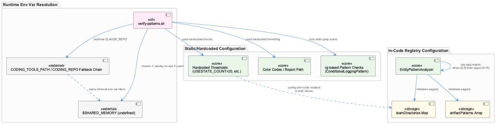
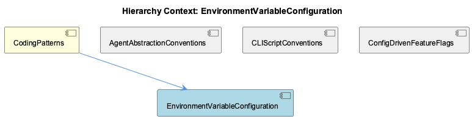

# EnvironmentVariableConfiguration

**Type:** SubComponent

# EnvironmentVariableConfiguration — Technical Insight Document

## What It Is

EnvironmentVariableConfiguration is a cross-cutting configuration idiom, most concretely observable in `scripts/knowledge-management/verify-patterns.sh`, where repo-root resolution follows the fallback chain `CLAUDE_REPO="${CODING_TOOLS_PATH:-${CODING_REPO:-$DEFAULT_REPO}}"`. This is the same layering pattern documented for LLM provider wiring (`LLM_PROXY_URL`, `RAPID_LLM_PROXY_URL`, `QWEN_LOCAL_API_KEY`, `QWEN_LAPTOP_API_BASE_URL`, `GSD_BROWSER_BROWSER_PATH`) in the parent component, **CodingPatterns**, applied instead to shell-script path discovery. Rather than being a single service, this entity represents a project-wide convention: any environment variable can be overridden, with progressively more generic defaults, so that scripts remain relocatable across CI, cron, and developer shells without hardcoded paths.

Critically, the observations reveal this convention is applied *unevenly*. It governs runtime resolution (repo paths, LLM endpoints) but is conspicuously absent from adjacent configuration surfaces — operational thresholds, formatting, and classification rules — which are hardcoded instead.

## Architecture and Design

The core pattern is the **environment-variable fallback chain**, shared structurally with sibling components **AgentAbstractionConventions** and **CLIScriptConventions** — both note that `verify-patterns.sh` resolves its own root via `$(cd "$(dirname ...)" && pwd)` combined with `CODING_TOOLS_PATH`/`CODING_REPO` overrides, mirroring the fallback idiom used for `LLM_PROXY_URL`. This establishes environment-variable-with-fallback as a general-purpose idiom for any `bin/`- or `scripts/`-level executable, not merely LLM provider wiring.

A second, contrasting idiom appears in `src/ontology/heuristics/EntityPatternAnalyzer.ts`, which encodes team/pattern mappings as compile-time TypeScript data structures (`teamDirectories` Map, `artifactPatterns` array) rather than externalized config. This is the inverse of the declarative-config approach used by <AWS_SECRET_REDACTED> (`config/prompt-classifier.yaml`, `config/task-taxonomy.yaml`) and explicitly diverges from sibling **ConfigDrivenFeatureFlags**, which expects behavior changes to ship via config PRs rather than code edits.

A third idiom — static, filesystem-scanning verification via `rg` (ripgrep) — is used by `verify-patterns.sh` itself to check code conventions (e.g., `console.log` vs `Logger.*` call counts), showing that "configuration" in this codebase spans at least three mechanisms: runtime env vars, in-code registries, and grep-based static checks, with no shared schema unifying them.

## Implementation Details

`verify-patterns.sh` demonstrates both the strength and weakness of the pattern. Its root-resolution logic properly uses the env-var fallback chain, but its own operational configuration — RED/GREEN/YELLOW/BLUE color codes, the `VERIFICATION_REPORT` path built from `$(date +%Y%m%d_%H%M%S)`, and hardcoded thresholds like `USESTATE_COUNT > 20` and `UNDOCUMENTED_FUNCTIONS < 10` — is embedded directly in the script. Changing a threshold requires editing the script rather than a config file, inconsistent with the config-over-code convention it exists to enforce.

More seriously, the script references `$SHARED_MEMORY` as an implicit, never-defined external variable, checked via `[ -f "$SHARED_MEMORY" ]` at two locations (pattern-usage lookup and the final `jq`-based timestamp/score write-back). Because the `-f` test simply fails when the variable is unset, both blocks silently no-op — an unconfigured environment produces an incomplete report rather than an error, exemplifying the "no central schema validator" problem called out at the parent level.

`EntityPatternAnalyzer`'s constructor initializes `teamDirectories` and `artifactPatterns` eagerly and synchronously — appropriate given these are cheap in-memory structures with no I/O cost, consistent with the project's convention of reserving lazy initialization for heavyweight resources (network clients keyed by `LLM_PROXY_URL`, browser instances via `GSD_BROWSER_BROWSER_PATH`). Its `analyzeEntityPatterns` method performs two-step matching — `checkLocalArtifact` then `matchArtifactPattern` — yielding distinct confidence scores (0.9 vs 0.75), a layered scoring approach independent of any external configuration.

## Integration Points

This entity sits under **CodingPatterns**, alongside **AgentAbstractionConventions**, **CLIScriptConventions**, and **ConfigDrivenFeatureFlags**. It shares its core mechanism with the `config/agents/*.sh` adapter scripts (claude.sh, copilot.sh, opencode.sh, pi.sh) described at the parent level, which likewise consume `LLM_PROXY_URL` and `CODING_OPENCODE_MODEL` via environment variables to normalize vendor CLIs into a common invocation contract. `verify-patterns.sh` depends implicitly on `$SHARED_MEMORY`, an undeclared external dependency likely populated by another orchestration component, making that integration point fragile and undocumented. `EntityPatternAnalyzer` sits outside this env-var world entirely, integrating instead with the ontology/heuristics layer via hardcoded registries, representing a competing configuration surface within the same broader system.

## Usage Guidelines

Developers extending scripts under `scripts/knowledge-management/` should follow the established fallback-chain pattern (`SPECIFIC_VAR:-${GENERIC_VAR:-$DEFAULT}`) for any new path or endpoint resolution, consistent with `CLIScriptConventions`. However, thresholds, formatting, and other tunable parameters should ideally be externalized rather than hardcoded, since the current approach in `verify-patterns.sh` requires script edits for what should be config changes. Any script depending on implicit environment variables like `$SHARED_MEMORY` should validate their presence explicitly and fail loudly rather than silently degrading, since silent no-ops currently produce misleadingly "successful" verification reports. When adding new team/pattern mappings to `EntityPatternAnalyzer`, developers should recognize this requires a code change and rebuild — not a config PR — and should consider whether migrating to an external YAML/JSON catalog (matching OntologyClassifier's approach) would better serve maintainability, since the current design's tight coupling between ownership data and code undermines the "no-code-change" goal pursued elsewhere via `config/feature-profiles.yaml` and `config/task-taxonomy.yaml`.

## Hierarchy Context

### Parent
- [CodingPatterns](./CodingPatterns.md) -- [LLM] The config/agents/*.sh scripts (claude.sh, copilot.sh, opencode.sh, pi.sh) implement a uniform adapter pattern where each script normalizes a different vendor CLI into a common invocation contract described in docs/architecture/agent-abstraction-api.md. Concretely, each script accepts the same positional arguments and environment variables (e.g., LLM_PROXY_URL, CODING_OPENCODE_MODEL), performs argument translation specific to its backend binary, and emits output in a shared format consumable by the orchestrator layer. This lets the rest of the system (e.g., wave-controller.ts or any dispatcher invoking these scripts) remain agnostic to which underlying agent CLI is actually installed—new agents can be onboarded by adding a new script that satisfies the same contract rather than modifying core dispatch logic, as described in docs/architecture/adding-new-agent.md.

### Siblings
- [AgentAbstractionConventions](./AgentAbstractionConventions.md) -- [LLM] The `config/agents/*.sh` adapter scripts described in the parent context establish a normalization boundary that is structurally mirrored in `scripts/knowledge-management/verify-patterns.sh`: both are Bash entrypoints that resolve their own root via `$(cd "$(dirname ...)" && pwd)` rather than assuming a fixed working directory, and both read configuration through environment variables with fallback chains (`CODING_TOOLS_PATH:-${CODING_REPO:-$DEFAULT_REPO}` in verify-patterns.sh mirrors the `LLM_PROXY_URL`/`RAPID_LLM_PROXY_URL` fallback idiom cited for the agent scripts). This shows the environment-variable-with-fallback convention is not confined to LLM provider wiring — it is a project-wide idiom for making any `bin/`- or `scripts/`-level executable relocatable and invocable from CI, cron, or an arbitrary submodule checkout without hardcoded paths.
- [CLIScriptConventions](./CLIScriptConventions.md) -- [LLM] The config/agents/*.sh adapter pattern described in the parent context is one instance of a broader convention visible in scripts/knowledge-management/verify-patterns.sh: shell scripts in this codebase are written as self-contained, idempotent CLI tools that resolve their own root directory via `SCRIPT_DIR="$(cd "$(dirname "${BASH_SOURCE[0]}")" && pwd)"` and then derive a repo-relative path (`DEFAULT_REPO="$(dirname "$(dirname "$SCRIPT_DIR")")"`), overridable via `CODING_TOOLS_PATH`/`CODING_REPO` env vars. This mirrors the env-var-driven configuration idiom (LLM_PROXY_URL, QWEN_LOCAL_API_KEY) at the shell-script layer: no script hardcodes an absolute path, so the same script works whether invoked from bin/, cron, or CI.
- [ConfigDrivenFeatureFlags](./ConfigDrivenFeatureFlags.md) -- [LLM] The EntityPatternAnalyzer class in src/ontology/heuristics/EntityPatternAnalyzer.ts embodies the config-driven feature flags idea from the parent context, but inverted: instead of an external YAML/JSON file like config/feature-profiles.yaml, the classification rules are hardcoded as in-memory data structures (`teamDirectories: Map<string, string[]>` and `artifactPatterns: ArtifactPattern[]`) built inside the constructor. This is a notable deviation from the declarative-config convention described for OntologyClassifier and SensitivityClassifier elsewhere in the codebase — here the 'declarative catalog' is TypeScript object literals rather than a parseable file, meaning changes to team ownership (e.g., adding a new team or artifact pattern) require a code change and rebuild rather than a config PR, undermining the stated goal of behavior changes shipping without TypeScript/JS edits.

---

*Generated from 9 observations*
