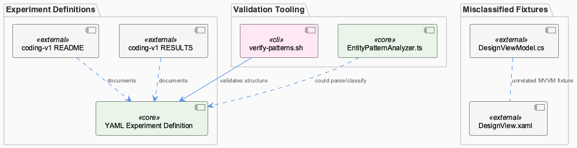
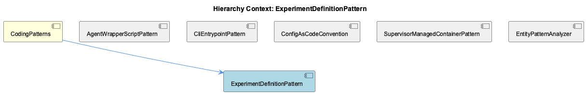

# ExperimentDefinitionPattern

**Type:** SubComponent

Despite being grouped under this sub-component, integrations/graphify/tests/fixtures/xaml_viewmodel/ViewModels/DesignViewModel.cs and Views/DesignView.xaml are unrelated XAML MVVM fixtures rather than YAML experiment definitions, suggesting the source file listing conflates fixture assets with actual pattern-defining files, while src/ontology/heuristics/EntityPatternAnalyzer.ts instead provides heuristic analysis logic that could be applied to parse or classify entities within such experiment definition YAML files.

# ExperimentDefinitionPattern — Technical Insight Document

## What It Is

ExperimentDefinitionPattern is a sub-component of CodingPatterns concerned with declaring experiments and benchmarks as data rather than code. Its primary evidence lives in `docs/benchmarks/coding-v1/README.md` and `docs/benchmarks/coding-v1/RESULTS.md`, which document a benchmark named `coding-v1` whose configuration and results are kept separate from executable code. This separation is the hallmark of the pattern: experiment/benchmark definitions are expected to be declarative artifacts (implied to be YAML) that live alongside, but distinct from, the logic that consumes them. The pattern is enforced procedurally by `scripts/knowledge-management/verify-patterns.sh`, which validates that these declarative definitions referenced under `docs/benchmarks` conform to expected structural conventions before downstream consumption.

Notably, the observed source listing for this sub-component is not entirely clean: `integrations/graphify/tests/fixtures/xaml_viewmodel/ViewModels/DesignViewModel.cs` and `Views/DesignView.xaml` are grouped under this pattern but are unrelated XAML MVVM test fixtures, not experiment definitions. This indicates the file-classification/knowledge-base tooling that assigns files to patterns has some noise, and this document should be read with that caveat — the true defining artifacts are the `docs/benchmarks/coding-v1/*` files and the verification script, not the XAML fixtures.

## Architecture and Design

The architectural approach is "config-as-code applied to experiments": experiment/benchmark definitions are treated as structured, declarative data, documented and versioned under `docs/benchmarks/<benchmark-name>/`, separate from any executable pipeline that runs them. This mirrors the sibling **ConfigAsCodeConvention**, which similarly emphasizes reading definitions from structured data (there, a jq-queried JSON knowledge base) rather than embedding configuration in code paths.

Validation is externalized into a dedicated script rather than baked into the definitions themselves or into application logic — `scripts/knowledge-management/verify-patterns.sh` acts as a gatekeeper, checking structural conformance of the YAML-like definitions before they are trusted by downstream consumers. This script is itself an instance of the sibling **CliEntrypointPattern**, being a standalone CLI entrypoint invoked directly (computing paths relative to `SCRIPT_DIR`) rather than dispatched through a shared `bin/` layer, consistent with how other verification/knowledge-management tooling in this codebase is structured.

## Implementation Details

The concrete mechanics center on two things: (1) documentation-as-definition files under `docs/benchmarks/coding-v1/` (`README.md` for description, `RESULTS.md` for outcomes), and (2) the verification logic in `verify-patterns.sh`. The script's job is to confirm that whatever declarative experiment/benchmark definitions are referenced from `docs/benchmarks` conform to expected structural conventions — acting as a pre-consumption contract check rather than a runtime enforcement mechanism.

Although not directly part of this sub-component's file set, `src/ontology/heuristics/EntityPatternAnalyzer.ts` is flagged as relevant tooling that could be applied to parse or classify entities within these experiment definition files — suggesting a potential (if not yet realized) integration where the heuristic analyzer used elsewhere in the ontology layer could extend to understanding benchmark/experiment YAML structures rather than only source code entities.

## Integration Points

ExperimentDefinitionPattern sits within **CodingPatterns** alongside siblings **AgentWrapperScriptPattern**, **CliEntrypointPattern**, **ConfigAsCodeConvention**, **SupervisorManagedContainerPattern**, and **EntityPatternAnalyzer**. Its most direct integration is with **CliEntrypointPattern**, since its validating script `verify-patterns.sh` is the canonical example of that sibling pattern. It also shares philosophy with **ConfigAsCodeConvention**, which likewise treats structured data (JSON knowledge base filtered by `entityType == 'TransferablePattern'` and `significance >= 8`) as the source of truth for pattern definitions rather than hardcoded logic.

The relationship to **EntityPatternAnalyzer** (both the sibling pattern and the concrete `src/ontology/heuristics/EntityPatternAnalyzer.ts` file) is more speculative but noted explicitly: its heuristic classification logic is a plausible mechanism for parsing/classifying entities inside experiment definition files, even though no direct wiring is confirmed in the observations.

## Usage Guidelines

Developers extending or auditing this pattern should treat `docs/benchmarks/<name>/README.md` and `RESULTS.md` as the canonical location for experiment/benchmark definitions and results, keeping them declarative and separate from executable code — following the `coding-v1` example. Before trusting or consuming any such definition downstream, run or rely on `scripts/knowledge-management/verify-patterns.sh` to confirm structural conformance.

Developers should also be aware of and correct the file-classification noise observed here: the XAML MVVM fixtures (`DesignViewModel.cs`, `DesignView.xaml`) under `integrations/graphify/tests/fixtures/xaml_viewmodel/` do not belong to this pattern and should not be treated as reference examples of experiment definitions. Finally, if extending parsing/classification of experiment definitions, consider reusing or extending `src/ontology/heuristics/EntityPatternAnalyzer.ts` rather than building bespoke parsing logic, to stay consistent with how other entity classification is handled in the codebase.

## Hierarchy Context

### Parent
- [CodingPatterns](./CodingPatterns.md) -- [LLM] The agent wrapper scripts under config/agents/ (claude.sh, copilot.sh, opencode.sh, pi.sh) implement a consistent adapter pattern where each script normalizes a distinct third-party CLI's invocation surface into a common interface expected by the rest of the Coding infrastructure. Rather than having callers branch on which agent is being invoked, each wrapper reads its own set of environment variables (e.g., CODING_OPENCODE_MODEL for opencode.sh) and translates them into the flags or config files that the underlying binary expects. This pattern lets orchestration code (likely in bin/coding or docs/architecture/agent-abstraction-api.md-described layers) treat all agents uniformly, at the cost of needing to keep each wrapper script in sync whenever a new common capability (like model selection or proxy routing) is added — a new developer adding agent support should look at an existing wrapper like claude.sh as the canonical template, per docs/architecture/adding-new-agent.md.

### Siblings
- [AgentWrapperScriptPattern](./AgentWrapperScriptPattern.md) -- Each wrapper reads a distinct env var namespace, e.g. CODING_OPENCODE_MODEL for opencode.sh, to select model configuration without changing caller code
- [CliEntrypointPattern](./CliEntrypointPattern.md) -- scripts/knowledge-management/verify-patterns.sh acts as a standalone CLI entrypoint invoked directly rather than through a shared bin/ dispatcher, computing paths relative to SCRIPT_DIR
- [ConfigAsCodeConvention](./ConfigAsCodeConvention.md) -- verify-patterns.sh reads pattern definitions dynamically from a jq-queried JSON knowledge base file ($SHARED_MEMORY) filtering entities by entityType == 'TransferablePattern' and significance >= 8
- [SupervisorManagedContainerPattern](./SupervisorManagedContainerPattern.md) -- No supervisord configuration files or Dockerfile content were present in the provided Source Files to substantiate specific observations
- [EntityPatternAnalyzer](./EntityPatternAnalyzer.md) -- EntityPatternAnalyzer.teamDirectories Map hardcodes directory-to-team ownership, e.g. 'Coding' owns src/ontology, src/knowledge-management, scripts, .specstory

---

*Generated from 3 observations*
