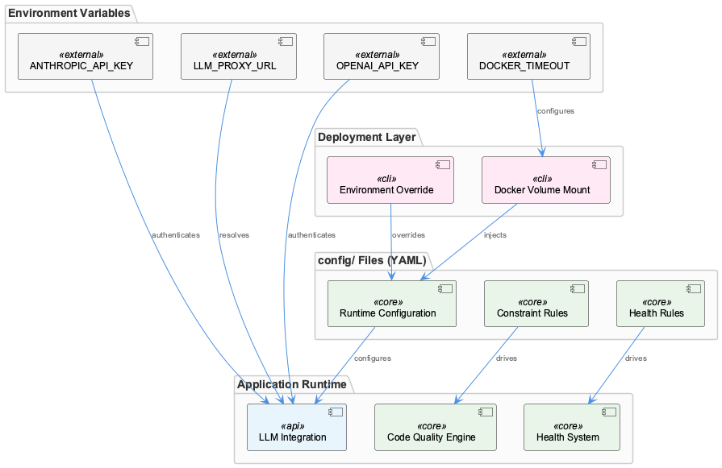
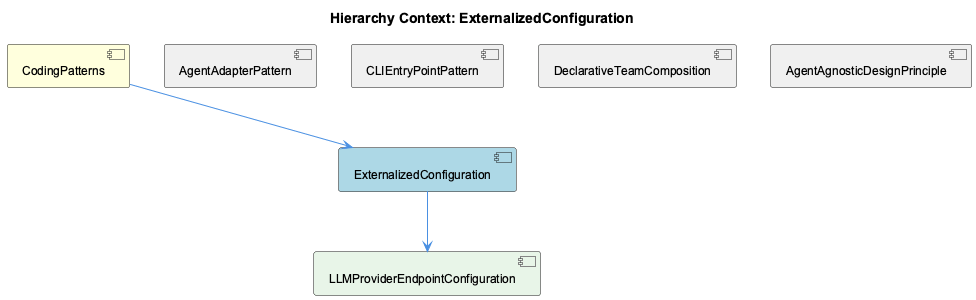

# ExternalizedConfiguration

**Type:** SubComponent

LLM_PROXY_URL, RAPID_LLM_PROXY_URL, OPENAI_API_KEY, and ANTHROPIC_API_KEY are all documented as environment variables rather than in-code constants, enforcing externalization at the credential level

# ExternalizedConfiguration

## What It Is

ExternalizedConfiguration is a documented architectural mandate within the Coding project that governs how runtime concerns — credentials, operational parameters, <USER_ID_REDACTED> enforcement rules, and monitoring behavior — are stored and accessed. Rather than hardcoding values within source files, the pattern designates `config/` as the authoritative location for all adjustable runtime state, with environment variables handling secrets and sensitive credentials. This is not an emergent convention but an explicit policy: `CLAUDE.md` names `config/` as the canonical home for runtime concerns, making ExternalizedConfiguration a first-class architectural constraint within CodingPatterns alongside siblings like AgentAgnosticDesignPrinciple and DeclarativeTeamComposition.

The pattern spans multiple concern domains. At the credential level, `LLM_PROXY_URL`, `RAPID_LLM_PROXY_URL`, `OPENAI_API_KEY`, and `ANTHROPIC_API_KEY` are all environment variables. At the infrastructure level, `DOCKER_TIMEOUT` follows the same externalization discipline. At the code-<USER_ID_REDACTED> level, `docs/constraints/README.md` confirms that constraint rules live in `config/` files. At the monitoring level, `docs/health-system/README.md` and `4-layer-architecture-implementation-plan.md` establish that health rules are defined in `config/` YAML. The breadth of this coverage — from AI secrets to linting rules to health checks — signals that ExternalizedConfiguration is intended as a universal principle rather than a targeted solution to a specific problem.

## Architecture and Design

The design separates configuration concerns into two distinct tiers based on sensitivity and format. Environment variables handle secrets and endpoint URLs — values that differ per deployment environment and must never appear in version-controlled files. The `config/` directory handles structural configuration — YAML and JSON files that define rules, thresholds, team compositions, and behavioral parameters that are safe to commit but should remain adjustable without code changes. This two-tier structure is a deliberate design decision that balances security (secrets stay out of the repository) with operability (behavioral tuning stays out of the source code).

The deployment-awareness of the pattern is confirmed by `docker/README.md`, which documents `config/` file mounting in Docker deployments. This means the externalization design explicitly accounts for environment-specific overrides: a containerized deployment can substitute a different `config/` mount without rebuilding the image. This makes the pattern compatible with standard container deployment practices where image immutability is a goal and environment-specific state is injected at runtime.

The relationship to sibling patterns is structurally significant. DeclarativeTeamComposition relies on ExternalizedConfiguration directly — `config/teams/` JSON files are themselves instances of the externalization pattern applied to team membership. AgentAgnosticDesignPrinciple is enabled by ExternalizedConfiguration: because LLM endpoint URLs and API keys are externalized (see child component LLMProviderEndpointConfiguration), swapping backends requires only environment variable changes rather than code modifications. CLIEntryPointPattern's bin/ proxy scripts similarly depend on environment variables being present at execution time. ExternalizedConfiguration is therefore load-bearing infrastructure for multiple other patterns in CodingPatterns.

## Implementation Details

The credential tier is implemented purely through environment variable conventions. `LLM_PROXY_URL` and `RAPID_LLM_PROXY_URL` represent two distinct proxy tiers for LLM routing — a distinction elaborated by child component LLMProviderEndpointConfiguration, which documents a standard path and a rapid/fast path. `OPENAI_API_KEY` and `ANTHROPIC_API_KEY` follow standard provider naming conventions. `DOCKER_TIMEOUT` extends this tier to infrastructure parameters, demonstrating that the pattern is not limited to AI concerns. These variables are documented in `CLAUDE.md` and associated READMEs rather than enforced by runtime validation code visible in the observations — the enforcement mechanism is documentation and convention rather than a configuration-loading framework.

The `config/` directory tier uses YAML as the primary format for structured configuration, with JSON used for team composition files (as established by DeclarativeTeamComposition). Health rules documented in `docs/health-system/README.md` and `4-layer-architecture-implementation-plan.md` reside in `config/` YAML, making the 4-layer health monitoring system reconfigurable without redeployment. Constraint configuration described in `docs/constraints/README.md` follows the same placement rule. The consistent use of `config/` as the single root for all such files means developers and operators have a single directory to inspect when understanding or modifying system behavior.

## Integration Points

ExternalizedConfiguration integrates with the deployment layer through Docker volume mounting, as documented in `docker/README.md`. This is the primary mechanism by which environment-specific configuration overrides reach the running system — a `config/` directory is mounted into the container, replacing or supplementing the default configuration. Environment variables are injected through standard Docker and container orchestration mechanisms.

Within the codebase, the pattern integrates with every subsystem that has tunable behavior: the health monitoring system (via `config/` YAML health rules), the constraint enforcement system (via `config/` constraint files), and the LLM routing layer (via environment variables consumed by LLMProviderEndpointConfiguration). The agent adapter layer, governed by AgentAdapterPattern, depends on the externalized endpoint and key variables to instantiate the correct backend without hardcoded provider details.

## Usage Guidelines

Developers adding new runtime-tunable behavior should place configuration in `config/` YAML or JSON files rather than introducing hardcoded values or new in-code constants. If the value is a secret or an environment-specific endpoint, it belongs in an environment variable documented in `CLAUDE.md` or the relevant subsystem README. If it is a behavioral rule, threshold, or composition definition, it belongs in a `config/` file. This distinction is the primary decision rule the pattern enforces.

When introducing new environment variables, they should be documented alongside existing variables in `CLAUDE.md` to maintain the single authoritative reference for environment-level configuration. New `config/` file schemas should be described in the relevant subsystem README (following the precedent of `docs/health-system/README.md` and `docs/constraints/README.md`) so that operators understand what is adjustable and what the valid value ranges or formats are.

For Docker deployments, any new `config/` files that must be environment-specific should be accounted for in `docker/README.md` as mountable paths. The immutability of the container image is a design goal that ExternalizedConfiguration directly supports — introducing hardcoded values that should vary by environment undermines this goal and violates the pattern's intent as established in `CLAUDE.md`.

## Hierarchy Context

### Parent
- [CodingPatterns](./CodingPatterns.md) -- CodingPatterns serves as the architectural catch-all component for the Coding project, capturing cross-cutting programming conventions, design patterns, and best practices that permeate the entire codebase. The project follows consistent patterns visible across its configuration, tooling, and documentation: agent abstractions use a constructor+initialize+execute lifecycle, shell scripts in bin/ follow a proxy/delegation pattern to underlying services, and configuration is externalized into config/ YAML/JSON files rather than hardcoded values. The system emphasizes agent-agnostic design, enabling multiple AI backends (Claude, Copilot, Mastra, OpenCode) to operate under a unified interface.

### Children
- [LLMProviderEndpointConfiguration](./LLMProviderEndpointConfiguration.md) -- Project documentation (CLAUDE.md, README.md) documents LLM_PROXY_URL and RAPID_LLM_PROXY_URL as distinct environment variables, suggesting two separate proxy tiers (standard vs. rapid/fast path) for LLM routing

### Siblings
- [AgentAdapterPattern](./AgentAdapterPattern.md) -- docs/architecture/agent-abstraction-api.md defines the unified Agent Abstraction API that all backends must conform to, serving as the contract between adapters and consumers
- [CLIEntryPointPattern](./CLIEntryPointPattern.md) -- CLAUDE.md describes bin/ scripts as proxies that delegate to underlying services, establishing delegation as the explicit architectural intent rather than an implementation detail
- [DeclarativeTeamComposition](./DeclarativeTeamComposition.md) -- config/teams/ directory holds JSON files that define which agents participate in a team and their roles, as described in the architecture documentation
- [AgentAgnosticDesignPrinciple](./AgentAgnosticDesignPrinciple.md) -- CLAUDE.md explicitly names agent-agnostic design as a core architectural principle, making backend independence a first-class documented constraint rather than an emergent property

---

*Generated from 6 observations*
