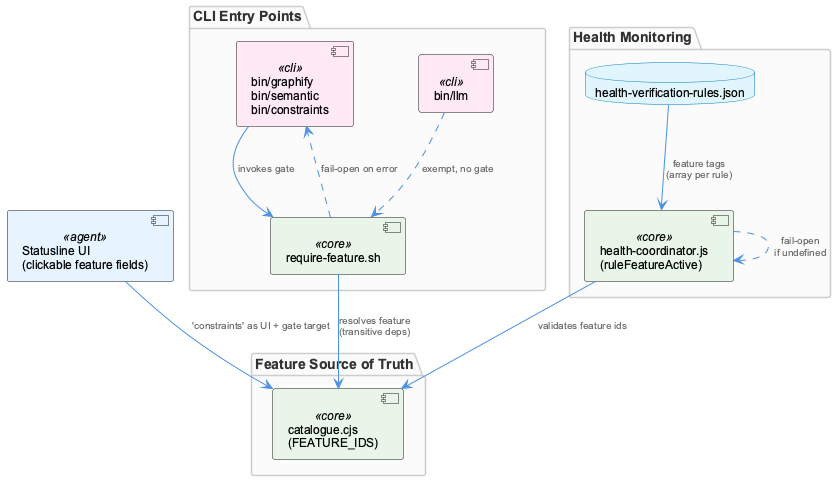
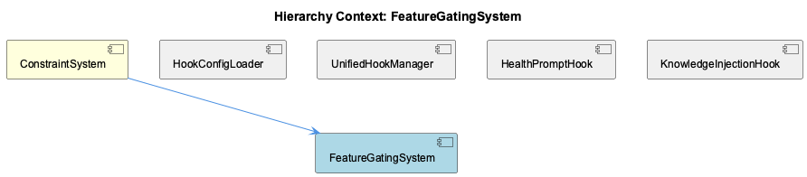

# FeatureGatingSystem

**Type:** SubComponent

## What It Is

FeatureGatingSystem is the mechanism that controls which optional capabilities of the toolchain are active, implemented across three layers: a shared shell guard (`lib/features/require-feature.sh`) invoked by CLI entry points such as `bin/graphify`, `bin/semantic`, and `bin/constraints`; a JS runtime filter (`scripts/health-coordinator.js`) that gates health-check rule evaluation; and a declarative JSON config (`config/health-verification-rules.json`) that tags individual health rules with the features they depend on. The single source of truth for valid feature names is `lib/features/catalogue.cjs` (`FEATURE_IDS`), which is cross-validated by `tests/features/cli-and-rules-gating.test.mjs` against both CLI guards and health-rule tags. As a SubComponent of ConstraintSystem, it underpins the parent's ability to selectively enforce constraint-related tooling — notably `bin/constraints` itself is one of the gated CLIs, and 'constraints' is a real feature ID exercised in the tests.

## Architecture and Design

The design centers on a guard/gate pattern: `require-feature.sh` is sourced by multiple CLIs rather than reimplemented, ensuring refusal wording stays consistent (exit code 2, stderr matching `/'codegraph' feature, which is switched off/`, with stdout left untouched so piped output isn't polluted). This is paired with a feature-to-dependency graph resolution model — disabling a low-level feature like 'knowledge' causes downstream features like 'lsl' (via 'observations') to fail too, and the resolver surfaces the root dependency reason in its refusal message rather than just the immediately requested feature.

A deliberate fail-open safety policy runs through every layer: `require-feature.sh` returns 0 (allow) when no repo is detected or `node` is unavailable, and `health-coordinator.js` treats a missing `features` object or an `undefined` entry as active. This reflects a design trade-off favoring availability over strict enforcement — a broken guard must never block a working command.

Health-rule tagging is declarative and stratified: `databases`/`services` rules may carry a `feature` (or array of features, e.g. `qdrant_availability` tagged `['constraints','knowledge']`) so a shared dependency stays monitored if ANY consuming feature is enabled, while `processes` and `files` rules are asserted to never carry a feature tag, keeping baseline machine health checks immune to minimal-profile installs.

## Implementation Details

`require-feature.sh` is sourced by CLI scripts to perform the actual gate check before command logic executes; its fail-open guards (`[ -n "$repo" ] || return 0`, `command -v node ... || return 0`) are explicit short-circuits rather than implicit fallthrough. On the JS side, `health-coordinator.js` implements `ruleFeatureActive(rule.feature, features)` and applies it via `if (rule.feature && !ruleFeatureActive(rule.feature, features)) continue;`, skipping rule evaluation when the tagged feature(s) are inactive. The rule/feature mapping itself lives outside code, in `config/health-verification-rules.json`, decoupling health-check definitions from the filtering logic that consumes them at runtime. Tests in `tests/features/cli-and-rules-gating.test.mjs` validate both layers together — asserting CLI refusal semantics and verifying that qdrant's feature array sorts to `['constraints','knowledge']` and that every service rule is tagged (an untagged service rule is treated as a bug).

## Integration Points

The gating system's exemptions are as deliberate as its coverage: `bin/llm` is explicitly excluded, verified by a test asserting its source lacks `require_feature` and instead references `engines/v1`, because it talks directly to Docker Model Runner rather than depending on a gated service like rapid-llm-proxy — the gating boundary is drawn around service dependencies, not command categories.

Within its parent ConstraintSystem, the 'constraints' feature ID is both a gate target (guarding `bin/constraints`) and a UI surface — the Statusline Click-Report Feature (part of HookManagementSystem) makes the 'constraints' statusline field clickable to open the constraint-monitor dashboard tab, tying gating state to dashboard visibility. That same statusline click-enablement work is noted (in a HookManagementSystem session record) to have introduced an unrelated regression in tmux copy-mode click-and-drag selection — a side effect on terminal input handling, not on gating logic itself. Among siblings (HookConfigLoader, UnifiedHookManager, HealthPromptHook, KnowledgeInjectionHook), no direct code-level coupling is evidenced; the relationship is mediated through the shared health-coordinator/rules pipeline and the ConstraintSystem parent context.

## Usage Guidelines

New CLIs that depend on a gated feature should source `require-feature.sh` rather than reimplement checks, preserving consistent refusal wording and exit codes. New feature IDs must be registered in `lib/features/catalogue.cjs` and cross-checked against health-rule tags to avoid drift. When adding health-verification rules, tag `databases`/`services` rules with the correct `feature` (or feature array) in `config/health-verification-rules.json` — untagged service rules are treated as bugs — while `processes` and `files` rules should remain untagged so baseline health checks survive minimal installs. Because the system fails open by design, gating should be treated as a UX/enforcement convenience, not a security boundary; do not rely on it to strictly prevent execution when the guard's resolution environment is broken. Finally, only gate genuine service dependencies (as with the deliberate `bin/llm` exemption) — gating a command that has no real feature dependency misrepresents the system's actual coupling.

## Code Evidence

Key code artifacts grounding this entity's analysis:

**Relationships:**
- tests/features/cli-and-rules-gating.test.mjs is the clearest evidence of a FeatureGatingSystem: it imports FEATURE_IDS from lib/features/catalogue.cjs, exercises lib/features/require-feature.sh via subprocess calls to bin/graphify, bin/semantic, bin/constraints, etc., and asserts a specific contract — disabled features exit with code 2 and stderr matching /'codegraph' feature, which is switched off/, while stdout stays empty so piped output is never polluted by gate messages.

**Other:**
- The gating system supports transitive dependency resolution, not just flat on/off flags: the test 'the refusal quotes the resolver, including a dependency reason' disables 'lsl' and expects bin/semantic to fail because 'knowledge' is off transitively (lsl -> observations -> knowledge), meaning require-feature.sh or its resolver walks a dependency graph and surfaces the root cause rather than the immediately-requested feature.
- scripts/health-coordinator.js integrates the gate into health-rule evaluation via the pattern `if (rule.feature && !ruleFeatureActive(rule.feature, features)) continue;`, and config/health-verification-rules.json tags individual rules (e.g. databases.qdrant_availability) with an array of features rather than a single string — verified by the test asserting qdrant's feature array sorts to ['constraints','knowledge'], meaning a shared dependency stays monitored as long as ANY consuming feature is enabled.
- The gating system is designed to fail open, not closed, on resolution failure: lib/features/require-feature.sh contains `[ -n "$repo" ] || return 0` and `command -v node ... || return 0`, and health-coordinator.js has `if (!features) return true;` plus treating `features[id] === undefined` as active — three separate fail-open checks across shell and JS layers, reflecting a deliberate policy that a broken guard must never block a working command.
- Health-rule tagging is stratified by category: databases/services rules can carry a `feature` tag (and untagged service rules are treated as a bug per the test 'every service rule is tagged', since an untagged check would alarm on a disabled feature), while processes and files rules are asserted to never carry a feature tag, keeping baseline machine health checks immune to the minimal profile so a pared-down install still monitors something.

## Work Record

What working sessions recorded about this entity — decisions taken, problems hit, and why things are the way they are:

- The 'Statusline Click-Report Feature' (about HookManagementSystem) record establishes that fields in the tmux statusline including 'constraints' are clickable to open/focus dashboard tabs; this is adjacent to but distinct from FeatureGatingSystem — the gating tests confirm 'constraints' as a real feature ID (bin/constraints is gated on it), showing the same feature name is a first-class UI surface as well as a gate target.
- The 'tmux Statusline Copy-Mode / Mouse Configuration' record (about HookManagementSystem) notes a regression in click-and-drag paragraph selection that appeared after statusline fields were made clickable, indicating the same UI change that surfaces gated-feature status (via the statusline) had a side effect on terminal input handling unrelated to the gating logic itself.

## Hierarchy Context

### Parent
- [ConstraintSystem](./ConstraintSystem.md) -- [SESSION] Statusline Click-Report Feature establishes that clicking the 'constraints' field in the tmux statusline opens or focuses the constraint-monitor dashboard tab, integrating HookManagementSystem-driven violation data with the dashboard UI

### Siblings
- [HookConfigLoader](./HookConfigLoader.md) -- [CGR] HookConfigLoader (class) in hook-config.js
- [UnifiedHookManager](./UnifiedHookManager.md) -- [CGR] UnifiedHookManager (class) in hook-manager.js
- [HealthPromptHook](./HealthPromptHook.md) -- [SESSION] obs-api Service Lifecycle and Dev Workflow Resumption: a coverage metric in obs-api computes a ratio whose denominator should exclude 'observations' and 'digests' entity types but currently includes them, skewing reported coverage — an open unresolved code-fix task
- [KnowledgeInjectionHook](./KnowledgeInjectionHook.md) -- [LLM] None of the four supplied code files — scripts/health-prompt-hook.js, tests/integration/health-prompt-hook-stall.test.mjs, integrations/system-health-dashboard/src/components/workflow/hooks.ts, tests/features/cli-and-rules-gating.test.mjs, and integrations/system-health-dashboard/src/hooks/usePolledFetch.ts — mention 'KnowledgeInjectionHook', a knowledge-base injection mechanism, or any hook that inserts KB content into an agent/LLM prompt. health-prompt-hook.js is a UserPromptSubmit hook, but its entire body is health-status reporting (coordinator polling, deriveSummary, envelope shaping) with no reference to knowledge, retrieval, or content injection.

---

*Generated from 11 observations*
