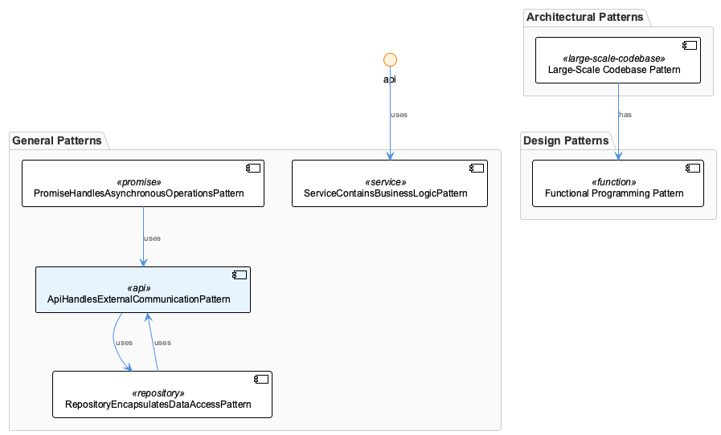

# General Pattern (182 occurrences)
**Type:** general
**Generated:** 2026-01-09T18:29:47.659Z

## Pattern Overview
Pattern observed across 182 instances

**Significance:** 9/10

## Evidence
- {"name":"ApiHandlesExternalCommunicationPattern","entityType":"Unclassified","significance":8,"obser
- {"name":"DecoratorAddsBehaviorToPattern","entityType":"Unclassified","significance":5,"observations"
- {"name":"RepositoryEncapsulatesDataAccessPattern","entityType":"Unclassified","significance":5,"obse
- {"name":"ComponentReusableUiBuildingPattern","entityType":"Unclassified","significance":5,"observati
- {"name":"ApiHandlesExternalCommunicationPattern","entityType":"Unclassified","significance":5,"obser

## Development History
Analysis of 887 commits.

## Conversation Insights
Analysis of 993 development sessions.

## Diagrams

## Related Patterns
- **ApiHandlesExternalCommunicationPattern** (general): High-significance observation
- **PromiseHandlesAsynchronousOperationsPattern** (general): High-significance observation
- **ApiHandlesExternalCommunicationPattern** (general): High-significance observation
- **PromiseHandlesAsynchronousOperationsPattern** (general): High-significance observation
- **ApiHandlesExternalCommunicationPattern** (general): High-significance observation
