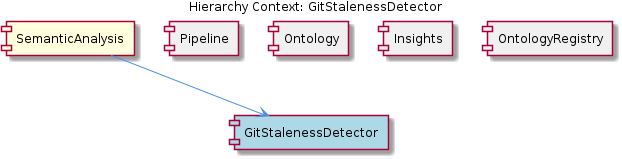
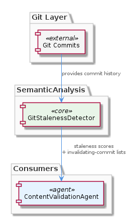

# GitStalenessDetector

**Type:** SubComponent

Serves as Correlates git commits with entity observations to produce staleness scores and invalidating-commit lists, used by ContentValidationAgent for git-based stale detection. within the SemanticAnalysis component at hierarchy path Coding/SemanticAnalysis/GitStalenessDetector

# GitStalenessDetector — Technical Insight Document

## What It Is

GitStalenessDetector is an L2 SubComponent residing at the hierarchy path **Coding/SemanticAnalysis/GitStalenessDetector**. It lives within the SemanticAnalysis multi-agent pipeline and carries a narrowly scoped, well-defined responsibility: correlating git commits with entity observations to produce two concrete outputs — **staleness scores** and **invalidating-commit lists**. These outputs are consumed downstream by `ContentValidationAgent` as the git-based half of its stale-detection logic.

Despite its position deep in the hierarchy, GitStalenessDetector is a decisive component. The question of whether a knowledge entity is still trustworthy ultimately bottoms out in the signal this sub-component produces. Everything above it in the pipeline — LLM cross-correlation, ontology classification, entity persistence — depends on a reliable answer to the question: *has the code this entity describes changed since the entity was recorded?*

## Architecture and Design

GitStalenessDetector sits inside SemanticAnalysis alongside four sibling sub-components — Pipeline, Ontology, Insights, and OntologyRegistry — each of which handles a distinct concern in the overall knowledge-extraction workflow. The sibling decomposition is instructive: Pipeline owns orchestration, Ontology and OntologyRegistry own classification structures, Insights owns derived knowledge output, and GitStalenessDetector owns temporal validity signals derived from version control history. This separation of concerns means no single sub-component conflates classification with validation or orchestration with scoring.

The design decision to isolate git-commit correlation into its own sub-component — rather than embedding it inside ContentValidationAgent directly — reflects a deliberate **separation between signal production and signal consumption**. GitStalenessDetector is a *producer* of scored, structured staleness data; ContentValidationAgent is the *consumer* that acts on it. This boundary means the scoring logic can evolve independently (e.g., changing how commit distance is weighted) without touching validation policy, and the validation agent can change its thresholds or aggregation strategy without touching git-parsing logic.

The two output types — a numeric staleness score and an explicit list of invalidating commits — are a notable design trade-off. A score alone would support threshold-based filtering but would obscure *why* an entity is stale. An invalidating-commit list alone would support debugging but would require every consumer to implement its own severity logic. Producing both gives ContentValidationAgent the ability to apply policy (via score) while retaining full auditability (via commit list), without forcing GitStalenessDetector to make policy decisions itself.

## Implementation Details

No code symbols or key files were surfaced in the available observations, so implementation mechanics cannot be described at the class or function level. What the observations do establish is the logical contract: GitStalenessDetector takes as inputs (a) git commit history and (b) entity observation records, and it produces (a) a staleness score and (b) the specific commits that invalidate each entity.

The parent context describes SemanticAnalysis as processing git history alongside LSL (vibe) sessions and AST-parsed code graphs via Tree-sitter and Memgraph. GitStalenessDetector's correlation work sits at the intersection of git history and entity observations — it does not appear to involve AST graph traversal directly (that is CodeGraphAgent's domain) but would need to reason about which files and symbols an entity references in order to determine whether a commit touches anything relevant. The design therefore implies an internal matching step: mapping entity file/symbol references against the changed paths in each commit, then computing a score from the match results and collecting the matching commits as the invalidating set.

## Integration Points

The primary integration is the **outbound interface to ContentValidationAgent**, which uses GitStalenessDetector's output as one leg of its stale-detection strategy. The parent description notes that ContentValidationAgent detects stale entities via both *file-reference correlation* and *git-commit correlation* — GitStalenessDetector owns the latter. This implies a peer relationship with whatever sub-component handles file-reference correlation; both feed into ContentValidationAgent's final validity verdict.

Upstream, GitStalenessDetector depends on git history data that the broader SemanticAnalysis pipeline ingests. SemanticAnalysis is described as processing git history as one of its three primary data streams, meaning GitStalenessDetector's inputs arrive through the pipeline's data-acquisition layer rather than by querying a repository directly. The Pipeline sibling sub-component is the likely orchestrator that sequences this data flow.

The relationship to SemanticAnalysis as a whole means GitStalenessDetector's outputs can also influence confidence scoring: the BaseAgent abstract class used across all agents provides a standard response envelope including confidence breakdown and issue detection. Staleness scores from GitStalenessDetector are a natural input to the confidence calculations ContentValidationAgent reports through that envelope.

## Usage Guidelines

**Treat staleness scores as relative, not absolute.** The score represents the degree to which observed git activity invalidates a recorded entity, but the threshold at which an entity should be considered "stale enough to act on" is a policy decision that belongs to ContentValidationAgent, not to GitStalenessDetector. Avoid embedding thresholds or eviction logic inside this sub-component.

**Preserve the invalidating-commit list as a first-class output.** Downstream consumers and debugging workflows depend on knowing *which* commits triggered a staleness determination. This list should not be collapsed into the score or discarded after scoring — it is the audit trail that makes staleness verdicts explainable.

**Scope correlation to entity-referenced artifacts only.** GitStalenessDetector should correlate commits against the specific files and symbols an entity claims to describe, not against entire repositories or broad directory trees. Overly broad correlation would inflate staleness scores and erode the signal-to-noise ratio that ContentValidationAgent relies on.

**Coordinate with the file-reference correlation path.** Because ContentValidationAgent uses both git-commit and file-reference signals, changes to how GitStalenessDetector defines "invalidating" should be reviewed alongside the complementary file-reference logic to ensure the two signals remain coherent and non-redundant.

As no code files are currently registered for this sub-component, any implementation should register key source files and exported symbols in the project knowledge hierarchy to enable future automated analysis and cross-referencing with sibling components like Pipeline and OntologyRegistry.

## Hierarchy Context

### Parent
- [SemanticAnalysis](./SemanticAnalysis.md) -- SemanticAnalysis is a multi-agent pipeline within the mcp-server-semantic-analysis integration that processes git history, LSL (vibe) sessions, and AST-parsed code graphs to extract, classify, and persist structured knowledge entities. The system coordinates several specialized agents: CodeGraphAgent indexes repositories via Tree-sitter/Memgraph, SemanticAnalysisAgent performs LLM-driven cross-correlation of git/vibe/code data, OntologyClassificationAgent classifies observations against upper/lower ontology hierarchies, ContentValidationAgent detects stale entities via file-reference and git-commit correlation, and a BaseAgent abstract class provides the standard response envelope (confidence breakdown, issue detection, routing suggestions) used by all agents.

### Siblings
- [Pipeline](./Pipeline.md) -- Pipeline is a sub-component of SemanticAnalysis
- [Ontology](./Ontology.md) -- Ontology is a sub-component of SemanticAnalysis
- [Insights](./Insights.md) -- Insights is a sub-component of SemanticAnalysis
- [OntologyRegistry](./OntologyRegistry.md) -- OntologyRegistry is a sub-component of SemanticAnalysis

---

*Generated from 3 observations*
