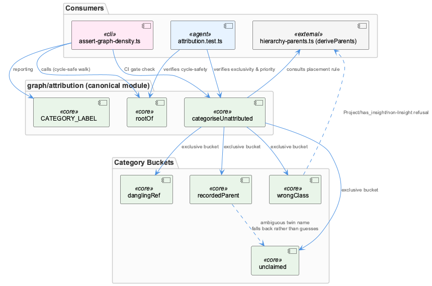
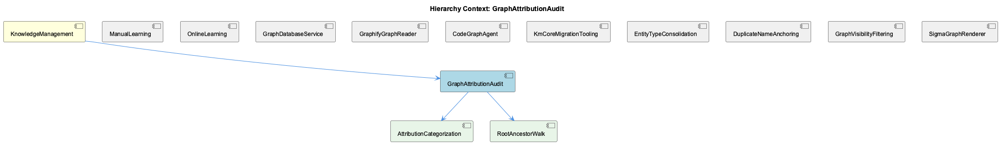

# GraphAttributionAudit

**Type:** SubComponent

## What It Is

GraphAttributionAudit is the read-side auditing module implemented at `integrations/unified-viewer/src/graph/attribution.ts` (implementation file not directly retrievable, but conclusively specified by its test suite `attribution.test.ts` and its consumer `scripts/assert-graph-density.ts`). It provides two core functions — `categoriseUnattributed` and `rootOf` — that together answer the question "why is this graph node not rooted under a Project or System, and what should be done about it?" It is the canonical, single-source-of-truth implementation of a graph-walk/classification rule that had previously drifted across three independent call sites.

## Architecture and Design

The module embodies a classification/triage pattern rather than a boolean flag: instead of a single "unattributed" bucket, `categoriseUnattributed` sorts orphaned nodes into four mutually exclusive categories — `recordedParent`, `wrongClass`, `danglingRef`, and `unclaimed` — each implying a different remediation path. This decomposition is formalized as its own child component, AttributionCategorization, while the traversal logic that finds a node's enclosing Project/System is factored out into the sibling child component RootAncestorWalk (`rootOf`).

A second key pattern is deliberate shared-module extraction. `assert-graph-density.ts`'s own header comment records that the file "used to carry its own copy of the walk while `countUnanchored` carried a second one and the panel would have made a third" — this module exists specifically to stop that triplication, making `graph/attribution` the canonical implementation consumed by a CI script, a node-count helper, and the viewer's quality panel alike.

A third pattern is conservative refusal-to-guess: when a `parentEntityName` resolves ambiguously to two same-named rooted entities (the codebase notes 40 of 98 live roll-up parents share their child's name), the function does not emit a coin-flip `suggestedParentId`; it falls back to `unclaimed`, explicitly reporting the ambiguity rather than resolving it.

## Implementation Details

`rootOf` performs a parent-chain walk up the `parents` map to locate the enclosing Project/System, and is explicitly cycle-safe: the test `'is cycle-safe'` constructs a two-node cycle (`d1 -> comp -> d1`) and asserts the walk terminates with `null` rather than looping — critical because `assert-graph-density.ts` invokes `rootOf` synchronously inside a CI gate, where an unguarded cycle would stall the pipeline instead of failing a budget check.

`categoriseUnattributed` applies specific hierarchy-placement rules, not generic heuristics. The `wrongClass` category captures cases where a real edge exists but placement is still refused on semantic grounds — e.g., a Project reaching a node via `has_insight` where that node isn't an Insight, a rule enforced in `hierarchy-parents.ts:156`'s `deriveParents`. This is distinguished from `danglingRef` (edge points at an entity absent from the store) and `unclaimed` (no edge, no recorded name at all).

Notably, the priority ordering among the four categories — what wins when a row has both a `parentEntityName` and a conflicting `has_insight` edge — is not exposed as a named constant or documented policy anywhere in the source. It is pinned only by the exclusivity test, which asserts such a row lands solely in `recordedParent` with a bucket sum of exactly 1. This makes the test suite the de facto specification.

## Integration Points

`assert-graph-density.ts` imports `rootOf`, `categoriseUnattributed`, and `CATEGORY_LABEL` directly from `graph/attribution`, treating them as canonical rather than reimplementing them — this is the module's primary consumer relationship. The audit logic also depends indirectly on `hierarchy-parents.ts`, whose `deriveParents` function encodes the placement rules (like the Project/`has_insight`/non-Insight rejection) that `wrongClass` surfaces but does not itself define.

Within its own hierarchy, GraphAttributionAudit sits under KnowledgeManagement and contains AttributionCategorization and RootAncestorWalk as its constituent capabilities, per the relationship diagram below.

Conceptually, this module is the read-side counterpart to write-side problems documented elsewhere in KnowledgeManagement. The Wave Insight Persistence record shows Wave 4 wrote 73 insight documents but zero `Insight`-typed graph nodes, breaking the History sidebar (relevant to siblings ManualLearning, OnlineLearning, and GraphDatabaseService) — a failure this audit module does not prevent, since it only classifies nodes that already exist. Similarly, the same-named-twin hazard that drives `recordedParent`'s refusal-to-guess policy is the read-side mirror of a write-side fix (disambiguating `findEntityByName` by `(name, entityType)` with a `projectAnchorName = 'Coding'` fallback) — the write path resolves ambiguity with a hard fallback, while this module's read path instead reports it as `unclaimed`.

## Usage Guidelines

Consumers needing to determine why a node lacks a project/system root should call `rootOf` and `categoriseUnattributed` from `graph/attribution` rather than reimplementing the walk — the explicit history of drift across `assert-graph-density.ts`, a node-count helper, and a UI panel is the cautionary example for why not to. Because the module is tested as a pure function independent of rendering or storage APIs (per `attribution.test.ts`), it can safely be embedded in CI gates, headless scripts, and DOM-bearing UI panels alike without pulling in canvas/DOM dependencies.

Developers relying on category precedence when a node matches multiple conditions must consult the `'categories are exclusive'` test in `attribution.test.ts`, since no constant or comment documents the ordering — this is a known documentation gap worth closing before extending the categorization logic. Any change to `hierarchy-parents.ts`'s placement rules (e.g., the Project/`has_insight`/non-Insight rejection at line 156) should be cross-checked against `wrongClass` test fixtures, since the two modules are only indirectly coupled. Finally, any traversal added to this module must preserve cycle-safety guarantees, given its use inside CI-gating code where a hang is worse than a failed check.

## Code Evidence

Key code artifacts grounding this entity's analysis:

**Relationships:**
- `rootOf` (also in `graph/attribution`, tested via the `describe('rootOf', ...)` block in `attribution.test.ts`) performs a parent-chain walk to find the enclosing Project/System for a node, and is explicitly cycle-safe — the test `'is cycle-safe'` builds a two-node parent cycle (`d1 -> comp -> d1`) and asserts the walk returns `null` rather than hanging. This matters because `assert-graph-density.ts` calls `rootOf` synchronously inside a CI gate; an unguarded cycle there would stall the pipeline rather than fail a budget check.
- `assert-graph-density.ts`'s own header comment states it imports `rootOf`, `categoriseUnattributed`, and `CATEGORY_LABEL` from `graph/attribution` rather than reimplementing the walk, because 'this file used to carry its own copy of the walk while `countUnanchored` carried a second one and the panel would have made a third' — i.e. this attribution module is the deliberate single-source-of-truth extraction point for a rule that had already drifted across three call sites (the density script, a node-count helper, and the viewer's quality panel).

**Other:**
- `categoriseUnattributed` (imported by `integrations/unified-viewer/scripts/assert-graph-density.ts` and exercised in `integrations/unified-viewer/src/graph/attribution.test.ts`) splits unrooted graph nodes into four mutually exclusive categories — `recordedParent`, `wrongClass`, `danglingRef`, `unclaimed` — instead of one generic 'unattributed' bucket. The test `'a recorded name that resolves to TWO rooted entities is NOT a suggestion'` shows why: when a `parentEntityName` string matches two same-named rooted entities (the comment notes 40 of 98 live roll-up parents share their child's name), the function refuses to guess and falls back to `unclaimed` rather than emitting a `suggestedParentId` that would be a coin flip presented as an answer.
- The `wrongClass` category encodes a specific hierarchy rule rather than a generic 'edge exists but doesn't fit': the test `'wrongClass — a Project claims it via has_insight but it is not an Insight'` demonstrates a node reached by a real `has_insight` edge that `deriveParents` still refuses to place (per the comment, `hierarchy-parents.ts:156` rejects that pairing on purpose). This distinguishes 'claimed but semantically wrong' from `danglingRef` (edge points at an entity absent from the store entirely) and `unclaimed` (no edge and no recorded name at all) — three different remediation paths compressed into one report.

## Work Record

What working sessions recorded about this entity — decisions taken, problems hit, and why things are the way they are:

- The Wave Insight Persistence work record describes a failure mode this audit module does not itself prevent: Wave 4 wrote 73 insight documents to disk but zero graph nodes of `entityType == 'Insight'`, so the viewer's History sidebar — which filters strictly on that entity type to decide whether to render a Batch badge — could not surface the run's conclusions even though the data existed on disk. This is a write-side omission (nodes never created) distinct from the read-side placement ambiguity `categoriseUnattributed`'s four categories audit (nodes exist but can't be rooted to a project).

## Hierarchy Context

### Parent
- [KnowledgeManagement](./KnowledgeManagement.md) -- [SESSION] Wave Insight Persistence work record establishes that Wave 4 was writing 73 insight documents but zero corresponding Insight graph nodes, meaning the viewer's History sidebar (which filters strictly to entityType 'Insight') could never surface a Batch badge for that run's conclusions.

### Children
- [AttributionCategorization](./AttributionCategorization.md) -- [LLM+CGR] `attribution.test.ts` is the authoritative specification for `categoriseUnattributed`'s four-bucket contract, and the `'categories are exclusive'` test is the only place the priority ordering among `recordedParent`, `wrongClass`, `danglingRef`, and `unclaimed` is pinned: a fixture row is given BOTH a `parentEntityName` metadata field AND a conflicting `has_insight` edge from `proj`, and the assertion requires it land only in `recordedParent` with a summed bucket length of exactly 1. Nothing in the visible source exposes this precedence as a constant or comment — a caller who wants to know 'which category wins when two conditions both match' has to read this specific test, not an API surface, which is itself a documentation gap the observation is pointing at rather than a design flaw.
- [RootAncestorWalk](./RootAncestorWalk.md) -- [LLM] No file among those supplied is named or contains a component literally called 'RootAncestorWalk'. The parent-context observations describe a 'parent-chain walk' function named `rootOf` living in `graph/attribution.ts`, and that name is the closest conceptual match — but `graph/attribution.ts` itself is not among the Code Files provided here. Only two artifacts that reference `rootOf` are visible: its test suite (`integrations/unified-viewer/src/graph/attribution.test.ts`) and one call site (`integrations/unified-viewer/scripts/assert-graph-density.ts`). The actual walk implementation — the loop or recursion that climbs the `parents` map — cannot be inspected from what's given.

### Siblings
- [ManualLearning](./ManualLearning.md) -- [SESSION] Wave Insight Persistence work record establishes that Wave 4 wrote 73 insight documents but zero corresponding Insight graph nodes, showing manually/human-curated conclusions can exist as documents without ever being anchored into the graph as entities.
- [OnlineLearning](./OnlineLearning.md) -- [SESSION] Wave Insight Persistence work record establishes that the History sidebar filters strictly to entityType 'Insight', so a Batch badge for a run's conclusions can only appear if the online pipeline actually writes Insight-typed graph nodes, not just insight documents.
- [GraphDatabaseService](./GraphDatabaseService.md) -- [SESSION] Wave Insight Persistence work record establishes that the persistence layer can silently accept writes to one representation (insight documents) while never receiving corresponding writes to another (Insight graph nodes), leaving the two out of sync with no error raised.
- [GraphifyGraphReader](./GraphifyGraphReader.md) -- [LLM] None of the supplied Code Files implement or reference a component named GraphifyGraphReader, nor do they import from or call into `integrations/semantic-analysis/src/agents/graphify-graph.ts`. The five files retrieved — `ukb-workflow-modal.tsx`, `assert-graph-density.ts`, `D3GraphCanvas.tsx`, `SigmaCanvas.tsx`, and `attribution.test.ts` — belong to `system-health-dashboard` and `unified-viewer`, two consumer-facing viewer packages that read graph data over HTTP from `obs-api` (port 12436), not the `semantic-analysis` agent layer where a 'GraphifyGraphReader' would plausibly live alongside `GraphifyGraph` and `CodeGraphAgent`.
- [CodeGraphAgent](./CodeGraphAgent.md) -- [LLM] The parent entity's own description characterizes CodeGraphAgent (integrations/semantic-analysis/src/agents/code-graph-agent.ts) as a compatibility shim: it preserves its full historical public interface — CodeEntity, CodeRelationship types, and the checkMemgraphConnection method — from an era when it queried a live Memgraph/Cypher backend, while internally delegating entirely to GraphifyGraph's static file-based reads. This is a Facade/Adapter pattern applied to a backend migration: callers written against the old contract, including guard clauses like `if (!connectionCheck.connected)`, continue to work unmodified even though the underlying 'connection' concept is now meaningless — a deliberate decoupling of consumer code changes from the storage-layer migration, at the cost of a permanently misleading method name in the API surface.
- [KmCoreMigrationTooling](./KmCoreMigrationTooling.md) -- [LLM] Every code file supplied for this analysis — integrations/system-health-dashboard/src/components/ukb-workflow-modal.tsx, integrations/unified-viewer/scripts/assert-graph-density.ts, integrations/unified-viewer/src/graph/D3GraphCanvas.tsx, integrations/unified-viewer/src/graph/SigmaCanvas.tsx, and integrations/unified-viewer/src/graph/attribution.test.ts — belongs to the dashboard/unified-viewer rendering layer (workflow progress UI, force-directed graph canvases, a node-count budget check, and an attribution-category test). None of them touch km-core's own migration surface: there is no reference in any of these files to LevelDB persistence, entity-type consolidation tables, or a Memgraph-to-file-store transition path.
- [EntityTypeConsolidation](./EntityTypeConsolidation.md) -- [LLM] None of the supplied files (ukb-workflow-modal.tsx, assert-graph-density.ts, D3GraphCanvas.tsx, SigmaCanvas.tsx, attribution.test.ts) implement entity-type consolidation logic. They concern workflow history pagination, graph density budgeting, and D3/Sigma rendering of already-typed entities — none touch a mapping table or type-folding migration.
- [DuplicateNameAnchoring](./DuplicateNameAnchoring.md) -- [SESSION] The Wave Insight Persistence work record documents that the anchor pass originally resolved entities by name only via `findEntityByName`, and because of that a newly created Detail-type node silently inherited 24 incoming edges belonging to an unrelated same-named SubComponent created weeks earlier. The record states the fix required threading entityType through both `queryIncomingRelations` and `storeRelationship` so entity lookups disambiguate by (name, type) pairs rather than name alone, with a fixed fallback `projectAnchorName = 'Coding'` introduced so nodes with no other resolvable parent attach to a known anchor instead of becoming orphans.
- [GraphVisibilityFiltering](./GraphVisibilityFiltering.md) -- [LLM] The actual implementation of the visibility predicate — `@/graph/visibility-predicate.ts` (exporting `isEntityVisible` and the `VisibilityFilters` type) and `@/graph/useGraphVisibility.ts` (the hook wrapping it) — is not present in the supplied files. What is present are two CONSUMERS: `integrations/unified-viewer/scripts/assert-graph-density.ts`, which imports `isEntityVisible`/`VisibilityFilters` directly to replay the canvas's filtering offline, and `integrations/unified-viewer/src/graph/D3GraphCanvas.tsx`, which calls a `useGraphVisibility()` hook. Both treat the predicate as an opaque contract rather than defining it, so any statement about the internal branching logic of the filter would be inference, not observation.
- [SigmaGraphRenderer](./SigmaGraphRenderer.md) -- [LLM] SigmaCanvas.tsx implements the actual WebGL graph renderer via <SigmaContainer> and a nested GraphSetup component that builds a graphology Graph from useGraphData() output, runs graphology-layout-force as a polish pass over graph-builder's hierarchical seed positions, and wires click/hover events through makeEventHandlers(). This is the component most plausibly referred to as 'SigmaGraphRenderer' in the parent context, though no file in the supplied set literally bears that name.

---

*Generated from 10 observations*
