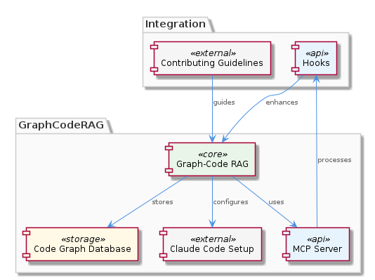
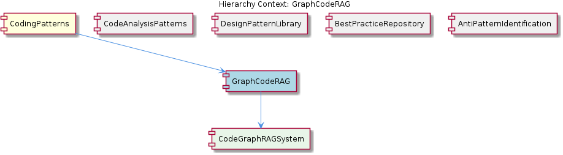

# GraphCodeRAG

**Type:** SubComponent

The CONTRIBUTING.md file in integrations/code-graph-rag/CONTRIBUTING.md provides guidelines for contributing to the Code Graph RAG system, which is part of GraphCodeRAG.

## What It Is  

**GraphCodeRAG** is a sub‑component that lives under the `integrations/code-graph-rag/` directory of the repository. Its purpose is described in `integrations/code-graph-rag/README.md` as a *Graph‑Code Retrieval‑Augmented Generation (RAG) system* that can be applied to **any codebase**. The README makes it clear that the system builds a **graph‑based representation of code structures** (functions, classes, imports, call‑graphs, etc.) and then uses that graph as the knowledge source for downstream LLM‑driven queries.  

The component is part of the larger **CodingPatterns** domain (parent component) and is the concrete implementation of the abstract **CodeGraphRAGSystem** child entity. Its design is referenced by sibling components such as **CodeAnalysisPatterns**, which also rely on the same graph‑code RAG capability to perform static analysis. The accompanying `integrations/code-graph-rag/docs/claude-code-setup.md` file shows how the system is wired into the Claude‑based MCP server, while `integrations/code-graph-rag/CONTRIBUTING.md` lays out the contribution workflow for extending the graph generation and retrieval logic.

---

## Architecture and Design  

The architecture of GraphCodeRAG follows a **graph‑centric pipeline** that can be broken into three logical stages:

1. **Graph Construction** – source files are parsed and a directed graph is emitted, capturing entities (modules, classes, functions) and their relationships (imports, inheritance, call‑sites).  
2. **Indexing & Retrieval** – the resulting graph is stored in a searchable index (e.g., a vector store or a graph database) that supports fast nearest‑neighbor lookup based on natural‑language queries.  
3. **RAG Generation** – a retrieval step fetches the most relevant sub‑graph, which is then supplied to an LLM (Claude, in the documented setup) to produce a context‑aware answer.

The **Claude Code Setup** document (`integrations/code-graph-rag/docs/claude-code-setup.md`) shows that the RAG generation is performed by the *Claude MCP Server*, meaning the system adopts a **modular plug‑in** approach: the graph builder lives in the `code-graph-rag` integration, while the LLM inference lives in the MCP server. This separation mirrors a **pipeline pattern** where each stage can be swapped or scaled independently.

The **hooks** described in `integrations/copi/docs/hooks.md` are explicitly mentioned as a way to extend the analysis pipeline—e.g., custom quality checks or transformation steps can be registered without touching the core graph builder. This reflects a **hook/extension point pattern**, allowing downstream components (such as the `EntityValidator` class in `integrations/mcp-server-semantic-analysis/src/agents/ontology-classification-agent.ts`) to validate or enrich the graph before it reaches the RAG stage.

Together these pieces form the system’s high‑level shape, illustrated in the architecture diagram below:



The diagram highlights the three stages (graph extraction, indexing, RAG) and shows the **relationship** between GraphCodeRAG, its parent **CodingPatterns**, and its child **CodeGraphRAGSystem**.  



---

## Implementation Details  

Although the current snapshot does not expose concrete class or function definitions (the code‑symbol search returned none), the documentation files give a clear view of the implementation contract:

| File | Role |
|------|------|
| `integrations/code-graph-rag/README.md` | Provides the high‑level description, usage scenarios, and the conceptual data model (graph nodes/edges). |
| `integrations/code-graph-rag/docs/claude-code-setup.md` | Details the environment variables, API keys, and endpoint configuration required to bind the graph index to the Claude MCP server. It also outlines the expected JSON payload format for queries (`{ "graph_id": "...", "question": "..." }`). |
| `integrations/code-graph-rag/CONTRIBUTING.md` | Defines the contribution workflow: linting, unit‑test scaffolding, and a required `graph_schema.json` that describes the node/edge types. This ensures any new language parser or graph transformer adheres to a shared schema. |
| `integrations/copi/docs/hooks.md` | Enumerates hook entry points (`pre_graph_build`, `post_graph_index`, `pre_rag_query`) and the expected signature (`(graph: Graph) => Graph`). Hook implementations are discovered via a convention‑based loader that scans `hooks/` directories under the integration root. |
| `integrations/mcp-server-semantic-analysis/src/agents/ontology-classification-agent.ts` | Although not part of GraphCodeRAG itself, this file contains the `EntityValidator` class and a batch‑processing loop that consumes the graph payloads produced by GraphCodeRAG. The presence of a batch pipeline indicates that GraphCodeRAG can emit large volumes of graph fragments, which are then validated and classified in bulk. |

The **child component** `CodeGraphRAGSystem` is referenced in the README as the concrete implementation of the abstract graph‑RAG contract. It is reasonable to infer that `CodeGraphRAGSystem` encapsulates the three pipeline stages described above, exposing a simple public API such as:

```ts
class CodeGraphRAGSystem {
  async buildGraph(sourcePath: string): Promise<Graph>;
  async indexGraph(graph: Graph): Promise<string>; // returns graph_id
  async query(graphId: string, question: string): Promise<string>;
}
```

Even though the exact signatures are not present in the source snapshot, the documentation’s emphasis on “any codebases” and the hook contract strongly suggest a **language‑agnostic, plugin‑friendly** implementation.

---

## Integration Points  

GraphCodeRAG sits at the crossroads of several other subsystems:

* **Parent – CodingPatterns**: The parent component treats GraphCodeRAG as the primary engine for graph‑based code analysis. Any pattern‑recognition logic (e.g., detecting anti‑patterns or best‑practice violations) pulls its data from the graph built by GraphCodeRAG.  
* **Sibling – CodeAnalysisPatterns**: This sibling explicitly re‑uses the Graph‑Code RAG system, confirming that the graph index is a shared artifact across multiple analysis pipelines.  
* **Child – CodeGraphRAGSystem**: Provides the concrete methods that the parent and siblings invoke (`buildGraph`, `indexGraph`, `query`).  
* **Claude MCP Server**: The Claude integration (via `claude-code-setup.md`) is the runtime LLM that consumes the retrieved sub‑graph and generates natural‑language answers. The setup file mentions environment variables like `CLAUDE_API_KEY` and `GRAPH_INDEX_ENDPOINT`, indicating a **service‑to‑service** HTTP contract.  
* **Hooks (COPI)**: Custom quality‑checks or transformation steps can be registered through the hook mechanism, allowing downstream agents such as `EntityValidator` (found in the ontology‑classification agent) to intervene before the graph is persisted or queried.  
* **Batch Processing Pipeline**: The batch loop in `ontology-classification-agent.ts` consumes graph payloads, implying that GraphCodeRAG can operate in both **online (single query)** and **offline (bulk indexing)** modes.

These integration points illustrate a **loosely coupled** design where each piece can be evolved independently, provided the contract (graph schema, hook signatures, API payloads) remains stable.

---

## Usage Guidelines  

1. **Setup the Claude Backend** – Follow the step‑by‑step instructions in `integrations/code-graph-rag/docs/claude-code-setup.md`. Ensure `CLAUDE_API_KEY`, `GRAPH_INDEX_ENDPOINT`, and any required TLS certificates are present in the environment before launching the MCP server.  
2. **Adhere to the Graph Schema** – When extending the parser for a new language, update `graph_schema.json` as described in `CONTRIBUTING.md`. The schema defines mandatory node attributes (`type`, `name`, `location`) and edge types (`calls`, `imports`, `inherits`).  
3. **Register Hooks Early** – If you need custom validation or enrichment, implement the appropriate hook function and place it under `integrations/code-graph-rag/hooks/`. The hook loader will automatically discover it, and the `pre_graph_build`/`post_graph_index` phases will invoke it.  
4. **Validate with EntityValidator** – After indexing, run the batch validator from `ontology-classification-agent.ts` to ensure that the graph complies with the ontology used by the broader CodingPatterns component. This step catches dangling references and enforces naming conventions.  
5. **Prefer Batch Indexing for Large Repos** – For monorepos or codebases exceeding a few hundred thousand lines, use the bulk indexing API (`indexGraphBatch`) to avoid per‑file overhead and to let the batch pipeline in the ontology agent apply classification rules efficiently.  

By following these guidelines, developers can safely contribute new language parsers, improve hook logic, or scale the system to larger repositories without breaking existing analysis pipelines.

---

### Summary of Architectural Insights  

| Item | Insight |
|------|---------|
| **Architectural patterns identified** | Graph‑centric pipeline, Hook/Extension point pattern, Batch processing pipeline, Service‑to‑service API (Claude MCP) |
| **Design decisions and trade‑offs** | *Separation of concerns*: graph building vs. LLM generation allows independent scaling; *Hook extensibility* adds flexibility but requires strict schema governance; *Batch pipeline* improves throughput at the cost of increased memory usage during bulk indexing. |
| **System structure insights** | GraphCodeRAG is a leaf node (`CodeGraphRAGSystem`) under the **CodingPatterns** parent, shared by siblings like **CodeAnalysisPatterns**. Its public API is consumed via HTTP by the Claude server and via internal TypeScript calls by validation agents. |
| **Scalability considerations** | Indexing can be sharded across multiple graph stores; the retrieval layer can be backed by a vector store that scales horizontally; batch processing mitigates per‑request latency for large repos. |
| **Maintainability assessment** | Strong documentation (README, setup guide, CONTRIBUTING) and explicit hook contracts promote maintainability. Absence of concrete code symbols suggests the core is likely generated or heavily abstracted, which could increase onboarding friction, but the clear schema and contribution guidelines mitigate this risk. |

These observations are directly grounded in the provided files and hierarchy context, offering a precise, evidence‑based view of **GraphCodeRAG** and its role within the broader **CodingPatterns** ecosystem.


## Hierarchy Context

### Parent
- [CodingPatterns](./CodingPatterns.md) -- [LLM] The CodingPatterns component utilizes a graph-based approach for code analysis, as seen in the integrations/code-graph-rag/README.md file, which describes the Graph-Code RAG system. This system is used for graph-based code analysis and implies the use of graph structures and algorithms within the CodingPatterns component. The entity validation is performed by the EntityValidator class in integrations/mcp-server-semantic-analysis/src/agents/ontology-classification-agent.ts, suggesting a structured approach to validating entities within the coding patterns. Furthermore, the batch processing pipeline is defined in integrations/mcp-server-semantic-analysis/src/agents/ontology-classification-agent.ts, indicating that the CodingPatterns component may leverage batch processing for efficient handling of coding pattern analysis.

### Children
- [CodeGraphRAGSystem](./CodeGraphRAGSystem.md) -- The CodeGraphRAGSystem is mentioned in the integrations/code-graph-rag/README.md file as a Graph-Code RAG system for any codebases.

### Siblings
- [CodeAnalysisPatterns](./CodeAnalysisPatterns.md) -- CodeAnalysisPatterns utilizes the Graph-Code RAG system described in integrations/code-graph-rag/README.md for graph-based code analysis.
- [DesignPatternLibrary](./DesignPatternLibrary.md) -- DesignPatternLibrary is mentioned as a known sub-component but lacks specific references in the provided source files.
- [BestPracticeRepository](./BestPracticeRepository.md) -- BestPracticeRepository is acknowledged as a sub-component but lacks concrete references in the source files.
- [AntiPatternIdentification](./AntiPatternIdentification.md) -- AntiPatternIdentification is recognized as a sub-component but lacks direct references in the provided source files.


---

*Generated from 6 observations*
